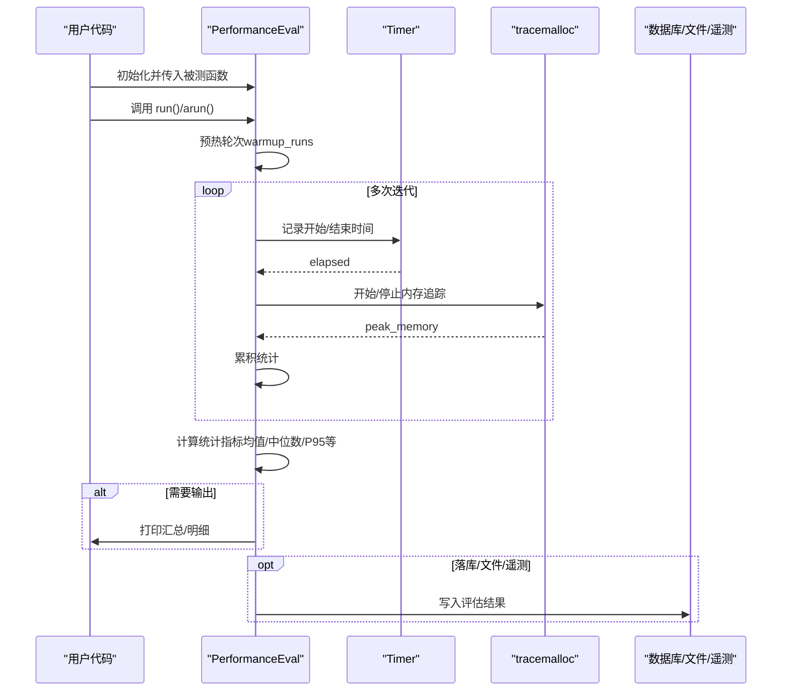
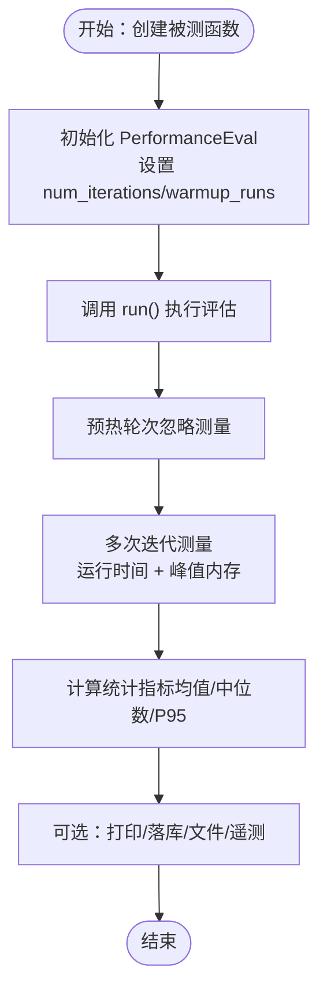
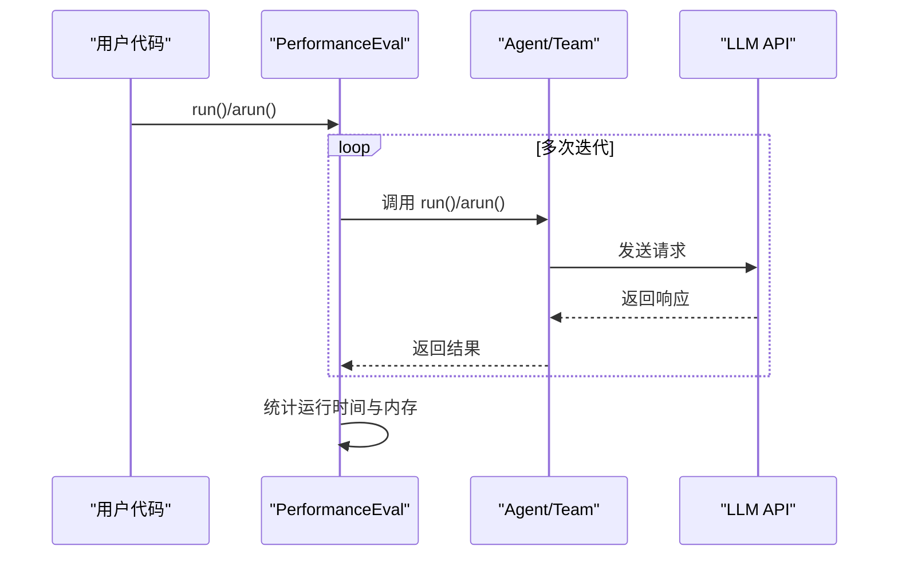
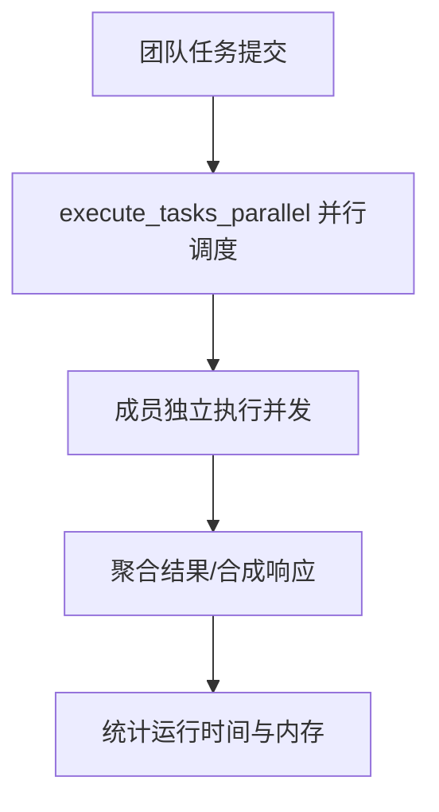
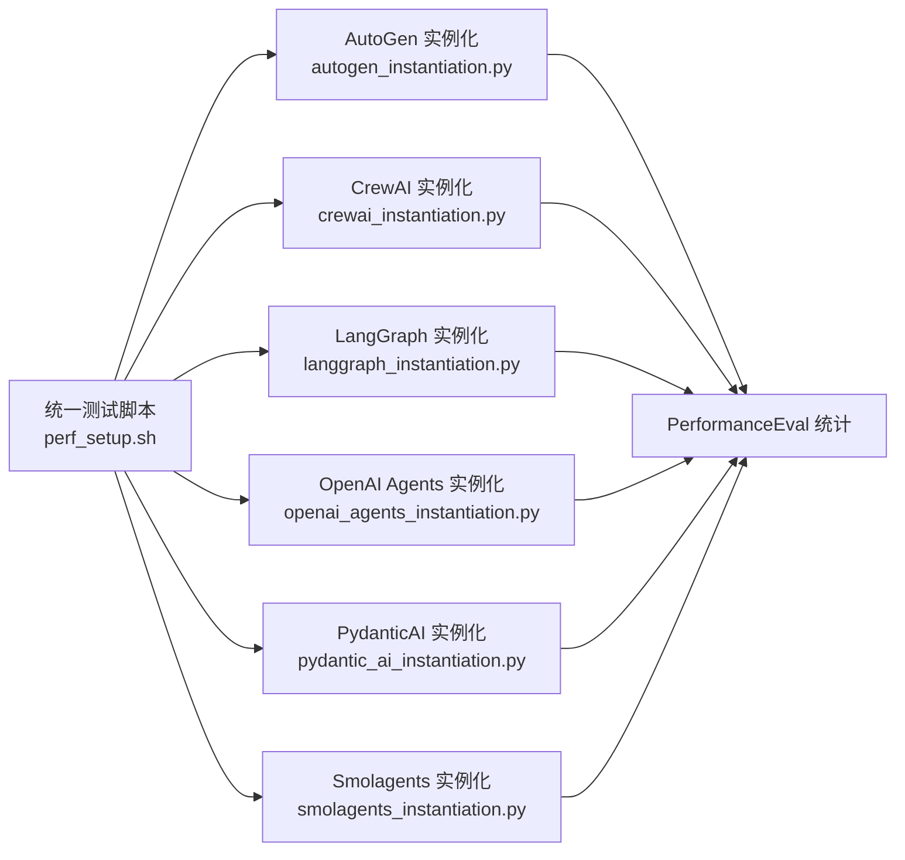
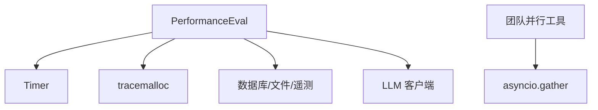

# 性能评估

<cite>
**本文引用的文件**
- [performance.py](file://libs/agno/agno/eval/performance.py)
- [timer.py](file://libs/agno/agno/utils/timer.py)
- [README.md](file://cookbook/09_evals/performance/README.md)
- [db_logging.py.md](file://cookbook/09_evals/performance/db_logging.py.md)
- [instantiate_agent.py](file://cookbook/09_evals/performance/instantiate_agent.py)
- [simple_response.py](file://cookbook/09_evals/performance/simple_response.py)
- [team_response_with_memory_and_reasoning.py.md](file://cookbook/09_evals/performance/team_response_with_memory_and_reasoning.py.md)
- [team_response_with_memory_simple.py](file://cookbook/09_evals/performance/team_response_with_memory_simple.py)
- [team_response_with_memory_multi_user.py](file://cookbook/09_evals/performance/team_response_with_memory_multi_user.py)
- [response_with_memory_updates.py.md](file://cookbook/09_evals/performance/response_with_memory_updates.py.md)
- [09_caching.md](file://cookbook/03_teams/01_quickstart/09_caching.md)
- [perf_setup.sh](file://scripts/perf_setup.sh)
- [autogen_instantiation.py](file://cookbook/09_evals/performance/comparison/autogen_instantiation.py)
- [crewai_instantiation.py](file://cookbook/09_evals/performance/comparison/crewai_instantiation.py)
- [_task_tools.py](file://libs/agno/agno/team/_task_tools.py)
- [test_memory_impact.py](file://libs/agno/tests/integration/agent/test_memory_impact.py)
</cite>

## 目录
1. [简介](#简介)
2. [项目结构](#项目结构)
3. [核心组件](#核心组件)
4. [架构总览](#架构总览)
5. [详细组件分析](#详细组件分析)
6. [依赖分析](#依赖分析)
7. [性能考量](#性能考量)
8. [故障排查指南](#故障排查指南)
9. [结论](#结论)
10. [附录](#附录)

## 简介
本章节面向性能评估模块，系统阐述如何在本仓库中开展性能评估工作，包括评估指标体系（响应时间、吞吐量、资源利用率、并发处理能力）、基准测试方法（环境搭建、测试用例设计、数据采集）、以及针对代理实例化、响应性能、团队协作与与其他框架对比的完整评测路径，并给出优化建议与最佳实践。

## 项目结构
性能评估相关代码主要分布在以下位置：
- 核心评估实现：libs/agno/agno/eval/performance.py
- 计时工具：libs/agno/agno/utils/timer.py
- 示例与用法：cookbook/09_evals/performance/*.py 及其说明文档
- 性能对比脚本：cookbook/09_evals/performance/comparison/*.py
- 性能测试环境脚本：scripts/perf_setup.sh
- 团队并行与缓存示例：cookbook/03_teams/01_quickstart/09_caching.md
- 内存影响测试：libs/agno/tests/integration/agent/test_memory_impact.py

```mermaid
graph TB
A["性能评估核心<br/>libs/agno/agno/eval/performance.py"] --> B["计时工具<br/>libs/agno/agno/utils/timer.py"]
A --> C["示例：代理实例化<br/>cookbook/09_evals/performance/instantiate_agent.py"]
A --> D["示例：简单响应<br/>cookbook/09_evals/performance/simple_response.py"]
A --> E["示例：团队响应与记忆<br/>cookbook/09_evals/performance/team_response_with_memory_and_reasoning.py.md"]
A --> F["示例：多用户并发团队<br/>cookbook/09_evals/performance/team_response_with_memory_multi_user.py"]
A --> G["示例：响应与内存更新<br/>cookbook/09_evals/performance/response_with_memory_updates.py.md"]
A --> H["对比：AutoGen/CrewAI/LangGraph<br/>cookbook/09_evals/performance/comparison/*.py"]
A --> I["性能测试环境脚本<br/>scripts/perf_setup.sh"]
A --> J["团队并行与缓存<br/>cookbook/03_teams/01_quickstart/09_caching.md"]
```

**图表来源**
- [performance.py:180-780](file://libs/agno/agno/eval/performance.py#L180-L780)
- [timer.py:1-42](file://libs/agno/agno/utils/timer.py#L1-L42)
- [instantiate_agent.py:1-31](file://cookbook/09_evals/performance/instantiate_agent.py#L1-L31)
- [simple_response.py:1-43](file://cookbook/09_evals/performance/simple_response.py#L1-L43)
- [team_response_with_memory_and_reasoning.py.md:1-37](file://cookbook/09_evals/performance/team_response_with_memory_and_reasoning.py.md#L1-L37)
- [team_response_with_memory_multi_user.py](file://cookbook/09_evals/performance/team_response_with_memory_multi_user.py)
- [response_with_memory_updates.py.md:41-65](file://cookbook/09_evals/performance/response_with_memory_updates.py.md#L41-L65)
- [autogen_instantiation.py:1-61](file://cookbook/09_evals/performance/comparison/autogen_instantiation.py#L1-L61)
- [perf_setup.sh:1-36](file://scripts/perf_setup.sh#L1-L36)
- [09_caching.md:1-199](file://cookbook/03_teams/01_quickstart/09_caching.md#L1-L199)

**章节来源**
- [README.md:1-18](file://cookbook/09_evals/performance/README.md#L1-L18)

## 核心组件
- 性能评估类 PerformanceEval
  - 支持同步与异步函数的性能评估，可选测量运行时间与峰值内存。
  - 提供预热轮次（warmup_runs）避免首帧偏差，支持多次迭代（num_iterations）统计。
  - 输出统计指标：平均值、最小/最大值、标准差、中位数、P95分位。
  - 支持内存增长追踪（memory_growth_tracking）与Top-N分配定位。
  - 支持结果落库（db）、文件保存（file_path_to_save_results）、遥测（telemetry）。
- 计时工具 Timer
  - 基于高精度计时器封装，提供 start/stop/elapsed 接口，用于运行时间测量。
- 性能结果容器 PerformanceResult
  - 统一承载运行时间与内存使用统计数据，并提供汇总与明细表格打印。

**章节来源**
- [performance.py:19-177](file://libs/agno/agno/eval/performance.py#L19-L177)
- [timer.py:5-42](file://libs/agno/agno/utils/timer.py#L5-L42)

## 架构总览
性能评估的整体流程如下：创建被测函数 → 配置 PerformanceEval → 执行 run/arun → 统计与可视化 → 可选落库/文件/遥测。

**图表来源**
- [performance.py:481-768](file://libs/agno/agno/eval/performance.py#L481-L768)
- [timer.py:13-25](file://libs/agno/agno/utils/timer.py#L13-L25)

## 详细组件分析

### 代理实例化性能测试
目标：测量 Agent 构造的初始化时间与内存占用，评估启动效率。
- 测试方法
  - 使用 PerformanceEval 包裹构造函数，设置较大的 num_iterations（例如 1000）以覆盖抖动。
  - 可选开启 memory_growth_tracking 与 top_n_memory_allocations，定位分配热点。
- 关键要点
  - 预热轮次（warmup_runs）默认 10，避免首次导入与 JIT 等开销影响。
  - 运行时间与内存峰值分别统计，输出均值/中位数/P95等指标。
- 示例参考
  - [instantiate_agent.py:15-24](file://cookbook/09_evals/performance/instantiate_agent.py#L15-L24)

**图表来源**
- [instantiate_agent.py:15-30](file://cookbook/09_evals/performance/instantiate_agent.py#L15-L30)
- [performance.py:481-622](file://libs/agno/agno/eval/performance.py#L481-L622)

**章节来源**
- [instantiate_agent.py:1-31](file://cookbook/09_evals/performance/instantiate_agent.py#L1-L31)
- [performance.py:19-177](file://libs/agno/agno/eval/performance.py#L19-L177)

### 响应性能测试（单次与批量）
目标：评估单次响应与批量处理的延迟与吞吐，识别瓶颈。
- 单次响应
  - 使用 PerformanceEval 包裹 agent.run 或 arun，设置 num_iterations=1，warmup_runs=0。
  - 示例参考：[simple_response.py:16-36](file://cookbook/09_evals/performance/simple_response.py#L16-L36)
- 批量处理与并发
  - 利用 asyncio.gather 或团队并行工具（execute_tasks_parallel）进行并发请求，评估吞吐与延迟分布。
  - 示例参考：
    - 团队并行：[_task_tools.py:647-659](file://libs/agno/agno/team/_task_tools.py#L647-L659)
    - 多用户并发团队：[team_response_with_memory_multi_user.py](file://cookbook/09_evals/performance/team_response_with_memory_multi_user.py)

**图表来源**
- [simple_response.py:16-36](file://cookbook/09_evals/performance/simple_response.py#L16-L36)
- [_task_tools.py:647-659](file://libs/agno/agno/team/_task_tools.py#L647-L659)

**章节来源**
- [simple_response.py:1-43](file://cookbook/09_evals/performance/simple_response.py#L1-L43)
- [_task_tools.py:647-659](file://libs/agno/agno/team/_task_tools.py#L647-L659)

### 团队协作性能评估（多代理协调、通信与整体系统性能）
目标：评估团队模式下的协调开销、成员间通信与整体吞吐。
- 方法
  - 使用团队并行工具（execute_tasks_parallel）或 asyncio.gather 并发成员任务。
  - 配置 memory_growth_tracking，观测长时间运行下的内存增长趋势。
  - 示例参考：
    - 复杂团队与推理工具：[team_response_with_memory_and_reasoning.py.md:1-37](file://cookbook/09_evals/performance/team_response_with_memory_and_reasoning.py.md#L1-L37)
    - 多用户并发团队：[team_response_with_memory_multi_user.py](file://cookbook/09_evals/performance/team_response_with_memory_multi_user.py)
    - 简单团队内存影响：[team_response_with_memory_simple.py](file://cookbook/09_evals/performance/team_response_with_memory_simple.py)

**图表来源**
- [_task_tools.py:647-659](file://libs/agno/agno/team/_task_tools.py#L647-L659)
- [team_response_with_memory_and_reasoning.py.md:1-37](file://cookbook/09_evals/performance/team_response_with_memory_and_reasoning.py.md#L1-L37)

**章节来源**
- [team_response_with_memory_and_reasoning.py.md:1-37](file://cookbook/09_evals/performance/team_response_with_memory_and_reasoning.py.md#L1-L37)
- [team_response_with_memory_multi_user.py](file://cookbook/09_evals/performance/team_response_with_memory_multi_user.py)
- [team_response_with_memory_simple.py](file://cookbook/09_evals/performance/team_response_with_memory_simple.py)

### 与其他框架的性能对比
目标：横向比较不同框架的代理实例化性能，辅助选型与迁移。
- 方法
  - 在同一测试环境下，使用 PerformanceEval 对比 AutoGen、CrewAI、LangGraph、OpenAI Agents SDK、PydanticAI、Smolagents 等框架的实例化耗时。
  - 环境准备：使用性能测试脚本安装依赖并创建隔离虚拟环境。
- 示例参考
  - AutoGen 实例化对比：[autogen_instantiation.py:34-54](file://cookbook/09_evals/performance/comparison/autogen_instantiation.py#L34-L54)
  - CrewAI 实例化对比：[crewai_instantiation.py](file://cookbook/09_evals/performance/comparison/crewai_instantiation.py)
  - 其他框架对比文件：[README.md:1-13](file://cookbook/09_evals/performance/comparison/README.md#L1-L13)
- 环境脚本
  - [perf_setup.sh:29-33](file://scripts/perf_setup.sh#L29-L33)

**图表来源**
- [perf_setup.sh:29-33](file://scripts/perf_setup.sh#L29-L33)
- [autogen_instantiation.py:34-54](file://cookbook/09_evals/performance/comparison/autogen_instantiation.py#L34-L54)
- [crewai_instantiation.py](file://cookbook/09_evals/performance/comparison/crewai_instantiation.py)
- [README.md:1-13](file://cookbook/09_evals/performance/comparison/README.md#L1-L13)

**章节来源**
- [autogen_instantiation.py:1-61](file://cookbook/09_evals/performance/comparison/autogen_instantiation.py#L1-L61)
- [crewai_instantiation.py](file://cookbook/09_evals/performance/comparison/crewai_instantiation.py)
- [README.md:1-13](file://cookbook/09_evals/performance/comparison/README.md#L1-L13)
- [perf_setup.sh:1-36](file://scripts/perf_setup.sh#L1-L36)

### 数据采集与结果落库
目标：将评估结果持久化以便长期跟踪与分析。
- 方法
  - 使用 PerformanceEval 的 db 参数连接数据库，自动写入评估记录与统计摘要。
  - 示例参考：[db_logging.py.md:23-54](file://cookbook/09_evals/performance/db_logging.py.md#L23-L54)
- 字段说明
  - 评估类型（PERFORMANCE）、运行次数、预热次数、被测组件名、模型信息、统计摘要（均值/中位数/P95等）、逐次运行详情（runtime/memory）。

**章节来源**
- [db_logging.py.md:1-64](file://cookbook/09_evals/performance/db_logging.py.md#L1-L64)
- [performance.py:592-610](file://libs/agno/agno/eval/performance.py#L592-L610)

## 依赖分析
- 组件耦合
  - PerformanceEval 依赖 Timer 进行时间测量；依赖 tracemalloc 进行内存峰值测量；可选依赖数据库/文件/遥测模块进行结果落库。
- 外部依赖
  - LLM 模型客户端（如 OpenAI Chat/Responses）会影响响应延迟与成本，需在对比测试中保持一致的模型与参数。
- 并发与并行
  - 团队并行工具（execute_tasks_parallel）与 asyncio.gather 提升吞吐，但需注意资源竞争与内存增长。

**图表来源**
- [performance.py:232-282](file://libs/agno/agno/eval/performance.py#L232-L282)
- [_task_tools.py:647-659](file://libs/agno/agno/team/_task_tools.py#L647-L659)

**章节来源**
- [performance.py:481-768](file://libs/agno/agno/eval/performance.py#L481-L768)
- [_task_tools.py:647-659](file://libs/agno/agno/team/_task_tools.py#L647-L659)

## 性能考量
- 指标体系
  - 响应时间：平均/中位数/P95，衡量延迟稳健性。
  - 吞吐量：单位时间内完成的请求数，可通过并发与批处理提升。
  - 资源利用率：CPU/内存/GC 次数，关注峰值与增长趋势。
  - 并发处理能力：线程/进程/协程的扩展性与锁竞争。
- 基准测试方法
  - 环境一致性：固定硬件、Python 版本、依赖版本、LLM 模型与参数。
  - 预热策略：warmup_runs 减少冷启动影响。
  - 统计稳健：num_iterations 足够大，排除异常值影响。
  - 数据采集：记录逐次运行详情，便于回溯与定位。
- 优化建议
  - 缓存策略：利用模型响应缓存（cache_response）降低重复调用成本与延迟（见团队缓存示例）。
  - 并发优化：使用团队并行工具与 asyncio.gather 提升吞吐，合理设置并发度避免资源争用。
  - 资源管理：定期强制 GC、避免长生命周期对象持有大内存、使用内存增长追踪定位泄漏。
  - I/O 优化：批量请求、连接池复用、异步 I/O。

**章节来源**
- [09_caching.md:56-92](file://cookbook/03_teams/01_quickstart/09_caching.md#L56-L92)
- [_task_tools.py:647-659](file://libs/agno/agno/team/_task_tools.py#L647-L659)
- [test_memory_impact.py:114-169](file://libs/agno/tests/integration/agent/test_memory_impact.py#L114-L169)

## 故障排查指南
- 常见问题
  - 评估结果不稳定：增大 num_iterations，确保 warmup_runs 充分；检查外部依赖（网络/模型）波动。
  - 内存持续增长：启用 memory_growth_tracking，查看 Top-N 分配；检查是否遗漏清理临时对象。
  - 异步函数误用：对异步函数应使用 arun，否则会抛出错误提示。
  - 数据库写入失败：确认 db 连接与表结构，检查字段映射与权限。
- 定位手段
  - 调试模式：开启 debug_mode 输出详细日志。
  - 内存快照对比：比较相邻迭代的 tracemalloc 快照，定位增长来源。
  - 逐步缩小：先单任务后并发，先本地后远程，先小规模后大规模。

**章节来源**
- [performance.py:359-435](file://libs/agno/agno/eval/performance.py#L359-L435)
- [test_memory_impact.py:131-169](file://libs/agno/tests/integration/agent/test_memory_impact.py#L131-L169)

## 结论
本模块提供了从指标设计、测试方法到结果落库与对比分析的完整性能评估能力。通过标准化的评估流程与丰富的示例，可在代理实例化、响应性能、团队协作与跨框架对比等多个维度进行系统化评测，并基于统计结果与内存追踪持续优化系统性能。

## 附录
- 快速开始
  - 安装性能测试环境：[perf_setup.sh:29-33](file://scripts/perf_setup.sh#L29-L33)
  - 运行示例：代理实例化、简单响应、团队响应与内存影响、多用户并发团队、响应与内存更新。
- 参考示例路径
  - [instantiate_agent.py:1-31](file://cookbook/09_evals/performance/instantiate_agent.py#L1-L31)
  - [simple_response.py:1-43](file://cookbook/09_evals/performance/simple_response.py#L1-L43)
  - [team_response_with_memory_and_reasoning.py.md:1-37](file://cookbook/09_evals/performance/team_response_with_memory_and_reasoning.py.md#L1-L37)
  - [team_response_with_memory_multi_user.py](file://cookbook/09_evals/performance/team_response_with_memory_multi_user.py)
  - [response_with_memory_updates.py.md:41-65](file://cookbook/09_evals/performance/response_with_memory_updates.py.md#L41-L65)
  - [autogen_instantiation.py:1-61](file://cookbook/09_evals/performance/comparison/autogen_instantiation.py#L1-L61)