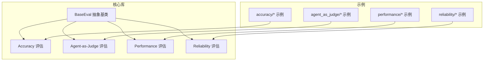
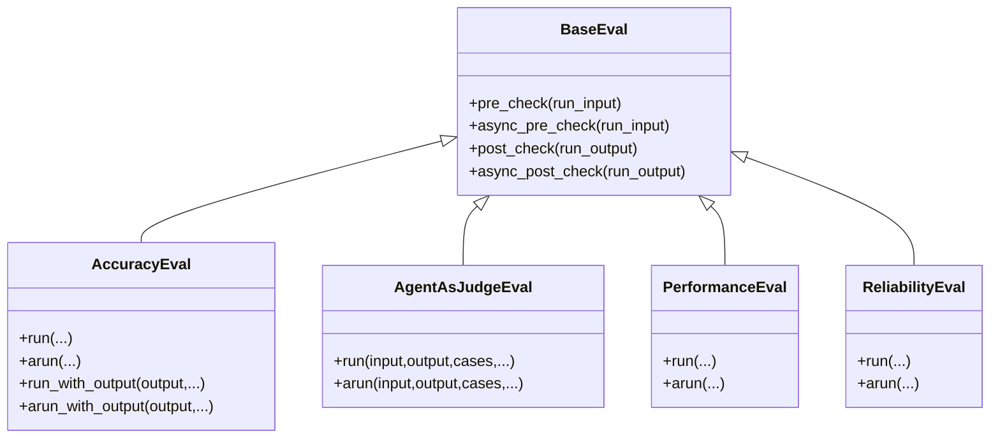
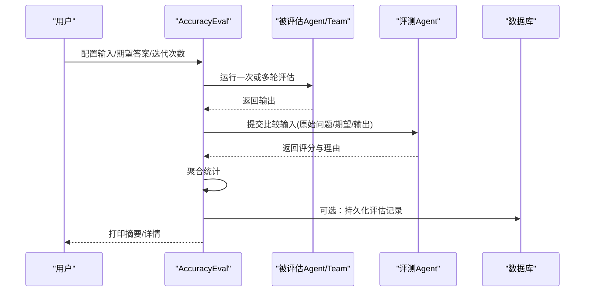
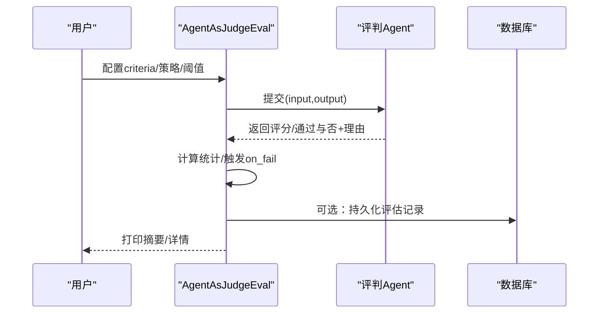
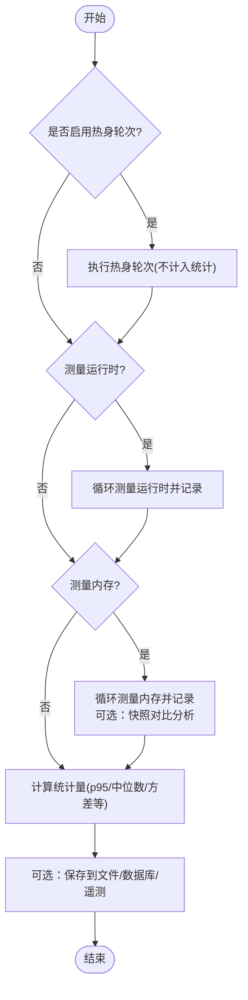
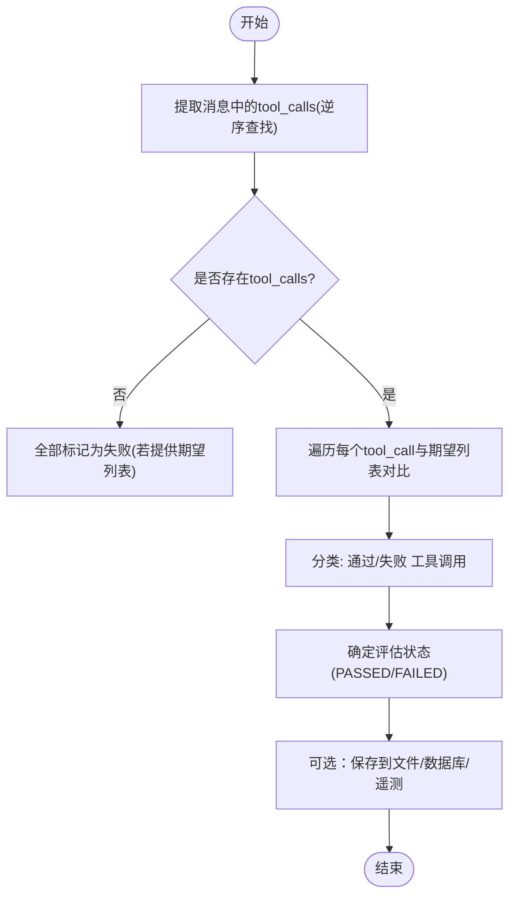
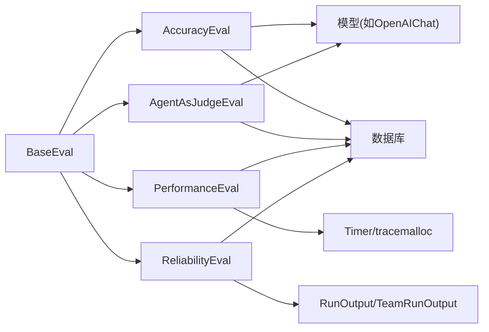

# 评估系统

<cite>
**本文引用的文件**
- [libs/agno/agno/eval/__init__.py](file://libs/agno/agno/eval/__init__.py)
- [libs/agno/agno/eval/base.py](file://libs/agno/agno/eval/base.py)
- [libs/agno/agno/eval/accuracy.py](file://libs/agno/agno/eval/accuracy.py)
- [libs/agno/agno/eval/agent_as_judge.py](file://libs/agno/agno/eval/agent_as_judge.py)
- [libs/agno/agno/eval/performance.py](file://libs/agno/agno/eval/performance.py)
- [libs/agno/agno/eval/reliability.py](file://libs/agno/agno/eval/reliability.py)
- [cookbook/09_evals/README.md](file://cookbook/09_evals/README.md)
- [cookbook/09_evals/accuracy/README.md](file://cookbook/09_evals/accuracy/README.md)
- [cookbook/09_evals/accuracy/accuracy_basic.py](file://cookbook/09_evals/accuracy/accuracy_basic.py)
- [cookbook/09_evals/agent_as_judge/README.md](file://cookbook/09_evals/agent_as_judge/README.md)
- [cookbook/09_evals/agent_as_judge/agent_as_judge_basic.py](file://cookbook/09_evals/agent_as_judge/agent_as_judge_basic.py)
- [cookbook/09_evals/performance/README.md](file://cookbook/09_evals/performance/README.md)
- [cookbook/09_evals/performance/instantiate_agent.py](file://cookbook/09_evals/performance/instantiate_agent.py)
- [cookbook/09_evals/reliability/README.md](file://cookbook/09_evals/reliability/README.md)
- [cookbook/09_evals/reliability/single_tool_calls/calculator.py](file://cookbook/09_evals/reliability/single_tool_calls/calculator.py)
</cite>

## 目录
1. [简介](#简介)
2. [项目结构](#项目结构)
3. [核心组件](#核心组件)
4. [架构总览](#架构总览)
5. [详细组件分析](#详细组件分析)
6. [依赖关系分析](#依赖关系分析)
7. [性能考量](#性能考量)
8. [故障排查指南](#故障排查指南)
9. [结论](#结论)
10. [附录](#附录)

## 简介
本文件面向 Agno Learn 的评估系统，系统性梳理并阐释其“准确性评估”“代理作为评判者（LLM-as-judge）”“性能评估”“可靠性评估”的综合框架与实现要点。文档以代码为依据，结合示例与最佳实践，帮助开发者建立可复用、可观测、可扩展的评估体系。

## 项目结构
评估系统由“核心库”与“示例与用法”两部分组成：
- 核心库位于 libs/agno/agno/eval 下，包含抽象基类与四大评估模块：accuracy、agent_as_judge、performance、reliability。
- 示例位于 cookbook/09_evals 下，按评估类型组织，覆盖同步/异步、单体/团队、工具调用等场景。

图表来源
- [libs/agno/agno/eval/__init__.py](file://libs/agno/agno/eval/__init__.py)
- [libs/agno/agno/eval/base.py](file://libs/agno/agno/eval/base.py)
- [libs/agno/agno/eval/accuracy.py](file://libs/agno/agno/eval/accuracy.py)
- [libs/agno/agno/eval/agent_as_judge.py](file://libs/agno/agno/eval/agent_as_judge.py)
- [libs/agno/agno/eval/performance.py](file://libs/agno/agno/eval/performance.py)
- [libs/agno/agno/eval/reliability.py](file://libs/agno/agno/eval/reliability.py)
- [cookbook/09_evals/README.md](file://cookbook/09_evals/README.md)

章节来源
- [cookbook/09_evals/README.md](file://cookbook/09_evals/README.md)
- [cookbook/09_evals/accuracy/README.md](file://cookbook/09_evals/accuracy/README.md)
- [cookbook/09_evals/agent_as_judge/README.md](file://cookbook/09_evals/agent_as_judge/README.md)
- [cookbook/09_evals/performance/README.md](file://cookbook/09_evals/performance/README.md)
- [cookbook/09_evals/reliability/README.md](file://cookbook/09_evals/reliability/README.md)

## 核心组件
- 抽象基类 BaseEval：定义统一的预检查与后检查接口，支持同步与异步。
- Accuracy 评估：对比模型输出与期望答案，生成评分与理由，并统计多轮结果。
- Agent-as-Judge 评估：使用 LLM 作为评判者，支持数值评分与二元通过/失败两种策略。
- Performance 评估：测量函数执行时间与峰值内存占用，提供均值、中位数、分位数等统计。
- Reliability 评估：基于消息中的 tool_calls 检查是否命中预期工具调用，判定通过/失败。

章节来源
- [libs/agno/agno/eval/base.py](file://libs/agno/agno/eval/base.py)
- [libs/agno/agno/eval/accuracy.py](file://libs/agno/agno/eval/accuracy.py)
- [libs/agno/agno/eval/agent_as_judge.py](file://libs/agno/agno/eval/agent_as_judge.py)
- [libs/agno/agno/eval/performance.py](file://libs/agno/agno/eval/performance.py)
- [libs/agno/agno/eval/reliability.py](file://libs/agno/agno/eval/reliability.py)

## 架构总览
评估系统采用“模块化 + 统一抽象 + 可插拔执行器”的架构：
- 统一抽象：所有评估器继承 BaseEval，确保一致的生命周期与钩子。
- 执行器：Accuracy 与 Agent-as-Judge 使用内置或自定义 Agent 作为“执行器”，负责对目标输出进行打分。
- 数据采集：Performance 通过计时器与 tracemalloc 采集运行时与内存数据；Reliability 从 RunOutput/TeamRunOutput 中解析 tool_calls。
- 结果落盘：支持文件保存、数据库持久化与遥测上报。

图表来源
- [libs/agno/agno/eval/base.py](file://libs/agno/agno/eval/base.py)
- [libs/agno/agno/eval/accuracy.py](file://libs/agno/agno/eval/accuracy.py)
- [libs/agno/agno/eval/agent_as_judge.py](file://libs/agno/agno/eval/agent_as_judge.py)
- [libs/agno/agno/eval/performance.py](file://libs/agno/agno/eval/performance.py)
- [libs/agno/agno/eval/reliability.py](file://libs/agno/agno/eval/reliability.py)

## 详细组件分析

### 准确性评估（Accuracy）
- 设计理念
  - 将“专家评判者”作为独立 Agent，仅关注“与期望答案的一致性与完整性”，不参与业务推理。
  - 支持多轮迭代，自动汇总评分统计（均值、中位数、标准差、极值）。
- 关键流程
  - 获取被评估的 Agent/Team 输出。
  - 构造“比较输入”（包含原始问题、期望答案、模型输出），交由评测 Agent 判定。
  - 记录评分与理由，累积到 AccuracyResult 并可选写入数据库与文件。
- 指标与统计
  - 单次评分：1~10 整数。
  - 多轮统计：avg、mean、min、max、std、median、p95（Performance 模块亦提供 p95）。
- 示例路径
  - [accuracy_basic.py](file://cookbook/09_evals/accuracy/accuracy_basic.py)

图表来源
- [libs/agno/agno/eval/accuracy.py](file://libs/agno/agno/eval/accuracy.py)
- [cookbook/09_evals/accuracy/accuracy_basic.py](file://cookbook/09_evals/accuracy/accuracy_basic.py)

章节来源
- [libs/agno/agno/eval/accuracy.py](file://libs/agno/agno/eval/accuracy.py)
- [cookbook/09_evals/accuracy/README.md](file://cookbook/09_evals/accuracy/README.md)
- [cookbook/09_evals/accuracy/accuracy_basic.py](file://cookbook/09_evals/accuracy/accuracy_basic.py)

### 代理作为评判者（Agent-as-Judge）
- 设计理念
  - 使用 LLM 作为“外部评判者”，根据明确的 criteria 对输出进行客观评分。
  - 支持数值评分（1~10）与二元判定（通过/失败），并可配置阈值。
- 关键流程
  - 构建评判 Agent（可自定义输出模式与指令）。
  - 输入为“原始输入/模型输出”，输出为评分或通过/失败。
  - 支持批量评估与回调 on_fail。
- 指标与统计
  - 数值模式：avg、min、max、std、pass rate。
  - 二元模式：pass rate。
- 示例路径
  - [agent_as_judge_basic.py](file://cookbook/09_evals/agent_as_judge/agent_as_judge_basic.py)

图表来源
- [libs/agno/agno/eval/agent_as_judge.py](file://libs/agno/agno/eval/agent_as_judge.py)
- [cookbook/09_evals/agent_as_judge/agent_as_judge_basic.py](file://cookbook/09_evals/agent_as_judge/agent_as_judge_basic.py)

章节来源
- [libs/agno/agno/eval/agent_as_judge.py](file://libs/agno/agno/eval/agent_as_judge.py)
- [cookbook/09_evals/agent_as_judge/README.md](file://cookbook/09_evals/agent_as_judge/README.md)
- [cookbook/09_evals/agent_as_judge/agent_as_judge_basic.py](file://cookbook/09_evals/agent_as_judge/agent_as_judge_basic.py)

### 性能评估（Performance）
- 设计理念
  - 通过计时器与 tracemalloc 测量函数执行时间与峰值内存占用。
  - 支持热身轮次（warmup）排除首次开销，支持内存增长快照分析。
- 关键流程
  - 可选 warmup → 多轮测量运行时/内存 → 统计分析 → 文件/数据库/遥测落盘。
- 指标与统计
  - 运行时：avg/min/max/std/median/p95。
  - 内存：avg/min/max/std/median/p95（MiB），并可对比快照定位增长源。
- 示例路径
  - [instantiate_agent.py](file://cookbook/09_evals/performance/instantiate_agent.py)

图表来源
- [libs/agno/agno/eval/performance.py](file://libs/agno/agno/eval/performance.py)
- [cookbook/09_evals/performance/instantiate_agent.py](file://cookbook/09_evals/performance/instantiate_agent.py)

章节来源
- [libs/agno/agno/eval/performance.py](file://libs/agno/agno/eval/performance.py)
- [cookbook/09_evals/performance/README.md](file://cookbook/09_evals/performance/README.md)
- [cookbook/09_evals/performance/instantiate_agent.py](file://cookbook/09_evals/performance/instantiate_agent.py)

### 可靠性评估（Reliability）
- 设计理念
  - 基于 RunOutput/TeamRunOutput 中的消息 tool_calls，验证是否命中预期工具调用。
  - 通过/失败由未命中的工具数量决定。
- 关键流程
  - 合并 Agent/Team 的消息，逆序查找最近一次包含 tool_calls 的消息。
  - 对比实际调用与期望列表，区分通过/失败的工具调用。
- 指标与统计
  - PASSED/FAILED 状态；失败工具列表；通过工具列表。
- 示例路径
  - [calculator.py](file://cookbook/09_evals/reliability/single_tool_calls/calculator.py)

图表来源
- [libs/agno/agno/eval/reliability.py](file://libs/agno/agno/eval/reliability.py)
- [cookbook/09_evals/reliability/single_tool_calls/calculator.py](file://cookbook/09_evals/reliability/single_tool_calls/calculator.py)

章节来源
- [libs/agno/agno/eval/reliability.py](file://libs/agno/agno/eval/reliability.py)
- [cookbook/09_evals/reliability/README.md](file://cookbook/09_evals/reliability/README.md)
- [cookbook/09_evals/reliability/single_tool_calls/calculator.py](file://cookbook/09_evals/reliability/single_tool_calls/calculator.py)

## 依赖关系分析
- 模块耦合
  - 四大评估模块均依赖 BaseEval 的统一接口，便于扩展新评估类型。
  - 评测 Agent 依赖模型层（如 OpenAIChat），默认模型在缺失时会抛出异常提示安装依赖。
  - 性能评估依赖计时器与 tracemalloc，可靠性评估依赖 RunOutput/TeamRunOutput 的消息结构。
- 外部依赖
  - 数据库：PostgreSQL/SQLite 等，用于持久化评估记录。
  - 可视化：rich 控制台表格与进度显示。
  - 遥测：向平台上报评估运行信息。

图表来源
- [libs/agno/agno/eval/base.py](file://libs/agno/agno/eval/base.py)
- [libs/agno/agno/eval/accuracy.py](file://libs/agno/agno/eval/accuracy.py)
- [libs/agno/agno/eval/agent_as_judge.py](file://libs/agno/agno/eval/agent_as_judge.py)
- [libs/agno/agno/eval/performance.py](file://libs/agno/agno/eval/performance.py)
- [libs/agno/agno/eval/reliability.py](file://libs/agno/agno/eval/reliability.py)

章节来源
- [libs/agno/agno/eval/__init__.py](file://libs/agno/agno/eval/__init__.py)
- [libs/agno/agno/eval/accuracy.py](file://libs/agno/agno/eval/accuracy.py)
- [libs/agno/agno/eval/agent_as_judge.py](file://libs/agno/agno/eval/agent_as_judge.py)
- [libs/agno/agno/eval/performance.py](file://libs/agno/agno/eval/performance.py)
- [libs/agno/agno/eval/reliability.py](file://libs/agno/agno/eval/reliability.py)

## 性能考量
- 运行时与内存测量
  - 使用高精度计时器与 tracemalloc，避免首帧抖动，提供 p95 分位与中位数，降低极端值影响。
  - 支持快照对比，定位持续增长的内存分配点。
- 评测 Agent 的成本控制
  - 默认模型可在缺失时自动提示安装依赖，避免隐式失败。
  - 评测 Agent 的输出模式（结构化）有助于减少二次解析与错误。
- 数据持久化与并发
  - 评测结果可同时写入文件、数据库与遥测，便于离线分析与在线监控。
  - 异步数据库需配合异步评测方法，避免阻塞。

## 故障排查指南
- 常见错误与处理
  - 缺失模型依赖：当未安装默认模型依赖时，评测 Agent 构建会抛出异常并提示安装。请按提示安装对应依赖。
  - 数据库与异步：同步 run() 不支持异步数据库；异步 arun() 不支持同步数据库。请根据数据库类型选择对应方法。
  - 参数校验：Agent-as-Judge 的阈值需在 1~10；Accuracy/Reliability 需提供且仅提供一个被评估对象（Agent 或 Team）。
  - on_fail 回调：同步评测不支持异步回调，请在异步评测中使用异步回调。
- 日志与调试
  - 可开启调试模式，输出更详细的内存快照与统计过程。
  - 使用 assert_passed 断言可靠性评估通过，快速定位失败用例。

章节来源
- [libs/agno/agno/eval/accuracy.py](file://libs/agno/agno/eval/accuracy.py)
- [libs/agno/agno/eval/agent_as_judge.py](file://libs/agno/agno/eval/agent_as_judge.py)
- [libs/agno/agno/eval/performance.py](file://libs/agno/agno/eval/performance.py)
- [libs/agno/agno/eval/reliability.py](file://libs/agno/agno/eval/reliability.py)

## 结论
Agno Learn 的评估系统以统一抽象为基础，围绕“准确性”“评判者视角”“性能”“可靠性”四个维度构建了可扩展、可观测、可落地的评估框架。通过示例与最佳实践，开发者可以快速搭建从单体 Agent 到团队协作的全链路评估方案，并结合数据库与遥测实现持续改进。

## 附录
- 快速上手建议
  - 先从 Accuracy 与 Agent-as-Judge 开始，明确“期望答案/评判标准”。
  - 再引入 Performance 评估关键路径，关注 p95 与中位数。
  - 最后加入 Reliability，确保工具调用符合预期。
- 数据与结果处理
  - 优先使用数据库持久化，便于长期追踪趋势。
  - 将评估结果纳入 CI/CD，形成回归保护。
- 扩展方向
  - 新增评估类型：继承 BaseEval，实现 run/arun 与统计逻辑。
  - 自定义评测 Agent：通过输出模式与指令模板提升稳定性与一致性。