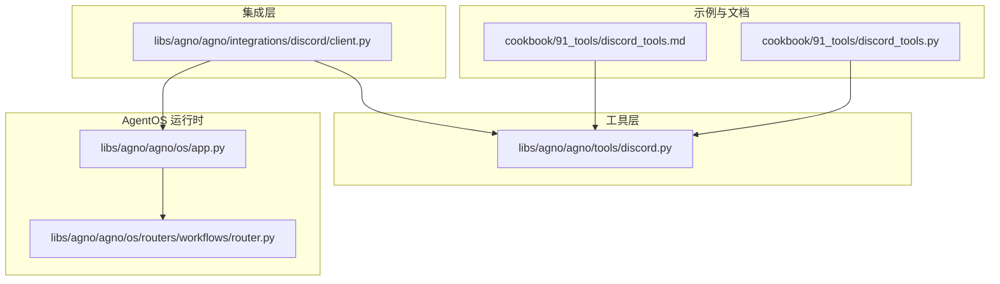
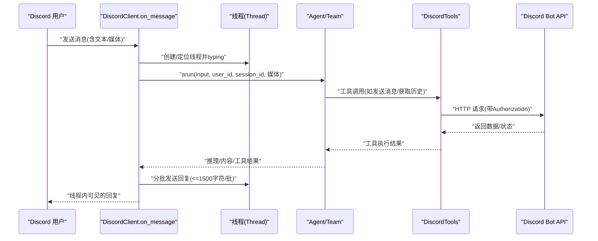
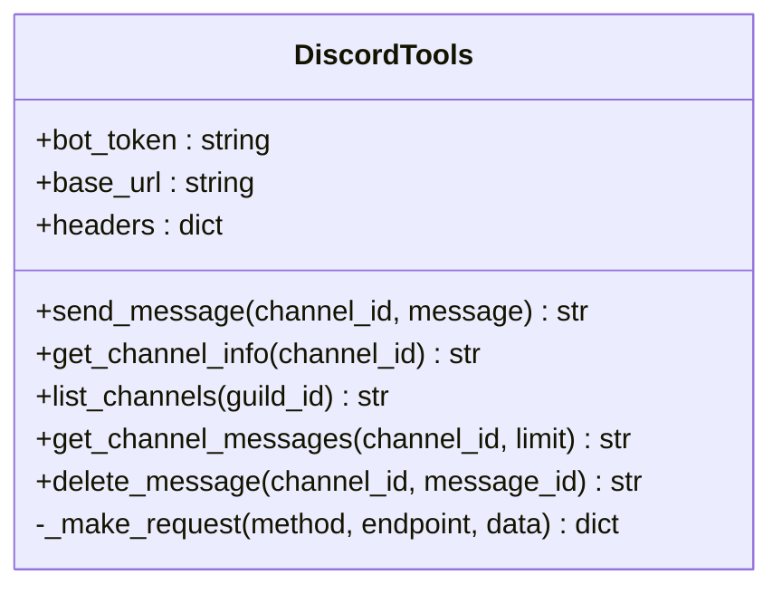
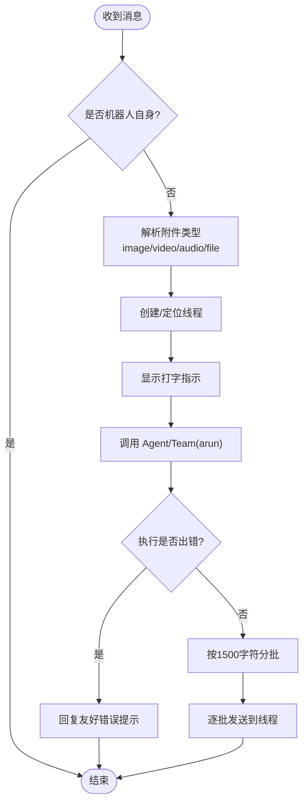
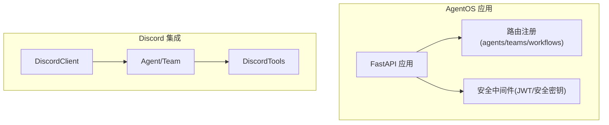
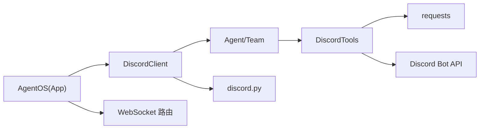

# Discord 集成

<cite>
**本文引用的文件**
- [cookbook/91_tools/discord_tools.py](file://cookbook/91_tools/discord_tools.py)
- [cookbook/91_tools/discord_tools.md](file://cookbook/91_tools/discord_tools.md)
- [libs/agno/agno/tools/discord.py](file://libs/agno/agno/tools/discord.py)
- [libs/agno/agno/integrations/discord/client.py](file://libs/agno/agno/integrations/discord/client.py)
- [libs/agno/agno/os/app.py](file://libs/agno/agno/os/app.py)
- [libs/agno/agno/os/routers/workflows/router.py](file://libs/agno/agno/os/routers/workflows/router.py)
</cite>

## 目录
1. [简介](#简介)
2. [项目结构](#项目结构)
3. [核心组件](#核心组件)
4. [架构总览](#架构总览)
5. [组件详解](#组件详解)
6. [依赖关系分析](#依赖关系分析)
7. [性能考量](#性能考量)
8. [故障排查指南](#故障排查指南)
9. [结论](#结论)
10. [附录](#附录)

## 简介
本文件面向希望在 AgentOS 中集成 Discord 机器人的开发者，系统性地介绍从机器人创建、授权到消息处理与事件监听的完整方案，并说明如何将 Discord 与智能代理系统进行消息路由、状态管理与响应处理的对接。文档同时覆盖错误处理、重连与性能优化的最佳实践，帮助读者快速搭建稳定、可扩展的 Discord 集成。

## 项目结构
围绕 Discord 集成的关键文件分布于以下位置：
- 工具层：libs/agno/agno/tools/discord.py 提供基于 Discord Bot API 的工具集，支持发送消息、获取频道信息、列出频道、获取消息历史、删除消息等能力。
- 集成层：libs/agno/agno/integrations/discord/client.py 提供基于 discord.py 的客户端，负责监听消息事件、解析文本与媒体、创建线程、调用 Agent/Team 并将结果回写至 Discord。
- 示例与说明：cookbook/91_tools/discord_tools.py 与 cookbook/91_tools/discord_tools.md 展示了如何以 Agent 使用 DiscordTools 工具进行频道管理与消息发送。
- AgentOS 集成：libs/agno/agno/os/app.py 与 libs/agno/agno/os/routers/workflows/router.py 展示了 AgentOS 的运行时与 WebSocket 能力，便于在更复杂的系统中承载 Discord 集成服务。

图表来源
- [cookbook/91_tools/discord_tools.py:1-125](file://cookbook/91_tools/discord_tools.py#L1-L125)
- [cookbook/91_tools/discord_tools.md:1-100](file://cookbook/91_tools/discord_tools.md#L1-L100)
- [libs/agno/agno/tools/discord.py:1-162](file://libs/agno/agno/tools/discord.py#L1-L162)
- [libs/agno/agno/integrations/discord/client.py:1-215](file://libs/agno/agno/integrations/discord/client.py#L1-L215)
- [libs/agno/agno/os/app.py:190-200](file://libs/agno/agno/os/app.py#L190-L200)
- [libs/agno/agno/os/routers/workflows/router.py:370-441](file://libs/agno/agno/os/routers/workflows/router.py#L370-L441)

章节来源
- [cookbook/91_tools/discord_tools.py:1-125](file://cookbook/91_tools/discord_tools.py#L1-L125)
- [libs/agno/agno/tools/discord.py:1-162](file://libs/agno/agno/tools/discord.py#L1-L162)
- [libs/agno/agno/integrations/discord/client.py:1-215](file://libs/agno/agno/integrations/discord/client.py#L1-L215)
- [libs/agno/agno/os/app.py:190-200](file://libs/agno/agno/os/app.py#L190-L200)
- [libs/agno/agno/os/routers/workflows/router.py:370-441](file://libs/agno/agno/os/routers/workflows/router.py#L370-L441)

## 核心组件
- DiscordTools 工具集
  - 功能：封装对 Discord Bot API 的调用，提供发送消息、获取频道信息、列出频道、获取消息历史、删除消息等方法。
  - 认证：通过环境变量或构造参数传入 bot_token，使用 Authorization 头进行鉴权。
  - 可控性：支持按需启用/禁用各功能，或统一开启 all=True。
- DiscordClient 集成客户端
  - 功能：基于 discord.py 监听 on_message 事件，解析文本与媒体附件，自动为每个消息创建线程并调用 Agent 或 Team 执行推理与工具调用，最后将结果分批回写到线程。
  - 人机交互：支持可选的人类确认视图，用于需要人工审批的工具调用。
  - 错误处理：捕获 Agent/Team 执行错误并返回友好提示。
- AgentOS 运行时与 WebSocket
  - AgentOS 提供应用生命周期管理、路由注册与安全中间件；WebSocket 路由可用于实时事件推送与认证。
  - 可作为承载 Discord 集成服务的平台，配合 Agent/Team 与工具链实现复杂工作流。

章节来源
- [libs/agno/agno/tools/discord.py:13-162](file://libs/agno/agno/tools/discord.py#L13-L162)
- [libs/agno/agno/integrations/discord/client.py:53-215](file://libs/agno/agno/integrations/discord/client.py#L53-L215)
- [libs/agno/agno/os/app.py:190-200](file://libs/agno/agno/os/app.py#L190-L200)
- [libs/agno/agno/os/routers/workflows/router.py:370-441](file://libs/agno/agno/os/routers/workflows/router.py#L370-L441)

## 架构总览
下图展示了从 Discord 消息事件到 Agent/Team 执行再到响应回写的端到端流程，以及与 AgentOS 的集成关系。

图表来源
- [libs/agno/agno/integrations/discord/client.py:66-153](file://libs/agno/agno/integrations/discord/client.py#L66-L153)
- [libs/agno/agno/integrations/discord/client.py:172-206](file://libs/agno/agno/integrations/discord/client.py#L172-L206)
- [libs/agno/agno/tools/discord.py:50-144](file://libs/agno/agno/tools/discord.py#L50-L144)

## 组件详解

### 组件一：DiscordTools 工具集
- 设计要点
  - 通过 Toolkit 注册工具方法，支持按需启用/禁用，避免过度授权。
  - 统一封装 HTTP 请求，集中处理异常与日志。
  - 工具方法返回字符串，便于在 Agent 输出中直接呈现。
- 数据结构与复杂度
  - 方法均为 O(1) 请求开销，受 Discord API 限速影响。
  - 返回 JSON 字符串，序列化成本低。
- 依赖链
  - requests 库发起 HTTP 请求。
  - 环境变量读取 bot_token。
- 优化建议
  - 对频繁调用的接口增加本地缓存（如频道列表）。
  - 在批量操作时合并请求，减少往返次数。

图表来源
- [libs/agno/agno/tools/discord.py:13-162](file://libs/agno/agno/tools/discord.py#L13-L162)

章节来源
- [libs/agno/agno/tools/discord.py:13-162](file://libs/agno/agno/tools/discord.py#L13-L162)

### 组件二：DiscordClient 事件监听与消息处理
- 设计要点
  - 监听 on_message，跳过自身消息，解析文本与媒体（图片/视频/音频/文件），根据频道类型创建线程。
  - 将用户上下文注入 Agent/Team 的 additional_context，传递 user_id 与 session_id，确保会话状态可追踪。
  - 支持人类确认视图，对需要人工批准的工具调用进行阻塞等待。
  - 将长回复按 1500 字符分批发送，避免超限。
- 媒体处理流程

图表来源
- [libs/agno/agno/integrations/discord/client.py:66-153](file://libs/agno/agno/integrations/discord/client.py#L66-L153)
- [libs/agno/agno/integrations/discord/client.py:172-206](file://libs/agno/agno/integrations/discord/client.py#L172-L206)

章节来源
- [libs/agno/agno/integrations/discord/client.py:53-215](file://libs/agno/agno/integrations/discord/client.py#L53-L215)

### 组件三：AgentOS 运行时与 WebSocket
- 设计要点
  - AgentOS 提供应用生命周期管理、路由注册与安全中间件，支持 JWT 与安全密钥认证。
  - WebSocket 路由支持认证后连接，可用于实时事件推送与前端交互。
- 集成建议
  - 将 DiscordClient 作为独立服务运行，或嵌入 AgentOS 应用中，利用其路由与安全能力。
  - 通过 WebSocket 将 Agent/Team 的执行状态与工具调用进度推送给前端或监控系统。

图表来源
- [libs/agno/agno/os/app.py:190-200](file://libs/agno/agno/os/app.py#L190-L200)
- [libs/agno/agno/os/routers/workflows/router.py:370-441](file://libs/agno/agno/os/routers/workflows/router.py#L370-L441)

章节来源
- [libs/agno/agno/os/app.py:190-200](file://libs/agno/agno/os/app.py#L190-L200)
- [libs/agno/agno/os/routers/workflows/router.py:370-441](file://libs/agno/agno/os/routers/workflows/router.py#L370-L441)

### 组件四：示例与配置（cookbook）
- 示例目标
  - 展示如何以 Agent 使用 DiscordTools 进行频道管理与消息发送。
  - 通过不同配置组合演示最小权限与全量权限两种模式。
- 关键点
  - 通过环境变量提供 DISCORD_BOT_TOKEN。
  - 使用 print_response(stream=True) 观察流式输出。
  - 支持指定频道 ID 与服务器 ID 进行测试。

章节来源
- [cookbook/91_tools/discord_tools.py:18-124](file://cookbook/91_tools/discord_tools.py#L18-L124)
- [cookbook/91_tools/discord_tools.md:1-100](file://cookbook/91_tools/discord_tools.md#L1-L100)

## 依赖关系分析
- 组件耦合
  - DiscordClient 依赖 discord.py 与 Agent/Team 的异步执行接口。
  - DiscordTools 依赖 requests 与 Discord Bot API。
  - AgentOS 提供运行时与路由，作为承载平台。
- 外部依赖
  - discord.py：事件驱动的 Discord SDK。
  - requests：HTTP 客户端。
  - FastAPI/Starlette：AgentOS 的 Web 框架与 WebSocket 支持。
- 潜在环路
  - 当前模块间为单向依赖，未见循环导入。

图表来源
- [libs/agno/agno/integrations/discord/client.py:13-17](file://libs/agno/agno/integrations/discord/client.py#L13-L17)
- [libs/agno/agno/tools/discord.py:7](file://libs/agno/agno/tools/discord.py#L7)
- [libs/agno/agno/os/app.py:190-200](file://libs/agno/agno/os/app.py#L190-L200)
- [libs/agno/agno/os/routers/workflows/router.py:370-441](file://libs/agno/agno/os/routers/workflows/router.py#L370-L441)

章节来源
- [libs/agno/agno/integrations/discord/client.py:13-17](file://libs/agno/agno/integrations/discord/client.py#L13-L17)
- [libs/agno/agno/tools/discord.py:7](file://libs/agno/agno/tools/discord.py#L7)
- [libs/agno/agno/os/app.py:190-200](file://libs/agno/agno/os/app.py#L190-L200)
- [libs/agno/agno/os/routers/workflows/router.py:370-441](file://libs/agno/agno/os/routers/workflows/router.py#L370-L441)

## 性能考量
- 请求限速与退避
  - Discord API 有速率限制，建议在工具层引入指数退避与重试策略，避免触发限流。
- 媒体处理
  - 视频/文件下载可能耗时，建议异步下载并在内存中处理，必要时转存临时存储再上传。
- 回复分批
  - 长文本按 1500 字符分批发送，减少单次请求压力并提升用户体验。
- 缓存策略
  - 对不频繁变化的数据（如频道列表）进行短期缓存，降低 API 调用频率。
- 并发与线程
  - on_message 中的 arun 调用应并发控制，避免大量线程同时占用资源。

## 故障排查指南
- 常见问题
  - 缺少 DISCORD_BOT_TOKEN：在启动 DiscordClient 或使用 DiscordTools 时会报错。请检查环境变量设置。
  - 无法安装 discord.py：请按提示安装 discord.py。
  - 机器人无权限：确认机器人的权限位已正确授予，且在目标服务器/频道具备相应权限。
  - 响应超长导致截断：当前实现按 1500 字符分批，若仍超限，建议优化内容长度或拆分为多条消息。
- 错误处理
  - 工具方法内部捕获异常并返回错误字符串，便于在 Agent 输出中直接呈现。
  - on_message 中对 Agent/Team 执行错误进行捕获并返回友好提示。
- 重连机制
  - 当前未内置自动重连逻辑。建议在生产环境中添加心跳检测与异常重连策略，结合 AgentOS 的健康检查路由进行监控。

章节来源
- [libs/agno/agno/integrations/discord/client.py:16-17](file://libs/agno/agno/integrations/discord/client.py#L16-L17)
- [libs/agno/agno/integrations/discord/client.py:209-214](file://libs/agno/agno/integrations/discord/client.py#L209-L214)
- [libs/agno/agno/tools/discord.py:68-74](file://libs/agno/agno/tools/discord.py#L68-L74)
- [libs/agno/agno/tools/discord.py:86-91](file://libs/agno/agno/tools/discord.py#L86-L91)
- [libs/agno/agno/tools/discord.py:103-108](file://libs/agno/agno/tools/discord.py#L103-L108)
- [libs/agno/agno/tools/discord.py:121-126](file://libs/agno/agno/tools/discord.py#L121-L126)
- [libs/agno/agno/tools/discord.py:139-144](file://libs/agno/agno/tools/discord.py#L139-L144)

## 结论
通过 DiscordTools 与 DiscordClient 的组合，可以快速构建一个具备消息处理、媒体解析、线程管理与工具调用能力的 Discord 集成系统。结合 AgentOS 的运行时与 WebSocket 能力，可在更复杂的场景中实现稳定的智能代理服务。建议在生产环境中完善重连、限速与缓存策略，并持续监控与优化性能与稳定性。

## 附录

### 配置清单与最佳实践
- 环境变量
  - DISCORD_BOT_TOKEN：Discord 机器人令牌，用于鉴权。
  - AGENT_OS_HOST/AGENT_OS_PORT：AgentOS 运行地址与端口（如需集成）。
- 最小权限原则
  - 仅启用必要的工具方法，避免授予删除频道等高危权限。
- 人机交互
  - 对敏感工具调用启用人类确认视图，确保可控。
- 响应与日志
  - 使用流式输出观察执行过程；在工具方法与事件处理中保留日志以便排障。

章节来源
- [cookbook/91_tools/discord_tools.py:18-26](file://cookbook/91_tools/discord_tools.py#L18-L26)
- [libs/agno/agno/integrations/discord/client.py:209-214](file://libs/agno/agno/integrations/discord/client.py#L209-L214)
- [libs/agno/agno/tools/discord.py:13-48](file://libs/agno/agno/tools/discord.py#L13-L48)