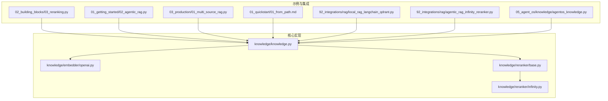
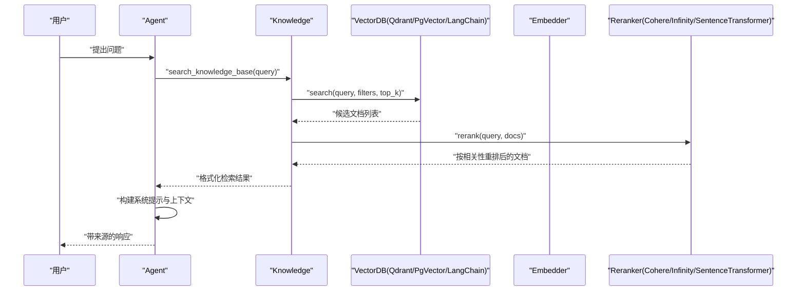
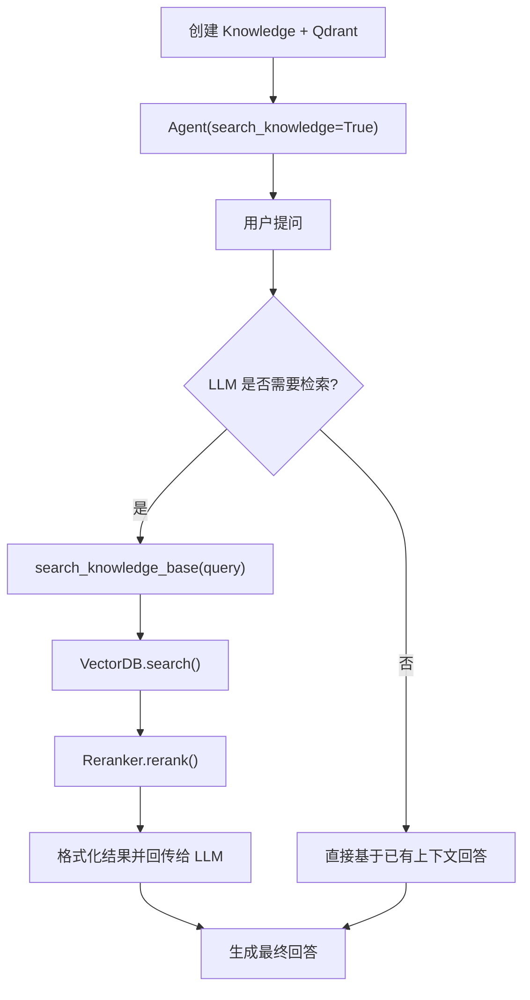
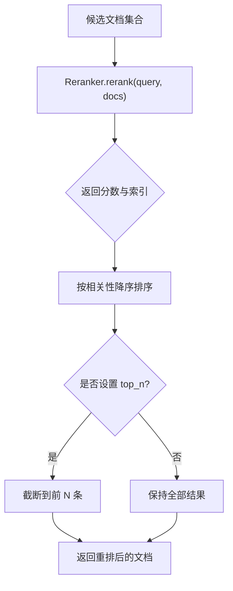
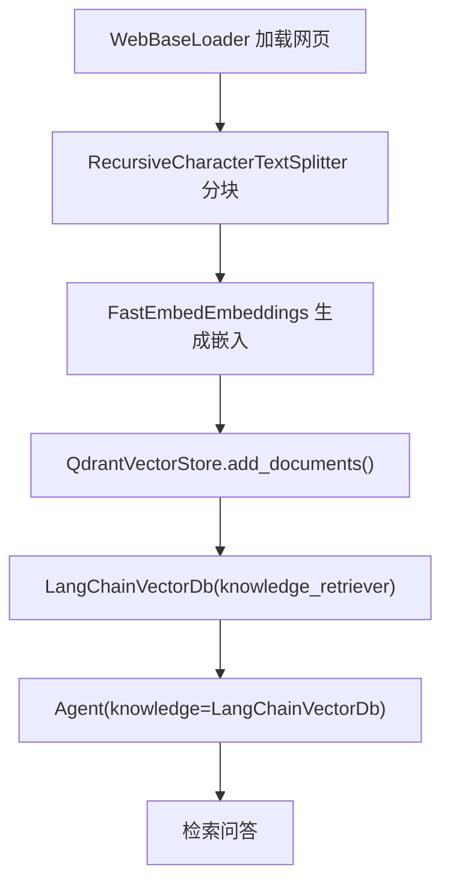
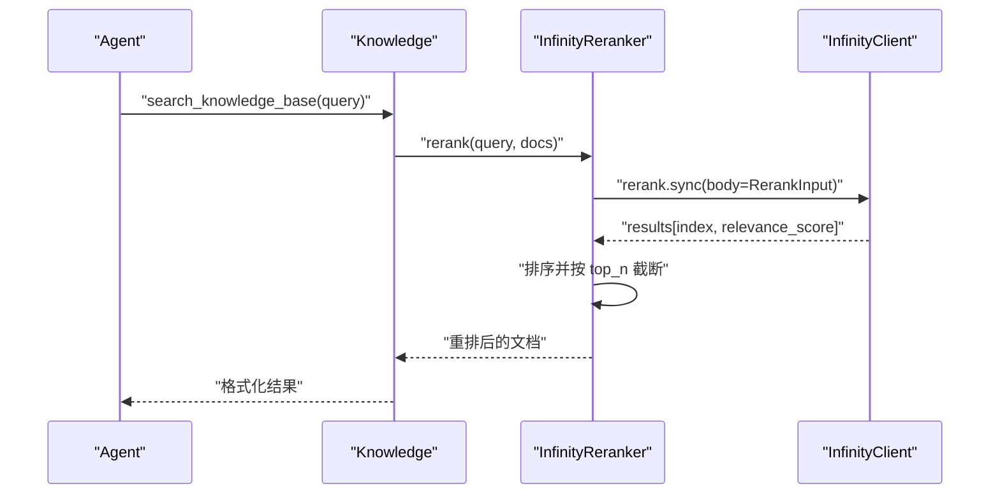
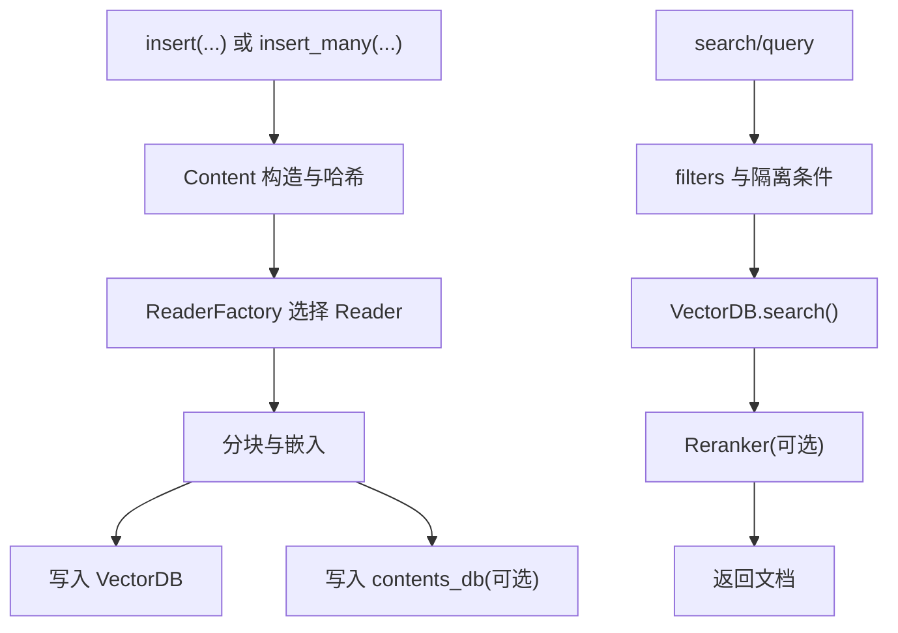
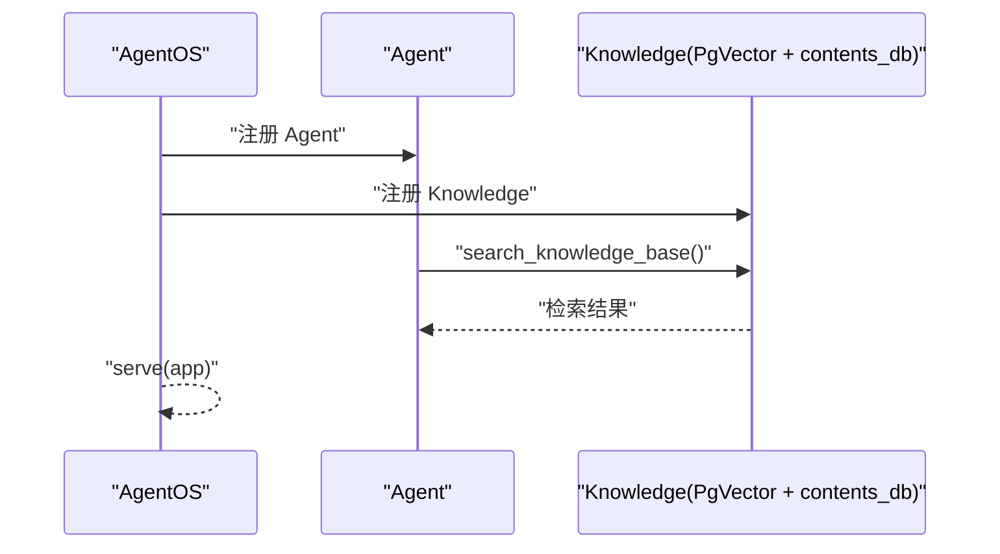
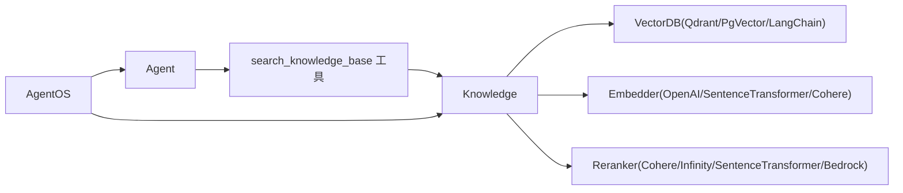

# RAG 集成

<cite>
**本文引用的文件**
- [cookbook/07_knowledge/01_getting_started/02_agentic_rag.py](file://cookbook/07_knowledge/01_getting_started/02_agentic_rag.py)
- [cookbook/07_knowledge/02_building_blocks/03_reranking.py](file://cookbook/07_knowledge/02_building_blocks/03_reranking.py)
- [cookbook/92_integrations/rag/local_rag_langchain_qdrant.py](file://cookbook/92_integrations/rag/local_rag_langchain_qdrant.py)
- [cookbook/92_integrations/rag/agentic_rag_infinity_reranker.py](file://cookbook/92_integrations/rag/agentic_rag_infinity_reranker.py)
- [libs/agno/agno/knowledge/reranker/infinity.py](file://libs/agno/agno/knowledge/reranker/infinity.py)
- [libs/agno/agno/knowledge/knowledge.py](file://libs/agno/agno/knowledge/knowledge.py)
- [libs/agno/agno/knowledge/embedder/openai.py](file://libs/agno/agno/knowledge/embedder/openai.py)
- [libs/agno/agno/knowledge/reranker/base.py](file://libs/agno/agno/knowledge/reranker/base.py)
- [cookbook/07_knowledge/01_quickstart/01_from_path.md](file://cookbook/07_knowledge/01_quickstart/01_from_path.md)
- [cookbook/07_knowledge/03_production/01_multi_source_rag.py](file://cookbook/07_knowledge/03_production/01_multi_source_rag.py)
- [cookbook/05_agent_os/knowledge/agentos_knowledge.py](file://cookbook/05_agent_os/knowledge/agentos_knowledge.py)
</cite>

## 目录
1. [简介](#简介)
2. [项目结构](#项目结构)
3. [核心组件](#核心组件)
4. [架构总览](#架构总览)
5. [详细组件分析](#详细组件分析)
6. [依赖关系分析](#依赖关系分析)
7. [性能考量](#性能考量)
8. [故障排查指南](#故障排查指南)
9. [结论](#结论)
10. [附录](#附录)

## 简介
本文件系统性梳理仓库中的 RAG 集成能力，覆盖本地与云端方案，包括：
- 向量嵌入与相似度检索：OpenAIEmbedder、SentenceTransformerEmbedder、CohereEmbedder 等
- 结果重排序：CohereReranker、SentenceTransformerReranker、InfinityReranker、BedrockReranker
- 知识库管理：文档加载、分块、向量化、索引与查询优化
- 与 AgentOS 的集成：检索配置、上下文注入、响应生成
- 平台集成示例：Infinity Reranker、LangChain Qdrant、传统 Qdrant、PgVector 等
- 性能优化、缓存与错误处理最佳实践

## 项目结构
围绕 RAG 的关键目录与文件如下：
- 知识库与检索示例：cookbook/07_knowledge
- AgentOS 知识库集成：cookbook/05_agent_os/knowledge
- RAG 平台集成示例：cookbook/92_integrations/rag
- 核心知识库与嵌入/重排序实现：libs/agno/agno/knowledge/*

**图表来源**
- [cookbook/07_knowledge/02_building_blocks/03_reranking.py:1-82](file://cookbook/07_knowledge/02_building_blocks/03_reranking.py#L1-L82)
- [cookbook/07_knowledge/01_getting_started/02_agentic_rag.py:1-87](file://cookbook/07_knowledge/01_getting_started/02_agentic_rag.py#L1-L87)
- [cookbook/07_knowledge/03_production/01_multi_source_rag.py:1-86](file://cookbook/07_knowledge/03_production/01_multi_source_rag.py#L1-L86)
- [cookbook/07_knowledge/01_quickstart/01_from_path.md:1-191](file://cookbook/07_knowledge/01_quickstart/01_from_path.md#L1-L191)
- [cookbook/92_integrations/rag/local_rag_langchain_qdrant.py:1-69](file://cookbook/92_integrations/rag/local_rag_langchain_qdrant.py#L1-L69)
- [cookbook/92_integrations/rag/agentic_rag_infinity_reranker.py:1-114](file://cookbook/92_integrations/rag/agentic_rag_infinity_reranker.py#L1-L114)
- [cookbook/05_agent_os/knowledge/agentos_knowledge.py:1-181](file://cookbook/05_agent_os/knowledge/agentos_knowledge.py#L1-L181)
- [libs/agno/agno/knowledge/knowledge.py:1-800](file://libs/agno/agno/knowledge/knowledge.py#L1-L800)
- [libs/agno/agno/knowledge/embedder/openai.py:1-200](file://libs/agno/agno/knowledge/embedder/openai.py#L1-L200)
- [libs/agno/agno/knowledge/reranker/base.py:1-15](file://libs/agno/agno/knowledge/reranker/base.py#L1-L15)
- [libs/agno/agno/knowledge/reranker/infinity.py:1-196](file://libs/agno/agno/knowledge/reranker/infinity.py#L1-L196)

**章节来源**
- [cookbook/07_knowledge/01_getting_started/02_agentic_rag.py:1-87](file://cookbook/07_knowledge/01_getting_started/02_agentic_rag.py#L1-L87)
- [cookbook/07_knowledge/02_building_blocks/03_reranking.py:1-82](file://cookbook/07_knowledge/02_building_blocks/03_reranking.py#L1-L82)
- [cookbook/92_integrations/rag/local_rag_langchain_qdrant.py:1-69](file://cookbook/92_integrations/rag/local_rag_langchain_qdrant.py#L1-L69)
- [cookbook/92_integrations/rag/agentic_rag_infinity_reranker.py:1-114](file://cookbook/92_integrations/rag/agentic_rag_infinity_reranker.py#L1-L114)
- [libs/agno/agno/knowledge/knowledge.py:1-800](file://libs/agno/agno/knowledge/knowledge.py#L1-L800)
- [libs/agno/agno/knowledge/embedder/openai.py:1-200](file://libs/agno/agno/knowledge/embedder/openai.py#L1-L200)
- [libs/agno/agno/knowledge/reranker/base.py:1-15](file://libs/agno/agno/knowledge/reranker/base.py#L1-L15)
- [libs/agno/agno/knowledge/reranker/infinity.py:1-196](file://libs/agno/agno/knowledge/reranker/infinity.py#L1-L196)
- [cookbook/07_knowledge/01_quickstart/01_from_path.md:1-191](file://cookbook/07_knowledge/01_quickstart/01_from_path.md#L1-L191)
- [cookbook/07_knowledge/03_production/01_multi_source_rag.py:1-86](file://cookbook/07_knowledge/03_production/01_multi_source_rag.py#L1-L86)
- [cookbook/05_agent_os/knowledge/agentos_knowledge.py:1-181](file://cookbook/05_agent_os/knowledge/agentos_knowledge.py#L1-L181)

## 核心组件
- 知识库 Knowledge：统一的文档加载、分块、嵌入、索引与检索入口，支持同步/异步插入与批量操作，支持过滤与内容管理。
- 嵌入器 Embedder：OpenAIEmbedder、SentenceTransformerEmbedder、CohereEmbedder 等，负责文本向量化。
- 重排序器 Reranker：CohereReranker、SentenceTransformerReranker、InfinityReranker、BedrockReranker 等，对候选结果进行语义重排。
- 向量数据库 VectorDB：Qdrant、PgVector、LanceDB、LangChain Qdrant、LightRAG 等，支撑向量检索与存储。
- AgentOS 集成：通过 Knowledge 与 AgentOS 的知识库注册，实现多 Agent/多知识库的上下文与检索协同。

**章节来源**
- [libs/agno/agno/knowledge/knowledge.py:40-800](file://libs/agno/agno/knowledge/knowledge.py#L40-L800)
- [libs/agno/agno/knowledge/embedder/openai.py:17-200](file://libs/agno/agno/knowledge/embedder/openai.py#L17-L200)
- [libs/agno/agno/knowledge/reranker/base.py:8-15](file://libs/agno/agno/knowledge/reranker/base.py#L8-L15)
- [libs/agno/agno/knowledge/reranker/infinity.py:16-196](file://libs/agno/agno/knowledge/reranker/infinity.py#L16-L196)
- [cookbook/05_agent_os/knowledge/agentos_knowledge.py:1-181](file://cookbook/05_agent_os/knowledge/agentos_knowledge.py#L1-L181)

## 架构总览
下图展示了从“用户查询”到“检索与重排序”的端到端流程，以及与 AgentOS 的集成点。

**图表来源**
- [cookbook/07_knowledge/01_getting_started/02_agentic_rag.py:47-87](file://cookbook/07_knowledge/01_getting_started/02_agentic_rag.py#L47-L87)
- [libs/agno/agno/knowledge/knowledge.py:507-590](file://libs/agno/agno/knowledge/knowledge.py#L507-L590)
- [libs/agno/agno/knowledge/reranker/infinity.py:61-130](file://libs/agno/agno/knowledge/reranker/infinity.py#L61-L130)
- [libs/agno/agno/knowledge/embedder/openai.py:66-100](file://libs/agno/agno/knowledge/embedder/openai.py#L66-L100)

## 详细组件分析

### 组件一：Agentic RAG（按需检索）
- 特点：Agent 拥有 search_knowledge_base 工具，可自主决定何时检索、是否多次检索与如何精炼查询。
- 示例要点：
  - 使用 Qdrant 作为向量库，混合检索（hybrid），OpenAIEmbedder 生成嵌入。
  - 插入远程 PDF 文档，Agent 交互式地进行多轮问答。
- 关键流程：系统提示注入知识库指令 → LLM 决策调用工具 → 检索 → 重排 → 组合上下文 → 生成答案。

**图表来源**
- [cookbook/07_knowledge/01_getting_started/02_agentic_rag.py:34-87](file://cookbook/07_knowledge/01_getting_started/02_agentic_rag.py#L34-L87)
- [libs/agno/agno/knowledge/knowledge.py:507-590](file://libs/agno/agno/knowledge/knowledge.py#L507-L590)

**章节来源**
- [cookbook/07_knowledge/01_getting_started/02_agentic_rag.py:1-87](file://cookbook/07_knowledge/01_getting_started/02_agentic_rag.py#L1-L87)

### 组件二：重排序（Reranking）
- 支持多种重排序器：CohereReranker、SentenceTransformerReranker、InfinityReranker、BedrockReranker。
- 示例要点：
  - 使用 CohereReranker 对混合检索结果进行重排，提升复杂查询质量。
  - InfinityReranker 提供本地部署的重排序服务，支持 top_n 控制与异步调用。
- 处理流程：候选集生成 → 重排序器评分 → 排序 → 截断（可选）→ 返回重排结果。

**图表来源**
- [cookbook/07_knowledge/02_building_blocks/03_reranking.py:35-44](file://cookbook/07_knowledge/02_building_blocks/03_reranking.py#L35-L44)
- [libs/agno/agno/knowledge/reranker/infinity.py:61-130](file://libs/agno/agno/knowledge/reranker/infinity.py#L61-L130)

**章节来源**
- [cookbook/07_knowledge/02_building_blocks/03_reranking.py:1-82](file://cookbook/07_knowledge/02_building_blocks/03_reranking.py#L1-L82)
- [libs/agno/agno/knowledge/reranker/infinity.py:16-196](file://libs/agno/agno/knowledge/reranker/infinity.py#L16-L196)

### 组件三：本地 RAG（LangChain + Qdrant）
- 特点：使用 LangChain 的 WebBaseLoader、RecursiveCharacterTextSplitter、FastEmbedEmbeddings，结合 QdrantVectorStore 构建本地 RAG。
- 关键步骤：加载网页 → 分块 → 嵌入 → 写入 Qdrant → 通过 LangChainVectorDb 注入到 Knowledge → Agent 检索问答。
- 适用场景：快速原型、本地部署、无需第三方 API。

**图表来源**
- [cookbook/92_integrations/rag/local_rag_langchain_qdrant.py:19-69](file://cookbook/92_integrations/rag/local_rag_langchain_qdrant.py#L19-L69)

**章节来源**
- [cookbook/92_integrations/rag/local_rag_langchain_qdrant.py:1-69](file://cookbook/92_integrations/rag/local_rag_langchain_qdrant.py#L1-L69)

### 组件四：Infinity Reranker 集成
- 特点：通过 InfinityReranker 与本地 Infinity 服务通信，支持同步/异步重排，可配置 host/port/model/top_n。
- 关键流程：构造 rerank 请求 → 调用 InfinityClient → 解析返回 → 排序与截断 → 返回重排结果。
- 注意事项：确保 Infinity 服务可用；异常时回退为原始文档顺序。

**图表来源**
- [cookbook/92_integrations/rag/agentic_rag_infinity_reranker.py:21-54](file://cookbook/92_integrations/rag/agentic_rag_infinity_reranker.py#L21-L54)
- [libs/agno/agno/knowledge/reranker/infinity.py:61-130](file://libs/agno/agno/knowledge/reranker/infinity.py#L61-L130)

**章节来源**
- [cookbook/92_integrations/rag/agentic_rag_infinity_reranker.py:1-114](file://cookbook/92_integrations/rag/agentic_rag_infinity_reranker.py#L1-L114)
- [libs/agno/agno/knowledge/reranker/infinity.py:16-196](file://libs/agno/agno/knowledge/reranker/infinity.py#L16-L196)

### 组件五：知识库管理（插入、过滤、删除）
- 插入能力：支持 path/url/text_content/topics/remote_content，自动推断类型、分块、嵌入、写入向量库与 contents_db。
- 批量插入：ainsert_many/insert_many 支持多来源混合插入。
- 查询与过滤：search/asearch 支持 filters 与隔离搜索（isolate_vector_search）。
- 内容管理：get_content/patch_content/remove_content_by_id 等，支持按 ID/名称/元数据删除向量与内容。

**图表来源**
- [libs/agno/agno/knowledge/knowledge.py:90-500](file://libs/agno/agno/knowledge/knowledge.py#L90-L500)
- [cookbook/07_knowledge/01_quickstart/01_from_path.md:61-85](file://cookbook/07_knowledge/01_quickstart/01_from_path.md#L61-L85)

**章节来源**
- [libs/agno/agno/knowledge/knowledge.py:90-800](file://libs/agno/agno/knowledge/knowledge.py#L90-L800)
- [cookbook/07_knowledge/01_quickstart/01_from_path.md:1-191](file://cookbook/07_knowledge/01_quickstart/01_from_path.md#L1-L191)

### 组件六：AgentOS 集成
- 特点：通过 AgentOS 注册多个 Agent 与 Knowledge，支持同步/异步数据库配置，实现多知识库与多 Agent 的上下文共享与检索协同。
- 关键点：Knowledge 与 Agent 的绑定、contents_db 的使用、AgentOS 的 serve 启动。

**图表来源**
- [cookbook/05_agent_os/knowledge/agentos_knowledge.py:124-181](file://cookbook/05_agent_os/knowledge/agentos_knowledge.py#L124-L181)

**章节来源**
- [cookbook/05_agent_os/knowledge/agentos_knowledge.py:1-181](file://cookbook/05_agent_os/knowledge/agentos_knowledge.py#L1-L181)

## 依赖关系分析
- Knowledge 依赖 VectorDB（Qdrant、PgVector、LanceDB、LangChain Qdrant、LightRAG）、Embedder（OpenAI、SentenceTransformer、Cohere）、Reranker（Cohere、Infinity、SentenceTransformer、Bedrock）。
- Agent 通过工具调用 Knowledge.search_knowledge_base，实现按需检索。
- AgentOS 通过注册多个 Agent 与 Knowledge，形成多租户/多知识库的检索体系。

**图表来源**
- [libs/agno/agno/knowledge/knowledge.py:40-800](file://libs/agno/agno/knowledge/knowledge.py#L40-L800)
- [libs/agno/agno/knowledge/embedder/openai.py:17-200](file://libs/agno/agno/knowledge/embedder/openai.py#L17-L200)
- [libs/agno/agno/knowledge/reranker/base.py:8-15](file://libs/agno/agno/knowledge/reranker/base.py#L8-L15)
- [libs/agno/agno/knowledge/reranker/infinity.py:16-196](file://libs/agno/agno/knowledge/reranker/infinity.py#L16-L196)
- [cookbook/05_agent_os/knowledge/agentos_knowledge.py:124-181](file://cookbook/05_agent_os/knowledge/agentos_knowledge.py#L124-L181)

**章节来源**
- [libs/agno/agno/knowledge/knowledge.py:40-800](file://libs/agno/agno/knowledge/knowledge.py#L40-L800)
- [libs/agno/agno/knowledge/embedder/openai.py:17-200](file://libs/agno/agno/knowledge/embedder/openai.py#L17-L200)
- [libs/agno/agno/knowledge/reranker/base.py:8-15](file://libs/agno/agno/knowledge/reranker/base.py#L8-L15)
- [libs/agno/agno/knowledge/reranker/infinity.py:16-196](file://libs/agno/agno/knowledge/reranker/infinity.py#L16-L196)
- [cookbook/05_agent_os/knowledge/agentos_knowledge.py:1-181](file://cookbook/05_agent_os/knowledge/agentos_knowledge.py#L1-L181)

## 性能考量
- 向量维度与模型选择：不同嵌入模型维度不同，影响向量库大小与检索速度；如需高召回可选更高维模型，兼顾成本与性能。
- 检索策略：混合检索（keyword + vector）通常优于单一向量检索；合理设置 top_k 与 rerank top_n，避免过多候选导致延迟。
- 批量嵌入：利用异步批量嵌入接口（如 OpenAIEmbedder 的批量接口）减少往返开销。
- 缓存与预热：对热点查询结果与嵌入结果进行缓存；启动时预热 Infinity 重排序服务或向量库索引。
- 数据库与网络：向量库与内容库分离可提升并发与查询稳定性；注意网络延迟与连接池配置。
- 过滤与隔离：使用 contents_db 与 metadata 过滤减少无效候选；启用 isolate_vector_search 避免多知识库互相干扰。

[本节为通用指导，无需特定文件引用]

## 故障排查指南
- 重排序服务不可达：检查 Infinity 服务地址与端口；确认网络连通与认证配置；查看日志错误信息并回退至原始文档顺序。
- 向量库连接失败：确认 VectorDB 地址、凭据与集合存在；必要时重建集合或检查驱动版本。
- 嵌入接口异常：检查 Embedder 的 API Key、维度与请求参数；对 OpenAIEmbedder 的批量调用进行降级处理。
- AgentOS 启动失败：确认知识库注册与数据库连接；检查 contents_db 与 vector_db 的表结构与权限。
- 检索结果为空：检查索引是否建立、分块是否过小、查询是否包含关键词；适当放宽 filters 或增加 top_k。

**章节来源**
- [libs/agno/agno/knowledge/reranker/infinity.py:119-130](file://libs/agno/agno/knowledge/reranker/infinity.py#L119-L130)
- [libs/agno/agno/knowledge/embedder/openai.py:85-100](file://libs/agno/agno/knowledge/embedder/openai.py#L85-L100)
- [cookbook/05_agent_os/knowledge/agentos_knowledge.py:142-181](file://cookbook/05_agent_os/knowledge/agentos_knowledge.py#L142-L181)

## 结论
本仓库提供了从基础到高级的 RAG 能力：按需检索、多嵌入与重排序、多来源知识库管理、平台集成与 AgentOS 协同。通过合理选择嵌入与重排序模型、优化检索策略与缓存机制，并完善错误处理与监控，可在本地与云端环境中稳定落地高质量的 RAG 应用。

[本节为总结，无需特定文件引用]

## 附录
- 快速开始：使用 Knowledge.insert(path/url/text_content) 与 search_knowledge=True 的 Agent，即可完成从文档加载到检索问答的闭环。
- 生产实践：多来源混合插入、内容生命周期管理、多租户隔离与 AgentOS 集成。
- 平台示例：Infinity Reranker 本地部署、LangChain Qdrant 本地 RAG、传统 Qdrant/PgVector 集成。

**章节来源**
- [cookbook/07_knowledge/01_quickstart/01_from_path.md:1-191](file://cookbook/07_knowledge/01_quickstart/01_from_path.md#L1-L191)
- [cookbook/07_knowledge/03_production/01_multi_source_rag.py:1-86](file://cookbook/07_knowledge/03_production/01_multi_source_rag.py#L1-L86)
- [cookbook/92_integrations/rag/agentic_rag_infinity_reranker.py:1-114](file://cookbook/92_integrations/rag/agentic_rag_infinity_reranker.py#L1-L114)
- [cookbook/92_integrations/rag/local_rag_langchain_qdrant.py:1-69](file://cookbook/92_integrations/rag/local_rag_langchain_qdrant.py#L1-L69)