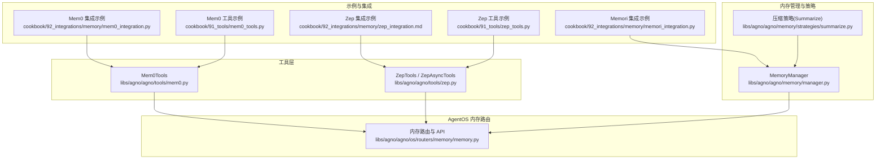
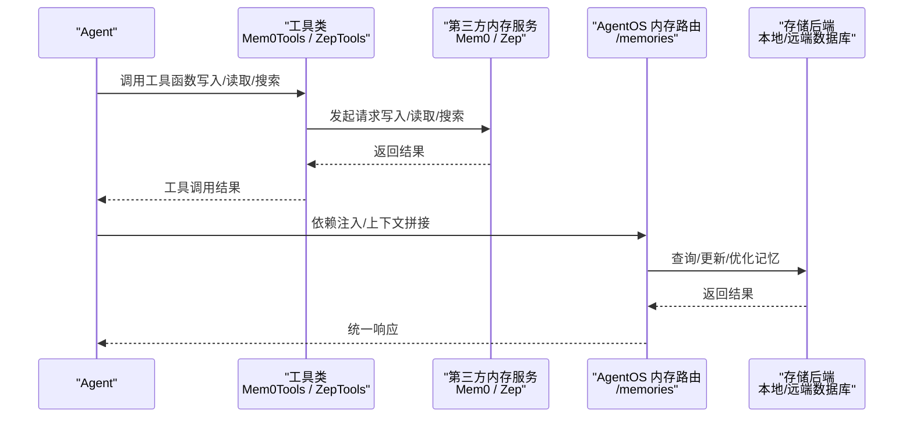
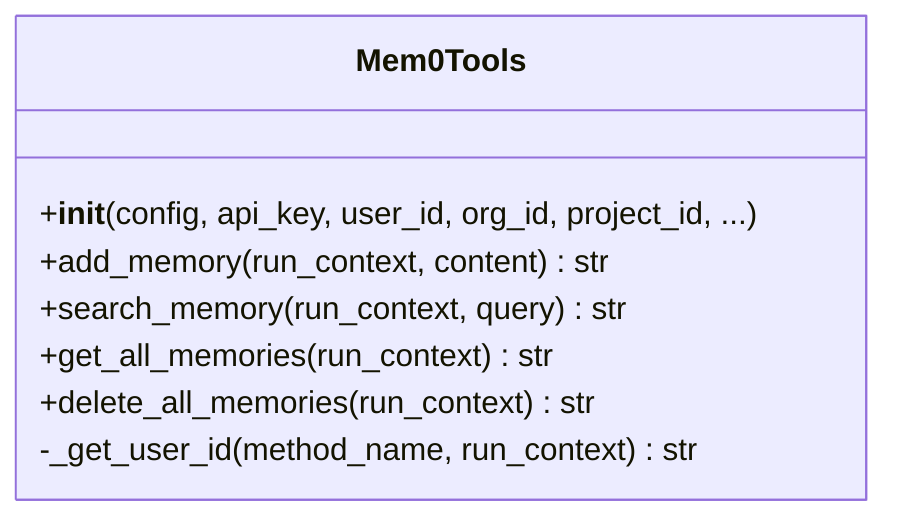
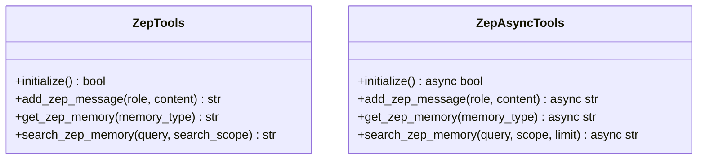
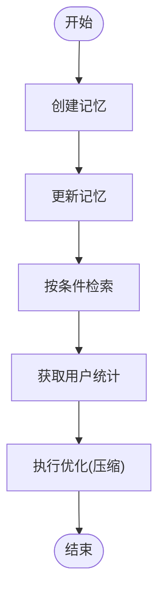
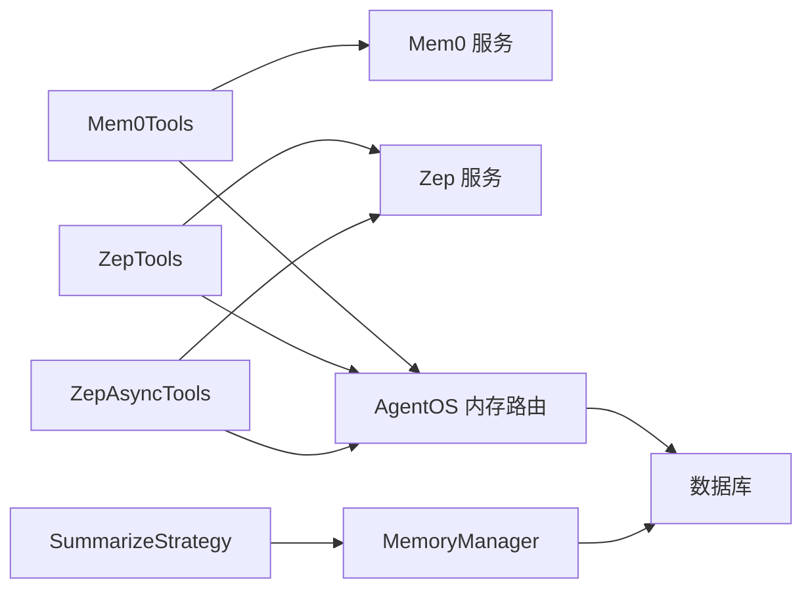

# 内存集成

<cite>
**本文引用的文件**
- [libs/agno/agno/tools/mem0.py](file://libs/agno/agno/tools/mem0.py)
- [libs/agno/agno/tools/zep.py](file://libs/agno/agno/tools/zep.py)
- [cookbook/91_tools/mem0_tools.py](file://cookbook/91_tools/mem0_tools.py)
- [cookbook/91_tools/zep_tools.py](file://cookbook/91_tools/zep_tools.py)
- [cookbook/92_integrations/memory/zep_integration.md](file://cookbook/92_integrations/memory/zep_integration.md)
- [cookbook/92_integrations/memory/mem0_integration.py](file://cookbook/92_integrations/memory/mem0_integration.py)
- [cookbook/92_integrations/memory/memori_integration.py](file://cookbook/92_integrations/memory/memori_integration.py)
- [libs/agno/agno/os/routers/memory/memory.py](file://libs/agno/agno/os/routers/memory/memory.py)
- [libs/agno/agno/memory/manager.py](file://libs/agno/agno/memory/manager.py)
- [libs/agno/agno/memory/strategies/summarize.py](file://libs/agno/agno/memory/strategies/summarize.py)
- [libs/agno/tests/unit/tools/test_zep.py](file://libs/agno/tests/unit/tools/test_zep.py)
- [libs/agno/tests/integration/os/test_memory.py](file://libs/agno/tests/integration/os/test_memory.py)
- [libs/agno/tests/integration/db/surrealdb/test_surrealdb_memory.py](file://libs/agno/tests/integration/db/surrealdb/test_surrealdb_memory.py)
</cite>

## 目录
1. [简介](#简介)
2. [项目结构](#项目结构)
3. [核心组件](#核心组件)
4. [架构总览](#架构总览)
5. [详细组件分析](#详细组件分析)
6. [依赖关系分析](#依赖关系分析)
7. [性能考虑](#性能考虑)
8. [故障排查指南](#故障排查指南)
9. [结论](#结论)
10. [附录](#附录)

## 简介
本文件系统性梳理了在 AgentOS 生态中对第三方内存服务的集成方案，重点覆盖 Mem0、Mem0ri 与 Zep 三类服务。内容涵盖：
- 第三方内存服务的接入方式与配置要点（API 密钥、组织/项目标识、连接参数）
- 数据同步机制（写入、读取、更新、删除）与异步处理流程
- 与 AgentOS 内存管理的对接（数据格式转换、依赖注入、上下文拼接、一致性保障）
- 性能优化策略（缓存、批量操作、令牌压缩）、错误处理最佳实践
- 多种服务的配置示例与使用指南，帮助快速落地

## 项目结构
围绕“内存集成”的相关模块主要分布在以下位置：
- 工具层：封装第三方内存服务的工具类（Mem0Tools、ZepTools/ZepAsyncTools）
- 示例与集成：cookbook 中的工具使用示例与端到端集成说明
- AgentOS 内存路由：提供统一的内存 CRUD、统计与优化接口
- 内存管理器与策略：负责本地/远程数据库中的记忆持久化、检索与压缩

图表来源
- [libs/agno/agno/tools/mem0.py:1-195](file://libs/agno/agno/tools/mem0.py#L1-L195)
- [libs/agno/agno/tools/zep.py:1-455](file://libs/agno/agno/tools/zep.py#L1-L455)
- [cookbook/92_integrations/memory/mem0_integration.py:1-55](file://cookbook/92_integrations/memory/mem0_integration.py#L1-L55)
- [cookbook/92_integrations/memory/zep_integration.md:1-151](file://cookbook/92_integrations/memory/zep_integration.md#L1-L151)
- [cookbook/91_tools/mem0_tools.py:1-122](file://cookbook/91_tools/mem0_tools.py#L1-L122)
- [cookbook/91_tools/zep_tools.py:1-106](file://cookbook/91_tools/zep_tools.py#L1-L106)
- [cookbook/92_integrations/memory/memori_integration.py:1-66](file://cookbook/92_integrations/memory/memori_integration.py#L1-L66)
- [libs/agno/agno/os/routers/memory/memory.py:1-798](file://libs/agno/agno/os/routers/memory/memory.py#L1-L798)
- [libs/agno/agno/memory/manager.py:1-800](file://libs/agno/agno/memory/manager.py#L1-L800)
- [libs/agno/agno/memory/strategies/summarize.py:1-197](file://libs/agno/agno/memory/strategies/summarize.py#L1-L197)

章节来源
- [libs/agno/agno/tools/mem0.py:1-195](file://libs/agno/agno/tools/mem0.py#L1-L195)
- [libs/agno/agno/tools/zep.py:1-455](file://libs/agno/agno/tools/zep.py#L1-L455)
- [cookbook/92_integrations/memory/mem0_integration.py:1-55](file://cookbook/92_integrations/memory/mem0_integration.py#L1-L55)
- [cookbook/92_integrations/memory/zep_integration.md:1-151](file://cookbook/92_integrations/memory/zep_integration.md#L1-L151)
- [cookbook/91_tools/mem0_tools.py:1-122](file://cookbook/91_tools/mem0_tools.py#L1-L122)
- [cookbook/91_tools/zep_tools.py:1-106](file://cookbook/91_tools/zep_tools.py#L1-L106)
- [cookbook/92_integrations/memory/memori_integration.py:1-66](file://cookbook/92_integrations/memory/memori_integration.py#L1-L66)
- [libs/agno/agno/os/routers/memory/memory.py:1-798](file://libs/agno/agno/os/routers/memory/memory.py#L1-L798)
- [libs/agno/agno/memory/manager.py:1-800](file://libs/agno/agno/memory/manager.py#L1-L800)
- [libs/agno/agno/memory/strategies/summarize.py:1-197](file://libs/agno/agno/memory/strategies/summarize.py#L1-L197)

## 核心组件
- Mem0Tools：封装 Mem0 平台或本地客户端，支持添加记忆、搜索、列出与删除；自动解析 user_id，支持从环境变量读取 API 凭据。
- ZepTools / ZepAsyncTools：封装 Zep 云服务，提供消息写入、记忆摘要获取、知识图谱检索；支持同步与异步两种变体；具备会话与用户初始化逻辑。
- AgentOS 内存路由：提供统一的内存 CRUD、分页检索、主题聚合、用户统计与优化接口，支持远端数据库与本地数据库。
- MemoryManager 与 SummarizeStrategy：负责本地记忆的创建、更新、删除、检索与压缩，支持按主题与时间维度检索，提供令牌级压缩策略。

章节来源
- [libs/agno/agno/tools/mem0.py:16-195](file://libs/agno/agno/tools/mem0.py#L16-L195)
- [libs/agno/agno/tools/zep.py:36-455](file://libs/agno/agno/tools/zep.py#L36-L455)
- [libs/agno/agno/os/routers/memory/memory.py:38-798](file://libs/agno/agno/os/routers/memory/memory.py#L38-L798)
- [libs/agno/agno/memory/manager.py:44-800](file://libs/agno/agno/memory/manager.py#L44-L800)
- [libs/agno/agno/memory/strategies/summarize.py:15-197](file://libs/agno/agno/memory/strategies/summarize.py#L15-L197)

## 架构总览
下图展示了从 Agent 到第三方内存服务与 AgentOS 内存管理的整体交互路径，以及依赖注入与上下文拼接的关键环节。

图表来源
- [libs/agno/agno/tools/mem0.py:87-195](file://libs/agno/agno/tools/mem0.py#L87-L195)
- [libs/agno/agno/tools/zep.py:136-240](file://libs/agno/agno/tools/zep.py#L136-L240)
- [libs/agno/agno/os/routers/memory/memory.py:56-798](file://libs/agno/agno/os/routers/memory/memory.py#L56-L798)

## 详细组件分析

### Mem0 集成
- 初始化与配置
  - 支持通过 API 密钥、组织/项目标识进行平台客户端初始化；也可从配置对象或默认方式初始化。
  - 自动从环境变量读取密钥与标识，便于在不同部署环境中灵活切换。
- 数据同步与操作
  - 写入：将用户输入的消息包装为标准格式并提交至服务端，支持结构化字典转字符串。
  - 搜索：基于语义检索返回匹配的记忆列表。
  - 读取：返回当前用户的全部记忆。
  - 删除：清空指定用户的全部记忆。
- 错误处理
  - 初始化失败抛出连接异常；各操作捕获异常并返回可读错误信息。

图表来源
- [libs/agno/agno/tools/mem0.py:16-195](file://libs/agno/agno/tools/mem0.py#L16-L195)

章节来源
- [libs/agno/agno/tools/mem0.py:16-195](file://libs/agno/agno/tools/mem0.py#L16-L195)
- [cookbook/91_tools/mem0_tools.py:1-122](file://cookbook/91_tools/mem0_tools.py#L1-L122)
- [cookbook/92_integrations/memory/mem0_integration.py:1-55](file://cookbook/92_integrations/memory/mem0_integration.py#L1-L55)

### Zep 集成
- 初始化与配置
  - 必须提供 API 密钥；支持显式传入 user_id/session_id 或自动生成。
  - 初始化时确保用户存在、会话创建成功；支持忽略特定角色消息（如 assistant）以减少噪声。
- 数据同步与操作
  - 写入：向当前会话追加消息，支持 role/content。
  - 读取：支持获取结构化摘要（context）或完整消息列表。
  - 搜索：基于知识图谱在“边（facts）”或“节点（nodes）”范围内检索。
- 异步版本
  - ZepAsyncTools 提供异步初始化与调用，适合高并发场景。
- 依赖注入与上下文拼接
  - 通过 dependencies + add_dependencies_to_context 将 Zep 生成的记忆摘要注入到用户消息上下文中，提升对话个性化与准确性。

图表来源
- [libs/agno/agno/tools/zep.py:36-455](file://libs/agno/agno/tools/zep.py#L36-L455)

章节来源
- [libs/agno/agno/tools/zep.py:36-455](file://libs/agno/agno/tools/zep.py#L36-L455)
- [cookbook/91_tools/zep_tools.py:1-106](file://cookbook/91_tools/zep_tools.py#L1-L106)
- [cookbook/92_integrations/memory/zep_integration.md:1-151](file://cookbook/92_integrations/memory/zep_integration.md#L1-L151)

### AgentOS 内存管理与路由
- 统一 API
  - 创建、删除、批量删除、查询、按主题检索、获取主题列表、更新、用户统计、优化等。
- 数据一致性
  - 支持远端数据库与本地数据库；更新时保留 created_at 不变，仅更新 updated_at，确保时间线一致。
- 优化策略
  - 提供默认“压缩”策略，将多条记忆合并为单条综合摘要，降低令牌消耗并保持关键事实。

图表来源
- [libs/agno/agno/os/routers/memory/memory.py:56-798](file://libs/agno/agno/os/routers/memory/memory.py#L56-L798)
- [libs/agno/agno/memory/strategies/summarize.py:44-197](file://libs/agno/agno/memory/strategies/summarize.py#L44-L197)

章节来源
- [libs/agno/agno/os/routers/memory/memory.py:56-798](file://libs/agno/agno/os/routers/memory/memory.py#L56-L798)
- [libs/agno/agno/memory/manager.py:793-800](file://libs/agno/agno/memory/manager.py#L793-L800)
- [libs/agno/agno/memory/strategies/summarize.py:15-197](file://libs/agno/agno/memory/strategies/summarize.py#L15-L197)
- [libs/agno/tests/integration/db/surrealdb/test_surrealdb_memory.py:88-127](file://libs/agno/tests/integration/db/surrealdb/test_surrealdb_memory.py#L88-L127)

### Memori 集成（外部服务）
- 通过 SQLAlchemy 会话与 Memori 客户端注册，结合 LLM 客户端实现对话记忆持久化。
- 适用于需要本地化存储与可插拔记忆服务的场景。

章节来源
- [cookbook/92_integrations/memory/memori_integration.py:1-66](file://cookbook/92_integrations/memory/memori_integration.py#L1-L66)

## 依赖关系分析
- 工具类依赖
  - Mem0Tools 依赖 mem0 客户端；ZepTools 依赖 zep-cloud 客户端；两者均在初始化阶段进行导入校验。
- AgentOS 集成
  - 工具类与 AgentOS 内存路由解耦，通过统一的依赖注入机制（dependencies + add_dependencies_to_context）将第三方服务输出注入到系统提示与用户消息中。
- 内存管理链路
  - MemoryManager 负责本地/远端数据库的记忆增删改查与检索；SummarizeStrategy 提供压缩策略；优化接口通过路由暴露。

图表来源
- [libs/agno/agno/tools/mem0.py:9-13](file://libs/agno/agno/tools/mem0.py#L9-L13)
- [libs/agno/agno/tools/zep.py:9-19](file://libs/agno/agno/tools/zep.py#L9-L19)
- [libs/agno/agno/os/routers/memory/memory.py:38-53](file://libs/agno/agno/os/routers/memory/memory.py#L38-L53)
- [libs/agno/agno/memory/manager.py:44-98](file://libs/agno/agno/memory/manager.py#L44-L98)
- [libs/agno/agno/memory/strategies/summarize.py:15-42](file://libs/agno/agno/memory/strategies/summarize.py#L15-L42)

章节来源
- [libs/agno/agno/tools/mem0.py:9-13](file://libs/agno/agno/tools/mem0.py#L9-L13)
- [libs/agno/agno/tools/zep.py:9-19](file://libs/agno/agno/tools/zep.py#L9-L19)
- [libs/agno/agno/os/routers/memory/memory.py:38-53](file://libs/agno/agno/os/routers/memory/memory.py#L38-L53)
- [libs/agno/agno/memory/manager.py:44-98](file://libs/agno/agno/memory/manager.py#L44-L98)
- [libs/agno/agno/memory/strategies/summarize.py:15-42](file://libs/agno/agno/memory/strategies/summarize.py#L15-L42)

## 性能考虑
- 缓存与批处理
  - 对于频繁读取的记忆摘要，可在应用层引入短期缓存（如会话内缓存），避免重复调用第三方服务。
  - 批量写入消息时尽量合并请求，减少网络往返。
- 令牌压缩
  - 使用 MemoryManager 的优化接口与 SummarizeStrategy 将多条记忆压缩为一条综合摘要，显著降低上下文长度与推理成本。
- 异步化
  - 在高并发场景优先使用 ZepAsyncTools，减少阻塞；同时配合批量操作与限流策略。
- 时间戳一致性
  - 更新记忆时仅变更 updated_at，保留 created_at，有助于审计与统计。

章节来源
- [libs/agno/agno/memory/strategies/summarize.py:44-197](file://libs/agno/agno/memory/strategies/summarize.py#L44-L197)
- [libs/agno/agno/os/routers/memory/memory.py:671-777](file://libs/agno/agno/os/routers/memory/memory.py#L671-L777)
- [libs/agno/tests/integration/db/surrealdb/test_surrealdb_memory.py:88-127](file://libs/agno/tests/integration/db/surrealdb/test_surrealdb_memory.py#L88-L127)

## 故障排查指南
- 初始化失败
  - Mem0Tools：检查 API 密钥、组织/项目标识是否正确；查看日志定位具体异常。
  - ZepTools：确认 ZEP_API_KEY 设置；若用户不存在会尝试创建，失败时会记录错误并返回初始化失败。
- 工具调用报错
  - ZepTools：当未初始化或会话/用户未就绪时，返回“客户端/会话未初始化”错误；检查初始化流程与 sleep 等待时间。
  - Mem0Tools：捕获异常并返回可读错误信息，便于前端或上层逻辑处理。
- 单元测试参考
  - ZepTools：包含对不支持的 memory_type、未初始化状态、图谱搜索返回边/节点等场景的断言，可据此验证行为。

章节来源
- [libs/agno/agno/tools/mem0.py:50-67](file://libs/agno/agno/tools/mem0.py#L50-L67)
- [libs/agno/agno/tools/zep.py:86-135](file://libs/agno/agno/tools/zep.py#L86-L135)
- [libs/agno/tests/unit/tools/test_zep.py:95-135](file://libs/agno/tests/unit/tools/test_zep.py#L95-L135)

## 结论
通过 Mem0Tools、ZepTools/ZepAsyncTools 与 AgentOS 内存路由的协同，可以实现从“写入—同步—检索—注入上下文—优化”的闭环。Mem0 适合结构化记忆与语义检索，Zep 更强调知识图谱与上下文摘要；二者均可与 MemoryManager 的压缩策略结合，实现高效、低成本的长期记忆管理。建议在生产环境中启用异步调用、缓存与令牌压缩，并严格遵循时间戳一致性规则，确保数据可审计与可维护。

## 附录

### 配置示例与使用指南
- Mem0
  - 环境变量：MEM0_API_KEY、MEM0_ORG_ID、MEM0_PROJECT_ID
  - 示例脚本：[mem0_integration.py:1-55](file://cookbook/92_integrations/memory/mem0_integration.py#L1-L55)、[mem0_tools.py:1-122](file://cookbook/91_tools/mem0_tools.py#L1-L122)
- Zep
  - 环境变量：ZEP_API_KEY
  - 示例脚本：[zep_integration.md:1-151](file://cookbook/92_integrations/memory/zep_integration.md#L1-L151)、[zep_tools.py:1-106](file://cookbook/91_tools/zep_tools.py#L1-L106)
- Memori
  - 示例脚本：[memori_integration.py:1-66](file://cookbook/92_integrations/memory/memori_integration.py#L1-L66)

### 与 AgentOS 的集成要点
- 依赖注入：将第三方服务返回的记忆摘要放入 dependencies，并开启 add_dependencies_to_context，使记忆成为系统提示的一部分。
- 路由接口：通过 /memories 统一管理本地/远端记忆，支持优化与统计。
- 一致性：更新时保留 created_at，仅更新 updated_at，确保时间线稳定。

章节来源
- [cookbook/92_integrations/memory/zep_integration.md:65-74](file://cookbook/92_integrations/memory/zep_integration.md#L65-L74)
- [libs/agno/agno/os/routers/memory/memory.py:56-798](file://libs/agno/agno/os/routers/memory/memory.py#L56-L798)
- [libs/agno/tests/integration/os/test_memory.py:1-35](file://libs/agno/tests/integration/os/test_memory.py#L1-L35)