# 可观测性集成

<cite>
**本文档引用的文件**
- [README.md](file://cookbook/92_integrations/observability/README.md)
- [langfuse_via_openinference.py](file://cookbook/92_integrations/observability/langfuse_via_openinference.py)
- [arize_phoenix_via_openinference.py](file://cookbook/92_integrations/observability/arize_phoenix_via_openinference.py)
- [arize_phoenix_via_openinference_local.py](file://cookbook/92_integrations/observability/arize_phoenix_via_openinference_local.py)
- [arize_phoenix_via_openinference_workflow.md](file://cookbook/92_integrations/observability/workflows/arize_phoenix_via_openinference_workflow.md)
- [langsmith_via_openinference.py](file://cookbook/92_integrations/observability/langsmith_via_openinference.py)
- [logfire_via_openinference.py](file://cookbook/92_integrations/observability/logfire_via_openinference.py)
- [opik_via_openinference.py](file://cookbook/92_integrations/observability/opik_via_openinference.py)
- [trace_to_database.py](file://cookbook/92_integrations/observability/trace_to_database.py)
- [mlflow_via_openinference.py](file://cookbook/92_integrations/observability/mlflow_via_openinference.py)
- [mlflow_via_autolog.py](file://cookbook/92_integrations/observability/mlflow_via_autolog.py)
- [__init__.py](file://libs/agno/agno/tracing/__init__.py)
- [schemas.py](file://libs/agno/agno/tracing/schemas.py)
- [setup.py](file://libs/agno/agno/tracing/setup.py)
- [exporter.py](file://libs/agno/agno/tracing/exporter.py)
- [log.py](file://libs/agno/agno/utils/log.py)
- [logging.py](file://libs/agno_infra/agno/utilities/logging.py)
- [test_logging.py](file://libs/agno/tests/unit/utils/test_logging.py)
- [custom_logging.md](file://cookbook/02_agents/14_advanced/custom_logging.md)
- [metrics.py](file://libs/agno/agno/os/routers/metrics/metrics.py)
- [test_metrics_routes.py](file://libs/agno/tests/system/tests/test_metrics_routes.py)
- [performance.py](file://libs/agno/agno/eval/performance.py)
- [async_function.py.md](file://cookbook/09_evals/performance/async_function.py.md)
- [_mistral_compat.py](file://libs/agno/agno/utils/models/_mistral_compat.py)
- [mistral.py](file://libs/agno/agno/models/mistral/mistral.py)
- [mistral.py](file://libs/agno/agno/utils/models/mistral.py)
- [mistral.py](file://libs/agno/agno/knowledge/embedder/mistral.py)
</cite>

## 更新摘要
**变更内容**
- 新增MLflow集成支持，提供两种追踪方式：autolog和OpenInference
- 增强Mistral AI SDK v2.0.0兼容性，包含try/except回退导入机制
- 更新平台集成示例，扩展可观测性工具支持范围

## 目录
1. [简介](#简介)
2. [项目结构](#项目结构)
3. [核心组件](#核心组件)
4. [架构总览](#架构总览)
5. [详细组件分析](#详细组件分析)
6. [依赖分析](#依赖分析)
7. [性能考虑](#性能考虑)
8. [故障排查指南](#故障排查指南)
9. [结论](#结论)
10. [附录](#附录)

## 简介
本文件系统性梳理 Agno 项目的可观测性集成方案，覆盖链路追踪、日志记录、性能监控与告警等能力。重点包括：
- 与 Langfuse、Arize Phoenix、LangSmith、OpenTelemetry、**MLflow** 等平台的集成配置与使用
- 追踪上下文传播、Span 创建与分布式追踪配置
- 结构化日志、日志级别与日志聚合
- 指标收集、告警规则与仪表板设置
- 平台特性对比、最佳实践与故障排查方法
- **Mistral AI SDK v2.0.0 兼容性支持**

## 项目结构
可观测性示例主要位于 cookbook/92_integrations/observability 目录，包含多个平台的集成脚本与工作流示例；追踪核心能力位于 libs/agno/agno/tracing 子模块。

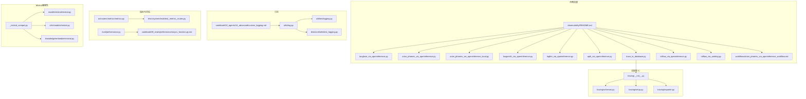

**图表来源**
- [README.md:1-36](file://cookbook/92_integrations/observability/README.md#L1-L36)
- [mlflow_via_openinference.py:1-68](file://cookbook/92_integrations/observability/mlflow_via_openinference.py#L1-L68)
- [mlflow_via_autolog.py:1-48](file://cookbook/92_integrations/observability/mlflow_via_autolog.py#L1-L48)
- [_mistral_compat.py:1-84](file://libs/agno/agno/utils/models/_mistral_compat.py#L1-L84)

**章节来源**
- [README.md:1-36](file://cookbook/92_integrations/observability/README.md#L1-L36)

## 核心组件
- OpenTelemetry 追踪与自动注入：通过 AgnoInstrumentor 对 Agent、Team、Workflow 的运行进行自动追踪，支持多种导出器（数据库、云平台）。
- 数据库存储：DatabaseSpanExporter 将 Span 聚合为 Trace 并写入数据库，提供查询接口用于诊断与审计。
- 日志系统：基于 RichHandler 的彩色日志，支持按组件类型（agent/team/workflow）区分样式与级别。
- 性能评估：内置性能评测工具，支持运行时间与内存占用的测量与统计。
- **MLflow 集成：提供两种追踪方式，包括原生 autolog 和 OpenInference 集成**。
- **Mistral AI SDK 兼容性：自动检测版本并提供 v1/v2 兼容的导入机制**。

**章节来源**
- [setup.py:23-113](file://libs/agno/agno/tracing/setup.py#L23-L113)
- [exporter.py:18-162](file://libs/agno/agno/tracing/exporter.py#L18-L162)
- [schemas.py:13-277](file://libs/agno/agno/tracing/schemas.py#L13-L277)
- [log.py:1-255](file://libs/agno/agno/utils/log.py#L1-L255)
- [performance.py:109-656](file://libs/agno/agno/eval/performance.py#L109-L656)
- [mlflow_via_openinference.py:1-68](file://cookbook/92_integrations/observability/mlflow_via_openinference.py#L1-L68)
- [mlflow_via_autolog.py:1-48](file://cookbook/92_integrations/observability/mlflow_via_autolog.py#L1-L48)
- [_mistral_compat.py:1-84](file://libs/agno/agno/utils/models/_mistral_compat.py#L1-L84)

## 架构总览
下图展示了从应用到追踪后端的整体链路，包括本地数据库导出与云平台导出两种路径，以及新增的 MLflow 集成。

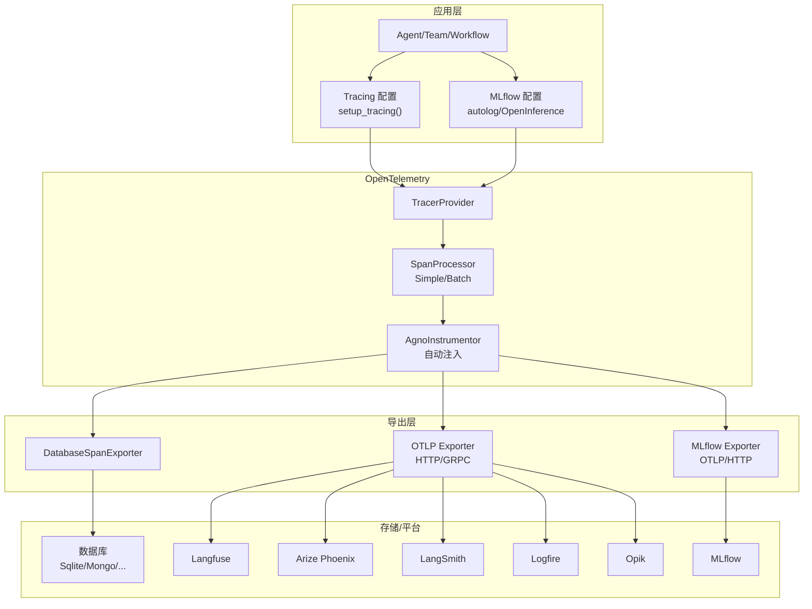

**图表来源**
- [setup.py:23-113](file://libs/agno/agno/tracing/setup.py#L23-L113)
- [exporter.py:18-162](file://libs/agno/agno/tracing/exporter.py#L18-L162)
- [mlflow_via_openinference.py:28-42](file://cookbook/92_integrations/observability/mlflow_via_openinference.py#L28-L42)
- [mlflow_via_autolog.py:31-36](file://cookbook/92_integrations/observability/mlflow_via_autolog.py#L31-L36)

## 详细组件分析

### 追踪与导出器
- DatabaseSpanExporter：将 OpenTelemetry Span 转换为内部 Span/Trace 模型，按 trace_id 聚合生成 Trace，并批量写入数据库。
- 支持同步与异步数据库导出，自动处理事件循环与远程数据库场景。
- 导出失败时记录错误日志，保证应用稳定性。

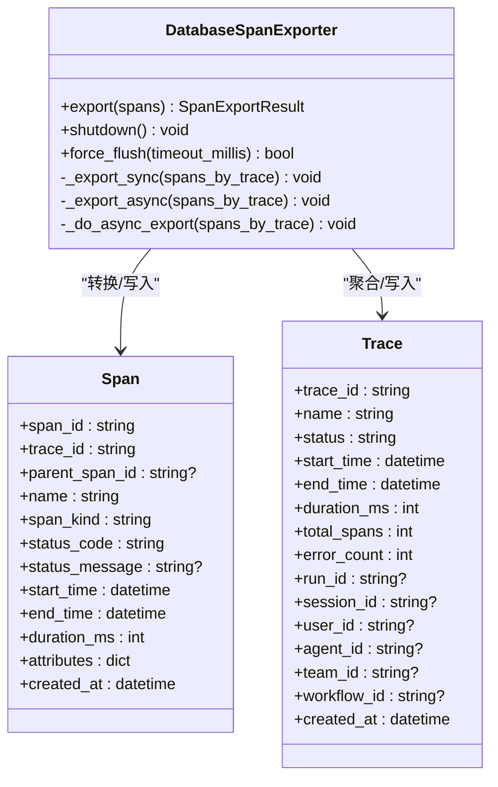

**图表来源**
- [exporter.py:18-162](file://libs/agno/agno/tracing/exporter.py#L18-L162)
- [schemas.py:13-277](file://libs/agno/agno/tracing/schemas.py#L13-L277)

**章节来源**
- [exporter.py:18-162](file://libs/agno/agno/tracing/exporter.py#L18-L162)
- [schemas.py:13-277](file://libs/agno/agno/tracing/schemas.py#L13-L277)

### 追踪配置与上下文传播
- setup_tracing：统一配置 TracerProvider、SpanProcessor（简单或批处理）、全局注册与 AgnoInstrumentor 注入。
- 上下文传播：通过 OpenTelemetry 机制自动传播 trace_id、span_id，确保跨服务调用的连贯性。
- 批处理建议：生产环境推荐 BatchSpanProcessor，以降低导出开销并提升吞吐。

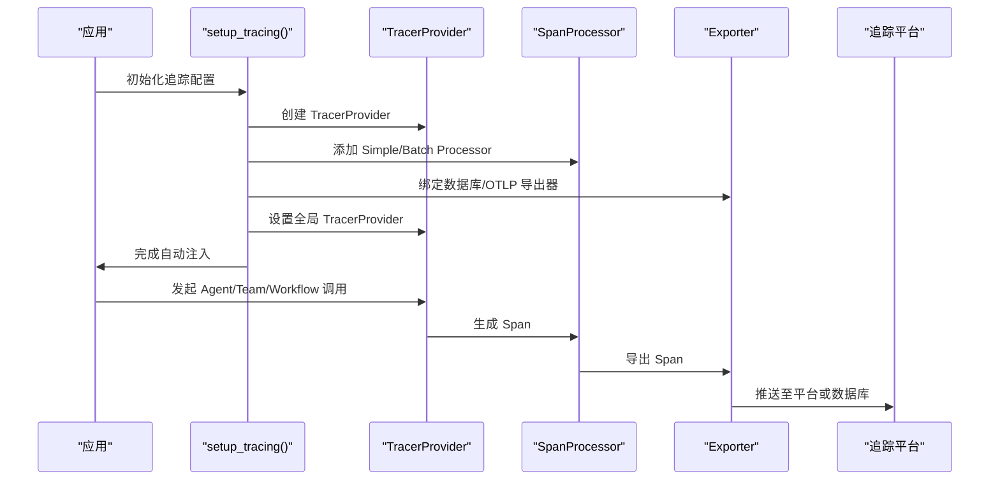

**图表来源**
- [setup.py:23-113](file://libs/agno/agno/tracing/setup.py#L23-L113)
- [exporter.py:18-162](file://libs/agno/agno/tracing/exporter.py#L18-L162)

**章节来源**
- [setup.py:23-113](file://libs/agno/agno/tracing/setup.py#L23-L113)

### 平台集成示例

#### Langfuse 集成
- 使用 OTLP HTTP 导出器，通过基础认证头发送到 Langfuse。
- 适用于 EU/US 区域与本地部署场景切换。

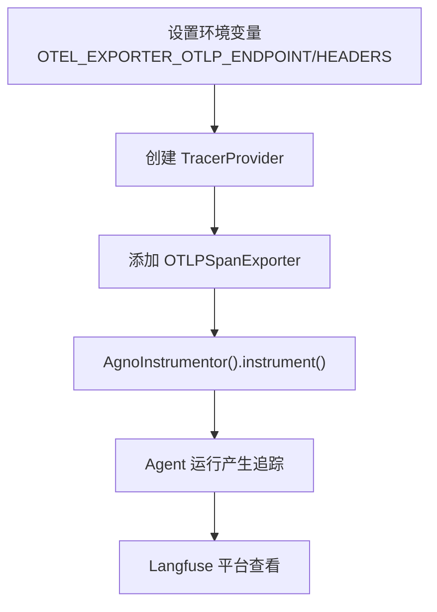

**图表来源**
- [langfuse_via_openinference.py:20-41](file://cookbook/92_integrations/observability/langfuse_via_openinference.py#L20-L41)

**章节来源**
- [langfuse_via_openinference.py:1-66](file://cookbook/92_integrations/observability/langfuse_via_openinference.py#L1-L66)

#### Arize Phoenix 集成
- 云端：使用 phoenix.otel.register(auto_instrument=True) 自动安装 instrumentor。
- 本地：设置 PHOENIX_COLLECTOR_ENDPOINT 为 localhost:6006，无需 API Key。
- 工作流示例：与 Langfuse 示例结构一致，仅后端不同。

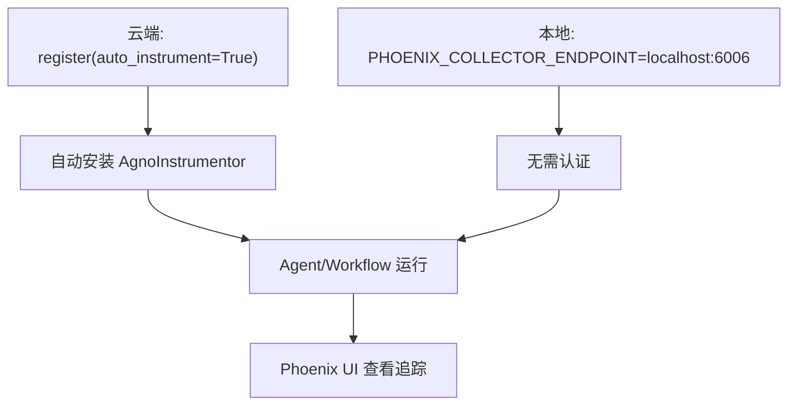

**图表来源**
- [arize_phoenix_via_openinference.py:1-21](file://cookbook/92_integrations/observability/arize_phoenix_via_openinference.py#L1-L21)
- [arize_phoenix_via_openinference_local.py:24-34](file://cookbook/92_integrations/observability/arize_phoenix_via_openinference_local.py#L24-L34)
- [arize_phoenix_via_openinference_workflow.md:55-73](file://cookbook/92_integrations/observability/workflows/arize_phoenix_via_openinference_workflow.md#L55-L73)

**章节来源**
- [arize_phoenix_via_openinference.py:1-21](file://cookbook/92_integrations/observability/arize_phoenix_via_openinference.py#L1-L21)
- [arize_phoenix_via_openinference_local.py:1-48](file://cookbook/92_integrations/observability/arize_phoenix_via_openinference_local.py#L1-L48)
- [arize_phoenix_via_openinference_workflow.md:1-83](file://cookbook/92_integrations/observability/workflows/arize_phoenix_via_openinference_workflow.md#L1-L83)

#### LangSmith 集成
- 通过 OTLP 导出器，使用 API Key 与项目头进行认证。
- 适合与 LangChain 生态联动。

**章节来源**
- [langsmith_via_openinference.py:1-53](file://cookbook/92_integrations/observability/langsmith_via_openinference.py#L1-L53)

#### Logfire 集成
- 通过写入令牌配置 OTLP 端点与头部。
- 支持多区域与本地部署。

**章节来源**
- [logfire_via_openinference.py:1-64](file://cookbook/92_integrations/observability/logfire_via_openinference.py#L1-L64)

#### Opik 集成
- 直接使用 OpenTelemetry API 设置 TracerProvider 并注入 AgnoInstrumentor。
- 支持自定义 trace_attributes，便于分类与检索。

**章节来源**
- [opik_via_openinference.py:1-53](file://cookbook/92_integrations/observability/opik_via_openinference.py#L1-L53)

#### **MLflow 集成** **新增**
- **OpenInference 方式**：通过 OTLP 导出器将追踪数据发送到 MLflow，支持实验管理和版本控制。
- **Autolog 方式**：使用 MLflow 原生 autolog 功能，自动追踪 Agno 操作。
- 支持本地 MLflow 服务器和远程实例，提供完整的实验追踪功能。

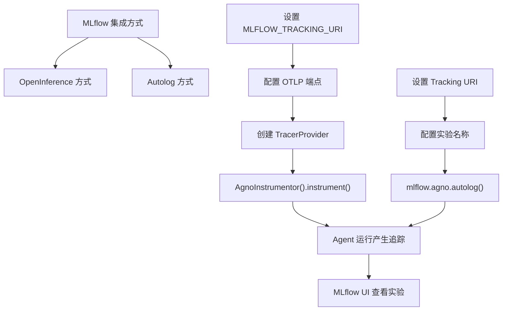

**图表来源**
- [mlflow_via_openinference.py:28-42](file://cookbook/92_integrations/observability/mlflow_via_openinference.py#L28-L42)
- [mlflow_via_autolog.py:31-36](file://cookbook/92_integrations/observability/mlflow_via_autolog.py#L31-L36)

**章节来源**
- [mlflow_via_openinference.py:1-68](file://cookbook/92_integrations/observability/mlflow_via_openinference.py#L1-L68)
- [mlflow_via_autolog.py:1-48](file://cookbook/92_integrations/observability/mlflow_via_autolog.py#L1-L48)

### 数据库存储与查询
- trace_to_database.py 展示了如何通过 setup_tracing(db) 将追踪直接写入数据库，并演示查询 Trace 与 Span 的方法。
- 支持打印 Span 层级、属性与错误信息，便于诊断。

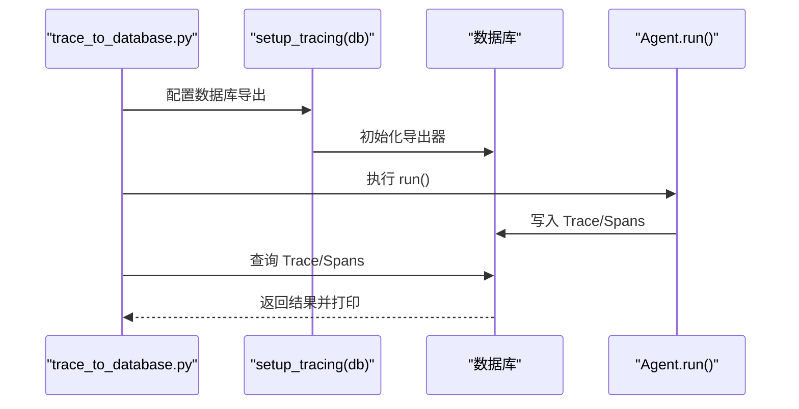

**图表来源**
- [trace_to_database.py:18-50](file://cookbook/92_integrations/observability/trace_to_database.py#L18-L50)
- [setup.py:23-64](file://libs/agno/agno/tracing/setup.py#L23-L64)

**章节来源**
- [trace_to_database.py:1-226](file://cookbook/92_integrations/observability/trace_to_database.py#L1-L226)

### 日志系统集成
- utils/log.py 提供彩色日志处理器与专用 logger（agent/team/workflow），支持切换与自定义。
- utilities/logging.py 提供基础设施层日志样式。
- 单元测试验证 configure_agno_logging 的替换行为。

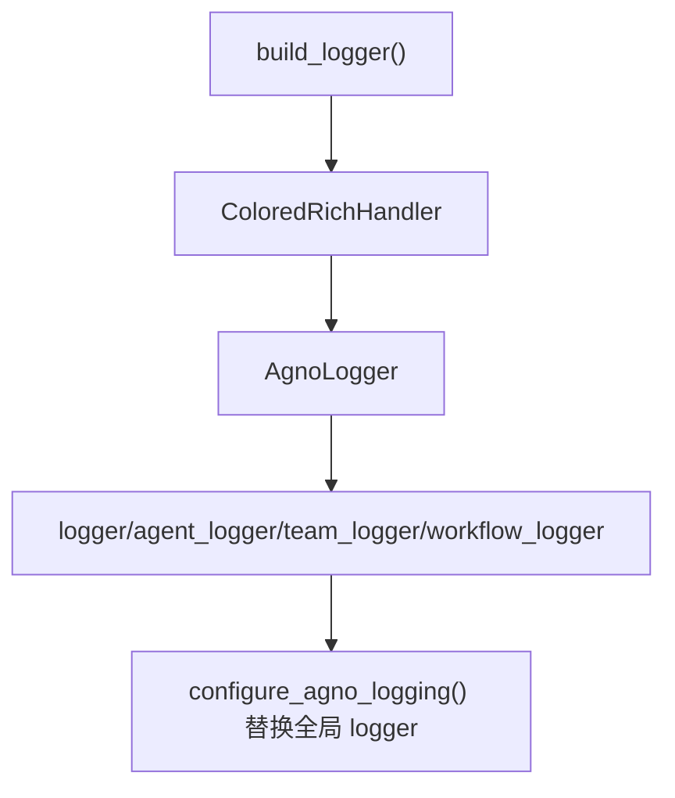

**图表来源**
- [log.py:67-101](file://libs/agno/agno/utils/log.py#L67-L101)
- [logging.py:20-32](file://libs/agno_infra/agno/utilities/logging.py#L20-L32)
- [test_logging.py:7-26](file://libs/agno/tests/unit/utils/test_logging.py#L7-L26)
- [custom_logging.md:45-59](file://cookbook/02_agents/14_advanced/custom_logging.md#L45-L59)

**章节来源**
- [log.py:1-255](file://libs/agno/agno/utils/log.py#L1-L255)
- [logging.py:1-46](file://libs/agno_infra/agno/utilities/logging.py#L1-L46)
- [test_logging.py:1-51](file://libs/agno/tests/unit/utils/test_logging.py#L1-L51)
- [custom_logging.md:45-59](file://cookbook/02_agents/14_advanced/custom_logging.md#L45-L59)

### 性能监控与评估
- 内置性能评测工具支持运行时间与内存占用测量，提供统计摘要与可选的内存增长跟踪。
- 异步与同步两种执行路径，异步版本使用 asyncio 与 tracemalloc。

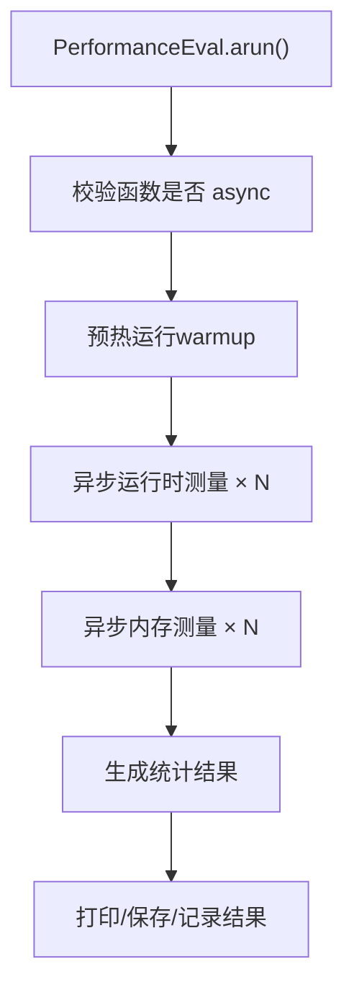

**图表来源**
- [performance.py:624-656](file://libs/agno/agno/eval/performance.py#L624-L656)
- [async_function.py.md:88-103](file://cookbook/09_evals/performance/async_function.py.md#L88-L103)

**章节来源**
- [performance.py:109-656](file://libs/agno/agno/eval/performance.py#L109-L656)
- [async_function.py.md:19-112](file://cookbook/09_evals/performance/async_function.py.md#L19-L112)

### **Mistral AI SDK 兼容性** **新增**
- **版本检测**：自动检测 mistralai 版本，支持 v1 (<2.0.0) 和 v2 (>=2.0.0)。
- **条件导入**：根据版本动态导入相应的类和模块，提供统一的 API 接口。
- **回退机制**：使用 try/except 确保兼容性和错误处理。
- **向后兼容**：v1 版本会显示弃用警告，建议升级到 v2。

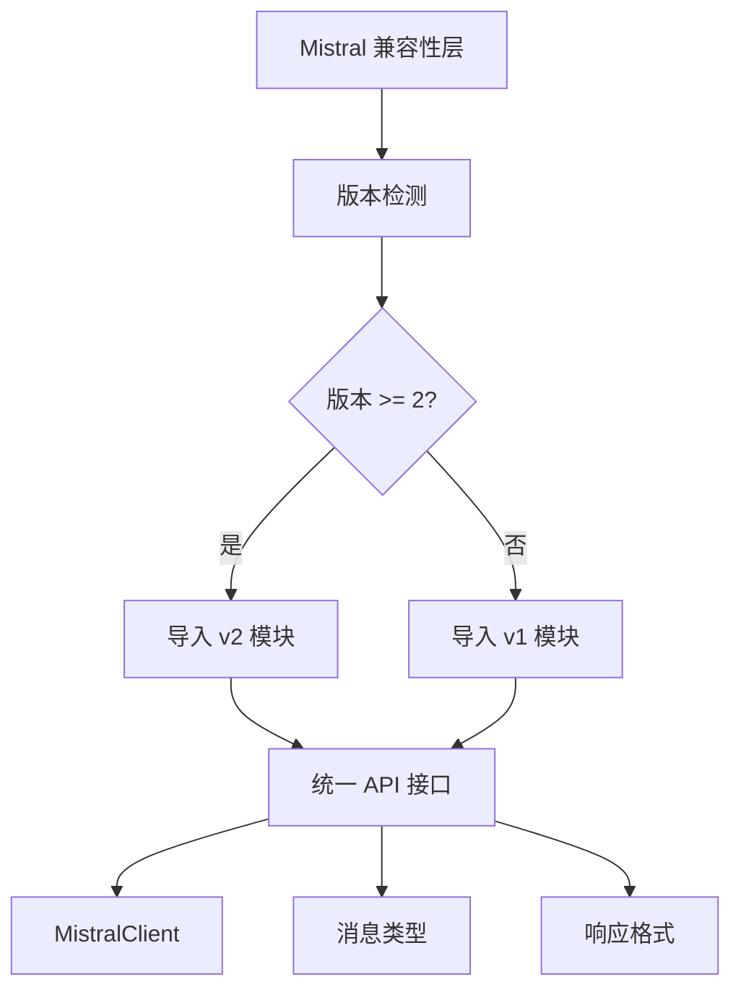

**图表来源**
- [_mistral_compat.py:13-57](file://libs/agno/agno/utils/models/_mistral_compat.py#L13-L57)

**章节来源**
- [_mistral_compat.py:1-84](file://libs/agno/agno/utils/models/_mistral_compat.py#L1-L84)
- [mistral.py:14-28](file://libs/agno/agno/models/mistral/mistral.py#L14-L28)
- [mistral.py:6-13](file://libs/agno/agno/utils/models/mistral.py#L6-L13)
- [mistral.py:7-8](file://libs/agno/agno/knowledge/embedder/mistral.py#L7-L8)

## 依赖分析
- 追踪模块依赖 OpenTelemetry SDK 与 openinference-instrumentation-agno，提供自动注入与导出能力。
- 日志模块依赖 RichHandler，提供终端友好输出。
- 指标路由依赖 FastAPI 与数据库抽象层，支持本地与远程数据库。
- **MLflow 集成依赖 mlflow 和 opentelemetry-exporter-otlp-proto-http**。
- **Mistral 兼容性依赖 importlib.metadata 进行版本检测**。

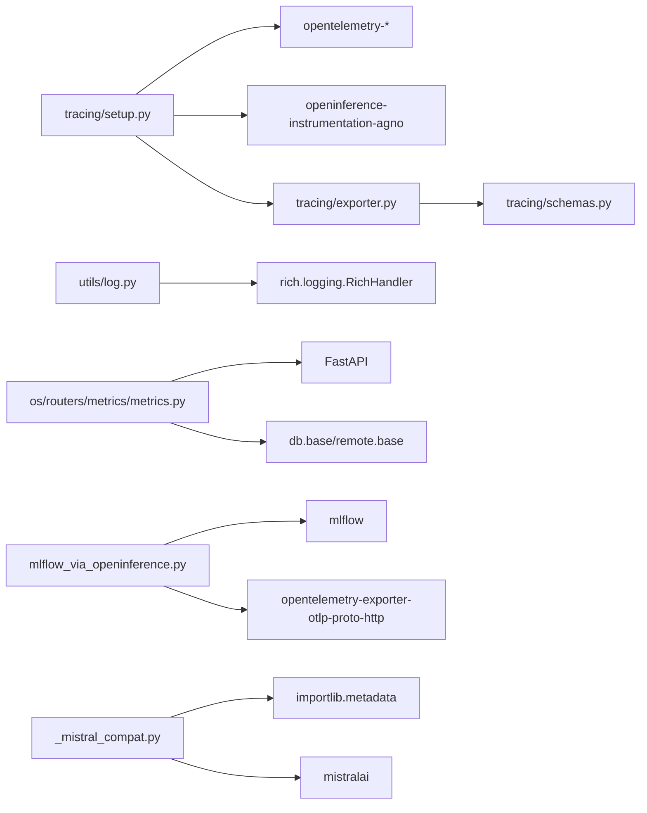

**图表来源**
- [setup.py:12-21](file://libs/agno/agno/tracing/setup.py#L12-L21)
- [exporter.py:1-16](file://libs/agno/agno/tracing/exporter.py#L1-L16)
- [log.py:1-10](file://libs/agno/agno/utils/log.py#L1-L10)
- [metrics.py:1-22](file://libs/agno/agno/os/routers/metrics/metrics.py#L1-L22)
- [mlflow_via_openinference.py:7-8](file://cookbook/92_integrations/observability/mlflow_via_openinference.py#L7-L8)
- [_mistral_compat.py:9](file://libs/agno/agno/utils/models/_mistral_compat.py#L9)

**章节来源**
- [setup.py:12-21](file://libs/agno/agno/tracing/setup.py#L12-L21)
- [exporter.py:1-16](file://libs/agno/agno/tracing/exporter.py#L1-L16)
- [log.py:1-10](file://libs/agno/agno/utils/log.py#L1-L10)
- [metrics.py:1-40](file://libs/agno/agno/os/routers/metrics/metrics.py#L1-L40)
- [mlflow_via_openinference.py:7-8](file://cookbook/92_integrations/observability/mlflow_via_openinference.py#L7-L8)
- [_mistral_compat.py:9](file://libs/agno/agno/utils/models/_mistral_compat.py#L9)

## 性能考虑
- 批处理导出：生产环境优先使用 BatchSpanProcessor，合理设置队列大小与导出批次，平衡延迟与吞吐。
- 导出器选择：数据库导出适合离线分析与审计；云平台导出适合实时可视化与协作；**MLflow 适合实验管理和版本控制**。
- 日志级别：在调试阶段开启 DEBUG，生产环境保持 INFO，避免过量日志影响性能。
- 性能评测：使用内置工具定期评估运行时间与内存占用，识别热点与内存泄漏风险。
- **Mistral 兼容性**：版本检测有轻微性能开销，但只在初始化时执行一次。

## 故障排查指南
- 追踪未生效：确认已调用 setup_tracing 并正确安装 AgnoInstrumentor；检查环境变量与导出器配置。
- 导出失败：查看 DatabaseSpanExporter 错误日志，定位转换或写入异常。
- 日志样式异常：检查 configure_agno_logging 是否被其他模块覆盖；验证 RichHandler 配置。
- 指标路由问题：核对认证依赖与数据库连接，参考系统测试用例定位问题。
- **MLflow 集成问题**：检查 MLFLOW_TRACKING_URI 环境变量，确认 MLflow 服务器正在运行，验证 OTLP 端点配置。
- **Mistral 版本问题**：查看版本检测日志，确认 mistralai 版本，v1 版本会显示弃用警告。

**章节来源**
- [setup.py:65-70](file://libs/agno/agno/tracing/setup.py#L65-L70)
- [exporter.py:47-49](file://libs/agno/agno/tracing/exporter.py#L47-L49)
- [log.py:226-255](file://libs/agno/agno/utils/log.py#L226-L255)
- [test_metrics_routes.py:73-185](file://libs/agno/tests/system/tests/test_metrics_routes.py#L73-L185)
- [mlflow_via_openinference.py:28](file://cookbook/92_integrations/observability/mlflow_via_openinference.py#L28)
- [_mistral_compat.py:13-17](file://libs/agno/agno/utils/models/_mistral_compat.py#L13-L17)

## 结论
本项目提供了从本地数据库到主流云平台的完整可观测性方案，涵盖追踪、日志与性能评估。**新增的 MLflow 集成扩展了实验管理能力，而 Mistral AI SDK v2.0.0 兼容性确保了与最新版本的无缝集成**。通过统一的 Tracing API 与灵活的导出策略，可在不同场景下快速落地可观测性能力，并结合平台特性实现高效的问题定位与性能优化。

## 附录
- 运行示例：参考 observability/README.md 中的运行命令，选择对应平台脚本进行演示。
- 最佳实践：生产环境采用批处理导出、结构化日志与定期性能评测；平台间切换通过环境变量控制。
- **MLflow 使用**：启动 MLflow 服务器后，使用提供的脚本进行追踪，支持实验对比和结果分析。
- **Mistral 兼容性**：自动处理版本差异，无需修改业务代码即可适配不同版本的 Mistral SDK。

**章节来源**
- [README.md:30-36](file://cookbook/92_integrations/observability/README.md#L30-L36)
- [mlflow_via_openinference.py:10-11](file://cookbook/92_integrations/observability/mlflow_via_openinference.py#L10-L11)
- [mlflow_via_autolog.py:10-11](file://cookbook/92_integrations/observability/mlflow_via_autolog.py#L10-L11)