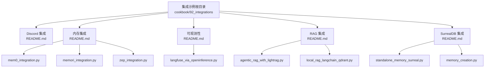
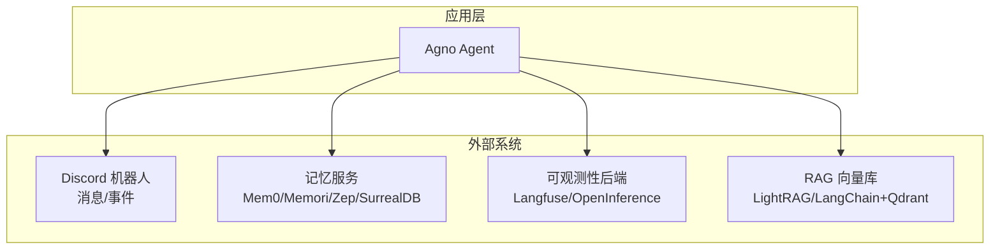
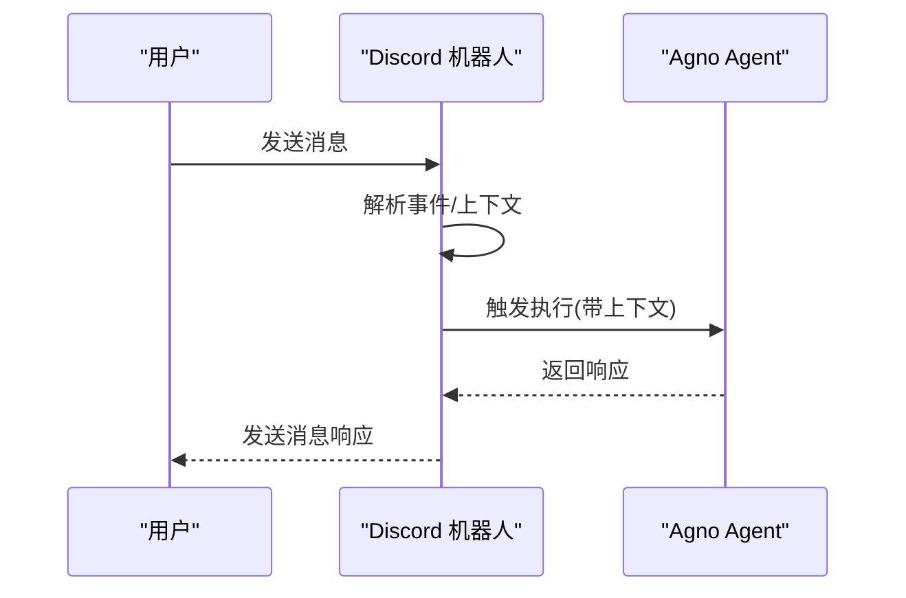
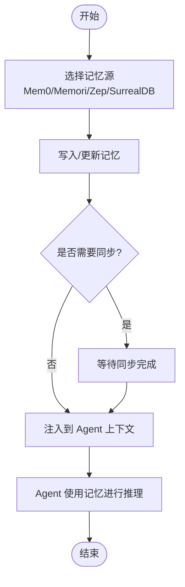
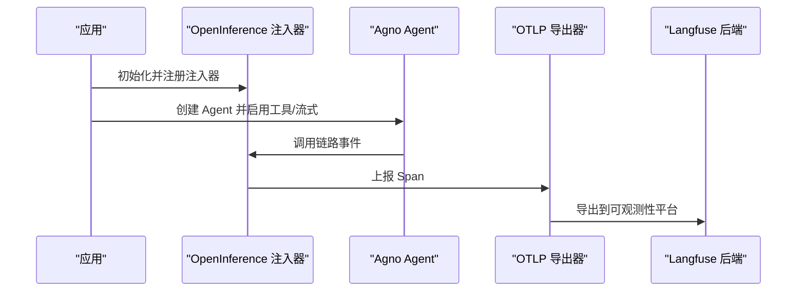
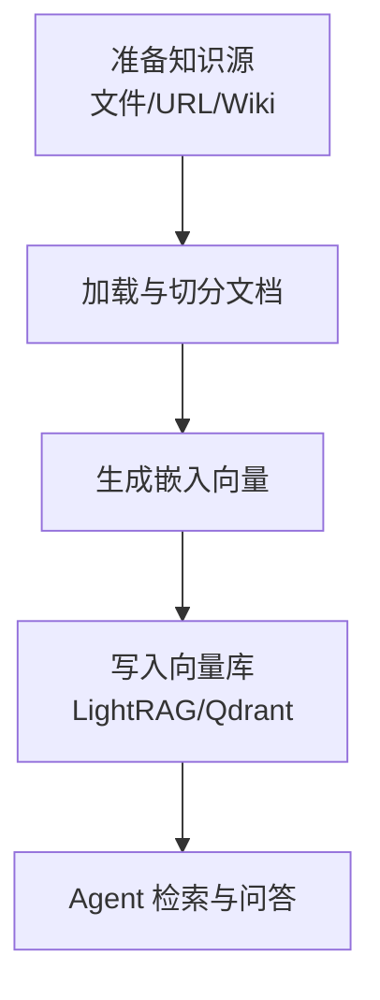
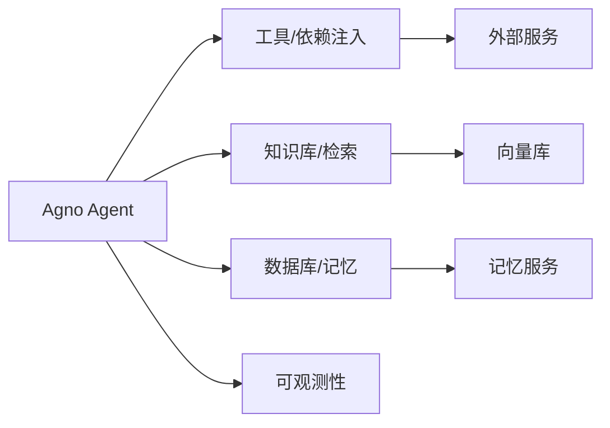

# 集成工具

<cite>
**本文引用的文件**
- [cookbook/92_integrations/discord/README.md](file://cookbook/92_integrations/discord/README.md)
- [cookbook/92_integrations/memory/README.md](file://cookbook/92_integrations/memory/README.md)
- [cookbook/92_integrations/memory/mem0_integration.py](file://cookbook/92_integrations/memory/mem0_integration.py)
- [cookbook/92_integrations/memory/memori_integration.py](file://cookbook/92_integrations/memory/memori_integration.py)
- [cookbook/92_integrations/memory/zep_integration.py](file://cookbook/92_integrations/memory/zep_integration.py)
- [cookbook/92_integrations/observability/README.md](file://cookbook/92_integrations/observability/README.md)
- [cookbook/92_integrations/observability/langfuse_via_openinference.py](file://cookbook/92_integrations/observability/langfuse_via_openinference.py)
- [cookbook/92_integrations/rag/README.md](file://cookbook/92_integrations/rag/README.md)
- [cookbook/92_integrations/rag/agentic_rag_with_lightrag.py](file://cookbook/92_integrations/rag/agentic_rag_with_lightrag.py)
- [cookbook/92_integrations/rag/local_rag_langchain_qdrant.py](file://cookbook/92_integrations/rag/local_rag_langchain_qdrant.py)
- [cookbook/92_integrations/surrealdb/README.md](file://cookbook/92_integrations/surrealdb/README.md)
- [cookbook/92_integrations/surrealdb/standalone_memory_surreal.py](file://cookbook/92_integrations/surrealdb/standalone_memory_surreal.py)
- [cookbook/92_integrations/surrealdb/memory_creation.py](file://cookbook/92_integrations/surrealdb/memory_creation.py)
</cite>

## 目录
1. [简介](#简介)
2. [项目结构](#项目结构)
3. [核心组件](#核心组件)
4. [架构总览](#架构总览)
5. [详细组件分析](#详细组件分析)
6. [依赖关系分析](#依赖关系分析)
7. [性能考量](#性能考量)
8. [故障排查指南](#故障排查指南)
9. [结论](#结论)
10. [附录](#附录)

## 简介
本文件面向 Agno Learn 的集成工具，系统化梳理并说明以下集成方向与实现要点：
- Discord 集成：机器人配置、消息处理与事件监听思路
- 内存集成：外部记忆服务（Mem0、Memori、Zep）与本地数据库（SurrealDB）的集成方式、数据同步与性能优化
- 可观测性集成：通过 OpenInference 对接 Langfuse 等平台进行链路追踪与指标采集
- RAG 集成：LightRAG 与 LangChain+Qdrant 的检索增强生成方案
- 第三方服务集成：Webhook、事件处理与数据同步的通用模式
- 使用指南与最佳实践：从环境准备到运行示例的完整路径

## 项目结构
本仓库在 cookbook/92_integrations 下提供了多类集成示例，分别覆盖 Discord、内存、可观测性、RAG 与 SurrealDB 等主题。每个子目录均包含 README 与可直接运行的示例脚本。

图表来源
- [cookbook/92_integrations/discord/README.md](file://cookbook/92_integrations/discord/README.md)
- [cookbook/92_integrations/memory/README.md](file://cookbook/92_integrations/memory/README.md)
- [cookbook/92_integrations/observability/README.md](file://cookbook/92_integrations/observability/README.md)
- [cookbook/92_integrations/rag/README.md](file://cookbook/92_integrations/rag/README.md)
- [cookbook/92_integrations/surrealdb/README.md](file://cookbook/92_integrations/surrealdb/README.md)

章节来源
- [cookbook/92_integrations/discord/README.md](file://cookbook/92_integrations/discord/README.md)
- [cookbook/92_integrations/memory/README.md](file://cookbook/92_integrations/memory/README.md)
- [cookbook/92_integrations/observability/README.md](file://cookbook/92_integrations/observability/README.md)
- [cookbook/92_integrations/rag/README.md](file://cookbook/92_integrations/rag/README.md)
- [cookbook/92_integrations/surrealdb/README.md](file://cookbook/92_integrations/surrealdb/README.md)

## 核心组件
- Discord 集成：基于 discord.py 构建机器人，结合 Agno Agent 实现消息响应与上下文管理
- 内存集成：对接 Mem0/Memori/Zep 等外部记忆服务；或使用 SurrealDB 作为本地持久化存储
- 可观测性：通过 OpenInference 注入器对 Agno 调用进行链路追踪，并导出至 Langfuse 等平台
- RAG 集成：以 LightRAG 或 LangChain+Qdrant 作为向量数据库，构建检索增强生成流程
- 第三方服务：通过工具（如 ZepTools）封装事件与数据同步逻辑

章节来源
- [cookbook/92_integrations/discord/README.md](file://cookbook/92_integrations/discord/README.md)
- [cookbook/92_integrations/memory/mem0_integration.py](file://cookbook/92_integrations/memory/mem0_integration.py)
- [cookbook/92_integrations/memory/memori_integration.py](file://cookbook/92_integrations/memory/memori_integration.py)
- [cookbook/92_integrations/memory/zep_integration.py](file://cookbook/92_integrations/memory/zep_integration.py)
- [cookbook/92_integrations/observability/langfuse_via_openinference.py](file://cookbook/92_integrations/observability/langfuse_via_openinference.py)
- [cookbook/92_integrations/rag/agentic_rag_with_lightrag.py](file://cookbook/92_integrations/rag/agentic_rag_with_lightrag.py)
- [cookbook/92_integrations/rag/local_rag_langchain_qdrant.py](file://cookbook/92_integrations/rag/local_rag_langchain_qdrant.py)
- [cookbook/92_integrations/surrealdb/standalone_memory_surreal.py](file://cookbook/92_integrations/surrealdb/standalone_memory_surreal.py)
- [cookbook/92_integrations/surrealdb/memory_creation.py](file://cookbook/92_integrations/surrealdb/memory_creation.py)

## 架构总览
下图展示了典型集成场景中的组件交互：Agent 作为核心编排者，通过工具/知识库与外部系统（Discord、记忆服务、可观测性后端、RAG 向量库）协作。

图表来源
- [cookbook/92_integrations/discord/README.md](file://cookbook/92_integrations/discord/README.md)
- [cookbook/92_integrations/memory/mem0_integration.py](file://cookbook/92_integrations/memory/mem0_integration.py)
- [cookbook/92_integrations/memory/memori_integration.py](file://cookbook/92_integrations/memory/memori_integration.py)
- [cookbook/92_integrations/memory/zep_integration.py](file://cookbook/92_integrations/memory/zep_integration.py)
- [cookbook/92_integrations/observability/langfuse_via_openinference.py](file://cookbook/92_integrations/observability/langfuse_via_openinference.py)
- [cookbook/92_integrations/rag/agentic_rag_with_lightrag.py](file://cookbook/92_integrations/rag/agentic_rag_with_lightrag.py)
- [cookbook/92_integrations/rag/local_rag_langchain_qdrant.py](file://cookbook/92_integrations/rag/local_rag_langchain_qdrant.py)
- [cookbook/92_integrations/surrealdb/standalone_memory_surreal.py](file://cookbook/92_integrations/surrealdb/standalone_memory_surreal.py)
- [cookbook/92_integrations/surrealdb/memory_creation.py](file://cookbook/92_integrations/surrealdb/memory_creation.py)

## 详细组件分析

### Discord 集成
- 设计理念
  - 将 Agno Agent 作为“智能中枢”，通过 discord.py 接收消息、解析上下文并触发 Agent 执行
  - 支持扩展参数与权限配置，便于在不同服务器/频道中定制行为
- 关键实现点
  - 机器人配置：需要在 Discord 开发者门户创建应用与机器人，启用网关意图，复制 Token 并通过环境变量注入
  - 消息处理：在事件回调中提取用户输入，构造会话上下文，调用 Agent 进行响应
  - 事件监听：监听消息事件、成员加入/离开、消息更新等，按需扩展业务逻辑
- 使用建议
  - 安全：Token 不上送版本控制；限制最小权限；对敏感指令做鉴权
  - 性能：对高频消息进行去重与节流；必要时引入队列异步处理
  - 可观测性：为机器人接入链路追踪，记录消息流转与响应耗时

图表来源
- [cookbook/92_integrations/discord/README.md](file://cookbook/92_integrations/discord/README.md)

章节来源
- [cookbook/92_integrations/discord/README.md](file://cookbook/92_integrations/discord/README.md)

### 内存集成
- 设计理念
  - 将对话历史与用户偏好等信息持久化到外部记忆服务或本地数据库，提升 Agent 的连续性与个性化能力
  - 支持多种记忆来源（上下文、工具返回、数据库），统一注入到 Agent 的上下文中
- 外部服务集成
  - Mem0：通过 MemoryClient 写入/读取用户记忆，作为依赖注入到 Agent
  - Memori：注册 LLM 客户端，结合 SQLAlchemy 建库与会话，实现对话记忆持久化
  - Zep：使用 ZepTools 写入消息并等待同步，再通过 get_zep_memory 获取上下文依赖
- 本地数据库集成（SurrealDB）
  - 通过 MemoryManager 与 UserMemory 提供增删改查与批量创建能力
  - 支持按用户维度隔离与检索，适合作为轻量级本地记忆后端
- 数据同步与一致性
  - 异步写入场景需等待同步窗口（如 Zep 示例中的延时）
  - 对高并发写入建议引入幂等键与冲突检测
- 性能优化
  - 分页/分批读取；缓存热点用户记忆
  - 合理的主题/标签索引，减少检索范围

图表来源
- [cookbook/92_integrations/memory/mem0_integration.py](file://cookbook/92_integrations/memory/mem0_integration.py)
- [cookbook/92_integrations/memory/memori_integration.py](file://cookbook/92_integrations/memory/memori_integration.py)
- [cookbook/92_integrations/memory/zep_integration.py](file://cookbook/92_integrations/memory/zep_integration.py)
- [cookbook/92_integrations/surrealdb/standalone_memory_surreal.py](file://cookbook/92_integrations/surrealdb/standalone_memory_surreal.py)
- [cookbook/92_integrations/surrealdb/memory_creation.py](file://cookbook/92_integrations/surrealdb/memory_creation.py)

章节来源
- [cookbook/92_integrations/memory/README.md](file://cookbook/92_integrations/memory/README.md)
- [cookbook/92_integrations/memory/mem0_integration.py](file://cookbook/92_integrations/memory/mem0_integration.py)
- [cookbook/92_integrations/memory/memori_integration.py](file://cookbook/92_integrations/memory/memori_integration.py)
- [cookbook/92_integrations/memory/zep_integration.py](file://cookbook/92_integrations/memory/zep_integration.py)
- [cookbook/92_integrations/surrealdb/README.md](file://cookbook/92_integrations/surrealdb/README.md)
- [cookbook/92_integrations/surrealdb/standalone_memory_surreal.py](file://cookbook/92_integrations/surrealdb/standalone_memory_surreal.py)
- [cookbook/92_integrations/surrealdb/memory_creation.py](file://cookbook/92_integrations/surrealdb/memory_creation.py)

### 可观测性集成
- 设计理念
  - 通过 OpenInference 注入器自动采集 Agent 的调用链路、输入输出与中间状态，统一导出到 Langfuse 等平台
  - 支持异步执行与流式输出的完整追踪
- 关键实现点
  - 初始化 TracerProvider 与 OTLP 导出器，配置认证头与端点
  - 使用 AgnoInstrumentor 对 Agent 调用进行自动标注
  - 在 Agent 中启用工具与流式输出，确保完整链路可见
- 运行与验证
  - 设置公开/私有密钥环境变量，启动后可在 Langfuse 控制台查看 Trace
  - 可切换数据区域端点或本地部署地址

图表来源
- [cookbook/92_integrations/observability/langfuse_via_openinference.py](file://cookbook/92_integrations/observability/langfuse_via_openinference.py)

章节来源
- [cookbook/92_integrations/observability/README.md](file://cookbook/92_integrations/observability/README.md)
- [cookbook/92_integrations/observability/langfuse_via_openinference.py](file://cookbook/92_integrations/observability/langfuse_via_openinference.py)

### RAG 集成
- 设计理念
  - 将知识库嵌入到 Agent 的检索流程中，支持从多种来源（文件、URL、Wikipedia）构建知识
  - 结合向量数据库（LightRAG 或 LangChain+Qdrant）实现高效相似度检索与重排序
- LightRAG 方案
  - 通过 LightRag 初始化向量库，构建 Knowledge 并注入 Agent
  - 支持多源数据插入（文件、URL、主题），随后进行检索问答
- LangChain+Qdrant 方案
  - 使用 WebBaseLoader 加载网页，RecursiveCharacterTextSplitter 切分文档，FastEmbed 嵌入
  - QdrantClient 管理集合，向量写入与检索器装配，最后注入 Agent
- 性能与安全
  - 向量化模型与向量维度影响检索速度与精度，需根据硬件条件权衡
  - 对敏感数据进行脱敏与访问控制，避免泄露

图表来源
- [cookbook/92_integrations/rag/agentic_rag_with_lightrag.py](file://cookbook/92_integrations/rag/agentic_rag_with_lightrag.py)
- [cookbook/92_integrations/rag/local_rag_langchain_qdrant.py](file://cookbook/92_integrations/rag/local_rag_langchain_qdrant.py)

章节来源
- [cookbook/92_integrations/rag/README.md](file://cookbook/92_integrations/rag/README.md)
- [cookbook/92_integrations/rag/agentic_rag_with_lightrag.py](file://cookbook/92_integrations/rag/agentic_rag_with_lightrag.py)
- [cookbook/92_integrations/rag/local_rag_langchain_qdrant.py](file://cookbook/92_integrations/rag/local_rag_langchain_qdrant.py)

### 第三方服务集成（通用模式）
- Webhook 与事件处理
  - 通过工具封装事件写入与查询接口，实现与外部系统的解耦
  - 示例：ZepTools 的消息写入与上下文获取，体现“先写后读”的数据同步模式
- 数据同步
  - 对于异步后端（如云端记忆服务），在读取前预留同步窗口时间
  - 对高吞吐场景，采用幂等键与重试机制保证一致性

章节来源
- [cookbook/92_integrations/memory/zep_integration.py](file://cookbook/92_integrations/memory/zep_integration.py)

## 依赖关系分析
- 组件内聚与耦合
  - Agent 与各外部系统通过工具/知识库/数据库抽象层解耦，便于替换与扩展
  - 记忆服务与 RAG 向量库可独立演进，互不影响
- 外部依赖
  - Discord 集成依赖 discord.py 与 Agno
  - 内存集成依赖对应 SDK（mem0ai、memori、Zep 工具）
  - 可观测性依赖 OpenInference 与 OTLP 导出器
  - RAG 集成依赖 LightRAG 或 LangChain 生态组件
- 循环依赖
  - 当前示例未见循环导入；若自定义工具/中间件，请保持单向依赖

图表来源
- [cookbook/92_integrations/memory/mem0_integration.py](file://cookbook/92_integrations/memory/mem0_integration.py)
- [cookbook/92_integrations/memory/memori_integration.py](file://cookbook/92_integrations/memory/memori_integration.py)
- [cookbook/92_integrations/memory/zep_integration.py](file://cookbook/92_integrations/memory/zep_integration.py)
- [cookbook/92_integrations/observability/langfuse_via_openinference.py](file://cookbook/92_integrations/observability/langfuse_via_openinference.py)
- [cookbook/92_integrations/rag/agentic_rag_with_lightrag.py](file://cookbook/92_integrations/rag/agentic_rag_with_lightrag.py)
- [cookbook/92_integrations/rag/local_rag_langchain_qdrant.py](file://cookbook/92_integrations/rag/local_rag_langchain_qdrant.py)
- [cookbook/92_integrations/surrealdb/standalone_memory_surreal.py](file://cookbook/92_integrations/surrealdb/standalone_memory_surreal.py)
- [cookbook/92_integrations/surrealdb/memory_creation.py](file://cookbook/92_integrations/surrealdb/memory_creation.py)

## 性能考量
- 记忆服务
  - 控制写入频率与批量大小；对热点用户记忆进行缓存
  - 使用主题/标签过滤减少检索范围
- RAG
  - 嵌入模型与向量维度需平衡精度与延迟；合理设置检索 top-k 与重排序
  - 对大文档分块时注意上下文连贯性
- 可观测性
  - 控制采样率与字段大小，避免追踪开销过大
  - 对流式输出进行分段上报，保证可观测性与性能平衡

## 故障排查指南
- Discord
  - 确认机器人 Token 与网关意图配置正确；检查权限与邀请链接
  - 如出现无响应，检查事件回调是否正确触发与上下文是否完整
- 内存集成
  - Zep 同步失败：确认等待时间充足；检查网络与服务可用性
  - SurrealDB：核对连接参数与命名空间/数据库存在性
- 可观测性
  - 确认 OTLP 端点与认证头配置；检查导出器是否成功初始化
- RAG
  - 向量库初始化失败：检查 API Key 与网络；确认集合/索引已创建
  - 检索结果为空：调整检索参数与嵌入模型

章节来源
- [cookbook/92_integrations/discord/README.md](file://cookbook/92_integrations/discord/README.md)
- [cookbook/92_integrations/memory/zep_integration.py](file://cookbook/92_integrations/memory/zep_integration.py)
- [cookbook/92_integrations/surrealdb/standalone_memory_surreal.py](file://cookbook/92_integrations/surrealdb/standalone_memory_surreal.py)
- [cookbook/92_integrations/observability/langfuse_via_openinference.py](file://cookbook/92_integrations/observability/langfuse_via_openinference.py)
- [cookbook/92_integrations/rag/local_rag_langchain_qdrant.py](file://cookbook/92_integrations/rag/local_rag_langchain_qdrant.py)

## 结论
本集成工具集围绕“Agent 为中心”的架构，提供了从消息入口（Discord）、记忆持久化（Mem0/Memori/Zep/SurrealDB）、可观测性（OpenInference/Langfuse）、检索增强（LightRAG/LangChain+Qdrant）到第三方服务（Webhook/事件）的完整路径。通过模块化设计与清晰的示例，开发者可以快速落地所需功能，并在生产环境中持续优化性能与稳定性。

## 附录
- 快速运行示例
  - 内存集成：参考对应 README 的运行命令，进入虚拟环境后执行相应脚本
  - 可观测性：准备 Langfuse 公钥/私钥，运行示例脚本后在控制台查看 Trace
  - RAG：准备 LIGHTRAG_API_KEY 或本地 Qdrant，运行示例脚本进行问答
  - Discord：准备 Discord Bot Token，运行示例脚本启动机器人

章节来源
- [cookbook/92_integrations/memory/README.md](file://cookbook/92_integrations/memory/README.md)
- [cookbook/92_integrations/observability/README.md](file://cookbook/92_integrations/observability/README.md)
- [cookbook/92_integrations/rag/README.md](file://cookbook/92_integrations/rag/README.md)
- [cookbook/92_integrations/surrealdb/README.md](file://cookbook/92_integrations/surrealdb/README.md)