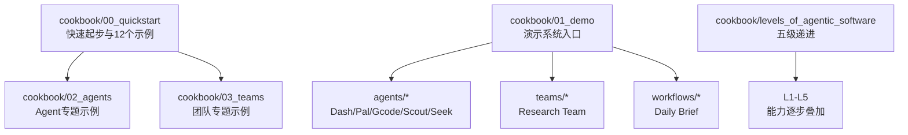
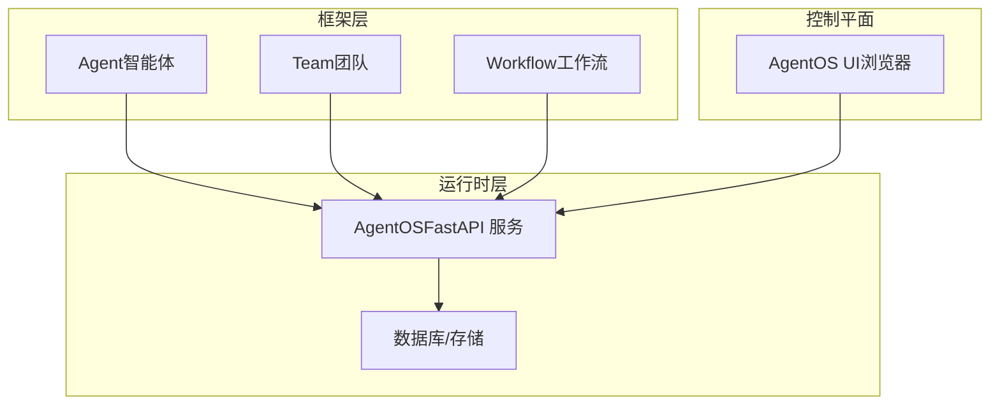
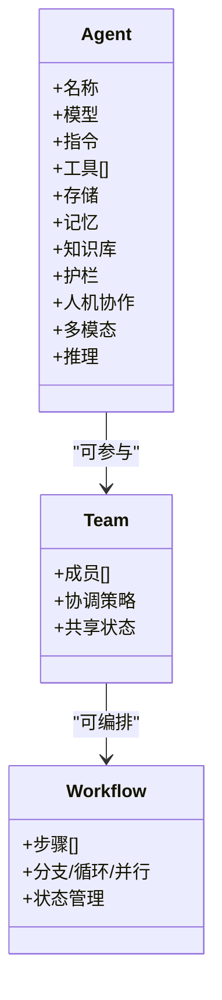
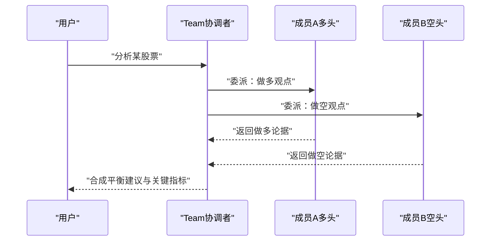
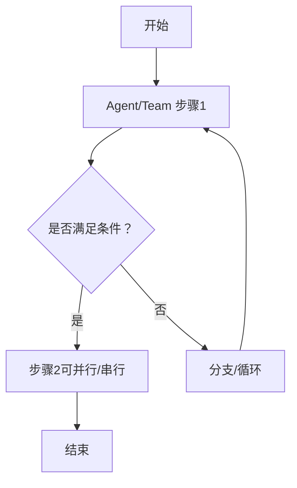
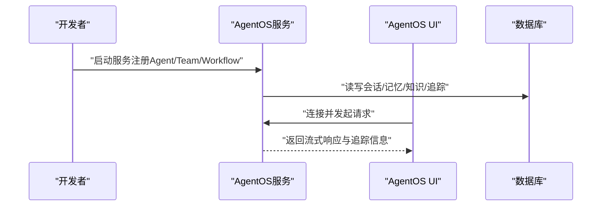
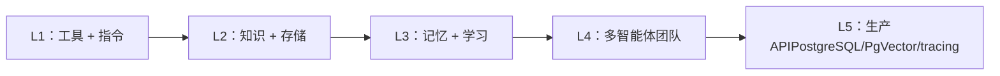

# 什么是 Agno

<cite>
**本文引用的文件**
- [README.md](file://README.md)
- [cookbook/README.md](file://cookbook/README.md)
- [cookbook/00_quickstart/README.md](file://cookbook/00_quickstart/README.md)
- [cookbook/00_quickstart/agent_with_tools.py](file://cookbook/00_quickstart/agent_with_tools.py)
- [cookbook/00_quickstart/multi_agent_team.py](file://cookbook/00_quickstart/multi_agent_team.py)
- [cookbook/01_demo/README.md](file://cookbook/01_demo/README.md)
- [cookbook/01_demo/run.py](file://cookbook/01_demo/run.py)
- [cookbook/levels_of_agentic_software/README.md](file://cookbook/levels_of_agentic_software/README.md)
- [cookbook/02_agents/README.md](file://cookbook/02_agents/README.md)
- [cookbook/03_teams/README.md](file://cookbook/03_teams/README.md)
</cite>

## 目录
1. [引言](#引言)
2. [项目结构](#项目结构)
3. [核心组件](#核心组件)
4. [架构总览](#架构总览)
5. [详细组件分析](#详细组件分析)
6. [依赖关系分析](#依赖关系分析)
7. [性能考量](#性能考量)
8. [故障排查指南](#故障排查指南)
9. [结论](#结论)
10. [附录](#附录)

## 引言
Agno 是面向“智能体软件（agentic software）”的运行时平台与开发框架，目标是帮助开发者以统一架构大规模地构建、运行与管理智能代理（Agent）、团队（Team）与工作流（Workflow）。它将“流式执行”“动态治理”“信任内建”作为 agentic 软件区别于传统软件的根本性特征，并提供从开发到生产的完整能力谱系：框架层用于构建具备记忆、知识库、护栏与丰富集成的 Agent/Team/Workflow；运行时层提供无状态、会话级隔离的 FastAPI 服务；控制平面通过 AgentOS UI 支持测试、监控与管理。

- Agno 的定位：智能体软件运行时
- 核心价值：统一架构支撑单智能体、团队协作与工作流编排，覆盖从开发到生产的全生命周期
- 应用场景：个人助理、数据智能体、研究与知识管理、编程辅助、投资决策委员会等

**章节来源**
- [README.md:25-27](file://README.md#L25-L27)
- [README.md:101-129](file://README.md#L101-L129)

## 项目结构
本仓库包含完整的“学习与示例”体系，围绕“快速起步、示例教程、演示系统、分层能力”组织内容：
- cookbook/00_quickstart：12 个循序渐进的入门示例，涵盖工具、结构化输出、存储、记忆、状态、知识库、护栏、人机协作、多智能体团队、顺序工作流等
- cookbook/01_demo：真实系统的演示入口，包含多个 Agent、一个团队与一个工作流，统一通过 AgentOS 提供服务
- cookbook/levels_of_agentic_software：从 L1 到 L5 的五级递进，展示如何逐步叠加能力，最终达到生产级 API
- cookbook/02_agents 与 cookbook/03_teams：按主题拆分的深度示例集合，覆盖输入输出、上下文管理、工具、记忆学习、知识库、护栏、钩子、人机协作、审批、多模态、推理、高级特性等

**图示来源**
- [cookbook/README.md:15-62](file://cookbook/README.md#L15-L62)
- [cookbook/00_quickstart/README.md:1-37](file://cookbook/00_quickstart/README.md#L1-L37)
- [cookbook/01_demo/README.md:1-28](file://cookbook/01_demo/README.md#L1-L28)
- [cookbook/levels_of_agentic_software/README.md:5-12](file://cookbook/levels_of_agentic_software/README.md#L5-L12)

**章节来源**
- [cookbook/README.md:1-101](file://cookbook/README.md#L1-L101)
- [cookbook/00_quickstart/README.md:1-155](file://cookbook/00_quickstart/README.md#L1-L155)
- [cookbook/01_demo/README.md:1-122](file://cookbook/01_demo/README.md#L1-L122)
- [cookbook/levels_of_agentic_software/README.md:1-122](file://cookbook/levels_of_agentic_software/README.md#L1-L122)

## 核心组件
- Agent（智能体）
  - 以统一 API 构建，支持指令、工具、结构化输入输出、流式响应、会话状态、记忆、知识库、护栏、人机协作等
  - 示例：工具型金融分析 Agent
- Team（团队）
  - 多智能体协作，支持路由、广播、任务、嵌套团队等模式，共享记忆与状态
  - 示例：多智能体研究团队（多头/空头视角合成）
- Workflow（工作流）
  - 将 Agent、Team 与函数串联为自动化流水线，支持顺序、条件、循环、并行等执行模式
- AgentOS（运行时与控制平面）
  - 无状态、会话级隔离的 FastAPI 服务，配套 AgentOS UI 用于测试、监控与管理

**章节来源**
- [README.md:29-34](file://README.md#L29-L34)
- [cookbook/00_quickstart/README.md:9-37](file://cookbook/00_quickstart/README.md#L9-L37)
- [cookbook/00_quickstart/multi_agent_team.py:1-23](file://cookbook/00_quickstart/multi_agent_team.py#L1-L23)
- [cookbook/01_demo/run.py:23-32](file://cookbook/01_demo/run.py#L23-L32)

## 架构总览
Agno 的整体架构由三层组成：框架（构建）、运行时（服务）、控制平面（管理）。下图展示了从示例到演示系统的典型路径，以及 AgentOS 如何统一暴露服务与 UI：

**图示来源**
- [README.md:29-34](file://README.md#L29-L34)
- [cookbook/01_demo/run.py:23-32](file://cookbook/01_demo/run.py#L23-L32)

## 详细组件分析

### 组件A：Agent（智能体）
- 能力要点
  - 工具调用：访问外部数据或执行动作
  - 结构化输入输出：类型安全、模式校验
  - 存储与会话：持久化对话历史与状态
  - 记忆与学习：跨会话个性化与持续改进
  - 知识库与检索：混合检索、RAG、重排序
  - 护栏与安全：输入过滤、PII 检测、提示注入防护
  - 人机协作与审批：确认流程、外部执行、审计
  - 多模态：图像/音频/视频处理
  - 推理：思维链、推理模型、推理工具
- 示例路径
  - 工具型 Agent：[agent_with_tools.py:1-98](file://cookbook/00_quickstart/agent_with_tools.py#L1-L98)
  - 多智能体团队：[multi_agent_team.py:1-167](file://cookbook/00_quickstart/multi_agent_team.py#L1-L167)

**图示来源**
- [cookbook/00_quickstart/agent_with_tools.py:60-76](file://cookbook/00_quickstart/agent_with_tools.py#L60-L76)
- [cookbook/00_quickstart/multi_agent_team.py:87-117](file://cookbook/00_quickstart/multi_agent_team.py#L87-L117)

**章节来源**
- [cookbook/00_quickstart/README.md:9-37](file://cookbook/00_quickstart/README.md#L9-L37)
- [cookbook/02_agents/README.md:1-39](file://cookbook/02_agents/README.md#L1-L39)
- [cookbook/00_quickstart/agent_with_tools.py:1-98](file://cookbook/00_quickstart/agent_with_tools.py#L1-L98)

### 组件B：Team（团队）
- 关键概念
  - 成员：具有专门角色的智能体
  - 协调者：负责委派、合成与最终输出
  - 执行模式：协调、路由、广播、任务
  - 共享记忆与状态：跨成员协同
- 示例路径
  - 多智能体团队（多头/空头合成）：[multi_agent_team.py:1-167](file://cookbook/00_quickstart/multi_agent_team.py#L1-L167)

**图示来源**
- [cookbook/00_quickstart/multi_agent_team.py:39-117](file://cookbook/00_quickstart/multi_agent_team.py#L39-L117)

**章节来源**
- [cookbook/03_teams/README.md:1-35](file://cookbook/03_teams/README.md#L1-L35)
- [cookbook/00_quickstart/multi_agent_team.py:1-167](file://cookbook/00_quickstart/multi_agent_team.py#L1-L167)

### 组件C：Workflow（工作流）
- 关键能力
  - 步骤编排：顺序、条件、循环、并行
  - 状态与事件：跨步骤的状态传递与事件监听
  - 与 Agent/Team 集成：将智能体与团队纳入流水线
- 示例路径
  - 顺序工作流（示例）：[cookbook/00_quickstart/sequential_workflow.py](file://cookbook/00_quickstart/sequential_workflow.py)

**图示来源**
- [cookbook/00_quickstart/README.md:11-22](file://cookbook/00_quickstart/README.md#L11-L22)

**章节来源**
- [cookbook/00_quickstart/README.md:11-22](file://cookbook/00_quickstart/README.md#L11-L22)

### 组件D：AgentOS（运行时与控制平面）
- 运行时
  - 无状态、会话级隔离的 FastAPI 服务
  - 支持跟踪（tracing）、调度（scheduler）、注册表（registry）
- 控制平面
  - AgentOS UI：连接本地/远程 AgentOS，测试、监控与管理
- 示例路径
  - 演示系统入口（聚合多个 Agent/Team/Workflow）：[cookbook/01_demo/run.py:1-38](file://cookbook/01_demo/run.py#L1-L38)

**图示来源**
- [README.md:35-98](file://README.md#L35-L98)
- [cookbook/01_demo/run.py:23-32](file://cookbook/01_demo/run.py#L23-L32)

**章节来源**
- [README.md:35-98](file://README.md#L35-L98)
- [cookbook/01_demo/run.py:1-38](file://cookbook/01_demo/run.py#L1-L38)

## 依赖关系分析
- 示例到运行时
  - 快速起步示例直接演示如何创建 Agent/Team/Workflow，并通过 AgentOS 暴露为服务
  - 演示系统入口将多个 Agent、团队与工作流统一注册到 AgentOS
- 分层演进
  - 五级递进从 L1（无状态工具调用）到 L5（生产数据库、学习与追踪），展示能力叠加路径

**图示来源**
- [cookbook/levels_of_agentic_software/README.md:5-12](file://cookbook/levels_of_agentic_software/README.md#L5-L12)

**章节来源**
- [cookbook/levels_of_agentic_software/README.md:1-122](file://cookbook/levels_of_agentic_software/README.md#L1-L122)

## 性能考量
- 无状态与水平扩展：运行时设计为无状态，便于横向扩展
- 会话隔离：按用户与会话隔离，避免资源争用
- 数据持久化：会话、记忆、知识与追踪存于数据库，确保一致性与可审计
- 生产就绪：支持 50+ 集成与后台执行，适合多用户并发场景

**章节来源**
- [README.md:130-142](file://README.md#L130-L142)

## 故障排查指南
- 环境变量与依赖
  - 快速起步示例要求设置模型提供商 API Key，并安装依赖
  - 演示系统需准备 PostgreSQL 与 PgVector
- 运行方式
  - 快速起步示例可直接运行脚本体验
  - 演示系统通过 AgentOS 提供服务，可在 UI 中连接并测试
- 常见问题定位
  - API Key 未设置或无效
  - 数据库未启动或连接失败
  - 知识库未加载或检索异常
  - 工具调用超时或权限不足

**章节来源**
- [cookbook/00_quickstart/README.md:52-67](file://cookbook/00_quickstart/README.md#L52-L67)
- [cookbook/01_demo/README.md:55-82](file://cookbook/01_demo/README.md#L55-L82)

## 结论
Agno 以统一架构支撑从单智能体到多智能体团队再到工作流编排的完整能力谱系，强调“流式执行、动态治理、信任内建”的 agentic 软件范式。通过框架层的模块化能力、运行时层的无状态服务与控制平面的可视化管理，开发者可以高效构建、运行与管理大规模智能体系统，并平滑过渡到生产环境。

**章节来源**
- [README.md:25-27](file://README.md#L25-L27)
- [README.md:101-129](file://README.md#L101-L129)

## 附录
- 快速开始示例（工具型 Agent）：[agent_with_tools.py:1-98](file://cookbook/00_quickstart/agent_with_tools.py#L1-L98)
- 多智能体团队示例：[multi_agent_team.py:1-167](file://cookbook/00_quickstart/multi_agent_team.py#L1-L167)
- 演示系统入口（AgentOS）：[run.py:1-38](file://cookbook/01_demo/run.py#L1-L38)
- 五级递进能力路径：[levels_of_agentic_software/README.md:1-122](file://cookbook/levels_of_agentic_software/README.md#L1-L122)