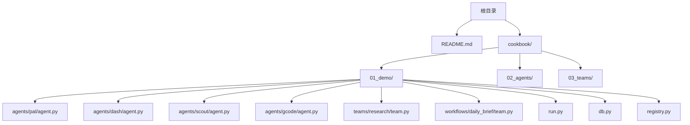
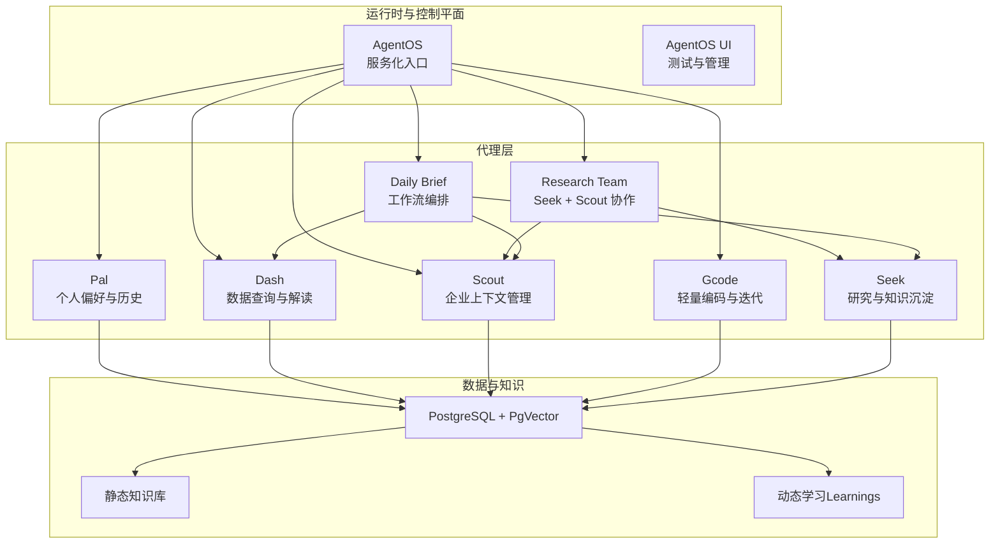
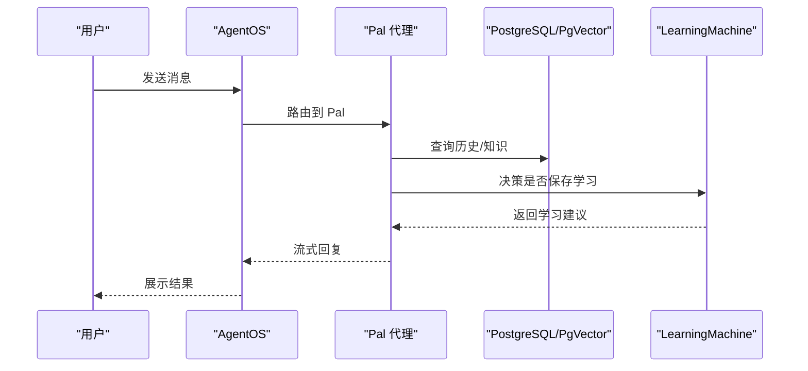
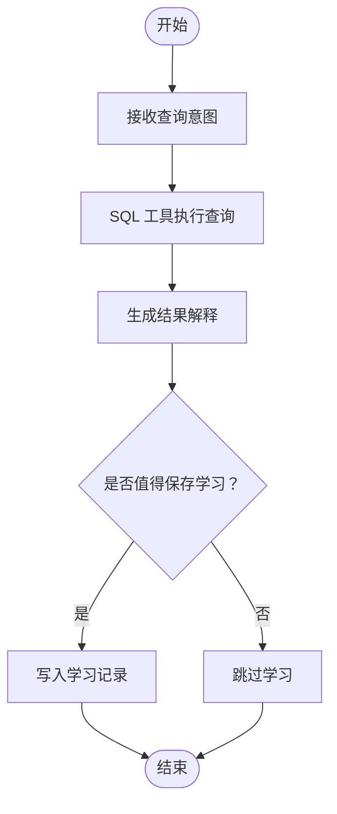
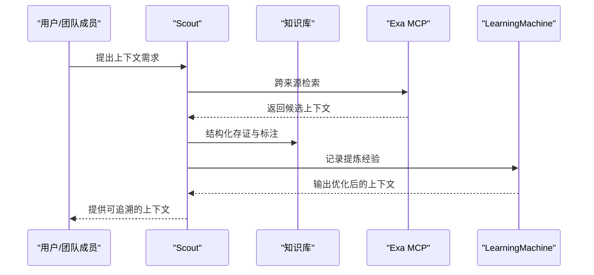
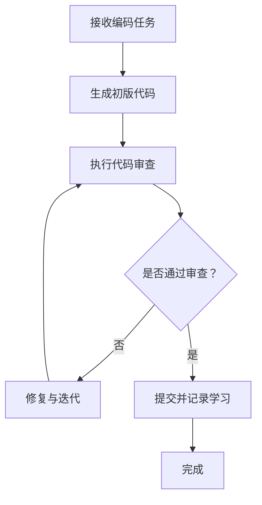
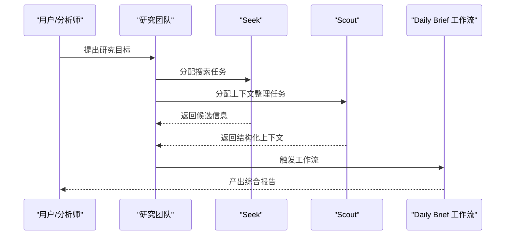
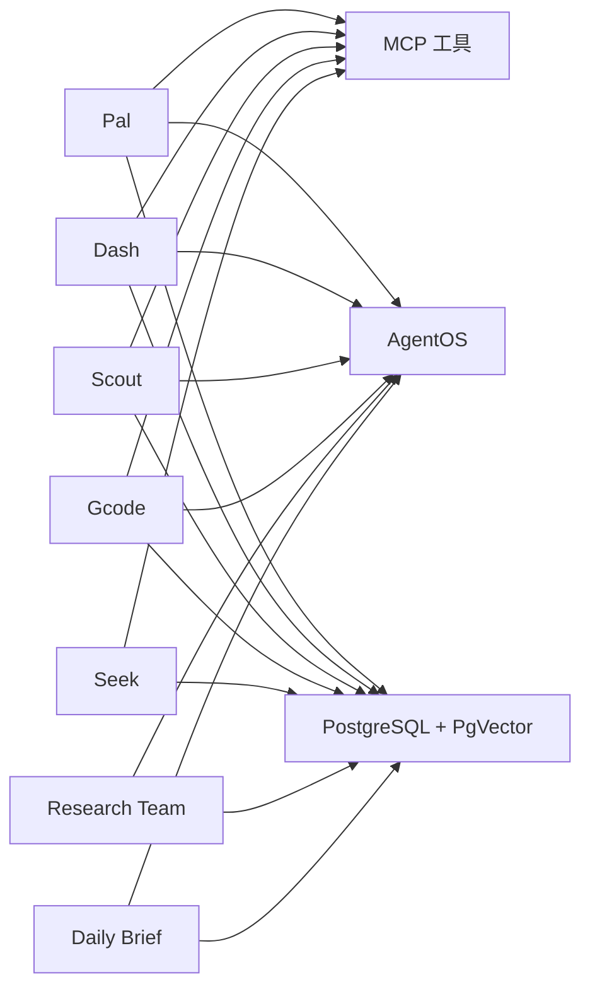

# 应用场景

<cite>
**本文引用的文件**
- [README.md](file://README.md)
- [cookbook/README.md](file://cookbook/README.md)
- [cookbook/01_demo/README.md](file://cookbook/01_demo/README.md)
- [cookbook/02_agents/README.md](file://cookbook/02_agents/README.md)
- [cookbook/03_teams/README.md](file://cookbook/03_teams/README.md)
- [cookbook/01_demo/agents/pal/agent.py](file://cookbook/01_demo/agents/pal/agent.py)
- [cookbook/01_demo/agents/dash/agent.py](file://cookbook/01_demo/agents/dash/agent.py)
- [cookbook/01_demo/agents/scout/agent.py](file://cookbook/01_demo/agents/scout/agent.py)
- [cookbook/01_demo/agents/gcode/agent.py](file://cookbook/01_demo/agents/gcode/agent.py)
- [cookbook/01_demo/teams/research/team.py](file://cookbook/01_demo/teams/research/team.py)
- [cookbook/01_demo/workflows/daily_brief/team.py](file://cookbook/01_demo/workflows/daily_brief/team.py)
- [cookbook/01_demo/db.py](file://cookbook/01_demo/db.py)
- [cookbook/01_demo/registry.py](file://cookbook/01_demo/registry.py)
- [cookbook/01_demo/run.py](file://cookbook/01_demo/run.py)
</cite>

## 目录
1. [简介](#简介)
2. [项目结构](#项目结构)
3. [核心组件](#核心组件)
4. [架构总览](#架构总览)
5. [详细组件分析](#详细组件分析)
6. [依赖分析](#依赖分析)
7. [性能考虑](#性能考虑)
8. [故障排除指南](#故障排除指南)
9. [结论](#结论)
10. [附录](#附录)

## 简介
本文件聚焦于 Agno Learn 项目中的智能代理系统应用场景，围绕以下五类真实案例展开：个人代理（Pal）、数据代理（Dash）、上下文代理（Scout）、编码代理（Gcode），以及多代理投资委员会（研究团队）等。我们将从业务需求、技术挑战与解决方案三个维度，结合仓库中的实际实现文件，系统阐述如何基于 Agno 的统一架构模式构建不同行业的智能代理系统，并提供可操作的实现思路与参考路径。

## 项目结构
Agno Learn 仓库提供了完整的“食谱”（cookbook）体系，涵盖从单体代理到团队协作、再到工作流编排的全栈能力。其中，01_demo 展示了五个代理与一个研究团队的端到端演示；02_agents 与 03_teams 则分别覆盖代理构建与团队协作的专题示例；顶层 README 对整体能力进行了概览。

图示来源
- [cookbook/01_demo/agents/pal/agent.py](file://cookbook/01_demo/agents/pal/agent.py)
- [cookbook/01_demo/agents/dash/agent.py](file://cookbook/01_demo/agents/dash/agent.py)
- [cookbook/01_demo/agents/scout/agent.py](file://cookbook/01_demo/agents/scout/agent.py)
- [cookbook/01_demo/agents/gcode/agent.py](file://cookbook/01_demo/agents/gcode/agent.py)
- [cookbook/01_demo/teams/research/team.py](file://cookbook/01_demo/teams/research/team.py)
- [cookbook/01_demo/workflows/daily_brief/team.py](file://cookbook/01_demo/workflows/daily_brief/team.py)
- [cookbook/01_demo/run.py](file://cookbook/01_demo/run.py)
- [cookbook/01_demo/db.py](file://cookbook/01_demo/db.py)
- [cookbook/01_demo/registry.py](file://cookbook/01_demo/registry.py)

章节来源
- [README.md:143-153](file://README.md#L143-L153)
- [cookbook/README.md:1-101](file://cookbook/README.md#L1-L101)
- [cookbook/01_demo/README.md:1-122](file://cookbook/01_demo/README.md#L1-L122)

## 核心组件
- 统一运行时与控制平面：Agno 将代理、团队与工作流统一在一套运行时上，支持无状态、可扩展的服务化部署，并通过 AgentOS UI 提供测试、监控与管理能力。
- 数据与知识层：Demo 中采用 PostgreSQL + PgVector 的混合检索方案，结合静态知识库与动态学习（LearningMachine AGENTIC 模式），支撑代理持续优化。
- 工具与护栏：通过 MCP 工具、SQL 工具、编码工具等扩展代理能力；同时内置护栏（Guardrails）与审批流程，满足治理与合规要求。
- 会话与记忆：支持按用户/会话隔离、持久化聊天历史与学习记录，确保个性化与连续性。

章节来源
- [README.md:25-34](file://README.md#L25-L34)
- [README.md:100-129](file://README.md#L100-L129)
- [cookbook/01_demo/README.md:29-38](file://cookbook/01_demo/README.md#L29-L38)

## 架构总览
下图展示了 Demo 中五个代理与研究团队的共享基础架构：统一模型、存储、知识与学习模块，以及 AgentOS 的服务化入口。

图示来源
- [cookbook/01_demo/README.md:29-38](file://cookbook/01_demo/README.md#L29-L38)
- [cookbook/01_demo/run.py](file://cookbook/01_demo/run.py)
- [cookbook/01_demo/db.py](file://cookbook/01_demo/db.py)

## 详细组件分析

### 个人代理 Pal（Personal Agent）
- 业务需求
  - 学习用户的偏好、上下文与历史，提供个性化、连贯的交互体验。
  - 支持长期记忆与会话隔离，保障隐私与一致性。
- 技术挑战
  - 如何在不侵入用户隐私的前提下建立稳定的偏好模型。
  - 如何在长对话中保持上下文相关性与一致性。
- 解决方案
  - 使用 PostgreSQL 存储聊天历史与学习记录，结合 LearningMachine 的 AGENTIC 模式实现“何时保存学习”的自主决策。
  - 通过会话状态管理与系统消息注入，强化指令与上下文引导。
- 实现思路与参考
  - 代理定义与工具注册：[cookbook/01_demo/agents/pal/agent.py](file://cookbook/01_demo/agents/pal/agent.py)
  - 数据库与知识加载：[cookbook/01_demo/db.py](file://cookbook/01_demo/db.py)
  - 服务化入口与路由：[cookbook/01_demo/registry.py](file://cookbook/01_demo/registry.py)
  - 运行与连接 AgentOS：[cookbook/01_demo/run.py](file://cookbook/01_demo/run.py)

图示来源
- [cookbook/01_demo/agents/pal/agent.py](file://cookbook/01_demo/agents/pal/agent.py)
- [cookbook/01_demo/db.py](file://cookbook/01_demo/db.py)

章节来源
- [cookbook/01_demo/README.md:11](file://cookbook/01_demo/README.md#L11)
- [cookbook/01_demo/agents/pal/agent.py](file://cookbook/01_demo/agents/pal/agent.py)

### 数据代理 Dash（Data Agent）
- 业务需求
  - 自适应地查询与解释数据，持续优化对表结构、指标与优先级的理解。
- 技术挑战
  - 如何在多轮交互中自动学习数据 schema 与业务指标，避免误判。
  - 如何在复杂查询与结果解释之间取得平衡。
- 解决方案
  - 采用“六层上下文”设计，结合 SQL 工具与混合检索，提升查询准确性与可解释性。
  - 通过 LearningMachine 的 AGENTIC 模式，让代理在合适时机保存“学习”，形成可复用的知识。
- 实现思路与参考
  - 代理与知识模块：[cookbook/01_demo/agents/dash/agent.py](file://cookbook/01_demo/agents/dash/agent.py)
  - 数据加载与知识注入：[cookbook/01_demo/agents/dash/scripts/load_data.py](file://cookbook/01_demo/agents/dash/scripts/load_data.py)
  - 知识加载脚本：[cookbook/01_demo/agents/dash/scripts/load_knowledge.py](file://cookbook/01_demo/agents/dash/scripts/load_knowledge.py)

图示来源
- [cookbook/01_demo/agents/dash/agent.py](file://cookbook/01_demo/agents/dash/agent.py)

章节来源
- [cookbook/01_demo/README.md:10-12](file://cookbook/01_demo/README.md#L10-L12)
- [cookbook/01_demo/agents/dash/agent.py](file://cookbook/01_demo/agents/dash/agent.py)

### 上下文代理 Scout（Context Agent）
- 业务需求
  - 管理企业上下文知识，支持研究、草稿与修订流程，降低知识管理成本。
- 技术挑战
  - 如何在海量非结构化文档中提取与组织上下文，保证检索质量与效率。
  - 如何在团队协作中保持上下文一致性与版本演进。
- 解决方案
  - 采用混合检索（语义 + 关键词）与 Exa MCP 工具，增强跨来源信息整合能力。
  - 通过 LearningMachine 记录上下文提炼经验，形成“上下文知识”资产。
- 实现思路与参考
  - 代理与知识模块：[cookbook/01_demo/agents/scout/agent.py](file://cookbook/01_demo/agents/scout/agent.py)
  - 知识加载脚本：[cookbook/01_demo/agents/scout/scripts/load_knowledge.py](file://cookbook/01_demo/agents/scout/scripts/load_knowledge.py)

图示来源
- [cookbook/01_demo/agents/scout/agent.py](file://cookbook/01_demo/agents/scout/agent.py)

章节来源
- [cookbook/01_demo/README.md:13-14](file://cookbook/01_demo/README.md#L13-L14)
- [cookbook/01_demo/agents/scout/agent.py](file://cookbook/01_demo/agents/scout/agent.py)

### 编码代理 Gcode（Coding Agent）
- 业务需求
  - 提供轻量、高效的代码生成、审查与迭代能力，减少 IDE 锁定，提升开发效率。
- 技术挑战
  - 如何在多轮迭代中保持代码一致性与可维护性。
  - 如何安全地执行与审查代码变更，避免高风险操作。
- 解决方案
  - 引入编码工具与推理工具，结合 MCP 工具链，实现“思考—行动—验证”的闭环。
  - 通过 LearningMachine 记录最佳实践与常见问题，形成可复用的“编码知识”。
- 实现思路与参考
  - 代理定义与工具注册：[cookbook/01_demo/agents/gcode/agent.py](file://cookbook/01_demo/agents/gcode/agent.py)

图示来源
- [cookbook/01_demo/agents/gcode/agent.py](file://cookbook/01_demo/agents/gcode/agent.py)

章节来源
- [cookbook/01_demo/README.md:14](file://cookbook/01_demo/README.md#L14)
- [cookbook/01_demo/agents/gcode/agent.py](file://cookbook/01_demo/agents/gcode/agent.py)

### 多代理投资委员会（研究团队）
- 业务需求
  - 通过多代理协作实现信息收集、交叉验证与综合判断，辅助投资决策。
- 技术挑战
  - 如何在多个代理之间分配任务、协调上下文与输出格式。
  - 如何在团队层面实现学习与知识沉淀，避免重复劳动。
- 解决方案
  - 采用研究团队（Seek + Scout）的协作模式，结合分布式检索与上下文压缩，提升信息处理效率。
  - 通过工作流编排（如每日简报）串联多个代理，形成稳定产出。
- 实现思路与参考
  - 研究团队定义：[cookbook/01_demo/teams/research/team.py](file://cookbook/01_demo/teams/research/team.py)
  - 日常简报工作流：[cookbook/01_demo/workflows/daily_brief/team.py](file://cookbook/01_demo/workflows/daily_brief/team.py)

图示来源
- [cookbook/01_demo/teams/research/team.py](file://cookbook/01_demo/teams/research/team.py)
- [cookbook/01_demo/workflows/daily_brief/team.py](file://cookbook/01_demo/workflows/daily_brief/team.py)

章节来源
- [cookbook/01_demo/README.md:17-27](file://cookbook/01_demo/README.md#L17-L27)
- [cookbook/01_demo/teams/research/team.py](file://cookbook/01_demo/teams/research/team.py)

## 依赖分析
- 组件内聚与耦合
  - 五个代理共享同一套运行时与基础设施（模型、存储、知识、学习），内聚度高、耦合度低，便于独立演进与替换。
- 外部依赖
  - PostgreSQL + PgVector：用于向量化检索与持久化。
  - MCP 工具：提供跨来源检索与外部能力扩展。
  - AgentOS：提供服务化部署与可视化管理。
- 依赖关系可视化

图示来源
- [cookbook/01_demo/db.py](file://cookbook/01_demo/db.py)
- [cookbook/01_demo/agents/pal/agent.py](file://cookbook/01_demo/agents/pal/agent.py)
- [cookbook/01_demo/agents/dash/agent.py](file://cookbook/01_demo/agents/dash/agent.py)
- [cookbook/01_demo/agents/scout/agent.py](file://cookbook/01_demo/agents/scout/agent.py)
- [cookbook/01_demo/agents/gcode/agent.py](file://cookbook/01_demo/agents/gcode/agent.py)
- [cookbook/01_demo/teams/research/team.py](file://cookbook/01_demo/teams/research/team.py)
- [cookbook/01_demo/workflows/daily_brief/team.py](file://cookbook/01_demo/workflows/daily_brief/team.py)
- [cookbook/01_demo/run.py](file://cookbook/01_demo/run.py)

## 性能考虑
- 检索与存储
  - 使用 PgVector 进行向量化检索，结合关键词检索提升召回质量与速度。
  - 合理分页与缓存策略，避免大规模检索带来的延迟。
- 工具调用
  - 对外部工具（如 MCP、SQL）进行调用限制与重试机制，避免单点失败影响整体性能。
- 会话与流式
  - 使用流式响应与事件驱动的会话状态管理，降低前端等待时间并提升交互体验。
- 团队与工作流
  - 在团队与工作流中采用并行步骤与条件分支，缩短端到端时延。

## 故障排除指南
- 环境变量与密钥
  - 确保已正确导出所需环境变量（如模型 API 密钥、MCP 地址等）。
- 数据库与向量库
  - 若检索异常，检查 PostgreSQL 与 PgVector 是否正常启动与连通。
- 代理无法启动
  - 检查 AgentOS 服务端口与网络连通性，确认代理注册与路由配置正确。
- 学习记录未生效
  - 核对 LearningMachine 的触发条件与存储路径，确保学习保存成功。

## 结论
Agno Learn 通过统一的运行时与基础设施，为不同行业与场景提供了可复用的智能代理架构。个人代理（Pal）强调偏好与历史的学习；数据代理（Dash）关注查询与解释的自适应优化；上下文代理（Scout）聚焦企业知识的结构化管理；编码代理（Gcode）提供高效、可迭代的代码能力；多代理投资委员会（研究团队）则展示了跨代理协作与工作流编排的规模化应用。开发者可根据自身业务需求，灵活选择代理类型与协作模式，在同一套架构上实现端到端的智能代理系统。

## 附录
- 快速开始与运行
  - 参考顶层 README 的快速开始与运行说明，完成本地部署与 AgentOS 连接。
- 示例与评测
  - Demo 包含全面的评测用例与运行命令，便于验证各代理的功能与性能。
- 专题食谱
  - 02_agents 与 03_teams 提供更细粒度的构建指南，覆盖输入输出、上下文管理、工具、状态与会话、记忆与学习、知识与 RAG、护栏、钩子、人机协作、审批、多模态、推理等主题。

章节来源
- [README.md:35-98](file://README.md#L35-L98)
- [cookbook/01_demo/README.md:39-122](file://cookbook/01_demo/README.md#L39-L122)
- [cookbook/02_agents/README.md:1-39](file://cookbook/02_agents/README.md#L1-L39)
- [cookbook/03_teams/README.md:1-35](file://cookbook/03_teams/README.md#L1-L35)