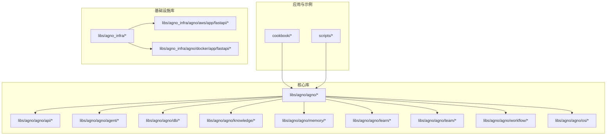
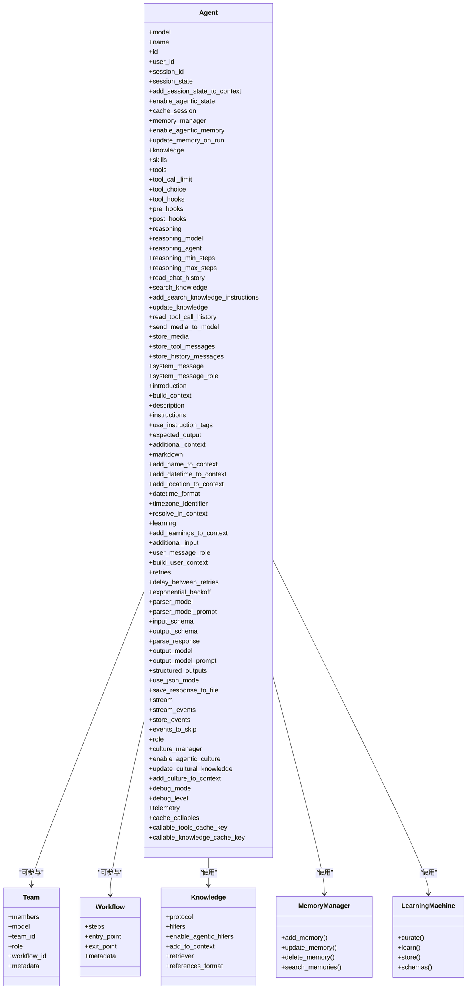
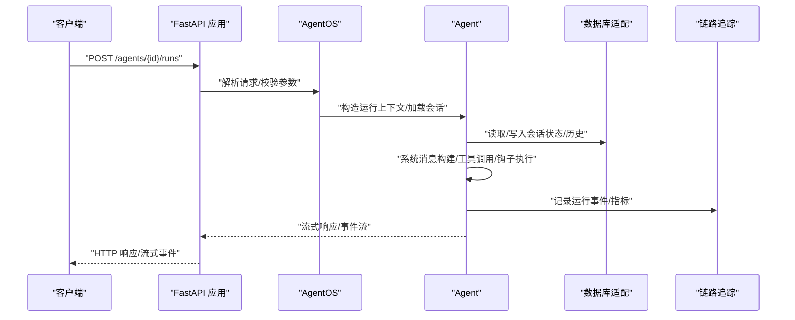
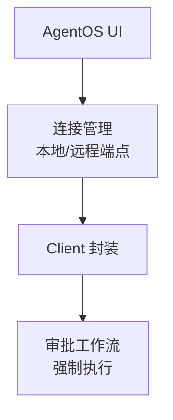
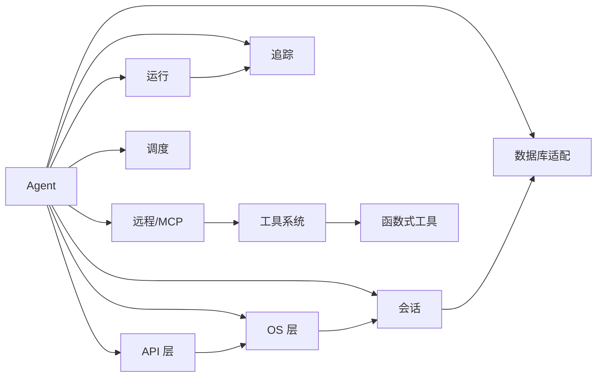

# 技术架构概览

<cite>
**本文引用的文件**   
- [README.md](file://README.md)
- [libs/agno/agno/os/__init__.py](file://libs/agno/agno/os/__init__.py)
- [libs/agno/agno/agent/agent.py](file://libs/agno/agno/agent/agent.py)
- [libs/agno/agno/api/api.py](file://libs/agno/agno/api/api.py)
- [libs/agno/agno/api/os.py](file://libs/agno/agno/api/os.py)
- [libs/agno/agno/api/schemas/os.py](file://libs/agno/agno/api/schemas/os.py)
- [libs/agno/agno/client/os.py](file://libs/agno/agno/client/os.py)
- [libs/agno/agno/utils/os.py](file://libs/agno/agno/utils/os.py)
- [libs/agno/agno/db/base.py](file://libs/agno/agno/db/base.py)
- [libs/agno/agno/session/agent.py](file://libs/agno/agno/session/agent.py)
- [libs/agno/agno/run/agent.py](file://libs/agno/agno/run/agent.py)
- [libs/agno/agno/tracing/__init__.py](file://libs/agno/agno/tracing/__init__.py)
- [libs/agno/agno/knowledge/knowledge.py](file://libs/agno/agno/knowledge/knowledge.py)
- [libs/agno/agno/memory/__init__.py](file://libs/agno/agno/memory/__init__.py)
- [libs/agno/agno/learn/machine.py](file://libs/agno/agno/learn/machine.py)
- [libs/agno/agno/team/team.py](file://libs/agno/agno/team/team.py)
- [libs/agno/agno/workflow/workflow.py](file://libs/agno/agno/workflow/workflow.py)
- [libs/agno/agno/approval/types.py](file://libs/agno/agno/approval/types.py)
- [libs/agno/agno/hooks/decorator.py](file://libs/agno/agno/hooks/decorator.py)
- [libs/agno/agno/guardrails/base.py](file://libs/agno/agno/guardrails/base.py)
- [libs/agno/agno/tools/function.py](file://libs/agno/agno/tools/function.py)
- [libs/agno/agno/models/base.py](file://libs/agno/agno/models/base.py)
- [libs/agno/agno/eval/base.py](file://libs/agno/agno/eval/base.py)
- [libs/agno/agno/registry/registry.py](file://libs/agno/agno/registry/registry.py)
- [libs/agno/agno/compression/manager.py](file://libs/agno/agno/compression/manager.py)
- [libs/agno/agno/culture/manager.py](file://libs/agno/agno/culture/manager.py)
- [libs/agno/agno/skills/skills.py](file://libs/agno/agno/skills/skills.py)
- [libs/agno/agno/vectordb/__init__.py](file://libs/agno/agno/vectordb/__init__.py)
- [libs/agno/agno/scheduler/scheduler.py](file://libs/agno/agno/scheduler/scheduler.py)
- [libs/agno/agno/remote/remote.py](file://libs/agno/agno/remote/remote.py)
- [libs/agno/agno/exceptions.py](file://libs/agno/agno/exceptions.py)
- [libs/agno/agno/filters.py](file://libs/agno/agno/filters.py)
- [libs/agno/agno/media.py](file://libs/agno/agno/media.py)
- [libs/agno/agno/metrics.py](file://libs/agno/agno/metrics.py)
- [libs/agno/agno/table.py](file://libs/agno/agno/table.py)
- [libs/agno_infra/README.md](file://libs/agno_infra/README.md)
- [libs/agno_infra/agno/aws/app/fastapi/fastapi.py](file://libs/agno_infra/agno/aws/app/fastapi/fastapi.py)
- [libs/agno_infra/agno/docker/app/fastapi/fastapi.py](file://libs/agno_infra/agno/docker/app/fastapi/fastapi.py)
</cite>

## 目录
1. [引言](#引言)
2. [项目结构](#项目结构)
3. [核心组件](#核心组件)
4. [架构总览](#架构总览)
5. [详细组件分析](#详细组件分析)
6. [依赖分析](#依赖分析)
7. [性能考量](#性能考量)
8. [故障排查指南](#故障排查指南)
9. [结论](#结论)
10. [附录](#附录)

## 引言
本文件面向 Agno Learn 项目的开发者与架构师，系统阐述 Agno 的三层架构设计：框架（Framework）、运行时（Runtime）与控制平面（Control Plane）。文档聚焦以下目标：
- 明确各层职责与边界，解释层间协作关系与数据流
- 总结架构设计的技术决策与权衡，如无状态设计、水平扩展、会话隔离等
- 给出架构图与组件交互说明，帮助快速理解系统整体设计思路与实现方式

根据项目 README 的定位，Agno 的三层架构分别承担“构建”“服务”“管理”的职责，且强调无状态、可扩展、会话隔离与原生链路追踪等能力。

章节来源
- [README.md:25-34](file://README.md#L25-L34)

## 项目结构
Agno 采用“库（libs）+示例与食谱（cookbook）+脚本（scripts）+根项目配置（pyproject.toml 等）”的组织方式。核心库位于 libs/agno，包含运行时 API、Agent 核心、数据库适配、知识库、记忆、学习、团队与工作流等模块；同时提供云与容器化部署基础设施库 libs/agno_infra。

- 核心库（libs/agno）：包含 agno.api、agno.agent、agno.db、agno.knowledge、agno.memory、agno.learn、agno.team、agno.workflow、agno.os 等子模块
- 示例与食谱（cookbook）：覆盖 Agent、团队、工作流、存储、知识、学习、评估等主题
- 基础设施（libs/agno_infra）：AWS/Docker 应用模板与资源编排，支撑运行时部署

图示来源
- [libs/agno/agno/os/__init__.py:1-4](file://libs/agno/agno/os/__init__.py#L1-L4)
- [libs/agno_infra/README.md](file://libs/agno_infra/README.md)

章节来源
- [libs/agno/agno/os/__init__.py:1-4](file://libs/agno/agno/os/__init__.py#L1-L4)
- [libs/agno_infra/README.md](file://libs/agno_infra/README.md)

## 核心组件
围绕三层架构，Agno 的核心组件如下：

- 框架（Framework）
  - Agent：统一的智能体抽象，负责系统消息构建、工具调用、钩子、推理、记忆、知识、学习、文化、压缩、技能等
  - 团队（Team）：多 Agent 协作编排
  - 工作流（Workflow）：结构化流程编排
  - 知识库（Knowledge）：RAG 与检索
  - 记忆（Memory）：用户偏好与长期记忆
  - 学习（Learn）：自适应与经验沉淀
  - 评估（Eval）：质量与可靠性评估
  - 护栏（Guardrails）：安全与合规前置
  - 钩子（Hooks）：前后置扩展点
  - 注册表（Registry）：组件注册与发现
  - 压缩（Compression）：上下文压缩
  - 文化（Culture）：文化知识管理
  - 技能（Skills）：结构化指令与脚本
  - 向量数据库（Vectordb）：向量化检索
  - 过滤器（Filters）：检索过滤
  - 媒体（Media）：多模态输入输出
  - 指标（Metrics）：运行指标
  - 表格（Table）：结构化数据处理

- 运行时（Runtime）
  - API 层：FastAPI 应用与路由
  - OS 层：AgentOS 应用入口与生命周期管理
  - 数据库适配：多种持久化后端
  - 会话（Session）：用户/会话隔离与状态管理
  - 运行（Run）：执行上下文与事件流
  - 远程（Remote）：远程工具与 MCP 集成
  - 调度（Scheduler）：异步任务调度
  - 异常（Exceptions）：统一错误模型
  - 追踪（Tracing）：链路追踪与审计

- 控制平面（Control Plane）
  - UI：AgentOS UI 用于测试、监控与管理
  - 连接：本地/远程 AgentOS 管理端点
  - 审批（Approval）：运行时审批与强制执行
  - 客户端（Client）：与控制平面交互的客户端封装

章节来源
- [libs/agno/agno/agent/agent.py:67-120](file://libs/agno/agno/agent/agent.py#L67-L120)
- [libs/agno/agno/api/api.py:10-35](file://libs/agno/agno/api/api.py#L10-L35)
- [libs/agno/agno/api/os.py](file://libs/agno/agno/api/os.py)
- [libs/agno/agno/api/schemas/os.py](file://libs/agno/agno/api/schemas/os.py)
- [libs/agno/agno/client/os.py](file://libs/agno/agno/client/os.py)
- [libs/agno/agno/utils/os.py](file://libs/agno/agno/utils/os.py)
- [libs/agno/agno/db/base.py](file://libs/agno/agno/db/base.py)
- [libs/agno/agno/session/agent.py](file://libs/agno/agno/session/agent.py)
- [libs/agno/agno/run/agent.py](file://libs/agno/agno/run/agent.py)
- [libs/agno/agno/tracing/__init__.py](file://libs/agno/agno/tracing/__init__.py)
- [libs/agno/agno/knowledge/knowledge.py](file://libs/agno/agno/knowledge/knowledge.py)
- [libs/agno/agno/memory/__init__.py](file://libs/agno/agno/memory/__init__.py)
- [libs/agno/agno/learn/machine.py](file://libs/agno/agno/learn/machine.py)
- [libs/agno/agno/team/team.py](file://libs/agno/agno/team/team.py)
- [libs/agno/agno/workflow/workflow.py](file://libs/agno/agno/workflow/workflow.py)
- [libs/agno/agno/approval/types.py](file://libs/agno/agno/approval/types.py)
- [libs/agno/agno/hooks/decorator.py](file://libs/agno/agno/hooks/decorator.py)
- [libs/agno/agno/guardrails/base.py](file://libs/agno/agno/guardrails/base.py)
- [libs/agno/agno/tools/function.py](file://libs/agno/agno/tools/function.py)
- [libs/agno/agno/models/base.py](file://libs/agno/agno/models/base.py)
- [libs/agno/agno/eval/base.py](file://libs/agno/agno/eval/base.py)
- [libs/agno/agno/registry/registry.py](file://libs/agno/agno/registry/registry.py)
- [libs/agno/agno/compression/manager.py](file://libs/agno/agno/compression/manager.py)
- [libs/agno/agno/culture/manager.py](file://libs/agno/agno/culture/manager.py)
- [libs/agno/agno/skills/skills.py](file://libs/agno/agno/skills/skills.py)
- [libs/agno/agno/vectordb/__init__.py](file://libs/agno/agno/vectordb/__init__.py)
- [libs/agno/agno/scheduler/scheduler.py](file://libs/agno/agno/scheduler/scheduler.py)
- [libs/agno/agno/remote/remote.py](file://libs/agno/agno/remote/remote.py)
- [libs/agno/agno/exceptions.py](file://libs/agno/agno/exceptions.py)
- [libs/agno/agno/filters.py](file://libs/agno/agno/filters.py)
- [libs/agno/agno/media.py](file://libs/agno/agno/media.py)
- [libs/agno/agno/metrics.py](file://libs/agno/agno/metrics.py)
- [libs/agno/agno/table.py](file://libs/agno/agno/table.py)

## 架构总览
Agno 的三层架构以“框架—运行时—控制平面”划分职责，形成“可构建、可服务、可管理”的闭环。

- 框架（Framework）：提供 Agent、团队、工作流等高层抽象，内嵌记忆、知识、护栏、评估、钩子、技能、文化、压缩等能力，统一对外暴露一致的编程模型
- 运行时（Runtime）：以无状态、会话作用域的 FastAPI 后端提供生产服务，支持流式响应、长时间运行、会话隔离、原生链路追踪与审计
- 控制平面（Control Plane）：通过 AgentOS UI 与本地/远程 AgentOS 连接，提供测试、监控与管理能力

```mermaid
graph TB
subgraph "框架Framework"
F_Agent["Agent<br/>系统消息/工具/钩子/推理/记忆/知识/学习/文化/压缩/技能"]
F_Team["Team<br/>多智能体协作"]
F_Workflow["Workflow<br/>结构化流程"]
F_Knowledge["Knowledge<br/>RAG/检索"]
F_Memory["Memory<br/>用户偏好/长期记忆"]
F_Learn["Learn<br/>自适应/经验沉淀"]
F_Eval["Eval<br/>质量/可靠性评估"]
F_Guard["Guardrails<br/>安全/合规"]
F_Hooks["Hooks<br/>前后置扩展"]
F_Skills["Skills<br/>结构化指令/脚本"]
F_Comp["Compression<br/>上下文压缩"]
F_Culture["Culture<br/>文化知识"]
F_DB["DB<br/>多后端适配"]
end
subgraph "运行时Runtime"
RT_API["FastAPI 应用<br/>路由/中间件/异常"]
RT_OS["AgentOS<br/>应用入口/生命周期"]
RT_Session["Session<br/>用户/会话隔离/状态"]
RT_Run["Run<br/>执行上下文/事件流"]
RT_Remote["Remote/MCP<br/>远程工具集成"]
RT_Sched["Scheduler<br/>异步任务调度"]
RT_Trace["Tracing<br/>链路追踪/审计"]
end
subgraph "控制平面Control Plane"
CP_UI["AgentOS UI<br/>测试/监控/管理"]
CP_Client["Client<br/>与控制平面交互"]
CP_Approval["Approval<br/>审批/强制执行"]
end
F_Agent --> RT_API
F_Team --> RT_API
F_Workflow --> RT_API
F_Knowledge --> RT_API
F_Memory --> RT_API
F_Learn --> RT_API
F_Eval --> RT_API
F_Guard --> RT_API
F_Hooks --> RT_API
F_Skills --> RT_API
F_Comp --> RT_API
F_Culture --> RT_API
F_DB --> RT_API
RT_API --> RT_OS
RT_Session --> RT_API
RT_Run --> RT_API
RT_Remote --> RT_API
RT_Sched --> RT_API
RT_Trace --> RT_API
CP_UI --> CP_Client
CP_Client --> RT_OS
CP_Approval --> RT_API
```

图示来源
- [libs/agno/agno/agent/agent.py:67-120](file://libs/agno/agno/agent/agent.py#L67-L120)
- [libs/agno/agno/api/api.py:10-35](file://libs/agno/agno/api/api.py#L10-L35)
- [libs/agno/agno/api/os.py](file://libs/agno/agno/api/os.py)
- [libs/agno/agno/api/schemas/os.py](file://libs/agno/agno/api/schemas/os.py)
- [libs/agno/agno/client/os.py](file://libs/agno/agno/client/os.py)
- [libs/agno/agno/utils/os.py](file://libs/agno/agno/utils/os.py)
- [libs/agno/agno/db/base.py](file://libs/agno/agno/db/base.py)
- [libs/agno/agno/session/agent.py](file://libs/agno/agno/session/agent.py)
- [libs/agno/agno/run/agent.py](file://libs/agno/agno/run/agent.py)
- [libs/agno/agno/tracing/__init__.py](file://libs/agno/agno/tracing/__init__.py)
- [libs/agno/agno/knowledge/knowledge.py](file://libs/agno/agno/knowledge/knowledge.py)
- [libs/agno/agno/memory/__init__.py](file://libs/agno/agno/memory/__init__.py)
- [libs/agno/agno/learn/machine.py](file://libs/agno/agno/learn/machine.py)
- [libs/agno/agno/team/team.py](file://libs/agno/agno/team/team.py)
- [libs/agno/agno/workflow/workflow.py](file://libs/agno/agno/workflow/workflow.py)
- [libs/agno/agno/approval/types.py](file://libs/agno/agno/approval/types.py)
- [libs/agno/agno/hooks/decorator.py](file://libs/agno/agno/hooks/decorator.py)
- [libs/agno/agno/guardrails/base.py](file://libs/agno/agno/guardrails/base.py)
- [libs/agno/agno/tools/function.py](file://libs/agno/agno/tools/function.py)
- [libs/agno/agno/models/base.py](file://libs/agno/agno/models/base.py)
- [libs/agno/agno/eval/base.py](file://libs/agno/agno/eval/base.py)
- [libs/agno/agno/registry/registry.py](file://libs/agno/agno/registry/registry.py)
- [libs/agno/agno/compression/manager.py](file://libs/agno/agno/compression/manager.py)
- [libs/agno/agno/culture/manager.py](file://libs/agno/agno/culture/manager.py)
- [libs/agno/agno/skills/skills.py](file://libs/agno/agno/skills/skills.py)
- [libs/agno/agno/vectordb/__init__.py](file://libs/agno/agno/vectordb/__init__.py)
- [libs/agno/agno/scheduler/scheduler.py](file://libs/agno/agno/scheduler/scheduler.py)
- [libs/agno/agno/remote/remote.py](file://libs/agno/agno/remote/remote.py)

## 详细组件分析

### 框架层（Framework）
- Agent：统一的智能体抽象，支持系统消息构建、工具调用、钩子、推理、记忆、知识、学习、文化、压缩、技能等，具备丰富的运行参数与扩展点
- Team：多 Agent 协作编排，支持角色、会话与知识共享
- Workflow：结构化流程编排，支持条件、循环、并行与人类协作
- Knowledge：RAG 与检索，支持多种加载器、嵌入与重排序
- Memory：用户偏好与长期记忆管理
- Learn：自适应与经验沉淀，支持 Curate 与 Store
- Eval：质量与可靠性评估
- Guardrails：安全与合规前置，支持多种护栏类型
- Hooks：前后置扩展点，支持会话状态读写与事件注入
- Skills：结构化指令与脚本，提升可复用性
- Compression：上下文压缩，降低 token 消耗
- Culture：文化知识管理，支持动态更新
- DB：多后端适配（SQLite、PostgreSQL、MySQL、Mongo、Redis 等）

图示来源
- [libs/agno/agno/agent/agent.py:67-720](file://libs/agno/agno/agent/agent.py#L67-L720)
- [libs/agno/agno/team/team.py](file://libs/agno/agno/team/team.py)
- [libs/agno/agno/workflow/workflow.py](file://libs/agno/agno/workflow/workflow.py)
- [libs/agno/agno/knowledge/knowledge.py](file://libs/agno/agno/knowledge/knowledge.py)
- [libs/agno/agno/memory/__init__.py](file://libs/agno/agno/memory/__init__.py)
- [libs/agno/agno/learn/machine.py](file://libs/agno/agno/learn/machine.py)

章节来源
- [libs/agno/agno/agent/agent.py:67-720](file://libs/agno/agno/agent/agent.py#L67-L720)
- [libs/agno/agno/team/team.py](file://libs/agno/agno/team/team.py)
- [libs/agno/agno/workflow/workflow.py](file://libs/agno/agno/workflow/workflow.py)
- [libs/agno/agno/knowledge/knowledge.py](file://libs/agno/agno/knowledge/knowledge.py)
- [libs/agno/agno/memory/__init__.py](file://libs/agno/agno/memory/__init__.py)
- [libs/agno/agno/learn/machine.py](file://libs/agno/agno/learn/machine.py)

### 运行时（Runtime）
- API 层：基于 FastAPI 的应用与路由，提供统一的 HTTP 接口，支持流式响应与事件推送
- OS 层：AgentOS 作为应用入口，负责组件初始化、生命周期管理与服务暴露
- 数据库适配：统一的 BaseDb/AsyncBaseDb 接口，支持 SQLite、PostgreSQL、MySQL、Mongo、Redis 等
- 会话（Session）：用户/会话隔离，支持会话状态读写、历史检索与摘要管理
- 运行（Run）：执行上下文与事件流，支持运行取消、事件跳过与运行指标
- 远程（Remote）：远程工具与 MCP 集成，支持外部工具执行
- 调度（Scheduler）：异步任务调度，支持后台任务与批处理
- 追踪（Tracing）：原生链路追踪与审计，便于问题定位与合规

图示来源
- [libs/agno/agno/api/api.py:10-35](file://libs/agno/agno/api/api.py#L10-L35)
- [libs/agno/agno/api/os.py](file://libs/agno/agno/api/os.py)
- [libs/agno/agno/api/schemas/os.py](file://libs/agno/agno/api/schemas/os.py)
- [libs/agno/agno/client/os.py](file://libs/agno/agno/client/os.py)
- [libs/agno/agno/utils/os.py](file://libs/agno/agno/utils/os.py)
- [libs/agno/agno/db/base.py](file://libs/agno/agno/db/base.py)
- [libs/agno/agno/session/agent.py](file://libs/agno/agno/session/agent.py)
- [libs/agno/agno/run/agent.py](file://libs/agno/agno/run/agent.py)
- [libs/agno/agno/tracing/__init__.py](file://libs/agno/agno/tracing/__init__.py)

章节来源
- [libs/agno/agno/api/api.py:10-35](file://libs/agno/agno/api/api.py#L10-L35)
- [libs/agno/agno/api/os.py](file://libs/agno/agno/api/os.py)
- [libs/agno/agno/api/schemas/os.py](file://libs/agno/agno/api/schemas/os.py)
- [libs/agno/agno/client/os.py](file://libs/agno/agno/client/os.py)
- [libs/agno/agno/utils/os.py](file://libs/agno/agno/utils/os.py)
- [libs/agno/agno/db/base.py](file://libs/agno/agno/db/base.py)
- [libs/agno/agno/session/agent.py](file://libs/agno/agno/session/agent.py)
- [libs/agno/agno/run/agent.py](file://libs/agno/agno/run/agent.py)
- [libs/agno/agno/tracing/__init__.py](file://libs/agno/agno/tracing/__init__.py)

### 控制平面（Control Plane）
- UI：AgentOS UI 用于测试、监控与管理
- 连接：支持本地与远程 AgentOS 管理端点
- 审批：运行时审批与强制执行，确保合规与安全
- 客户端：与控制平面交互的客户端封装

图示来源
- [libs/agno/agno/client/os.py](file://libs/agno/agno/client/os.py)
- [libs/agno/agno/approval/types.py](file://libs/agno/agno/approval/types.py)

章节来源
- [libs/agno/agno/client/os.py](file://libs/agno/agno/client/os.py)
- [libs/agno/agno/approval/types.py](file://libs/agno/agno/approval/types.py)

## 依赖分析
- 组件耦合与内聚
  - Agent 对外高度内聚，内部通过模块化拆分（_run、_session、_storage、_tools、_messages 等）实现高内聚低耦合
  - 运行时 API 与 OS 层通过统一接口解耦，便于替换与扩展
  - 数据库适配通过 BaseDb/AsyncBaseDb 接口屏蔽差异，增强可移植性
- 直接与间接依赖
  - 框架层对运行时层存在直接依赖（API、OS、Session、Run），运行时层对控制平面层通过客户端间接依赖
- 外部依赖与集成点
  - 模型抽象（models/base.py）与多家大模型供应商对接
  - 工具系统（tools/function.py）支持函数式工具与远程工具（MCP）
  - 评估（eval/base.py）、护栏（guardrails/base.py）、钩子（hooks/decorator.py）提供扩展点
  - 远程（remote/remote.py）与调度（scheduler/scheduler.py）支持后台任务与异步执行

图示来源
- [libs/agno/agno/agent/agent.py:67-720](file://libs/agno/agno/agent/agent.py#L67-L720)
- [libs/agno/agno/api/api.py:10-35](file://libs/agno/agno/api/api.py#L10-L35)
- [libs/agno/agno/db/base.py](file://libs/agno/agno/db/base.py)
- [libs/agno/agno/session/agent.py](file://libs/agno/agno/session/agent.py)
- [libs/agno/agno/run/agent.py](file://libs/agno/agno/run/agent.py)
- [libs/agno/agno/remote/remote.py](file://libs/agno/agno/remote/remote.py)
- [libs/agno/agno/scheduler/scheduler.py](file://libs/agno/agno/scheduler/scheduler.py)
- [libs/agno/agno/tracing/__init__.py](file://libs/agno/agno/tracing/__init__.py)
- [libs/agno/agno/tools/function.py](file://libs/agno/agno/tools/function.py)

章节来源
- [libs/agno/agno/agent/agent.py:67-720](file://libs/agno/agno/agent/agent.py#L67-L720)
- [libs/agno/agno/api/api.py:10-35](file://libs/agno/agno/api/api.py#L10-L35)
- [libs/agno/agno/db/base.py](file://libs/agno/agno/db/base.py)
- [libs/agno/agno/session/agent.py](file://libs/agno/agno/session/agent.py)
- [libs/agno/agno/run/agent.py](file://libs/agno/agno/run/agent.py)
- [libs/agno/agno/remote/remote.py](file://libs/agno/agno/remote/remote.py)
- [libs/agno/agno/scheduler/scheduler.py](file://libs/agno/agno/scheduler/scheduler.py)
- [libs/agno/agno/tracing/__init__.py](file://libs/agno/agno/tracing/__init__.py)
- [libs/agno/agno/tools/function.py](file://libs/agno/agno/tools/function.py)

## 性能考量
- 无状态与水平扩展
  - 运行时以无状态设计为核心，结合会话作用域隔离，便于横向扩展与负载均衡
- 会话隔离与状态管理
  - 用户/会话维度的状态与历史存储于数据库，支持跨运行累积与切换回放
- 上下文压缩与检索优化
  - 压缩模块与向量数据库配合，降低 token 消耗与检索延迟
- 流式响应与事件流
  - 支持流式输出与事件推送，提升用户体验与可观测性
- 异步与后台任务
  - 调度器与后台线程池支持异步任务与后台处理，避免阻塞主流程

## 故障排查指南
- 错误模型与异常处理
  - 统一的异常类型与错误信息，便于定位与恢复
- 追踪与审计
  - 原生链路追踪与运行指标，支持问题定位与性能分析
- 会话与状态一致性
  - 通过数据库持久化与会话摘要管理，确保状态一致性与可追溯性
- 工具与护栏
  - 钩子与护栏作为前置检查，减少运行期失败率

章节来源
- [libs/agno/agno/exceptions.py](file://libs/agno/agno/exceptions.py)
- [libs/agno/agno/tracing/__init__.py](file://libs/agno/agno/tracing/__init__.py)
- [libs/agno/agno/session/agent.py](file://libs/agno/agno/session/agent.py)
- [libs/agno/agno/run/agent.py](file://libs/agno/agno/run/agent.py)
- [libs/agno/agno/hooks/decorator.py](file://libs/agno/agno/hooks/decorator.py)
- [libs/agno/agno/guardrails/base.py](file://libs/agno/agno/guardrails/base.py)

## 结论
Agno 的三层架构以“框架—运行时—控制平面”清晰划分职责，既保证了高层抽象的易用性，又提供了生产级的无状态、可扩展、可审计能力。通过统一的 Agent 抽象与模块化设计，框架层提供强大的可组合性；运行时层以 FastAPI 与会话隔离实现高可用服务；控制平面则提供测试、监控与管理能力。整体架构兼顾工程效率与运维可控性，适合在多样化场景中落地。

## 附录
- 部署与运行
  - 运行时可基于 AWS/Docker 应用模板快速部署，支持本地与云端环境
- 生态与集成
  - 支持多种模型供应商、数据库与工具生态，便于扩展与迁移

章节来源
- [libs/agno_infra/README.md](file://libs/agno_infra/README.md)
- [libs/agno_infra/agno/aws/app/fastapi/fastapi.py](file://libs/agno_infra/agno/aws/app/fastapi/fastapi.py)
- [libs/agno_infra/agno/docker/app/fastapi/fastapi.py](file://libs/agno_infra/agno/docker/app/fastapi/fastapi.py)