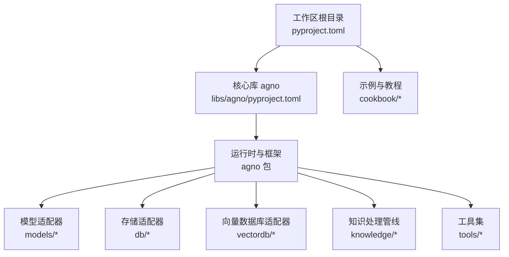
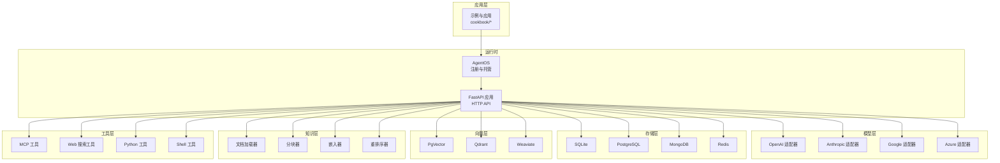
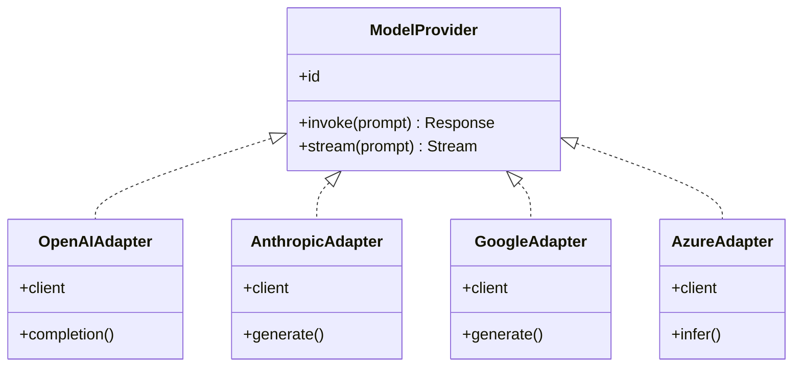
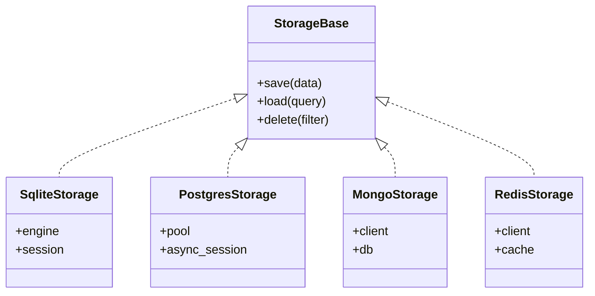
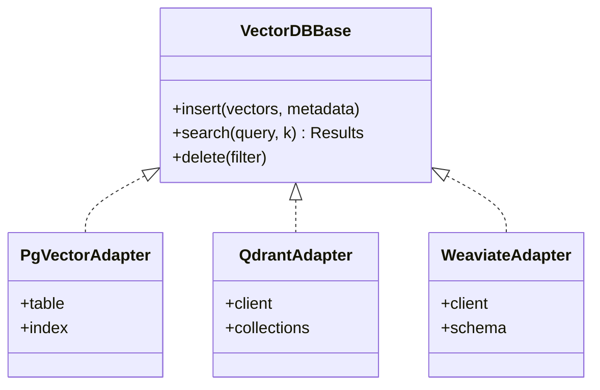
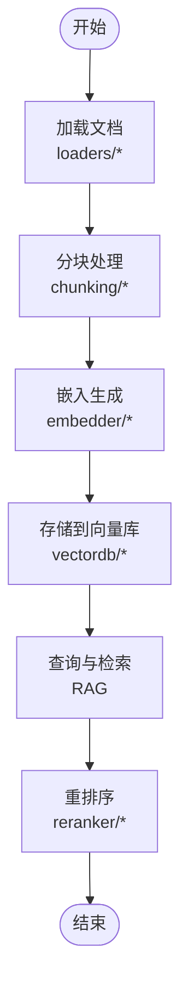
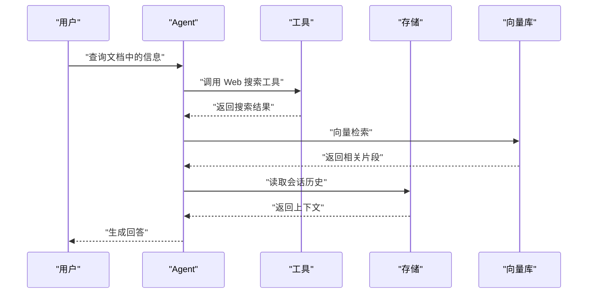
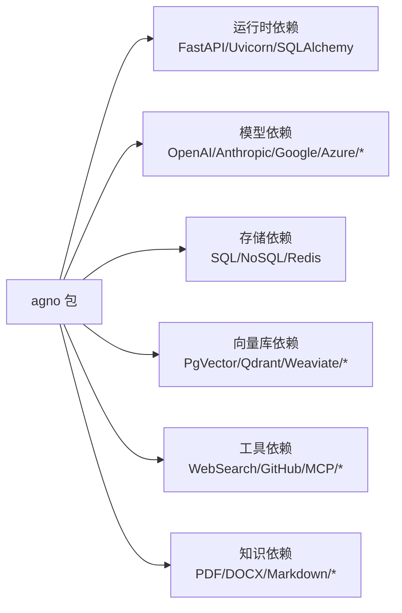

# 技术栈

<cite>
**本文引用的文件**
- [README.md](file://README.md)
- [pyproject.toml](file://pyproject.toml)
- [libs/agno/pyproject.toml](file://libs/agno/pyproject.toml)
- [libs/agno/requirements.txt](file://libs/agno/requirements.txt)
- [cookbook/00_quickstart/config.yaml](file://cookbook/00_quickstart/config.yaml)
- [cookbook/01_demo/config.yaml](file://cookbook/01_demo/config.yaml)
- [libs/agno/db/__init__.py](file://libs/agno/db/__init__.py)
- [libs/agno/vectordb/__init__.py](file://libs/agno/vectordb/__init__.py)
- [libs/agno/models/__init__.py](file://libs/agno/models/__init__.py)
- [libs/agno/tools/__init__.py](file://libs/agno/tools/__init__.py)
- [libs/agno/knowledge/__init__.py](file://libs/agno/knowledge/__init__.py)
- [libs/agno/db/base.py](file://libs/agno/db/base.py)
- [libs/agno/db/sqlite/__init__.py](file://libs/agno/db/sqlite/__init__.py)
- [libs/agno/db/postgres/__init__.py](file://libs/agno/db/postgres/__init__.py)
- [libs/agno/db/mongo/__init__.py](file://libs/agno/db/mongo/__init__.py)
- [libs/agno/db/redis/__init__.py](file://libs/agno/db/redis/__init__.py)
- [libs/agno/vectordb/pgvector/__init__.py](file://libs/agno/vectordb/pgvector/__init__.py)
- [libs/agno/vectordb/qdrant/__init__.py](file://libs/agno/vectordb/qdrant/__init__.py)
- [libs/agno/vectordb/weaviate/__init__.py](file://libs/agno/vectordb/weaviate/__init__.py)
- [libs/agno/models/openai/__init__.py](file://libs/agno/models/openai/__init__.py)
- [libs/agno/models/anthropic/__init__.py](file://libs/agno/models/anthropic/__init__.py)
- [libs/agno/models/google/__init__.py](file://libs/agno/models/google/__init__.py)
- [libs/agno/models/azure/__init__.py](file://libs/agno/models/azure/__init__.py)
- [libs/agno/tools/mcp/__init__.py](file://libs/agno/tools/mcp/__init__.py)
- [libs/agno/tools/web_search/__init__.py](file://libs/agno/tools/web_search/__init__.py)
- [libs/agno/tools/python/__init__.py](file://libs/agno/tools/python/__init__.py)
- [libs/agno/tools/shell/__init__.py](file://libs/agno/tools/shell/__init__.py)
- [libs/agno/knowledge/embedder/__init__.py](file://libs/agno/knowledge/embedder/__init__.py)
- [libs/agno/knowledge/chunking/__init__.py](file://libs/agno/knowledge/chunking/__init__.py)
- [libs/agno/knowledge/loaders/__init__.py](file://libs/agno/knowledge/loaders/__init__.py)
- [libs/agno/knowledge/readers/__init__.py](file://libs/agno/knowledge/readers/__init__.py)
- [libs/agno/knowledge/reranker/__init__.py](file://libs/agno/knowledge/reranker/__init__.py)
</cite>

## 目录
1. [简介](#简介)
2. [项目结构](#项目结构)
3. [核心组件](#核心组件)
4. [架构总览](#架构总览)
5. [详细组件分析](#详细组件分析)
6. [依赖关系分析](#依赖关系分析)
7. [性能考量](#性能考量)
8. [故障排查指南](#故障排查指南)
9. [结论](#结论)
10. [附录](#附录)

## 简介
本节概述 Agno Learn 项目所支持的技术栈与集成生态，涵盖大语言模型提供商、数据库系统、向量数据库、知识处理与工具集成等方面。文档同时说明技术选型原因、兼容性考虑、版本要求与配置建议，帮助开发者理解 Agno 的技术边界与扩展能力。

## 项目结构
Agno Learn 采用多示例与多功能 Cookbook 组织方式，核心运行时与可选依赖通过独立包管理，便于按需扩展。顶层工作区定义了最小 Python 版本与依赖范围，核心库 agno 提供运行时、模型、存储、向量数据库、知识与工具等模块化能力。

图表来源
- [pyproject.toml:1-15](file://pyproject.toml#L1-L15)
- [libs/agno/pyproject.toml:1-50](file://libs/agno/pyproject.toml#L1-L50)

章节来源
- [pyproject.toml:1-15](file://pyproject.toml#L1-L15)
- [libs/agno/pyproject.toml:1-50](file://libs/agno/pyproject.toml#L1-L50)

## 核心组件
- 运行时与框架：基于 FastAPI 的无状态、会话作用域后端，支持生产部署与可观测性。
- 模型适配器：统一抽象多种 LLM 提供商，便于切换与扩展。
- 存储适配器：覆盖关系型、NoSQL、对象存储与内存存储，满足不同场景的数据持久化需求。
- 向量数据库适配器：支持主流向量数据库，支撑 RAG 与相似度检索。
- 知识处理管线：文档加载、分块、嵌入、重排序与远程内容获取。
- 工具集：Web 搜索、文件操作、数据库访问、外部 API 集成等。

章节来源
- [README.md:25-98](file://README.md#L25-L98)
- [libs/agno/pyproject.toml:66-200](file://libs/agno/pyproject.toml#L66-L200)

## 架构总览
下图展示 Agno Learn 的高层架构：应用通过 AgentOS 注册与托管，运行时提供 HTTP API；模型适配器负责与 LLM 提供商通信；存储与向量数据库支撑会话、记忆与知识；工具集扩展外部能力；知识管线负责文档处理与嵌入。

图表来源
- [libs/agno/pyproject.toml:76-173](file://libs/agno/pyproject.toml#L76-L173)
- [libs/agno/db/__init__.py](file://libs/agno/db/__init__.py)
- [libs/agno/vectordb/__init__.py](file://libs/agno/vectordb/__init__.py)
- [libs/agno/knowledge/__init__.py](file://libs/agno/knowledge/__init__.py)
- [libs/agno/tools/__init__.py](file://libs/agno/tools/__init__.py)

## 详细组件分析

### 大语言模型提供商
- 支持的提供商：OpenAI、Anthropic、Google、Azure、AWS Bedrock、Cerebras、Cohere、Infinity、Groq、IBM、LiteLLM、Meta、Mistral、Ollama、Portkey 等。
- 技术选型原因：
  - 通过可插拔适配器抽象统一接口，便于在不同提供商间切换与对比。
  - 通过可选依赖与分组安装，避免不必要的依赖体积。
- 兼容性与版本：
  - Python 版本要求：核心库支持 Python 3.7–3.12；工作区要求 Python >=3.12。
  - 部分提供商依赖版本在可选依赖中明确声明，如 Google GenAI、Azure AI Inference、Anthropic、OpenAI 等。
- 配置建议：
  - 通过环境变量或配置文件注入提供商密钥与区域参数。
  - 在示例中使用 MCP 工具与 Claude 模型进行演示，便于快速上手。

图表来源
- [libs/agno/models/openai/__init__.py](file://libs/agno/models/openai/__init__.py)
- [libs/agno/models/anthropic/__init__.py](file://libs/agno/models/anthropic/__init__.py)
- [libs/agno/models/google/__init__.py](file://libs/agno/models/google/__init__.py)
- [libs/agno/models/azure/__init__.py](file://libs/agno/models/azure/__init__.py)

章节来源
- [libs/agno/pyproject.toml:76-93](file://libs/agno/pyproject.toml#L76-L93)
- [libs/agno/models/__init__.py](file://libs/agno/models/__init__.py)
- [README.md:39-78](file://README.md#L39-L78)

### 数据库系统
- 支持的数据库：SQLite、PostgreSQL、MySQL、MongoDB、Redis、Google Cloud Storage、Firestore、SingleStore、SurrealDB 等。
- 技术选型原因：
  - 关系型数据库用于结构化会话与审计数据；NoSQL 适合灵活文档与键值存储；Redis 用于缓存与会话状态。
- 兼容性与版本：
  - SQLAlchemy 作为 ORM/查询抽象，统一 SQL 生态；异步驱动用于高并发场景。
- 配置建议：
  - 使用环境变量配置连接字符串与认证参数。
  - SQLite 适合开发与演示；生产推荐 PostgreSQL 或 MySQL。

图表来源
- [libs/agno/db/base.py](file://libs/agno/db/base.py)
- [libs/agno/db/sqlite/__init__.py](file://libs/agno/db/sqlite/__init__.py)
- [libs/agno/db/postgres/__init__.py](file://libs/agno/db/postgres/__init__.py)
- [libs/agno/db/mongo/__init__.py](file://libs/agno/db/mongo/__init__.py)
- [libs/agno/db/redis/__init__.py](file://libs/agno/db/redis/__init__.py)

章节来源
- [libs/agno/pyproject.toml:146-156](file://libs/agno/pyproject.toml#L146-L156)
- [libs/agno/db/__init__.py](file://libs/agno/db/__init__.py)

### 向量数据库
- 支持的向量数据库：PgVector、Qdrant、Weaviate、Chroma、LanceDB、Couchbase、Cassandra、MongoDB、SingleStore、Milvus、ClickHouse、Pinecone、SurrealDB、Upstash、Pylance 等。
- 技术选型原因：
  - 不同场景选择不同向量数据库：云原生、开源、混合部署与特定索引特性。
- 兼容性与版本：
  - 通过可选依赖按需启用，避免安装无关客户端。
- 配置建议：
  - 为嵌入维度与距离度量选择合适的索引参数；生产环境建议集群部署与备份策略。

图表来源
- [libs/agno/vectordb/pgvector/__init__.py](file://libs/agno/vectordb/pgvector/__init__.py)
- [libs/agno/vectordb/qdrant/__init__.py](file://libs/agno/vectordb/qdrant/__init__.py)
- [libs/agno/vectordb/weaviate/__init__.py](file://libs/agno/vectordb/weaviate/__init__.py)

章节来源
- [libs/agno/pyproject.toml:157-173](file://libs/agno/pyproject.toml#L157-L173)
- [libs/agno/vectordb/__init__.py](file://libs/agno/vectordb/__init__.py)

### 知识处理与嵌入
- 组件：文档加载器、分块器、嵌入器、重排序器、远程内容获取。
- 技术选型原因：
  - 通过模块化管线解耦加载、分块、嵌入与检索阶段，便于替换与优化。
- 兼容性与版本：
  - 支持 PDF、DOCX、PPTX、CSV、Excel、Markdown 等格式；嵌入器可选 HuggingFace、vLLM 等。
- 配置建议：
  - 根据文档类型选择合适分块策略与嵌入维度；对长文档采用滚动窗口或语义分块。

图表来源
- [libs/agno/knowledge/loaders/__init__.py](file://libs/agno/knowledge/loaders/__init__.py)
- [libs/agno/knowledge/chunking/__init__.py](file://libs/agno/knowledge/chunking/__init__.py)
- [libs/agno/knowledge/embedder/__init__.py](file://libs/agno/knowledge/embedder/__init__.py)
- [libs/agno/knowledge/reranker/__init__.py](file://libs/agno/knowledge/reranker/__init__.py)
- [libs/agno/vectordb/__init__.py](file://libs/agno/vectordb/__init__.py)

章节来源
- [libs/agno/pyproject.toml:174-182](file://libs/agno/pyproject.toml#L174-L182)
- [libs/agno/knowledge/__init__.py](file://libs/agno/knowledge/__init__.py)

### 工具集成
- 支持的工具类别：Web 搜索、文件操作、数据库访问、外部 API 集成、MCP 工具、浏览器自动化、图像/音频处理等。
- 技术选型原因：
  - 通过统一装饰器与钩子机制，简化工具开发与复用。
- 兼容性与版本：
  - 工具依赖通过可选依赖分组安装，避免捆绑不必要依赖。
- 配置建议：
  - 为外部 API 设置超时与重试策略；对敏感操作增加审批与审计。

图表来源
- [libs/agno/tools/web_search/__init__.py](file://libs/agno/tools/web_search/__init__.py)
- [libs/agno/tools/mcp/__init__.py](file://libs/agno/tools/mcp/__init__.py)
- [libs/agno/db/__init__.py](file://libs/agno/db/__init__.py)
- [libs/agno/vectordb/__init__.py](file://libs/agno/vectordb/__init__.py)

章节来源
- [libs/agno/pyproject.toml:100-144](file://libs/agno/pyproject.toml#L100-L144)
- [libs/agno/tools/__init__.py](file://libs/agno/tools/__init__.py)

## 依赖关系分析
- 运行时依赖：FastAPI、Uvicorn、SQLAlchemy、PyJWT、OpenTelemetry、Langfuse 等。
- 模型依赖：各提供商 SDK 通过可选依赖启用。
- 存储依赖：SQLAlchemy、psycopg、redis、pymongo、asyncpg 等。
- 向量数据库依赖：pgvector、qdrant-client、weaviate-client、chromadb 等。
- 工具依赖：web 搜索、GitHub/GitLab、Gmail、BigQuery、YouTube、ElevenLabs、MCP 等。
- 知识处理依赖：PDF/DOCX/PPTX/CSV/Excel/Markdown 解析与分块、嵌入器等。

图表来源
- [libs/agno/pyproject.toml:66-200](file://libs/agno/pyproject.toml#L66-L200)

章节来源
- [libs/agno/pyproject.toml:66-200](file://libs/agno/pyproject.toml#L66-L200)

## 性能考量
- 无状态与会话作用域：降低共享状态带来的锁竞争，提升水平扩展能力。
- 异步存储与向量库：使用异步驱动与连接池，减少 I/O 阻塞。
- 观测性：OpenTelemetry/Langfuse 集成，便于端到端性能追踪与瓶颈定位。
- 分块与嵌入：根据文档长度与查询复杂度调整分块大小与嵌入维度，平衡召回与延迟。
- 缓存策略：利用 Redis 缓存热点数据与中间结果，降低重复计算。

## 故障排查指南
- 模型调用失败：检查提供商密钥与网络连通性；确认模型 ID 与版本兼容。
- 存储连接异常：核对连接字符串、认证凭据与防火墙设置；确保数据库服务可用。
- 向量库检索慢：检查索引配置与查询参数；对大规模数据进行分区与近似最近邻优化。
- 工具执行错误：查看工具日志与超时设置；对易错外部 API 增加重试与熔断。
- 会话状态丢失：确认 Redis 或存储后端的持久化配置与副本一致性。

## 结论
Agno Learn 通过模块化设计与可选依赖，提供了覆盖模型、存储、向量库、知识与工具的完整技术栈。其架构强调可扩展性、可观测性与生产就绪，既适合快速原型，也适合规模化部署。开发者可根据业务场景选择合适的组件组合，并遵循版本与配置建议以获得最佳兼容性与性能。

## 附录
- 示例配置参考：
  - 快速开始示例配置：[cookbook/00_quickstart/config.yaml](file://cookbook/00_quickstart/config.yaml)
  - 演示示例配置：[cookbook/01_demo/config.yaml](file://cookbook/01_demo/config.yaml)
- 运行时与依赖清单：
  - 核心依赖：[libs/agno/requirements.txt](file://libs/agno/requirements.txt)
  - 工作区定义：[pyproject.toml](file://pyproject.toml)