# 核心特性

<cite>
**本文引用的文件**
- [README.md](file://README.md)
- [agent.py](file://libs/agno/agno/agent/agent.py)
- [_session.py](file://libs/agno/agno/agent/_session.py)
- [_run.py](file://libs/agno/agno/agent/_run.py)
- [_response.py](file://libs/agno/agno/agent/_response.py)
- [api.py](file://libs/agno/agno/api/api.py)
- [routes.py](file://libs/agno/agno/api/routes.py)
- [os.py](file://libs/agno/agno/os/os.py)
- [streaming.py](file://cookbook/02_agents/02_input_output/streaming.py)
- [human_in_the_loop.py](file://cookbook/00_quickstart/human_in_the_loop.py)
- [confirmation_required.py](file://cookbook/10_human_in_the_loop/confirmation_required.py)
- [custom_guardrail.py](file://cookbook/08_guardrails/custom_guardrail.py)
- [openai_moderation.py](file://cookbook/08_guardrails/openai_moderation.py)
- [pii_detection.py](file://cookbook/08_guardrails/pii_detection.py)
- [prompt_injection.py](file://cookbook/08_guardrails/prompt_injection.py)
- [run_evals.py](file://cookbook/01_demo/evals/run_evals.py)
- [test_cases.py](file://cookbook/01_demo/evals/test_cases.py)
- [persistent_session_storage.py](file://cookbook/06_storage/examples/persistent_session_storage.py)
- [memory_manager.py](file://cookbook/06_memory/memory_manager.py)
- [agentic_rag.py](file://cookbook/07_knowledge/02_building_blocks/agentic_rag.py)
- [agentic_session_state.py](file://cookbook/02_agents/05_state_and_session/agentic_session_state.py)
- [session_state_events.py](file://cookbook/02_agents/05_state_and_session/session_state_events.py)
- [session_state_hooks.py](file://cookbook/09_hooks/session_state_hooks.py)
- [stream_hook.py](file://cookbook/09_hooks/stream_hook.py)
- [team.py](file://libs/agno/agno/team/team.py)
- [workflow.py](file://libs/agno/agno/workflow/workflow.py)
- [base.py](file://libs/agno/agno/guardrails/base.py)
- [openai.py](file://libs/agno/agno/guardrails/openai.py)
- [pii.py](file://libs/agno/agno/guardrails/pii.py)
- [prompt_injection.py](file://libs/agno/agno/guardrails/prompt_injection.py)
- [accuracy.py](file://libs/agno/agno/eval/accuracy.py)
- [performance.py](file://libs/agno/agno/eval/performance.py)
- [reliability.py](file://libs/agno/agno/eval/reliability.py)
- [base.py](file://libs/agno/agno/eval/base.py)
- [sqlite.py](file://libs/agno/agno/db/sqlite/sqlite.py)
- [postgres.py](file://libs/agno/agno/db/postgres/postgres.py)
- [redis.py](file://libs/agno/agno/db/redis/redis.py)
- [json.py](file://libs/agno/agno/db/json/json.py)
- [base.py](file://libs/agno/agno/db/base.py)
- [base.py](file://libs/agno/agno/knowledge/knowledge.py)
- [content.py](file://libs/agno/agno/knowledge/content.py)
- [embedder.py](file://libs/agno/agno/knowledge/embedder/embedder.py)
- [reranker.py](file://libs/agno/agno/knowledge/reranker/reranker.py)
- [manager.py](file://libs/agno/agno/memory/memory_manager.py)
- [machine.py](file://libs/agno/agno/learn/machine.py)
- [schemas.py](file://libs/agno/agno/learn/schemas.py)
- [curate.py](file://libs/agno/agno/learn/curate.py)
- [decorators.py](file://libs/agno/agno/hooks/decorator.py)
- [decorator.py](file://libs/agno/agno/approval/decorator.py)
- [tracing.py](file://libs/agno/agno/tracing/tracing.py)
</cite>

## 目录
1. [引言](#引言)
2. [项目结构](#项目结构)
3. [核心组件](#核心组件)
4. [架构总览](#架构总览)
5. [详细组件分析](#详细组件分析)
6. [依赖关系分析](#依赖关系分析)
7. [性能考量](#性能考量)
8. [故障排查指南](#故障排查指南)
9. [结论](#结论)
10. [附录](#附录)

## 引言
本文件聚焦 Agno Learn 项目的核心特性与工程实践，围绕以下主题展开：无状态设计、会话作用域、流式响应、人机协作、护栏系统、评估集成。我们将从系统架构、组件关系、数据流、处理逻辑、集成点与错误处理等方面进行深入剖析，并通过图示与“章节来源”标注帮助读者定位到仓库中的具体实现位置。同时，我们提供“使用示例路径”，便于开发者在自身项目中快速落地。

## 项目结构
Agno 采用分层架构：框架（Framework）负责构建具备记忆、知识库、护栏与多集成的 Agent、团队与工作流；运行时（Runtime）提供无状态、会话作用域的 FastAPI 服务；控制平面（Control Plane）通过 AgentOS UI 提供测试、监控与管理能力。项目以模块化组织，核心位于 libs/agno 下，cookbook 提供丰富的示例与最佳实践。

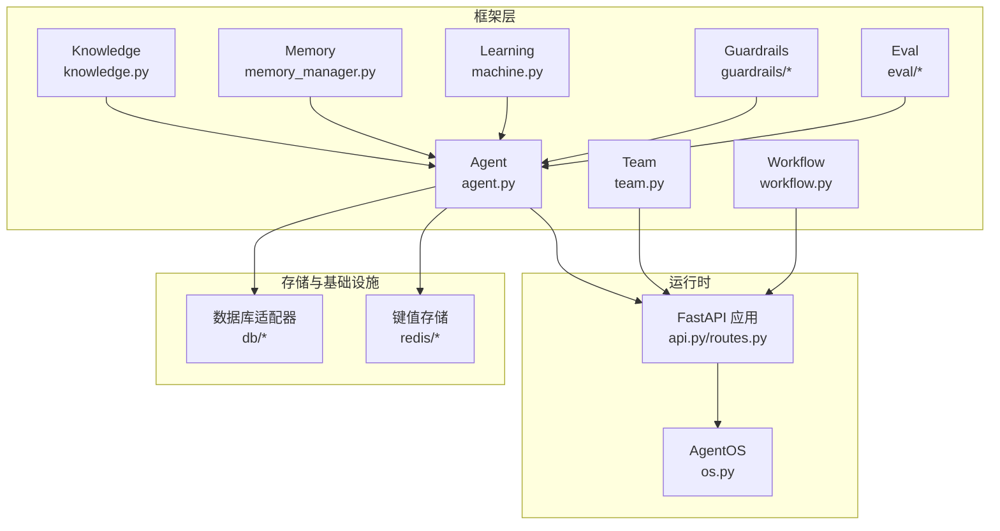

**图表来源**
- [agent.py](file://libs/agno/agno/agent/agent.py)
- [team.py](file://libs/agno/agno/team/team.py)
- [workflow.py](file://libs/agno/agno/workflow/workflow.py)
- [knowledge.py](file://libs/agno/agno/knowledge/knowledge.py)
- [memory_manager.py](file://libs/agno/agno/memory/memory_manager.py)
- [machine.py](file://libs/agno/agno/learn/machine.py)
- [guardrails/base.py](file://libs/agno/agno/guardrails/base.py)
- [eval/base.py](file://libs/agno/agno/eval/base.py)
- [api.py](file://libs/agno/agno/api/api.py)
- [routes.py](file://libs/agno/agno/api/routes.py)
- [os.py](file://libs/agno/agno/os/os.py)
- [sqlite.py](file://libs/agno/agno/db/sqlite/sqlite.py)
- [redis.py](file://libs/agno/agno/db/redis/redis.py)

**章节来源**
- [README.md:25-34](file://README.md#L25-L34)

## 核心组件
- Agent：核心执行单元，支持工具调用、记忆、知识库、护栏与流式响应。
- Team：多 Agent 协作编排，支持模式切换、结构化输入输出、分布式 RAG 等。
- Workflow：顺序/条件/并行/循环等执行模型，支持人类介入与审批。
- Knowledge：文档加载、分块、嵌入、重排序与检索。
- Memory/Learning：会话记忆与自适应学习。
- Guardrails：输入/输出护栏，支持自定义与第三方集成。
- Eval：准确性、性能、可靠性评估，贯穿 Agent 循环。
- API/Runtime：无状态 FastAPI 服务，会话作用域隔离，原生链路追踪。

**章节来源**
- [agent.py](file://libs/agno/agno/agent/agent.py)
- [team.py](file://libs/agno/agno/team/team.py)
- [workflow.py](file://libs/agno/agno/workflow/workflow.py)
- [knowledge.py](file://libs/agno/agno/knowledge/knowledge.py)
- [memory_manager.py](file://libs/agno/agno/memory/memory_manager.py)
- [machine.py](file://libs/agno/agno/learn/machine.py)
- [guardrails/base.py](file://libs/agno/agno/guardrails/base.py)
- [eval/base.py](file://libs/agno/agno/eval/base.py)
- [api.py](file://libs/agno/agno/api/api.py)
- [routes.py](file://libs/agno/agno/api/routes.py)
- [os.py](file://libs/agno/agno/os/os.py)

## 架构总览
下图展示了从客户端到 Agent、再到模型与外部工具/存储的端到端流程，体现无状态、会话作用域与流式响应的关键特征。

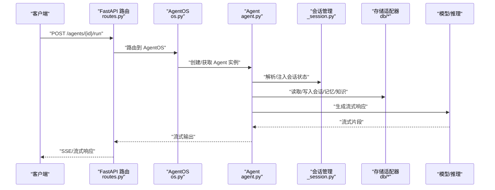

**图表来源**
- [routes.py](file://libs/agno/agno/api/routes.py)
- [os.py](file://libs/agno/agno/os/os.py)
- [agent.py](file://libs/agno/agno/agent/agent.py)
- [_session.py](file://libs/agno/agno/agent/_session.py)
- [sqlite.py](file://libs/agno/agno/db/sqlite/sqlite.py)

## 详细组件分析

### 无状态设计
- 设计原则：运行时以无状态方式提供服务，避免在进程内维护全局状态，确保水平扩展与高可用。
- 关键实现：
  - API 层通过会话 ID 与用户 ID 解析当前上下文，不依赖进程内缓存。
  - AgentOS 负责实例生命周期管理，结合存储层持久化状态。
- 业务价值：简化部署、提升弹性与可运维性，适合云原生环境。

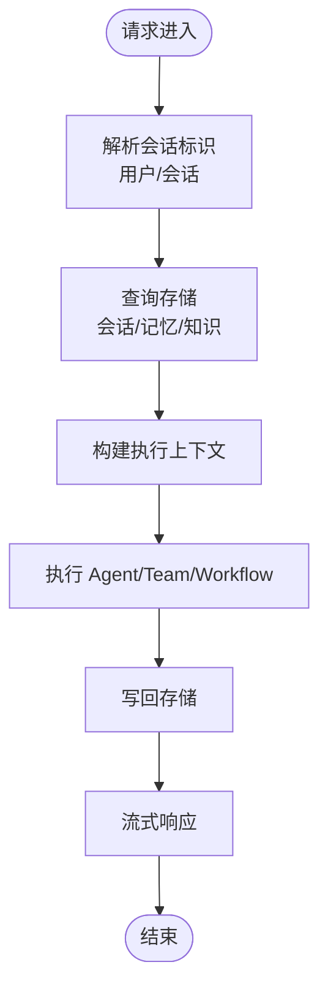

**图表来源**
- [routes.py](file://libs/agno/agno/api/routes.py)
- [os.py](file://libs/agno/agno/os/os.py)
- [agent.py](file://libs/agno/agno/agent/agent.py)
- [_session.py](file://libs/agno/agno/agent/_session.py)

**章节来源**
- [README.md:130-139](file://README.md#L130-L139)
- [routes.py](file://libs/agno/agno/api/routes.py)
- [os.py](file://libs/agno/agno/os/os.py)

### 会话作用域
- 会话隔离：同一 Agent 对不同用户与会话保持独立上下文，避免交叉污染。
- 状态管理：通过会话状态事件钩子与手动更新机制，实现动态上下文注入与持久化。
- 示例路径：
  - [agentic_session_state.py](file://cookbook/02_agents/05_state_and_session/agentic_session_state.py)
  - [session_state_events.py](file://cookbook/02_agents/05_state_and_session/session_state_events.py)
  - [session_state_hooks.py](file://cookbook/09_hooks/session_state_hooks.py)

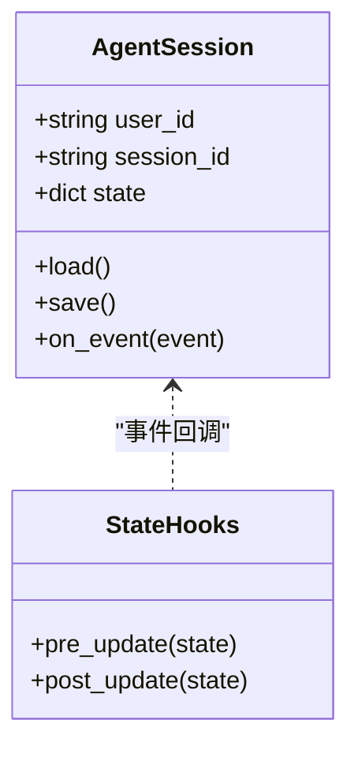

**图表来源**
- [_session.py](file://libs/agno/agno/agent/_session.py)
- [session_state_hooks.py](file://cookbook/09_hooks/session_state_hooks.py)

**章节来源**
- [_session.py](file://libs/agno/agno/agent/_session.py)
- [session_state_events.py](file://cookbook/02_agents/05_state_and_session/session_state_events.py)
- [session_state_hooks.py](file://cookbook/09_hooks/session_state_hooks.py)

### 流式响应
- 实现方式：服务端事件（SSE）或流式传输，边生成边输出，降低首字延迟。
- 关键点：在 Agent 执行过程中持续推送中间结果，支持中断与恢复。
- 示例路径：
  - [streaming.py](file://cookbook/02_agents/02_input_output/streaming.py)
  - [_response.py](file://libs/agno/agno/agent/_response.py)
  - [stream_hook.py](file://cookbook/09_hooks/stream_hook.py)

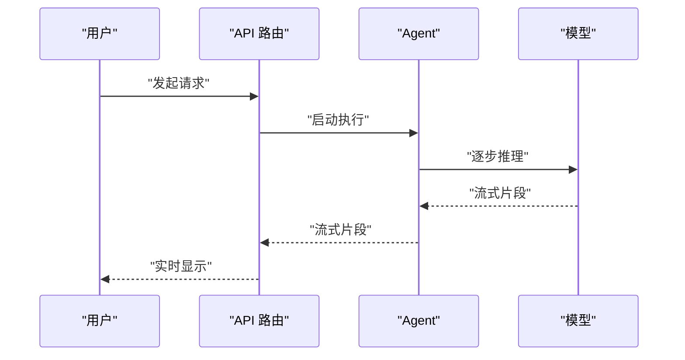

**图表来源**
- [streaming.py](file://cookbook/02_agents/02_input_output/streaming.py)
- [_response.py](file://libs/agno/agno/agent/_response.py)
- [stream_hook.py](file://cookbook/09_hooks/stream_hook.py)

**章节来源**
- [README.md:103-107](file://README.md#L103-L107)
- [streaming.py](file://cookbook/02_agents/02_input_output/streaming.py)
- [_response.py](file://libs/agno/agno/agent/_response.py)

### 人机协作
- 交互模式：在关键步骤要求人工确认，支持外部工具执行与反馈闭环。
- 关键机制：审批装饰器与确认工具，允许在 Agent 执行中插入人工干预。
- 示例路径：
  - [human_in_the_loop.py](file://cookbook/00_quickstart/human_in_the_loop.py)
  - [confirmation_required.py](file://cookbook/10_human_in_the_loop/confirmation_required.py)
  - [decorator.py](file://libs/agno/agno/approval/decorator.py)

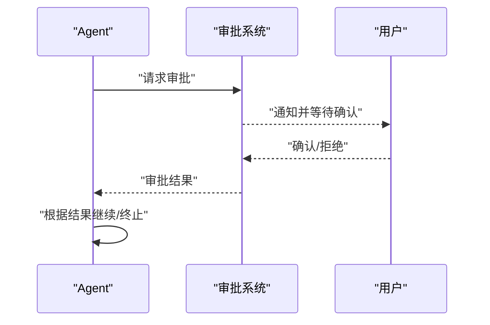

**图表来源**
- [human_in_the_loop.py](file://cookbook/00_quickstart/human_in_the_loop.py)
- [confirmation_required.py](file://cookbook/10_human_in_the_loop/confirmation_required.py)
- [decorator.py](file://libs/agno/agno/approval/decorator.py)

**章节来源**
- [README.md:109-119](file://README.md#L109-L119)
- [human_in_the_loop.py](file://cookbook/00_quickstart/human_in_the_loop.py)
- [confirmation_required.py](file://cookbook/10_human_in_the_loop/confirmation_required.py)

### 护栏系统
- 输入护栏：检测提示注入、PII 等敏感信息。
- 输出护栏：基于模型或外部服务（如 OpenAI Moderation）过滤不当内容。
- 自定义护栏：通过统一基类扩展新护栏策略。
- 示例路径：
  - [custom_guardrail.py](file://cookbook/08_guardrails/custom_guardrail.py)
  - [openai_moderation.py](file://cookbook/08_guardrails/openai_moderation.py)
  - [pii_detection.py](file://cookbook/08_guardrails/pii_detection.py)
  - [prompt_injection.py](file://cookbook/08_guardrails/prompt_injection.py)
  - [guardrails/base.py](file://libs/agno/agno/guardrails/base.py)
  - [guardrails/openai.py](file://libs/agno/agno/guardrails/openai.py)
  - [guardrails/pii.py](file://libs/agno/agno/guardrails/pii.py)
  - [guardrails/prompt_injection.py](file://libs/agno/agno/guardrails/prompt_injection.py)

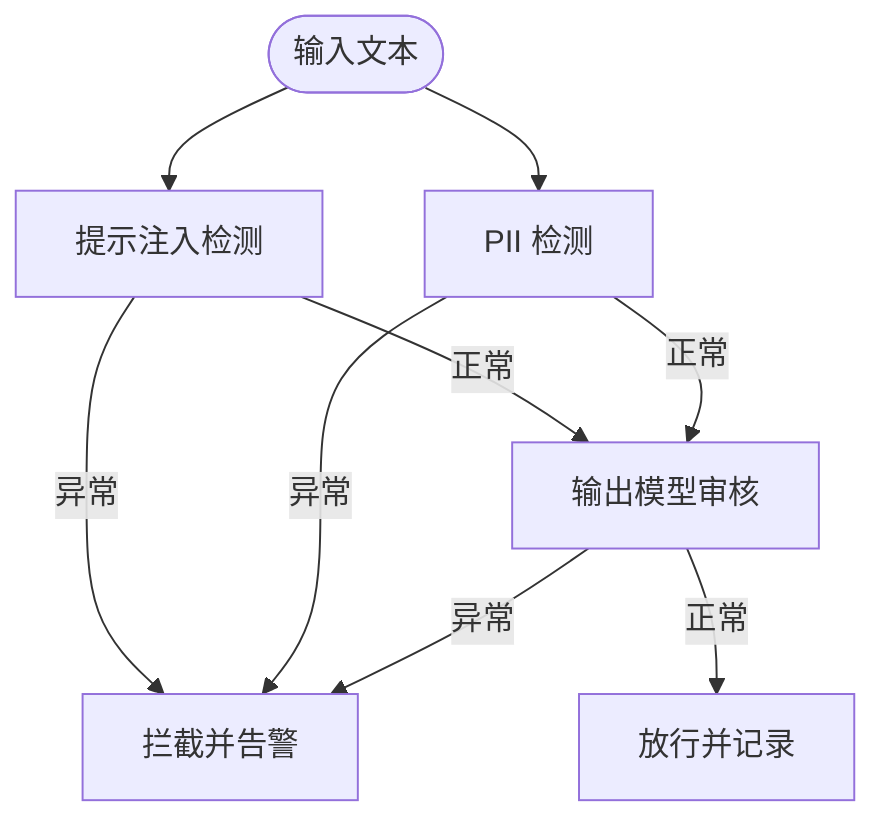

**图表来源**
- [custom_guardrail.py](file://cookbook/08_guardrails/custom_guardrail.py)
- [openai_moderation.py](file://cookbook/08_guardrails/openai_moderation.py)
- [pii_detection.py](file://cookbook/08_guardrails/pii_detection.py)
- [prompt_injection.py](file://cookbook/08_guardrails/prompt_injection.py)
- [guardrails/base.py](file://libs/agno/agno/guardrails/base.py)

**章节来源**
- [README.md:120-129](file://README.md#L120-L129)
- [guardrails/base.py](file://libs/agno/agno/guardrails/base.py)

### 评估集成
- 评估维度：准确性、性能、可靠性，贯穿 Agent 的训练与运行阶段。
- 集成方式：在 Agent 循环中嵌入评估步骤，结合测试用例与指标计算。
- 示例路径：
  - [run_evals.py](file://cookbook/01_demo/evals/run_evals.py)
  - [test_cases.py](file://cookbook/01_demo/evals/test_cases.py)
  - [accuracy.py](file://libs/agno/agno/eval/accuracy.py)
  - [performance.py](file://libs/agno/agno/eval/performance.py)
  - [reliability.py](file://libs/agno/agno/eval/reliability.py)
  - [base.py](file://libs/agno/agno/eval/base.py)

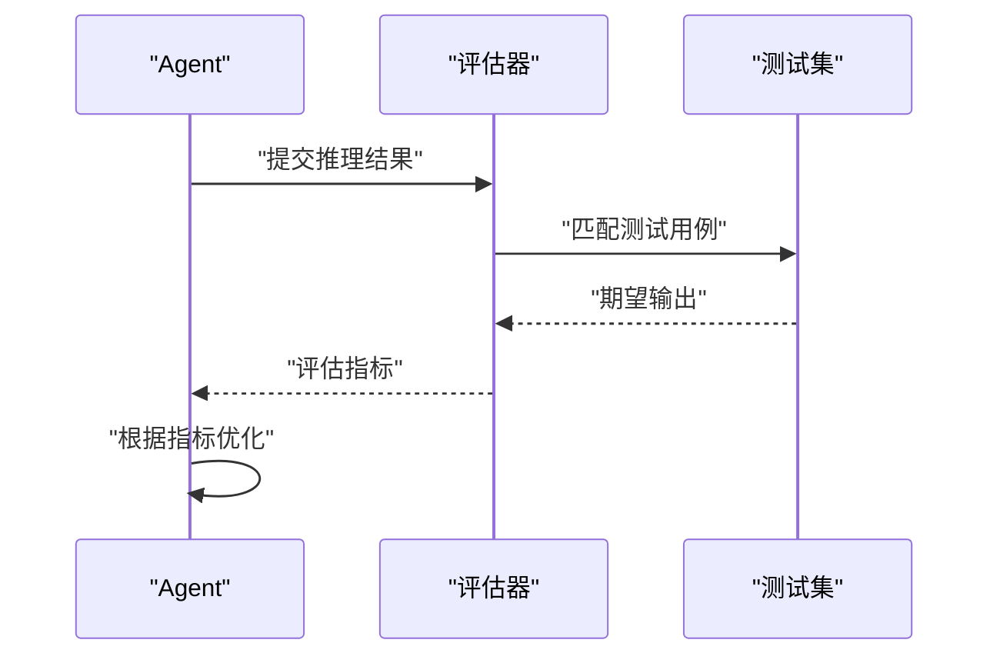

**图表来源**
- [run_evals.py](file://cookbook/01_demo/evals/run_evals.py)
- [test_cases.py](file://cookbook/01_demo/evals/test_cases.py)
- [accuracy.py](file://libs/agno/agno/eval/accuracy.py)
- [performance.py](file://libs/agno/agno/eval/performance.py)
- [reliability.py](file://libs/agno/agno/eval/reliability.py)

**章节来源**
- [README.md:126-128](file://README.md#L126-L128)
- [run_evals.py](file://cookbook/01_demo/evals/run_evals.py)
- [test_cases.py](file://cookbook/01_demo/evals/test_cases.py)

### 知识与记忆
- 知识：文档加载、分块、嵌入、重排序与检索，支持传统 RAG 与智能 RAG。
- 记忆：会话历史、实体记忆与共享记忆，支持跨 Agent 共享。
- 示例路径：
  - [agentic_rag.py](file://cookbook/07_knowledge/02_building_blocks/agentic_rag.py)
  - [memory_manager.py](file://cookbook/06_memory/memory_manager.py)
  - [knowledge.py](file://libs/agno/agno/knowledge/knowledge.py)
  - [content.py](file://libs/agno/agno/knowledge/content.py)
  - [embedder.py](file://libs/agno/agno/knowledge/embedder/embedder.py)
  - [reranker.py](file://libs/agno/agno/knowledge/reranker/reranker.py)
  - [manager.py](file://libs/agno/agno/memory/memory_manager.py)

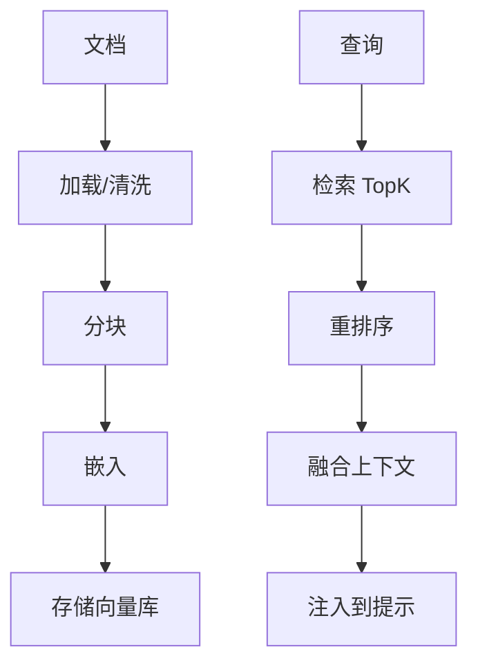

**图表来源**
- [agentic_rag.py](file://cookbook/07_knowledge/02_building_blocks/agentic_rag.py)
- [knowledge.py](file://libs/agno/agno/knowledge/knowledge.py)
- [content.py](file://libs/agno/agno/knowledge/content.py)
- [embedder.py](file://libs/agno/agno/knowledge/embedder/embedder.py)
- [reranker.py](file://libs/agno/agno/knowledge/reranker/reranker.py)

**章节来源**
- [memory_manager.py](file://cookbook/06_memory/memory_manager.py)
- [manager.py](file://libs/agno/agno/memory/memory_manager.py)

### 学习与自适应
- 学习机：基于会话与知识的自适应迭代，优化输出质量与决策稳定性。
- 示例路径：
  - [machine.py](file://libs/agno/agno/learn/machine.py)
  - [schemas.py](file://libs/agno/agno/learn/schemas.py)
  - [curate.py](file://libs/agno/agno/learn/curate.py)

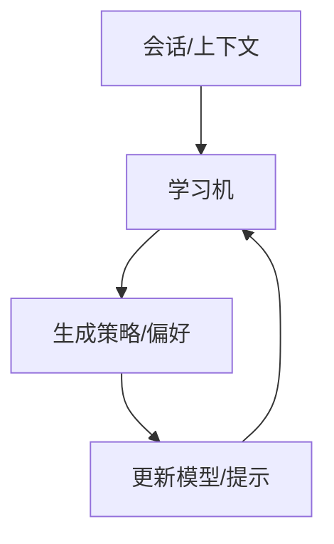

**图表来源**
- [machine.py](file://libs/agno/agno/learn/machine.py)
- [schemas.py](file://libs/agno/agno/learn/schemas.py)
- [curate.py](file://libs/agno/agno/learn/curate.py)

**章节来源**
- [machine.py](file://libs/agno/agno/learn/machine.py)

### 存储与持久化
- 支持多种存储后端：SQLite、PostgreSQL、Redis、JSON 文件等，满足不同场景需求。
- 示例路径：
  - [persistent_session_storage.py](file://cookbook/06_storage/examples/persistent_session_storage.py)
  - [sqlite.py](file://libs/agno/agno/db/sqlite/sqlite.py)
  - [postgres.py](file://libs/agno/agno/db/postgres/postgres.py)
  - [redis.py](file://libs/agno/agno/db/redis/redis.py)
  - [json.py](file://libs/agno/agno/db/json/json.py)
  - [base.py](file://libs/agno/agno/db/base.py)

**章节来源**
- [persistent_session_storage.py](file://cookbook/06_storage/examples/persistent_session_storage.py)
- [sqlite.py](file://libs/agno/agno/db/sqlite/sqlite.py)
- [postgres.py](file://libs/agno/agno/db/postgres/postgres.py)
- [redis.py](file://libs/agno/agno/db/redis/redis.py)
- [json.py](file://libs/agno/agno/db/json/json.py)
- [base.py](file://libs/agno/agno/db/base.py)

### 钩子与扩展
- 钩子：在执行前/后注入自定义逻辑，如状态钩子、流钩子。
- 示例路径：
  - [session_state_hooks.py](file://cookbook/09_hooks/session_state_hooks.py)
  - [stream_hook.py](file://cookbook/09_hooks/stream_hook.py)
  - [decorators.py](file://libs/agno/agno/hooks/decorator.py)

**章节来源**
- [session_state_hooks.py](file://cookbook/09_hooks/session_state_hooks.py)
- [stream_hook.py](file://cookbook/09_hooks/stream_hook.py)
- [decorators.py](file://libs/agno/agno/hooks/decorator.py)

### 团队与工作流
- 团队：多 Agent 协作，支持模式切换、结构化输入输出与分布式 RAG。
- 工作流：顺序/条件/并行/循环执行，支持人类介入与审批。
- 示例路径：
  - [team.py](file://libs/agno/agno/team/team.py)
  - [workflow.py](file://libs/agno/agno/workflow/workflow.py)

**章节来源**
- [team.py](file://libs/agno/agno/team/team.py)
- [workflow.py](file://libs/agno/agno/workflow/workflow.py)

## 依赖关系分析
- 组件耦合：Agent 依赖会话、存储、知识、护栏与评估；运行时通过 API 路由与 AgentOS 解耦。
- 外部依赖：模型提供商、外部工具、数据库与键值存储。
- 集成点：MCP 工具、外部审批系统、外部评估服务。

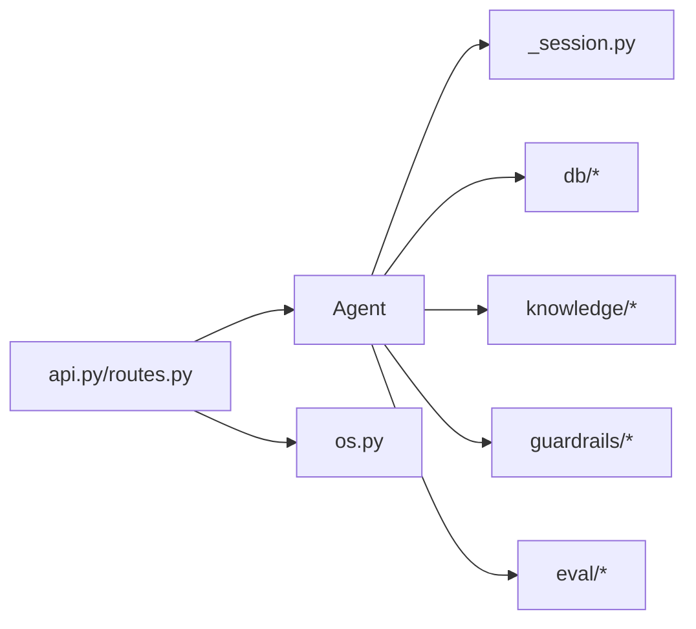

**图表来源**
- [agent.py](file://libs/agno/agno/agent/agent.py)
- [_session.py](file://libs/agno/agno/agent/_session.py)
- [sqlite.py](file://libs/agno/agno/db/sqlite/sqlite.py)
- [knowledge.py](file://libs/agno/agno/knowledge/knowledge.py)
- [guardrails/base.py](file://libs/agno/agno/guardrails/base.py)
- [eval/base.py](file://libs/agno/agno/eval/base.py)
- [api.py](file://libs/agno/agno/api/api.py)
- [routes.py](file://libs/agno/agno/api/routes.py)
- [os.py](file://libs/agno/agno/os/os.py)

**章节来源**
- [agent.py](file://libs/agno/agno/agent/agent.py)
- [routes.py](file://libs/agno/agno/api/routes.py)
- [os.py](file://libs/agno/agno/os/os.py)

## 性能考量
- 无状态与会话作用域：减少进程内状态竞争，利于水平扩展。
- 流式响应：降低首字延迟，提升用户体验。
- 存储与检索：合理分块与嵌入策略、重排序与缓存命中率影响整体性能。
- 评估集成：在不影响主流程的前提下异步评估，避免阻塞。

[本节为通用指导，无需特定文件来源]

## 故障排查指南
- 护栏触发：检查护栏配置与日志，确认是否误报或漏报。
- 会话状态异常：核对会话事件钩子与手动更新逻辑，确保状态一致性。
- 流式输出中断：检查网络与 SSE 配置，确认模型输出是否被截断。
- 评估失败：验证测试用例与期望输出格式，确保评估器正确解析。

**章节来源**
- [guardrails/base.py](file://libs/agno/agno/guardrails/base.py)
- [session_state_hooks.py](file://cookbook/09_hooks/session_state_hooks.py)
- [stream_hook.py](file://cookbook/09_hooks/stream_hook.py)
- [accuracy.py](file://libs/agno/agno/eval/accuracy.py)

## 结论
Agno 的核心优势在于将“无状态、会话作用域、流式响应、人机协作、护栏系统、评估集成”六大特性有机融合，形成可扩展、可观测、可治理的智能体运行平台。通过模块化的框架与运行时分离，开发者可以快速构建从单 Agent 到复杂团队与工作流的系统，并在生产环境中稳定运行与持续优化。

[本节为总结，无需特定文件来源]

## 附录
- 使用示例路径汇总（便于快速定位）：
  - 无状态与运行时：[README.md:35-79](file://README.md#L35-L79)
  - 流式响应：[streaming.py](file://cookbook/02_agents/02_input_output/streaming.py)
  - 人机协作：[human_in_the_loop.py](file://cookbook/00_quickstart/human_in_the_loop.py)、[confirmation_required.py](file://cookbook/10_human_in_the_loop/confirmation_required.py)
  - 护栏系统：[custom_guardrail.py](file://cookbook/08_guardrails/custom_guardrail.py)、[openai_moderation.py](file://cookbook/08_guardrails/openai_moderation.py)、[pii_detection.py](file://cookbook/08_guardrails/pii_detection.py)、[prompt_injection.py](file://cookbook/08_guardrails/prompt_injection.py)
  - 评估集成：[run_evals.py](file://cookbook/01_demo/evals/run_evals.py)、[test_cases.py](file://cookbook/01_demo/evals/test_cases.py)
  - 知识与记忆：[agentic_rag.py](file://cookbook/07_knowledge/02_building_blocks/agentic_rag.py)、[memory_manager.py](file://cookbook/06_memory/memory_manager.py)
  - 学习与自适应：[machine.py](file://libs/agno/agno/learn/machine.py)
  - 存储与持久化：[persistent_session_storage.py](file://cookbook/06_storage/examples/persistent_session_storage.py)
  - 钩子与扩展：[session_state_hooks.py](file://cookbook/09_hooks/session_state_hooks.py)、[stream_hook.py](file://cookbook/09_hooks/stream_hook.py)
  - 团队与工作流：[team.py](file://libs/agno/agno/team/team.py)、[workflow.py](file://libs/agno/agno/workflow/workflow.py)

[本节为附录，无需特定文件来源]