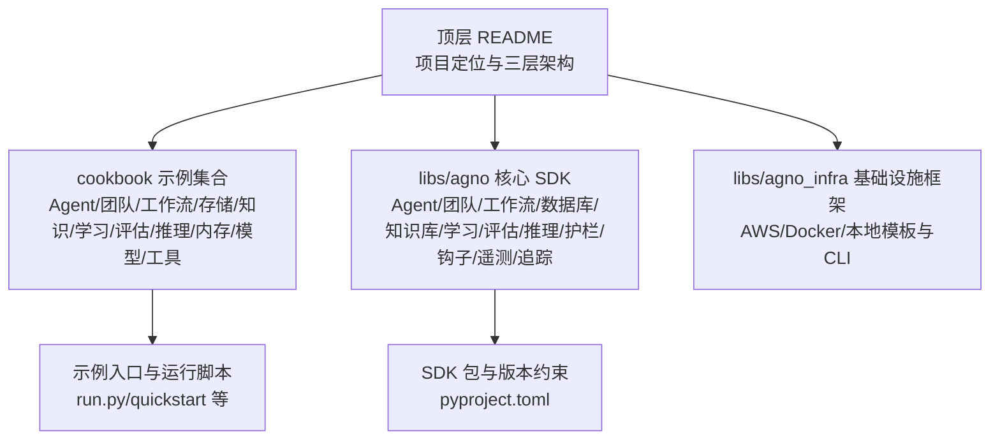
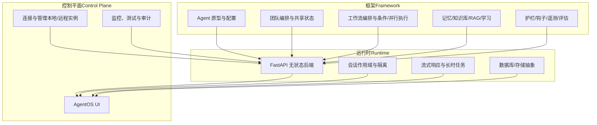
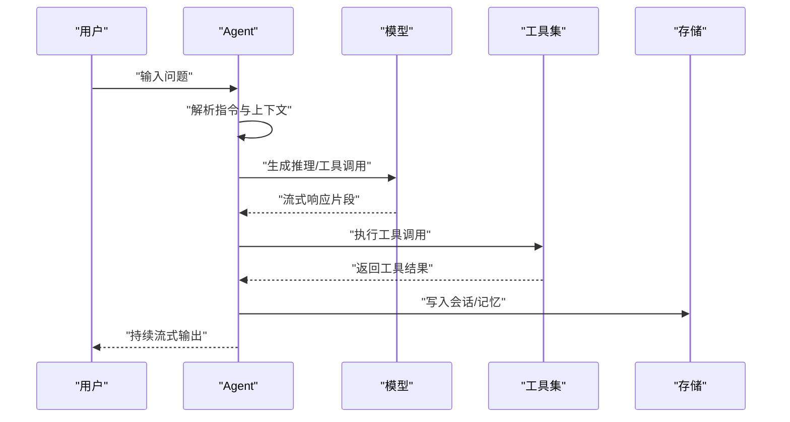
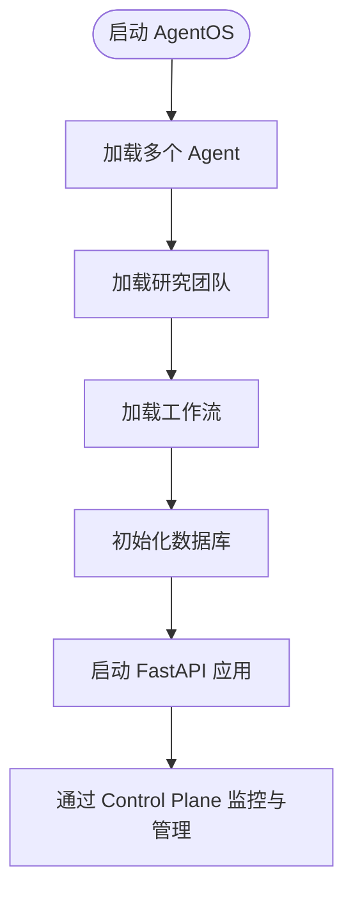
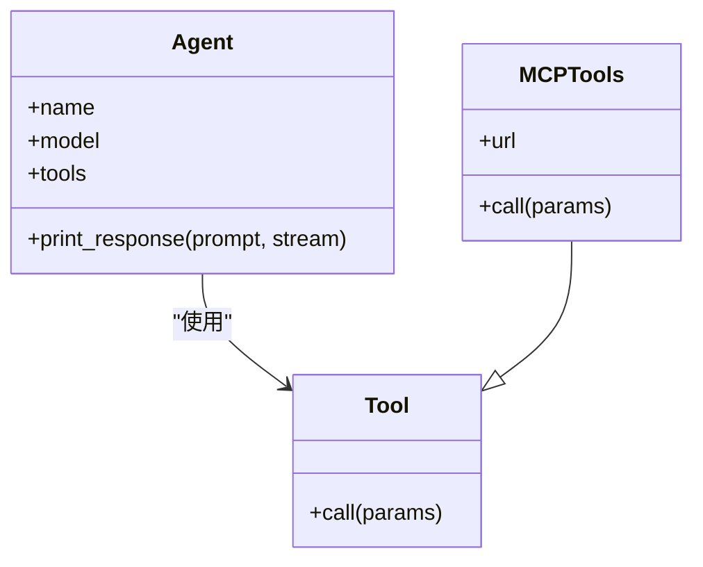
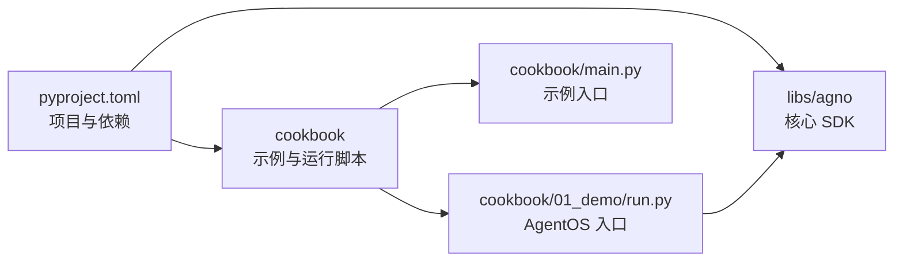

# 项目概述

<cite>
**本文引用的文件**
- [README.md](file://README.md)
- [cookbook/README.md](file://cookbook/README.md)
- [cookbook/main.py](file://cookbook/main.py)
- [pyproject.toml](file://pyproject.toml)
- [libs/agno_infra/README.md](file://libs/agno_infra/README.md)
- [cookbook/00_quickstart/agent_with_tools.py](file://cookbook/00_quickstart/agent_with_tools.py)
- [cookbook/01_demo/run.py](file://cookbook/01_demo/run.py)
- [cookbook/02_agents/01_quickstart/basic_agent.py](file://cookbook/02_agents/01_quickstart/basic_agent.py)
</cite>

## 目录
1. [引言](#引言)
2. [项目结构](#项目结构)
3. [核心组件](#核心组件)
4. [架构总览](#架构总览)
5. [详细组件分析](#详细组件分析)
6. [依赖关系分析](#依赖关系分析)
7. [性能考量](#性能考量)
8. [故障排查指南](#故障排查指南)
9. [结论](#结论)
10. [附录](#附录)

## 引言
Agno Learn 是一个面向“智能代理软件”的运行时平台，目标是帮助用户大规模地构建、运行与管理具备记忆、知识库、护栏与工具集成能力的 Agent、团队与工作流。它通过三层架构实现：框架（Framework）、运行时（Runtime）、控制平面（Control Plane），并提供无状态、会话作用域、流式响应与人机协作等关键技术优势，覆盖从个人 Agent 到复杂多 Agent 投资委员会等真实场景。

- 核心使命与愿景：将 Agent 的实时推理、工具调用与长期执行作为一等公民，提供可扩展、可观测、可审计的生产级运行时与控制平面。
- 关键优势：无状态设计、按用户/会话隔离、流式响应、人机协作、护栏与评估内嵌、原生链路追踪与审计。
- 应用场景：个人偏好学习 Agent、企业上下文 Agent、多 Agent 协会/委员会、自动化工作流与后台任务编排。

**章节来源**
- [README.md:11-178](file://README.md#L11-L178)

## 项目结构
本仓库采用多模块与示例 Cookbook 并行组织的方式：
- 顶层 README 提供总体定位、三层架构与快速开始。
- cookbook 目录包含数百个可直接运行的示例，涵盖 Agent、团队、工作流、存储、知识库、学习、评估、推理、内存、模型与工具等主题。
- libs/agno 为核心 SDK，提供 Agent、团队、工作流、数据库、知识库、学习、评估、推理、护栏、钩子、遥测、追踪等能力。
- libs/agno_infra 为基础设施管理框架，提供跨 AWS/Docker/本地的统一 CLI 与模板化部署能力。

**图示来源**
- [README.md:25-98](file://README.md#L25-L98)
- [cookbook/README.md:1-101](file://cookbook/README.md#L1-L101)
- [pyproject.toml:1-15](file://pyproject.toml#L1-L15)
- [libs/agno_infra/README.md:1-140](file://libs/agno_infra/README.md#L1-L140)

**章节来源**
- [README.md:25-98](file://README.md#L25-L98)
- [cookbook/README.md:1-101](file://cookbook/README.md#L1-L101)
- [pyproject.toml:1-15](file://pyproject.toml#L1-L15)
- [libs/agno_infra/README.md:1-140](file://libs/agno_infra/README.md#L1-L140)

## 核心组件
- 框架（Framework）：提供构建 Agent、团队与工作流的原子能力，包括记忆、知识库、护栏、100+ 集成与工具生态。
- 运行时（Runtime）：基于无状态、会话作用域的 FastAPI 后端，提供生产级 API 服务与流式响应。
- 控制平面（Control Plane）：通过 AgentOS UI 对 Agent 系统进行测试、监控与管理，支持本地连接与远程托管。

技术优势与特性：
- 无状态与水平扩展：运行时设计便于横向扩展与高可用部署。
- 会话作用域与隔离：按用户与会话隔离，保障数据与行为边界。
- 流式响应：实时输出推理、工具调用与结果，支持长时间运行与中断恢复。
- 人机协作：内置审批、确认与外部工具执行，支持人类输入与反馈。
- 护栏与评估：在执行过程中运行护栏，将评估纳入循环，确保安全与质量。
- 链路追踪与审计：原生追踪与完整审计日志，满足合规与运维需求。

**章节来源**
- [README.md:29-142](file://README.md#L29-L142)

## 架构总览
Agno 的三层架构贯穿从开发到生产的全生命周期：

**图示来源**
- [README.md:29-98](file://README.md#L29-L98)

## 详细组件分析

### 组件 A：Agent（个人智能体）
- 能力要点：指令驱动、工具集成、历史上下文、结构化输出、多模态、记忆与学习、护栏与钩子。
- 示例路径：[cookbook/02_agents/01_quickstart/basic_agent.py:1-26](file://cookbook/02_agents/01_quickstart/basic_agent.py#L1-L26)
- 运行方式：通过 print_response(stream=True) 实现流式输出；可结合模型与工具完成任务。

**图示来源**
- [cookbook/02_agents/01_quickstart/basic_agent.py:14-25](file://cookbook/02_agents/01_quickstart/basic_agent.py#L14-L25)

**章节来源**
- [cookbook/02_agents/01_quickstart/basic_agent.py:1-26](file://cookbook/02_agents/01_quickstart/basic_agent.py#L1-L26)

### 组件 B：团队（多 Agent 协作）
- 能力要点：异步/同步编排、共享记忆、分布式 RAG、推理模式、上下文压缩与学习。
- 示例路径：[cookbook/01_demo/run.py:1-38](file://cookbook/01_demo/run.py#L1-L38)

**图示来源**
- [cookbook/01_demo/run.py:23-37](file://cookbook/01_demo/run.py#L23-L37)

**章节来源**
- [cookbook/01_demo/run.py:1-38](file://cookbook/01_demo/run.py#L1-L38)

### 组件 C：工作流（流程编排）
- 能力要点：顺序执行、条件分支、循环执行、并行执行、CEL 表达式与人机协作。
- 示例路径：[cookbook/00_quickstart/sequential_workflow.py](file://cookbook/00_quickstart/sequential_workflow.py)

**章节来源**
- [cookbook/00_quickstart/sequential_workflow.py](file://cookbook/00_quickstart/sequential_workflow.py)

### 组件 D：工具与 MCP（外部能力扩展）
- 能力要点：Web 搜索、SQL、邮件、API、MCP、Discord、Slack、Docker 等 100+ 工具；支持自定义工具与事件钩子。
- 示例路径：[cookbook/00_quickstart/agent_with_tools.py:1-98](file://cookbook/00_quickstart/agent_with_tools.py#L1-L98)

**图示来源**
- [cookbook/00_quickstart/agent_with_tools.py:60-67](file://cookbook/00_quickstart/agent_with_tools.py#L60-L67)

**章节来源**
- [cookbook/00_quickstart/agent_with_tools.py:1-98](file://cookbook/00_quickstart/agent_with_tools.py#L1-L98)

### 组件 E：存储与知识库（持久化与检索）
- 能力要点：会话摘要、聊天历史、向量检索、分块策略、重排序、混合搜索、URL/GCS/S3/YouTube/PDF 等多源加载。
- 示例路径：[cookbook/06_storage/README.md](file://cookbook/06_storage/README.md)、[cookbook/07_knowledge/README.md](file://cookbook/07_knowledge/README.md)

**章节来源**
- [cookbook/06_storage/README.md](file://cookbook/06_storage/README.md)
- [cookbook/07_knowledge/README.md](file://cookbook/07_knowledge/README.md)

### 组件 F：基础设施与部署（Agno Infra）
- 能力要点：AWS/Docker/本地模板与 CLI；统一命令接口；资源管理与应用类型支持（FastAPI、Streamlit、Celery、Django 等）。
- 示例路径：[libs/agno_infra/README.md:1-140](file://libs/agno_infra/README.md#L1-L140)

**章节来源**
- [libs/agno_infra/README.md:1-140](file://libs/agno_infra/README.md#L1-L140)

## 依赖关系分析
- 顶层项目元信息与依赖：顶层 pyproject.toml 指定 agno 主包与工作区成员。
- 示例入口：cookbook/main.py 提供基础入口脚本。
- 运行时与控制平面：通过 AgentOS 将 Agent、团队与工作流打包为 FastAPI 应用并通过 UI 管理。

**图示来源**
- [pyproject.toml:1-15](file://pyproject.toml#L1-L15)
- [cookbook/main.py:1-7](file://cookbook/main.py#L1-L7)
- [cookbook/01_demo/run.py:1-38](file://cookbook/01_demo/run.py#L1-L38)

**章节来源**
- [pyproject.toml:1-15](file://pyproject.toml#L1-L15)
- [cookbook/main.py:1-7](file://cookbook/main.py#L1-L7)
- [cookbook/01_demo/run.py:1-38](file://cookbook/01_demo/run.py#L1-L38)

## 性能考量
- 无状态与水平扩展：运行时设计便于横向扩展与高可用部署，适合云原生环境。
- 会话作用域隔离：降低耦合并提升并发处理能力。
- 流式响应：减少端到端延迟，提升用户体验。
- 数据库与存储：建议根据负载选择合适的数据库与缓存方案，配合向量化检索优化查询性能。
- 链路追踪与审计：有助于定位性能瓶颈与异常路径。

[本节为通用指导，无需特定文件引用]

## 故障排查指南
- 快速开始与本地连接：参考顶层 README 的快速开始与 AgentOS UI 连接步骤，确认端点与凭据。
- 示例运行：使用 cookbook 中的示例脚本，检查模型提供商密钥与网络连通性。
- 日志与追踪：启用 tracing 以便定位问题；结合审计日志回放执行路径。
- 工具与 MCP：验证工具 URL 与权限，确保外部服务可达。

**章节来源**
- [README.md:35-98](file://README.md#L35-L98)
- [cookbook/01_demo/run.py:23-32](file://cookbook/01_demo/run.py#L23-L32)

## 结论
Agno Learn 以三层架构为核心，将智能体的推理、工具与长期执行能力系统化封装，提供从开发到生产的完整工具链。通过无状态运行时、会话作用域、流式响应与人机协作等特性，既能支撑个人 Agent 的快速迭代，也能承载复杂多 Agent 的企业级应用。结合丰富的 Cookbook 与基础设施框架，用户可以高效构建、部署与管理大规模 agentic 软件。

[本节为总结性内容，无需特定文件引用]

## 附录
- 快速开始与示例入口：[cookbook/00_quickstart/agent_with_tools.py:1-98](file://cookbook/00_quickstart/agent_with_tools.py#L1-L98)、[cookbook/01_demo/run.py:1-38](file://cookbook/01_demo/run.py#L1-L38)
- 技术栈概览（来自示例与文档）：模型提供商（40+）、数据库（Postgres/SQLite/Redis/MongoDB 等）、工具生态（Web 搜索、SQL、邮件、API、MCP、Slack/Discord、Docker 等）。
- 应用案例：个人偏好学习 Agent（Pal）、数据 Agent（Dash）、上下文 Agent（Scout）、编码 Agent（Gcode）、多 Agent 投资委员会。

**章节来源**
- [README.md:143-154](file://README.md#L143-L154)
- [cookbook/README.md:33-61](file://cookbook/README.md#L33-L61)