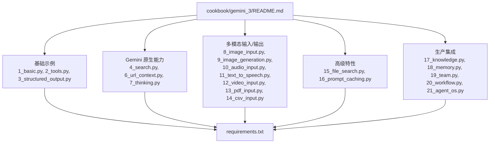
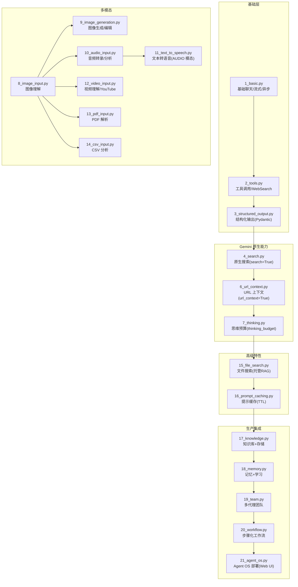
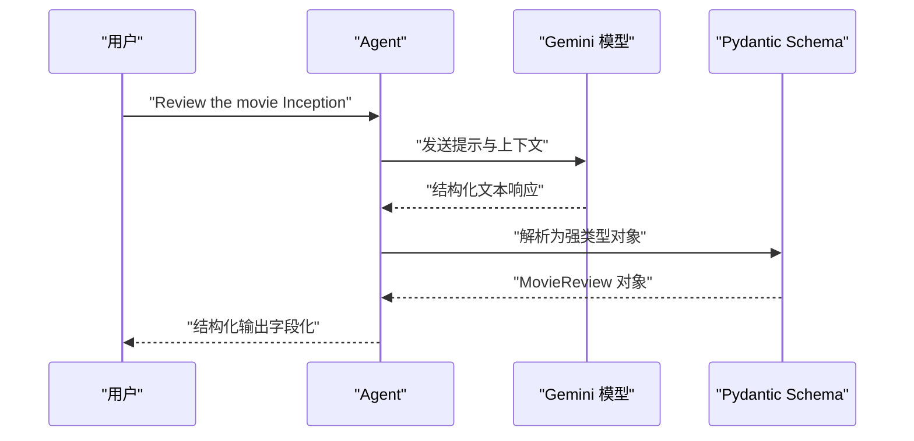
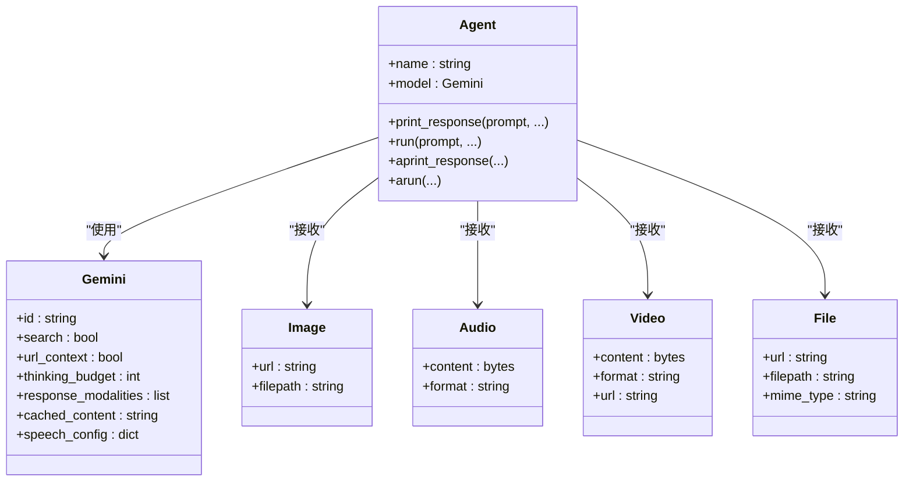
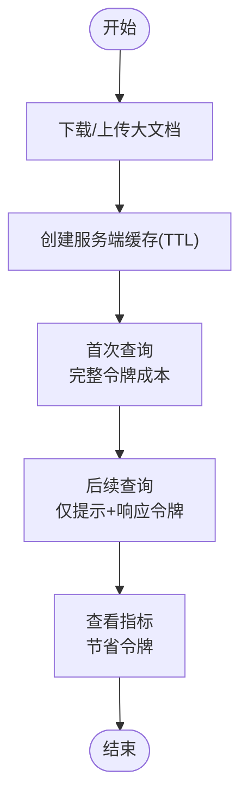

# Gemini 3 示例

<cite>
**本文引用的文件**
- [README.md](file://cookbook/gemini_3/README.md)
- [requirements.txt](file://cookbook/gemini_3/requirements.txt)
- [1_basic.py](file://cookbook/gemini_3/1_basic.py)
- [2_tools.py](file://cookbook/gemini_3/2_tools.py)
- [3_structured_output.py](file://cookbook/gemini_3/3_structured_output.py)
- [4_search.py](file://cookbook/gemini_3/4_search.py)
- [6_url_context.py](file://cookbook/gemini_3/6_url_context.py)
- [7_thinking.py](file://cookbook/gemini_3/7_thinking.py)
- [8_image_input.py](file://cookbook/gemini_3/8_image_input.py)
- [9_image_generation.py](file://cookbook/gemini_3/9_image_generation.py)
- [10_audio_input.py](file://cookbook/gemini_3/10_audio_input.py)
- [11_text_to_speech.py](file://cookbook/gemini_3/11_text_to_speech.py)
- [12_video_input.py](file://cookbook/gemini_3/12_video_input.py)
- [13_pdf_input.py](file://cookbook/gemini_3/13_pdf_input.py)
- [14_csv_input.py](file://cookbook/gemini_3/14_csv_input.py)
- [15_file_search.py](file://cookbook/gemini_3/15_file_search.py)
- [16_prompt_caching.py](file://cookbook/gemini_3/16_prompt_caching.py)
- [17_knowledge.py](file://cookbook/gemini_3/17_knowledge.py)
- [18_memory.py](file://cookbook/gemini_3/18_memory.py)
- [19_team.py](file://cookbook/gemini_3/19_team.py)
- [20_workflow.py](file://cookbook/gemini_3/20_workflow.py)
- [21_agent_os.py](file://cookbook/gemini_3/21_agent_os.py)
- [db.py](file://cookbook/gemini_3/db.py)
</cite>

## 目录
1. [简介](#简介)
2. [项目结构](#项目结构)
3. [核心组件](#核心组件)
4. [架构总览](#架构总览)
5. [详细组件分析](#详细组件分析)
6. [依赖分析](#依赖分析)
7. [性能考虑](#性能考虑)
8. [故障排除指南](#故障排除指南)
9. [结论](#结论)
10. [附录](#附录)

## 简介
本指南面向希望使用 Google Gemini 构建智能代理的开发者与产品团队，采用渐进式方法从基础聊天助手逐步扩展到工作流与多代理团队，并最终在 Agent OS 上进行部署。示例覆盖基础框架、工具调用、结构化输出、原生搜索、知识 grounding、URL 上下文获取、思维链推理、多模态处理（图像、音频、视频、PDF、CSV）、高级特性（文件搜索、提示缓存），以及生产环境集成（知识管理、记忆学习、团队协作、工作流编排、Agent OS 部署）。每个示例均独立可运行，包含注释与示例提示，帮助理解背后机制。

## 项目结构
Gemini 3 示例位于 cookbook/gemini_3 目录，包含多个独立脚本，按主题分组，便于循序渐进学习与实验。顶层 README 提供了快速路径、运行清单与故障排除要点；requirements.txt 定义了运行示例所需的依赖。

图表来源
- [README.md:1-135](file://cookbook/gemini_3/README.md#L1-L135)
- [requirements.txt:1-8](file://cookbook/gemini_3/requirements.txt#L1-L8)

章节来源
- [README.md:1-135](file://cookbook/gemini_3/README.md#L1-L135)
- [requirements.txt:1-8](file://cookbook/gemini_3/requirements.txt#L1-L8)

## 核心组件
- Agent：Agno 的核心实体，封装模型与指令，支持同步/异步、流式输出与多种执行模式。
- Model（Gemini）：Google Gemini 模型适配器，支持搜索、URL 上下文、思考预算、响应模态、缓存等特性。
- Media：统一的媒体输入抽象，支持 Image、Audio、Video、File 等类型。
- Tools：工具集，如 WebSearchTools 等，用于扩展代理的外部能力。
- RunOutput：标准化的响应对象，包含文本、图片、音频、结构化数据与引用元数据。

章节来源
- [1_basic.py:1-84](file://cookbook/gemini_3/1_basic.py#L1-L84)
- [2_tools.py:1-92](file://cookbook/gemini_3/2_tools.py#L1-L92)
- [3_structured_output.py:1-94](file://cookbook/gemini_3/3_structured_output.py#L1-L94)
- [4_search.py:1-84](file://cookbook/gemini_3/4_search.py#L1-L84)
- [6_url_context.py:1-81](file://cookbook/gemini_3/6_url_context.py#L1-L81)
- [7_thinking.py:1-74](file://cookbook/gemini_3/7_thinking.py#L1-L74)
- [8_image_input.py:1-92](file://cookbook/gemini_3/8_image_input.py#L1-L92)
- [9_image_generation.py:1-116](file://cookbook/gemini_3/9_image_generation.py#L1-L116)
- [10_audio_input.py:1-86](file://cookbook/gemini_3/10_audio_input.py#L1-L86)
- [11_text_to_speech.py:1-82](file://cookbook/gemini_3/11_text_to_speech.py#L1-L82)
- [12_video_input.py:1-97](file://cookbook/gemini_3/12_video_input.py#L1-L97)
- [13_pdf_input.py:1-93](file://cookbook/gemini_3/13_pdf_input.py#L1-L93)
- [14_csv_input.py:1-104](file://cookbook/gemini_3/14_csv_input.py#L1-L104)
- [15_file_search.py:1-124](file://cookbook/gemini_3/15_file_search.py#L1-L124)
- [16_prompt_caching.py:1-127](file://cookbook/gemini_3/16_prompt_caching.py#L1-L127)

## 架构总览
下图展示了从基础代理到多模态、原生能力、高级特性与生产集成的整体演进路径，以及各示例之间的关系与依赖。

图表来源
- [README.md:28-75](file://cookbook/gemini_3/README.md#L28-L75)
- [1_basic.py:1-84](file://cookbook/gemini_3/1_basic.py#L1-L84)
- [2_tools.py:1-92](file://cookbook/gemini_3/2_tools.py#L1-L92)
- [3_structured_output.py:1-94](file://cookbook/gemini_3/3_structured_output.py#L1-L94)
- [4_search.py:1-84](file://cookbook/gemini_3/4_search.py#L1-L84)
- [6_url_context.py:1-81](file://cookbook/gemini_3/6_url_context.py#L1-L81)
- [7_thinking.py:1-74](file://cookbook/gemini_3/7_thinking.py#L1-L74)
- [8_image_input.py:1-92](file://cookbook/gemini_3/8_image_input.py#L1-L92)
- [9_image_generation.py:1-116](file://cookbook/gemini_3/9_image_generation.py#L1-L116)
- [10_audio_input.py:1-86](file://cookbook/gemini_3/10_audio_input.py#L1-L86)
- [11_text_to_speech.py:1-82](file://cookbook/gemini_3/11_text_to_speech.py#L1-L82)
- [12_video_input.py:1-97](file://cookbook/gemini_3/12_video_input.py#L1-L97)
- [13_pdf_input.py:1-93](file://cookbook/gemini_3/13_pdf_input.py#L1-L93)
- [14_csv_input.py:1-104](file://cookbook/gemini_3/14_csv_input.py#L1-L104)
- [15_file_search.py:1-124](file://cookbook/gemini_3/15_file_search.py#L1-L124)
- [16_prompt_caching.py:1-127](file://cookbook/gemini_3/16_prompt_caching.py#L1-L127)
- [17_knowledge.py](file://cookbook/gemini_3/17_knowledge.py)
- [18_memory.py](file://cookbook/gemini_3/18_memory.py)
- [19_team.py](file://cookbook/gemini_3/19_team.py)
- [20_workflow.py](file://cookbook/gemini_3/20_workflow.py)
- [21_agent_os.py](file://cookbook/gemini_3/21_agent_os.py)

## 详细组件分析

### 基础聊天与执行模式（1_basic.py）
- 功能概述：展示 Agent 的基本用法，包括同步、异步、流式输出与 Markdown 渲染。
- 关键特性：
  - 模型初始化：Gemini(id="gemini-3-flash-preview")
  - 执行模式：print_response、run、aprint_response、arun 及其流式变体
  - 交互方式：支持同步阻塞、异步非阻塞、边生成边打印
- 运行指南：设置 GOOGLE_API_KEY 后直接运行脚本，尝试示例提示。

章节来源
- [1_basic.py:1-84](file://cookbook/gemini_3/1_basic.py#L1-L84)

### 工具调用与系统提示（2_tools.py）
- 功能概述：通过 WebSearchTools 获取实时信息，结合系统提示控制行为。
- 关键特性：
  - 工具注入：tools=[WebSearchTools()]
  - 系统提示：instructions 定义工作流与规则
  - 时间上下文：add_datetime_to_context 注入当前日期时间
- 运行指南：确保网络可达，运行后观察搜索结果与引用。

章节来源
- [2_tools.py:1-92](file://cookbook/gemini_3/2_tools.py#L1-L92)

### 结构化输出与类型安全（3_structured_output.py）
- 功能概述：使用 Pydantic 输出模式强制返回结构化数据，避免自由文本解析。
- 关键特性：
  - 输出模式：output_schema=MovieReview
  - 类型约束：字段范围校验（如评分 0-10）
  - 结果访问：run().content 返回强类型对象
- 运行指南：运行后可直接访问字段，便于 UI 渲染、数据库入库与比较分析。

章节来源
- [3_structured_output.py:1-94](file://cookbook/gemini_3/3_structured_output.py#L1-L94)

### 原生搜索（4_search.py）
- 功能概述：启用模型内置搜索能力，无需额外工具即可获取实时信息。
- 关键特性：
  - 搜索开关：model=Gemini(..., search=True)
  - 无缝性：模型自动决定何时搜索
  - 适用场景：快速获取时效信息
- 运行指南：对比工具搜索与原生搜索的差异。

章节来源
- [4_search.py:1-84](file://cookbook/gemini_3/4_search.py#L1-L84)

### URL 上下文获取（6_url_context.py）
- 功能概述：模型直接抓取并阅读网页内容，适合跨页对比与结构化提取。
- 关键特性：
  - URL 上下文：model=Gemini(..., url_context=True)
  - 实时抓取：请求时读取页面，不缓存
  - 适用模型：Pro 模型效果更佳
- 运行指南：传入两个不同 URL 进行对比分析。

章节来源
- [6_url_context.py:1-81](file://cookbook/gemini_3/6_url_context.py#L1-L81)

### 思维链推理与预算控制（7_thinking.py）
- 功能概述：通过思考预算与链式思维提升复杂任务的推理质量。
- 关键特性：
  - 思考预算：thinking_budget 控制内部推理开销
  - 展示思考：include_thoughts 将模型推理过程纳入响应
  - 模型选择：Pro 模型更适合深度思考
- 运行指南：尝试逻辑谜题或需要多步推导的任务。

章节来源
- [7_thinking.py:1-74](file://cookbook/gemini_3/7_thinking.py#L1-L74)

### 多模态输入（图像、音频、视频、PDF、CSV）
- 图像理解（8_image_input.py）
  - 支持从 URL 或本地文件传入图像
  - 可结合搜索获取图像相关内容
- 图像生成与编辑（9_image_generation.py）
  - response_modalities=["Text","Image"] 同时输出文本与图像
  - 支持对已有图像进行修改
- 音频理解（10_audio_input.py）
  - 支持多种格式（MP3、WAV、FLAC、OGG 等）
  - 内置转录与摘要能力
- 文本转语音（11_text_to_speech.py）
  - response_modalities=["AUDIO"] 输出音频
  - 支持预置声音配置
- 视频理解（12_video_input.py）
  - 支持本地视频与 YouTube URL
  - 联合视觉与音频分析
- PDF 解析（13_pdf_input.py）
  - 原生解析 PDF，保留版式与表格
- CSV 分析（14_csv_input.py）
  - 直接分析数据集，生成统计与趋势

章节来源
- [8_image_input.py:1-92](file://cookbook/gemini_3/8_image_input.py#L1-L92)
- [9_image_generation.py:1-116](file://cookbook/gemini_3/9_image_generation.py#L1-L116)
- [10_audio_input.py:1-86](file://cookbook/gemini_3/10_audio_input.py#L1-L86)
- [11_text_to_speech.py:1-82](file://cookbook/gemini_3/11_text_to_speech.py#L1-L82)
- [12_video_input.py:1-97](file://cookbook/gemini_3/12_video_input.py#L1-L97)
- [13_pdf_input.py:1-93](file://cookbook/gemini_3/13_pdf_input.py#L1-L93)
- [14_csv_input.py:1-104](file://cookbook/gemini_3/14_csv_input.py#L1-L104)

### 高级特性（文件搜索与提示缓存）
- 文件搜索（15_file_search.py）
  - 创建托管文件搜索存储
  - 上传文档并自动分块索引
  - 查询时自动带引用（citations）
- 提示缓存（16_prompt_caching.py）
  - 服务端缓存大文档，降低重复查询成本
  - TTL 控制缓存有效期
  - 显著节省高频问答的输入令牌成本

章节来源
- [15_file_search.py:1-124](file://cookbook/gemini_3/15_file_search.py#L1-L124)
- [16_prompt_caching.py:1-127](file://cookbook/gemini_3/16_prompt_caching.py#L1-L127)

### 生产集成（知识、记忆、团队、工作流、Agent OS）
- 知识库与存储（17_knowledge.py）
  - 使用 ChromaDb 与 SQLite 存储构建本地 RAG
  - 支持混合检索与引用
- 记忆与学习（18_memory.py）
  - 结合 LearningMachine 与代理记忆，持续改进
- 多代理团队（19_team.py）
  - 团队成员角色化（写手、编辑、事实核查）
  - 协作完成内容生产流水线
- 步骤化工作流（20_workflow.py）
  - 并行、条件分支与循环的可预测多步流程
- Agent OS 部署（21_agent_os.py）
  - Web UI、追踪与端点注册，便于团队协作与运维

章节来源
- [17_knowledge.py](file://cookbook/gemini_3/17_knowledge.py)
- [18_memory.py](file://cookbook/gemini_3/18_memory.py)
- [19_team.py](file://cookbook/gemini_3/19_team.py)
- [20_workflow.py](file://cookbook/gemini_3/20_workflow.py)
- [21_agent_os.py](file://cookbook/gemini_3/21_agent_os.py)
- [db.py](file://cookbook/gemini_3/db.py)

## 依赖分析
- 运行时依赖：agno[google]、duckduckgo-search、chromadb、httpx、pydantic、Pillow、requests
- 作用概览：
  - agno[google]：Google 模型适配与工具生态
  - duckduckgo-search：WebSearchTools 的无密搜索
  - chromadb：本地向量存储（知识库）
  - httpx：下载示例媒体资源
  - pydantic：结构化输出类型定义
  - Pillow：图像生成/编辑保存
  - requests：大文档下载与缓存示例

章节来源
- [requirements.txt:1-8](file://cookbook/gemini_3/requirements.txt#L1-L8)

## 性能考虑
- 模型选择策略
  - Gemini 3 Flash：速度快、成本低，适合工具调用、基础对话、多模态输入与缓存场景
  - Gemini 3.1 Pro：更强的推理与理解能力，适合复杂思维、URL 上下文、结构化输出与 TTS
- 思维预算与延迟权衡
  - thinking_budget 越高，推理越深但延迟与成本越高
  - 对简单问答禁用思考可显著降低延迟
- 缓存与令牌节省
  - 提示缓存对大文档高频查询有明显成本优势
  - TTL 设置需结合使用场景（开发/交互/批处理）
- 多模态输入的成本
  - 图像/音频/视频/PDF/CSV 输入会增加令牌消耗，建议仅在必要时附加
- 异步执行
  - 生产应用推荐使用异步模式以提升吞吐与资源利用率

## 故障排除指南
- 环境变量未设置
  - 症状：报错提示未设置 GOOGLE_API_KEY
  - 处理：export GOOGLE_API_KEY=your-key
- 依赖缺失
  - 症状：ModuleNotFoundError
  - 处理：uv pip install -r cookbook/gemini_3/requirements.txt
- 速率限制
  - 症状：429 Rate limit exceeded
  - 处理：等待或更换模型 ID
- 模型不存在
  - 症状：Model not found
  - 处理：检查模型 ID 拼写，使用 gemini-3-flash-preview 或 gemini-3.1-pro-preview
- 缓存/上传问题
  - 症状：文件处理中止或缓存创建失败
  - 处理：确认网络连通与权限，重试或调整 TTL

章节来源
- [README.md:121-129](file://cookbook/gemini_3/README.md#L121-L129)

## 结论
通过 Gemini 3 示例，您可以从最简单的聊天助手开始，逐步掌握工具调用、结构化输出、原生搜索、URL 上下文、思维链推理与多模态处理，并进一步探索文件搜索、提示缓存等高级特性，最终实现知识管理、记忆学习、团队协作、工作流编排与 Agent OS 部署。建议根据任务复杂度与成本目标选择合适的模型与参数，并在生产环境中采用异步执行与缓存策略以获得更好的性能与体验。

## 附录

### 快速运行清单
- 克隆仓库并创建虚拟环境
- 安装依赖
- 设置 GOOGLE_API_KEY
- 运行单个示例脚本或按章节顺序执行

章节来源
- [README.md:11-26](file://cookbook/gemini_3/README.md#L11-L26)

### 模型选择策略
- 工具调用与基础对话：Gemini 3 Flash
- 推理与理解：Gemini 3.1 Pro
- TTS 与图像生成：专用模型（见对应示例）

章节来源
- [README.md:7-7](file://cookbook/gemini_3/README.md#L7-L7)
- [4_search.py:37-44](file://cookbook/gemini_3/4_search.py#L37-L44)
- [6_url_context.py:39-45](file://cookbook/gemini_3/6_url_context.py#L39-L45)
- [7_thinking.py:24-34](file://cookbook/gemini_3/7_thinking.py#L24-L34)
- [9_image_generation.py:31-38](file://cookbook/gemini_3/9_image_generation.py#L31-L38)
- [11_text_to_speech.py:32-42](file://cookbook/gemini_3/11_text_to_speech.py#L32-L42)

### 代码级序列图：结构化输出工作流

图表来源
- [3_structured_output.py:41-66](file://cookbook/gemini_3/3_structured_output.py#L41-L66)

### 代码级类图：多模态输入与输出

图表来源
- [8_image_input.py:40-46](file://cookbook/gemini_3/8_image_input.py#L40-L46)
- [9_image_generation.py:31-38](file://cookbook/gemini_3/9_image_generation.py#L31-L38)
- [10_audio_input.py:39-44](file://cookbook/gemini_3/10_audio_input.py#L39-L44)
- [11_text_to_speech.py:32-42](file://cookbook/gemini_3/11_text_to_speech.py#L32-L42)
- [12_video_input.py:42-47](file://cookbook/gemini_3/12_video_input.py#L42-L47)
- [13_pdf_input.py:39-44](file://cookbook/gemini_3/13_pdf_input.py#L39-L44)
- [14_csv_input.py:46-51](file://cookbook/gemini_3/14_csv_input.py#L46-L51)

### 代码级流程图：提示缓存经济性

图表来源
- [16_prompt_caching.py:70-103](file://cookbook/gemini_3/16_prompt_caching.py#L70-L103)