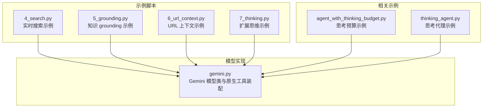
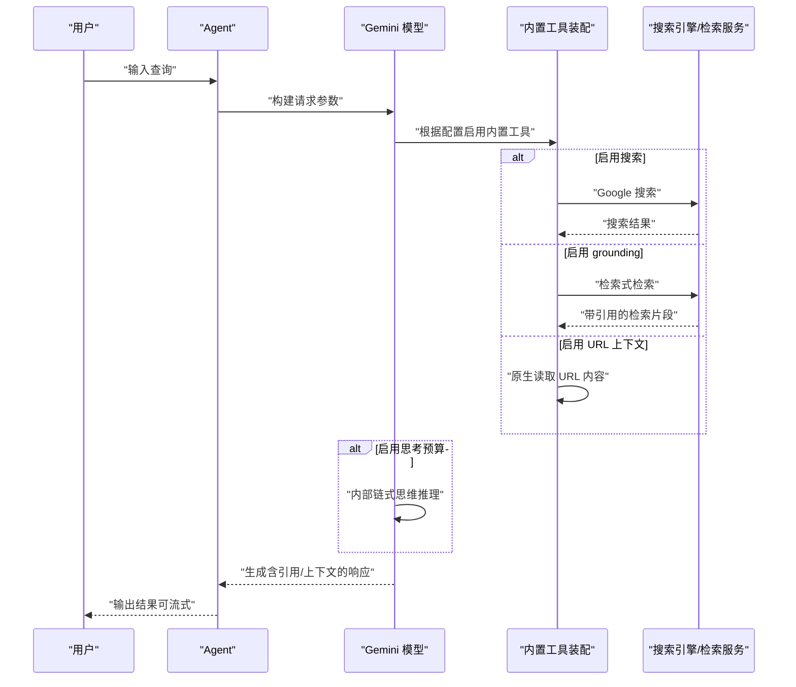
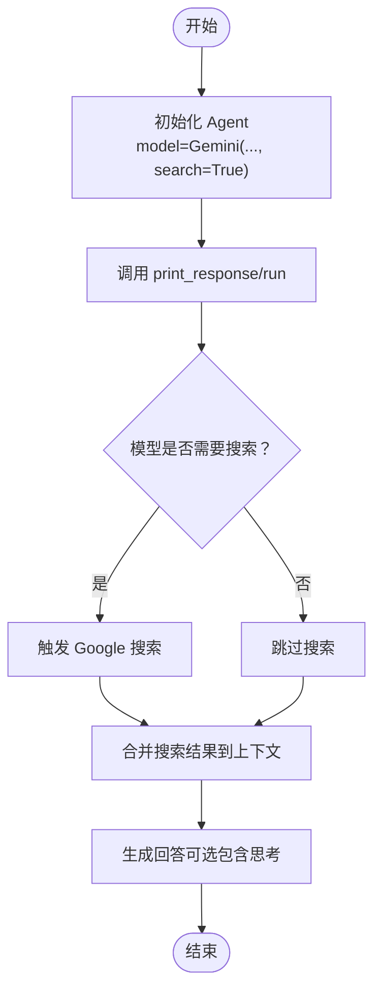
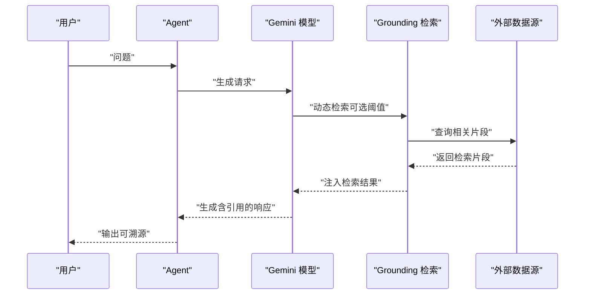
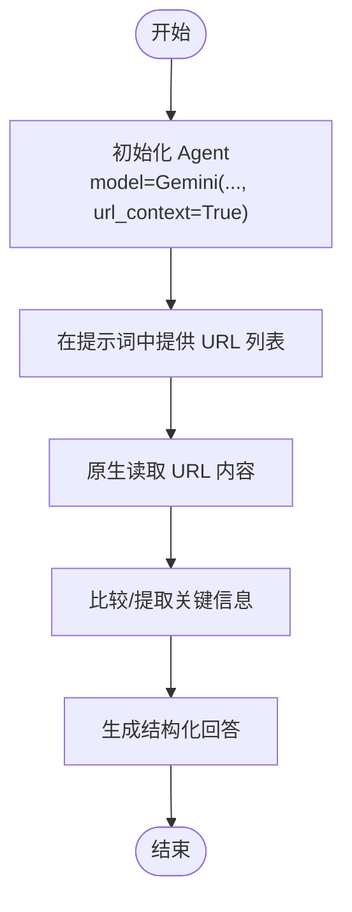
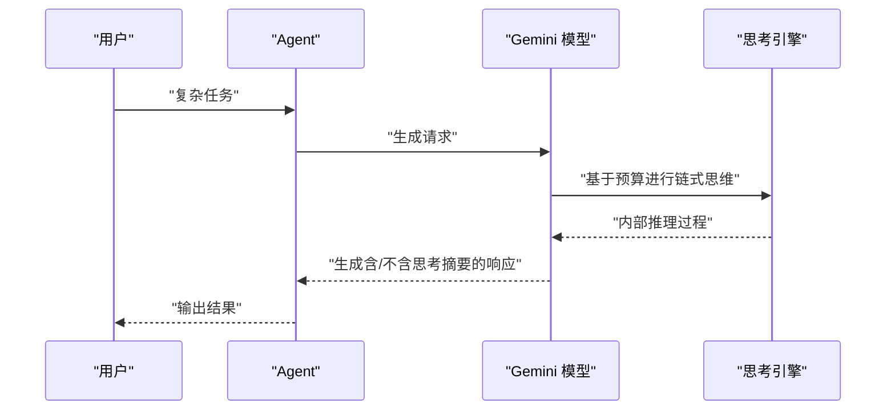
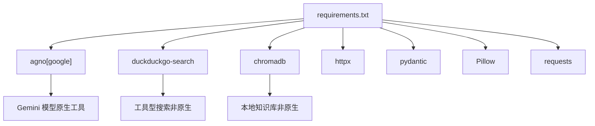

# Gemini 原生特性

<cite>
**本文档引用的文件**
- [4_search.py](file://cookbook/gemini_3/4_search.py)
- [5_grounding.py](file://cookbook/90_models/google/gemini/grounding.py)
- [6_url_context.py](file://cookbook/gemini_3/6_url_context.py)
- [7_thinking.py](file://cookbook/gemini_3/7_thinking.py)
- [gemini.py](file://libs/agno/agno/models/google/gemini.py)
- [README.md](file://cookbook/gemini_3/README.md)
- [requirements.txt](file://cookbook/gemini_3/requirements.txt)
- [agent_with_thinking_budget.py](file://cookbook/90_models/google/gemini/agent_with_thinking_budget.py)
- [thinking_agent.py](file://cookbook/90_models/google/gemini/thinking_agent.py)
</cite>

## 目录
1. [简介](#简介)
2. [项目结构](#项目结构)
3. [核心组件](#核心组件)
4. [架构总览](#架构总览)
5. [详细组件分析](#详细组件分析)
6. [依赖分析](#依赖分析)
7. [性能考量](#性能考量)
8. [故障排查指南](#故障排查指南)
9. [结论](#结论)
10. [附录](#附录)

## 简介
本章节系统性介绍 Google Gemini 的四项原生特性：实时搜索、知识 grounding、URL 上下文获取与扩展思维能力。这些能力由 Gemini 模型直接提供，无需额外安装外部工具包，即可在智能体中无缝启用，显著提升信息获取、事实核查与复杂推理的能力。

- 实时搜索（4_search.py）：通过在模型上设置 search=True，启用原生 Google 搜索，自动检索最新信息，适合快速获取时效性强的内容。
- 知识 grounding（5_grounding.py）：为响应提供可验证的引用来源，便于事实核查与溯源，适合对准确性要求高的场景。
- URL 上下文获取（6_url_context.py）：原生读取并比较网页内容，无需额外抓取工具，适合跨页面对比与结构化提取。
- 扩展思维能力（7_thinking.py）：基于预算的链式思维与推理，支持动态或固定预算，适合复杂逻辑、数学与多步规划任务。

## 项目结构
本节聚焦与 Gemini 原生特性相关的示例与实现文件，并给出高层组织关系图。

**图表来源**
- [4_search.py:1-84](file://cookbook/gemini_3/4_search.py#L1-L84)
- [5_grounding.py:1-39](file://cookbook/90_models/google/gemini/grounding.py#L1-L39)
- [6_url_context.py:1-81](file://cookbook/gemini_3/6_url_context.py#L1-L81)
- [7_thinking.py:1-74](file://cookbook/gemini_3/7_thinking.py#L1-L74)
- [gemini.py:280-361](file://libs/agno/agno/models/google/gemini.py#L280-L361)

**章节来源**
- [README.md:38-46](file://cookbook/gemini_3/README.md#L38-L46)
- [requirements.txt:1-8](file://cookbook/gemini_3/requirements.txt#L1-L8)

## 核心组件
本节概述四个原生特性在代码中的关键实现点与配置项，帮助快速定位到具体实现文件与参数。

- 实时搜索（search=True）
  - 在模型初始化时设置 search=True，启用原生 Google 搜索。
  - 示例路径：[4_search.py:37-44](file://cookbook/gemini_3/4_search.py#L37-L44)
  - 模型装配逻辑：[gemini.py:311-313](file://libs/agno/agno/models/google/gemini.py#L311-L313)

- 知识 grounding（grounding=True）
  - 在模型初始化时设置 grounding=True，启用检索式 grounding。
  - 示例路径：[5_grounding.py:17-24](file://cookbook/90_models/google/gemini/grounding.py#L17-L24)
  - 模型装配逻辑：[gemini.py:297-309](file://libs/agno/agno/models/google/gemini.py#L297-L309)

- URL 上下文获取（url_context=True）
  - 在模型初始化时设置 url_context=True，原生读取 URL 内容。
  - 示例路径：[6_url_context.py:39-45](file://cookbook/gemini_3/6_url_context.py#L39-L45)
  - 模型装配逻辑：[gemini.py:315-317](file://libs/agno/agno/models/google/gemini.py#L315-L317)

- 扩展思维能力（thinking_budget/include_thoughts）
  - 配置 thinking_budget 控制内部推理预算，include_thoughts 决定是否在响应中包含模型的思考摘要。
  - 示例路径：[7_thinking.py:24-34](file://cookbook/gemini_3/7_thinking.py#L24-L34)
  - 思考配置装配：[gemini.py:283-292](file://libs/agno/agno/models/google/gemini.py#L283-L292)

**章节来源**
- [4_search.py:37-44](file://cookbook/gemini_3/4_search.py#L37-L44)
- [5_grounding.py:17-24](file://cookbook/90_models/google/gemini/grounding.py#L17-L24)
- [6_url_context.py:39-45](file://cookbook/gemini_3/6_url_context.py#L39-L45)
- [7_thinking.py:24-34](file://cookbook/gemini_3/7_thinking.py#L24-L34)
- [gemini.py:283-317](file://libs/agno/agno/models/google/gemini.py#L283-L317)

## 架构总览
下图展示了 Gemini 原生特性在智能体调用链中的位置与交互关系。

**图表来源**
- [gemini.py:294-336](file://libs/agno/agno/models/google/gemini.py#L294-L336)
- [4_search.py:37-44](file://cookbook/gemini_3/4_search.py#L37-L44)
- [5_grounding.py:17-24](file://cookbook/90_models/google/gemini/grounding.py#L17-L24)
- [6_url_context.py:39-45](file://cookbook/gemini_3/6_url_context.py#L39-L45)
- [7_thinking.py:24-34](file://cookbook/gemini_3/7_thinking.py#L24-L34)

## 详细组件分析

### 实时搜索（search=True）
- 技术实现
  - 在模型初始化时设置 search=True，框架会自动将 GoogleSearch 工具注入到工具数组中，使模型在对话过程中按需触发搜索。
  - 关键实现位置：[gemini.py:311-313](file://libs/agno/agno/models/google/gemini.py#L311-L313)
- 配置选项
  - search=True：启用原生 Google 搜索。
  - 模型选择：示例中使用 gemini-3-flash-preview，适合快速获取最新信息。
- 使用场景
  - 快速了解时事新闻、股票市场动态、技术趋势等需要实时信息的任务。
- 性能与成本
  - 无需额外工具包，调用更简洁；但搜索触发时机由模型决定，可控性较弱。
- API 调用方法
  - 创建 Agent 并传入 model=Gemini(..., search=True)，随后调用 print_response 或 run 即可。
- 实际应用案例
  - 新闻摘要、热点追踪、市场观察等。

**图表来源**
- [gemini.py:311-313](file://libs/agno/agno/models/google/gemini.py#L311-L313)
- [4_search.py:37-44](file://cookbook/gemini_3/4_search.py#L37-L44)

**章节来源**
- [4_search.py:1-84](file://cookbook/gemini_3/4_search.py#L1-L84)
- [gemini.py:311-313](file://libs/agno/agno/models/google/gemini.py#L311-L313)

### 知识 grounding（grounding=True）
- 技术实现
  - 设置 grounding=True 后，框架注入 GoogleSearchRetrieval 工具，结合动态阈值进行检索式检索，为响应提供可验证的引用来源。
  - 关键实现位置：[gemini.py:297-309](file://libs/agno/agno/models/google/gemini.py#L297-L309)
- 配置选项
  - grounding=True：启用检索式 grounding。
  - grounding_dynamic_threshold：可选，控制检索触发的动态阈值。
- 使用场景
  - 对事实准确性要求高、需要可追溯来源的问答与分析任务。
- 性能与成本
  - 引用生成增加一定延迟与成本，但显著提升可信度。
- API 调用方法
  - 创建 Agent 并传入 model=Gemini(..., grounding=True, ...)，随后调用 print_response 即可。
- 实际应用案例
  - 科研综述、合规审查、事实核查等。

**图表来源**
- [gemini.py:297-309](file://libs/agno/agno/models/google/gemini.py#L297-L309)
- [5_grounding.py:17-24](file://cookbook/90_models/google/gemini/grounding.py#L17-L24)

**章节来源**
- [5_grounding.py:1-39](file://cookbook/90_models/google/gemini/grounding.py#L1-L39)
- [gemini.py:297-309](file://libs/agno/agno/models/google/gemini.py#L297-L309)

### URL 上下文获取（url_context=True）
- 技术实现
  - 设置 url_context=True 后，框架注入 UrlContext 工具，允许模型直接读取并比较网页内容，无需额外抓取工具。
  - 关键实现位置：[gemini.py:315-317](file://libs/agno/agno/models/google/gemini.py#L315-L317)
- 配置选项
  - url_context=True：启用原生 URL 内容读取。
  - 模型建议：示例使用 gemini-3.1-pro-preview，Pro 模型在处理长文本与复杂比较时表现更佳。
- 使用场景
  - 跨页面对比、长文摘要、结构化数据抽取、多来源研究等。
- 性能与成本
  - 每次请求实时抓取页面，不缓存；适合短时间内的多次请求，但需注意网络与成本开销。
- API 调用方法
  - 创建 Agent 并传入 model=Gemini(..., url_context=True)，随后在提示词中提供 URL 即可。
- 实际应用案例
  - 商品对比、文章对比、政策条款解析等。

**图表来源**
- [gemini.py:315-317](file://libs/agno/agno/models/google/gemini.py#L315-L317)
- [6_url_context.py:39-45](file://cookbook/gemini_3/6_url_context.py#L39-L45)

**章节来源**
- [6_url_context.py:1-81](file://cookbook/gemini_3/6_url_context.py#L1-L81)
- [gemini.py:315-317](file://libs/agno/agno/models/google/gemini.py#L315-L317)

### 扩展思维能力（thinking_budget/include_thoughts）
- 技术实现
  - 通过 thinking_budget 控制模型内部“思考”的预算（0=禁用，-1=动态），include_thoughts 决定是否在最终响应中包含模型的思考摘要。
  - 关键实现位置：[gemini.py:283-292](file://libs/agno/agno/models/google/gemini.py#L283-L292)
- 配置选项
  - thinking_budget：推理预算（整数或 -1），用于控制链式思维深度。
  - include_thoughts：是否在响应中包含思考摘要。
  - 模型建议：示例使用 gemini-3.1-pro-preview，Pro 模型在复杂推理任务上效果更佳。
- 使用场景
  - 数学与逻辑谜题、代码生成（含边界情况）、多步骤规划、需要链式思维的分析任务。
- 性能与成本
  - 更深的思考会增加延迟与成本；对于简单问答可能得不偿失。
- API 调用方法
  - 创建 Agent 并传入 model=Gemini(..., thinking_budget=..., include_thoughts=True)，随后调用 print_response 即可。
- 实际应用案例
  - 复杂算法设计、策略规划、深度分析等。

**图表来源**
- [gemini.py:283-292](file://libs/agno/agno/models/google/gemini.py#L283-L292)
- [7_thinking.py:24-34](file://cookbook/gemini_3/7_thinking.py#L24-L34)

**章节来源**
- [7_thinking.py:1-74](file://cookbook/gemini_3/7_thinking.py#L1-L74)
- [gemini.py:283-292](file://libs/agno/agno/models/google/gemini.py#L283-L292)
- [agent_with_thinking_budget.py:1-37](file://cookbook/90_models/google/gemini/agent_with_thinking_budget.py#L1-L37)
- [thinking_agent.py:1-40](file://cookbook/90_models/google/gemini/thinking_agent.py#L1-L40)

## 依赖分析
- 运行环境与依赖
  - 示例脚本所在目录的依赖清单：[requirements.txt:1-8](file://cookbook/gemini_3/requirements.txt#L1-L8)
  - 主要依赖包括 agno[google]、duckduckgo-search、chromadb、httpx、pydantic、Pillow、requests 等。
- 原生特性与外部依赖的关系
  - 四项原生特性均通过模型参数启用，无需额外安装第三方搜索或抓取工具包。
  - 若使用工具型搜索（如 WebSearchTools），则需要相应工具包；而原生搜索无需额外依赖。

**图表来源**
- [requirements.txt:1-8](file://cookbook/gemini_3/requirements.txt#L1-L8)

**章节来源**
- [requirements.txt:1-8](file://cookbook/gemini_3/requirements.txt#L1-L8)

## 性能考量
- 实时搜索
  - 优点：无缝集成，无需额外工具；适合快速获取最新信息。
  - 缺点：搜索触发时机由模型决定，可控性较弱。
- 知识 grounding
  - 优点：响应可溯源，适合高可信度场景。
  - 缺点：检索与引用生成带来额外延迟与成本。
- URL 上下文获取
  - 优点：原生读取，无需额外抓取工具；适合跨页面对比与抽取。
  - 缺点：每次请求实时抓取，不缓存；网络与成本开销需关注。
- 扩展思维能力
  - 优点：对复杂推理与多步任务有显著增益。
  - 缺点：更高的延迟与成本；对简单任务可能不必要。

## 故障排查指南
- 环境变量
  - 未设置 GOOGLE_API_KEY：请先设置 GOOGLE_API_KEY。
- 依赖缺失
  - ModuleNotFoundError：请运行 cookbook/gemini_3/requirements.txt 中的安装命令。
- 模型不可用
  - Model not found：检查模型 ID 拼写，推荐使用 gemini-3-flash-preview 或 gemini-3.1-pro-preview。
- 请求频率过高
  - 429 Rate limit exceeded：等待一分钟或更换模型 ID。

**章节来源**
- [README.md:121-129](file://cookbook/gemini_3/README.md#L121-L129)

## 结论
Gemini 的四项原生特性为智能体提供了强大的信息获取、事实核查与复杂推理能力。通过在模型上设置相应的布尔参数或预算配置，即可在不引入额外工具包的前提下，显著提升应用的实时性、可验证性与推理深度。在实际应用中，应根据任务类型与性能预算选择合适的特性组合，以达到最佳的成本与效果平衡。

## 附录
- 运行示例
  - 实时搜索：python cookbook/gemini_3/4_search.py
  - 知识 grounding：python cookbook/90_models/google/gemini/grounding.py
  - URL 上下文：python cookbook/gemini_3/6_url_context.py
  - 扩展思维：python cookbook/gemini_3/7_thinking.py
- 相关实现参考
  - 模型装配与工具注入：[gemini.py:294-336](file://libs/agno/agno/models/google/gemini.py#L294-L336)
  - 思考预算示例：[agent_with_thinking_budget.py:1-37](file://cookbook/90_models/google/gemini/agent_with_thinking_budget.py#L1-L37)
  - 思考代理示例：[thinking_agent.py:1-40](file://cookbook/90_models/google/gemini/thinking_agent.py#L1-L40)