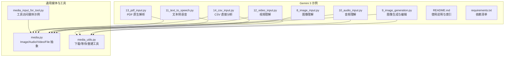
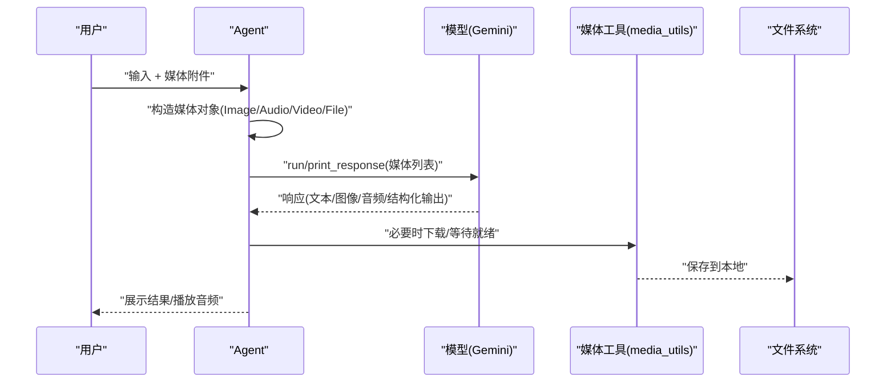
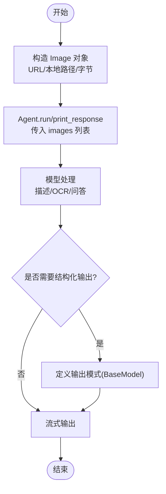
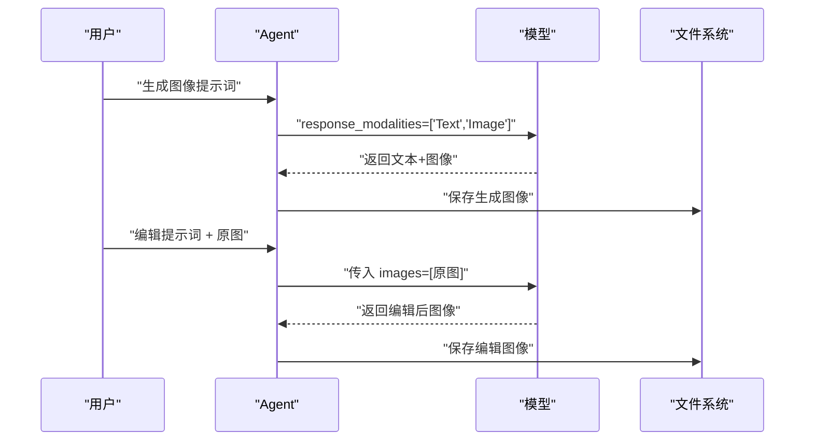
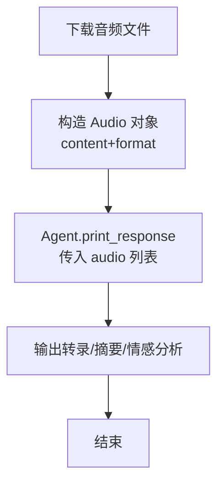
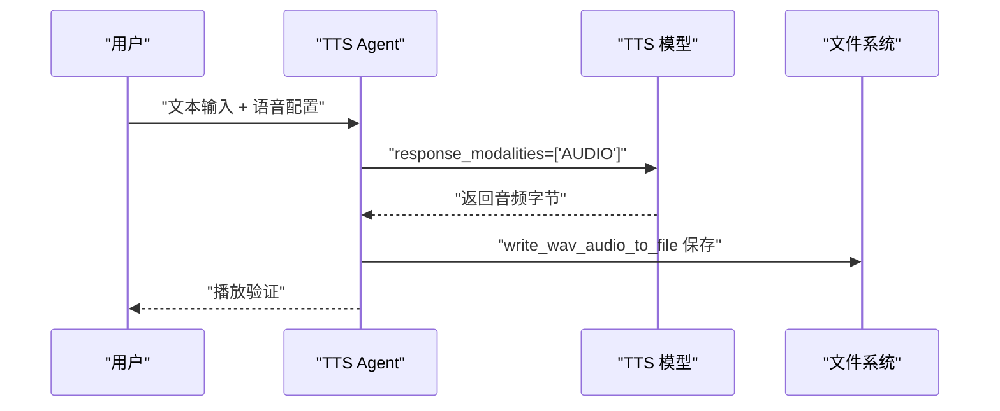
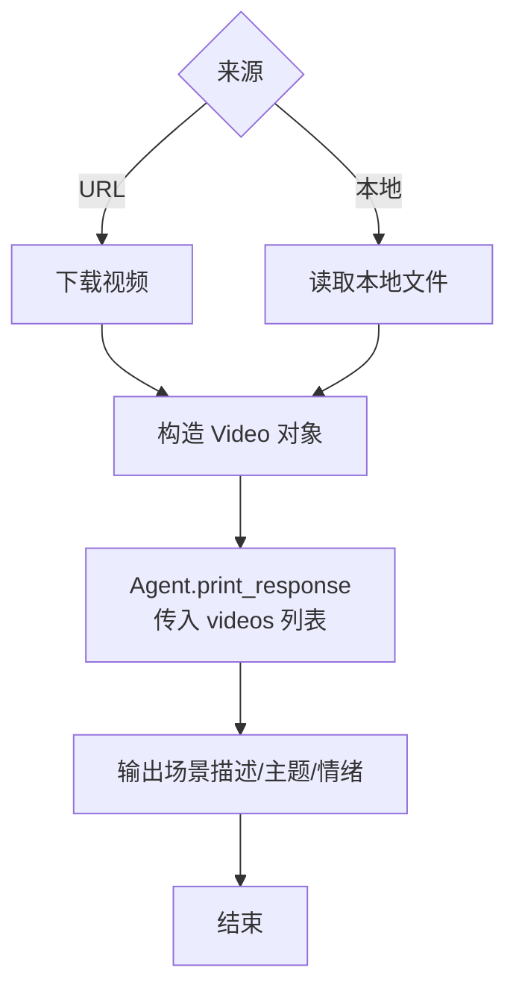
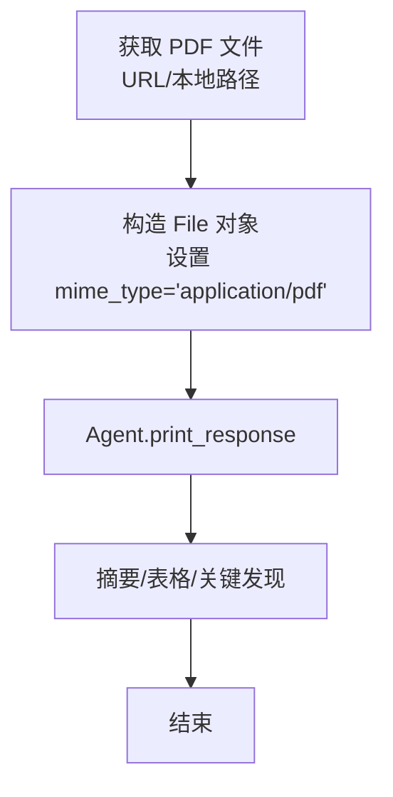
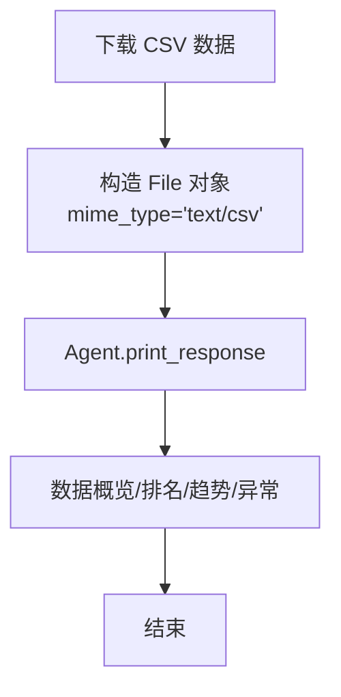
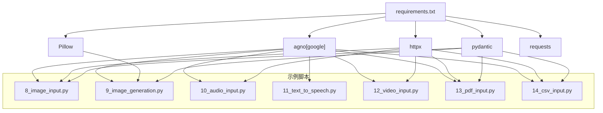

# 多模态处理

<cite>
**本文引用的文件**
- [8_image_input.py](file://cookbook/gemini_3/8_image_input.py)
- [9_image_generation.py](file://cookbook/gemini_3/9_image_generation.py)
- [10_audio_input.py](file://cookbook/gemini_3/10_audio_input.py)
- [11_text_to_speech.py](file://cookbook/gemini_3/11_text_to_speech.py)
- [12_video_input.py](file://cookbook/gemini_3/12_video_input.py)
- [13_pdf_input.py](file://cookbook/gemini_3/13_pdf_input.py)
- [14_csv_input.py](file://cookbook/gemini_3/14_csv_input.py)
- [README.md](file://cookbook/gemini_3/README.md)
- [requirements.txt](file://cookbook/gemini_3/requirements.txt)
- [media.py](file://libs/agno/agno/media.py)
- [media_utils.py](file://libs/agno/agno/utils/media.py)
- [media_input_for_tool.py](file://cookbook/02_agents/12_multimodal/media_input_for_tool.py)
</cite>

## 目录
1. [简介](#简介)
2. [项目结构](#项目结构)
3. [核心组件](#核心组件)
4. [架构总览](#架构总览)
5. [详细组件分析](#详细组件分析)
6. [依赖分析](#依赖分析)
7. [性能考虑](#性能考虑)
8. [故障排查指南](#故障排查指南)
9. [结论](#结论)
10. [附录](#附录)

## 简介
本章节聚焦于 Gemini 3 在多模态处理方面的强大能力，覆盖图像理解、图像生成与编辑、音频分析、文本转语音、视频理解（含 YouTube）、PDF 原生解析以及 CSV 数据直接分析等场景。每个示例均基于统一的媒体抽象层，通过简洁的 API 将不同媒体输入传递给模型，并在运行时自动处理下载、格式化与输出解析。文档将从系统架构、数据流、处理逻辑、配置要点、性能优化到最佳实践进行分层次阐述，帮助读者快速上手并构建生产级应用。

## 项目结构
多模态示例位于 cookbook/gemini_3 目录下，围绕“图像、音频、视频、文档、数据”五类媒体分别提供独立脚本，配合通用媒体抽象与工具模块实现跨模态的一致体验。

图表来源
- [README.md:47-57](file://cookbook/gemini_3/README.md#L47-L57)
- [media.py:10-497](file://libs/agno/agno/media.py#L10-L497)
- [media_utils.py:1-374](file://libs/agno/agno/utils/media.py#L1-L374)

章节来源
- [README.md:47-57](file://cookbook/gemini_3/README.md#L47-L57)
- [requirements.txt:1-8](file://cookbook/gemini_3/requirements.txt#L1-L8)

## 核心组件
- 统一媒体抽象层：提供 Image、Audio、Video、File 四类对象，统一处理 URL/本地路径/原始字节三种内容来源，并内置序列化、反序列化与 base64 编解码能力。
- 工具与实用函数：提供下载、等待就绪、从字典重建媒体对象等工具，便于在复杂工作流中持久化与传输媒体数据。
- Agent 与模型集成：通过 Gemini 模型参数（如 response_modalities、speech_config）控制输出模态与语音特性，结合指令与结构化输出 schema 实现专业场景定制。

章节来源
- [media.py:10-497](file://libs/agno/agno/media.py#L10-L497)
- [media_utils.py:1-374](file://libs/agno/agno/utils/media.py#L1-L374)

## 架构总览
下图展示了多模态处理的整体调用链：Agent 接收用户输入与媒体附件，经由媒体抽象层标准化后传递给模型；模型根据配置返回文本、图像或音频等结果，再由工具层进行保存、播放或进一步处理。

图表来源
- [media.py:10-497](file://libs/agno/agno/media.py#L10-L497)
- [media_utils.py:81-167](file://libs/agno/agno/utils/media.py#L81-L167)

## 详细组件分析

### 图像理解（8_image_input.py）
- 能力概述
  - 支持从 URL 或本地文件传入图像，进行描述、OCR 文本提取与问答。
  - 可启用搜索增强以提升上下文理解。
- 关键点
  - 使用 Image(url=...) 或 Image(filepath=...) 构造媒体对象。
  - 通过 images=[...] 参数传入多个图像。
  - 结合结构化输出可抽取特定字段（如物体、文本、情绪）。
- 典型流程
  - 下载/读取图像 → 构造 Image 对象 → 调用 Agent.run/print_response → 流式输出结果。
- 最佳实践
  - 提前对图像进行格式与尺寸检查，避免超大文件导致延迟。
  - 对包含文字的图像，建议明确提示词以提升 OCR 准确性。
  - 使用搜索增强时注意隐私与版权问题。

图表来源
- [8_image_input.py:12-17](file://cookbook/gemini_3/8_image_input.py#L12-L17)
- [8_image_input.py:40-60](file://cookbook/gemini_3/8_image_input.py#L40-L60)

章节来源
- [8_image_input.py:1-92](file://cookbook/gemini_3/8_image_input.py#L1-L92)

### 图像生成与编辑（9_image_generation.py）
- 能力概述
  - 原生支持图像生成与编辑，无需外部工具。
  - 同时输出文本与图像，或仅图像。
- 关键点
  - response_modalities 设置为 ["Text", "Image"] 或 ["Image"]。
  - 使用 RunOutput.images 获取生成/编辑后的图像字节。
  - 图像编辑通过传入现有图像与修改指令实现迭代优化。
- 典型流程
  - 创建 Agent（禁用系统消息，改写提示词）→ 生成图像 → 保存 → 编辑图像 → 保存。
- 最佳实践
  - 提示词越具体，图像质量越高；建议包含风格、色调、构图等关键词。
  - 图像生成模型不支持系统消息，需将指导语放入提示词。
  - 迭代编辑采用“生成→评估→微调”的闭环策略。

图表来源
- [9_image_generation.py:31-87](file://cookbook/gemini_3/9_image_generation.py#L31-L87)

章节来源
- [9_image_generation.py:1-116](file://cookbook/gemini_3/9_image_generation.py#L1-L116)

### 音频分析（10_audio_input.py）
- 能力概述
  - 原生支持多种音频格式（MP3、WAV、FLAC、OGG 等）的转录、摘要与情感分析。
- 关键点
  - 使用 Audio(content=..., format=...) 传入音频字节与格式。
  - 支持从 URL 下载后直接分析。
- 典型流程
  - 下载音频 → 构造 Audio 对象 → 调用 Agent.print_response → 流式输出转录与摘要。
- 最佳实践
  - 明确标注音频格式，避免解码失败。
  - 多说话人场景建议在提示词中强调区分说话人。
  - 长音频可分段处理以降低延迟与成本。

图表来源
- [10_audio_input.py:49-60](file://cookbook/gemini_3/10_audio_input.py#L49-L60)

章节来源
- [10_audio_input.py:1-86](file://cookbook/gemini_3/10_audio_input.py#L1-L86)

### 文本转语音（11_text_to_speech.py）
- 能力概述
  - 使用专用 TTS 模型生成自然语音，支持多种预置声音。
- 关键点
  - response_modalities 设为 ["AUDIO"]。
  - speech_config 控制声音名称与音色参数。
  - 通过工具函数将 response_audio 写入本地文件。
- 典型流程
  - 创建 TTS Agent → 生成音频 → 写入 WAV 文件 → 播放验证。
- 最佳实践
  - 根据场景选择合适的声音（新闻播报、旁白、角色配音）。
  - 对长文本建议分段合成，减少一次性请求的失败风险。
  - 注意音频文件格式与播放器兼容性。

图表来源
- [11_text_to_speech.py:32-56](file://cookbook/gemini_3/11_text_to_speech.py#L32-L56)

章节来源
- [11_text_to_speech.py:1-82](file://cookbook/gemini_3/11_text_to_speech.py#L1-L82)

### 视频理解（12_video_input.py）
- 能力概述
  - 支持本地视频与 YouTube 链接的场景描述与内容分析。
  - 模型同时处理视觉与音频轨道，提供整体情绪与主题判断。
- 关键点
  - Video(content=..., format=...) 或 Video(url=...)。
  - 支持从 YouTube URL 直接分析。
- 典型流程
  - 下载/读取视频 → 构造 Video 对象 → 调用 Agent.print_response → 流式输出总结。
- 最佳实践
  - 对长视频建议截取关键片段或分段分析。
  - 提示词中明确时间线顺序与关注重点（人物、事件、背景音乐）。

图表来源
- [12_video_input.py:52-72](file://cookbook/gemini_3/12_video_input.py#L52-L72)

章节来源
- [12_video_input.py:1-97](file://cookbook/gemini_3/12_video_input.py#L1-L97)

### PDF 处理（13_pdf_input.py）
- 能力概述
  - 原生解析 PDF，理解表格、列布局与排版信息。
- 关键点
  - File(url=..., mime_type="application/pdf") 或 File(filepath=..., mime_type="application/pdf")。
  - 支持结构化输出抽取关键信息。
- 典型流程
  - 传入 PDF → 调用 Agent.print_response → 输出摘要/表格/建议。
- 最佳实践
  - 对扫描版 PDF，建议先做 OCR 再交给模型解析。
  - 大型 PDF 可按页拆分处理，提高稳定性。

图表来源
- [13_pdf_input.py:49-59](file://cookbook/gemini_3/13_pdf_input.py#L49-L59)

章节来源
- [13_pdf_input.py:1-93](file://cookbook/gemini_3/13_pdf_input.py#L1-L93)

### 数据分析（14_csv_input.py）
- 能力概述
  - 直接分析 CSV 数据集，无需额外数据处理库。
- 关键点
  - File(filepath=..., mime_type="text/csv")。
  - 提供统计、趋势与异常检测等能力。
- 典型流程
  - 下载样本数据 → 构造 File → 调用 Agent.print_response → 输出统计与洞察。
- 最佳实践
  - 提前清洗缺失值与异常值，提升分析准确性。
  - 使用结构化输出模式抽取关键指标，便于后续自动化处理。

图表来源
- [14_csv_input.py:56-72](file://cookbook/gemini_3/14_csv_input.py#L56-L72)

章节来源
- [14_csv_input.py:1-104](file://cookbook/gemini_3/14_csv_input.py#L1-L104)

## 依赖分析
- 运行时依赖
  - agno[google]：集成 Google 模型与工具。
  - httpx：网络请求与下载。
  - Pillow：图像生成与保存（用于图像编辑示例）。
  - pydantic：结构化输出模式定义。
  - requests：通用网络请求（示例中未直接使用，但作为常见依赖存在）。
- 组件耦合
  - 示例脚本高度内聚，每个脚本独立运行，仅依赖通用媒体抽象与工具。
  - 媒体抽象层提供统一接口，降低各模态之间的差异带来的耦合度。

图表来源
- [requirements.txt:1-8](file://cookbook/gemini_3/requirements.txt#L1-L8)

章节来源
- [requirements.txt:1-8](file://cookbook/gemini_3/requirements.txt#L1-L8)

## 性能考虑
- 输入预处理
  - 图像/视频/音频过大时，建议压缩或裁剪后再传入，减少往返时间与费用。
  - 对长音频/视频采用分段处理，避免单次请求超时。
- 并发与批处理
  - 多媒体批处理时，优先使用本地路径或字节流，减少重复下载。
  - 对批量 CSV/文件分析，建议分页或分块读取，避免内存峰值过高。
- 输出与存储
  - 图像/音频生成后及时落盘，避免内存驻留。
  - 使用工具函数等待媒体资源可用后再消费，避免空指针与重试风暴。
- 模型选择
  - 不同任务选择合适模型 ID，兼顾速度与精度。
  - 对需要结构化输出的任务，提前定义输出模式，减少模型反复修正。

## 故障排查指南
- 环境变量
  - GOOGLE_API_KEY 未设置：请在运行前导出正确的 API 密钥。
- 依赖缺失
  - 缺少 Pillow：安装 Pillow 以运行图像生成与编辑示例。
  - ModuleNotFoundError：执行 requirements.txt 中的安装命令。
- 模型错误
  - 429 速率限制：稍等片刻或切换模型 ID。
  - 模型不存在：核对模型 ID 拼写，确保使用受支持的版本。
- 媒体相关
  - 下载失败：检查 URL 可达性与格式，必要时增加重试与超时设置。
  - 媒体未就绪：使用等待工具轮询 HEAD 请求，确认资源可用后再消费。

章节来源
- [README.md:121-129](file://cookbook/gemini_3/README.md#L121-L129)

## 结论
通过统一的媒体抽象与简洁的 API，Gemini 3 在多模态场景中实现了“即插即用”的能力组合：从图像理解到生成编辑，从音频转录到文本转语音，再到视频理解、PDF 原生解析与 CSV 直接分析。配合结构化输出与工具层的下载/重建能力，开发者可以快速搭建端到端的多模态应用，并在实践中不断优化性能与用户体验。

## 附录
- 快速运行
  - 安装依赖后，按 README 中的步骤逐个运行示例脚本，观察不同模态的处理效果。
- 扩展建议
  - 将媒体对象持久化至数据库，利用重建工具恢复运行时状态。
  - 在工具中注入媒体访问能力，实现“上传即处理”的工作流。