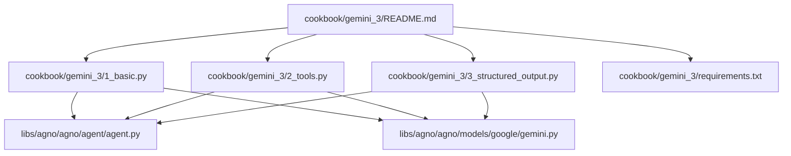
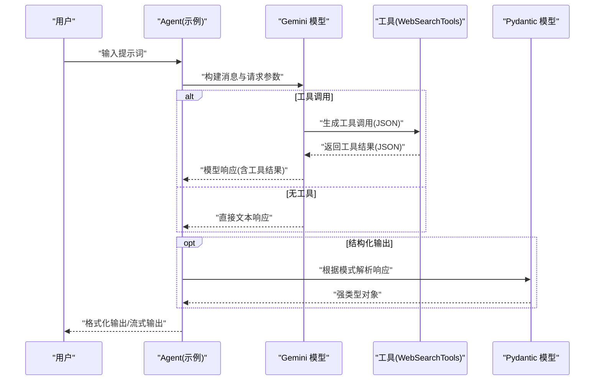
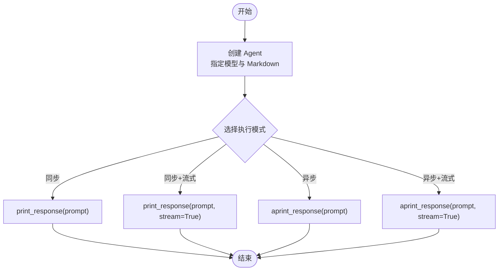
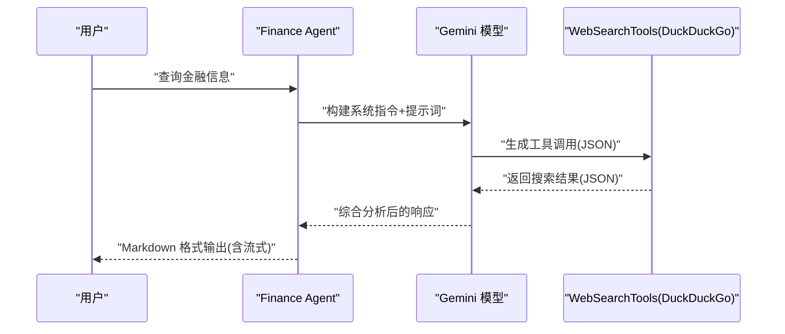
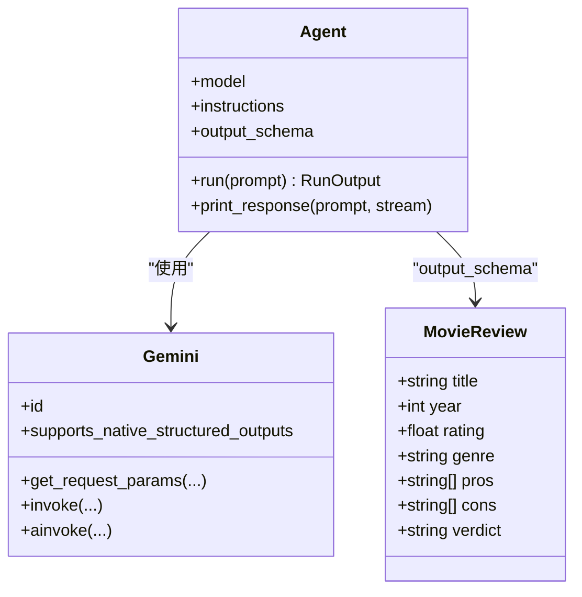
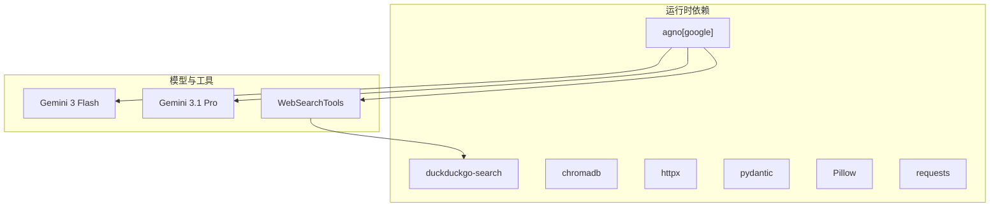

# 框架基础

<cite>
**本文引用的文件列表**
- [1_basic.py](file://cookbook/gemini_3/1_basic.py)
- [2_tools.py](file://cookbook/gemini_3/2_tools.py)
- [3_structured_output.py](file://cookbook/gemini_3/3_structured_output.py)
- [README.md](file://cookbook/gemini_3/README.md)
- [requirements.txt](file://cookbook/gemini_3/requirements.txt)
- [gemini.py](file://libs/agno/agno/models/google/gemini.py)
- [agent.py](file://libs/agno/agno/agent/agent.py)
</cite>

## 目录
1. [简介](#简介)
2. [项目结构](#项目结构)
3. [核心组件](#核心组件)
4. [架构总览](#架构总览)
5. [详细组件分析](#详细组件分析)
6. [依赖关系分析](#依赖关系分析)
7. [性能考量](#性能考量)
8. [故障排除指南](#故障排除指南)
9. [结论](#结论)
10. [附录](#附录)

## 简介
本章节聚焦于 Gemini 3 框架的基础能力，围绕三个核心示例逐步讲解如何使用 Google Gemini 构建基础智能代理：
- 基础聊天助手（1_basic.py）：介绍代理创建、同步/异步/流式响应的基本概念
- 工具调用代理（2_tools.py）：展示如何集成 Web 搜索工具和系统指令
- 结构化输出代理（3_structured_output.py）：详解如何使用 Pydantic 模型进行类型安全的结构化输出

同时，我们将解释 Gemini 3 Flash 模型的选择原因与配置方法，提供运行方式、关键参数说明、实际效果展示、故障排除与最佳实践建议。

## 项目结构
Gemini 3 示例位于 cookbook/gemini_3 目录下，包含三个独立脚本与一个说明文档，以及依赖清单。整体结构清晰，便于按步骤学习与运行。

图表来源
- [README.md:1-135](file://cookbook/gemini_3/README.md#L1-L135)
- [1_basic.py:1-84](file://cookbook/gemini_3/1_basic.py#L1-L84)
- [2_tools.py:1-92](file://cookbook/gemini_3/2_tools.py#L1-L92)
- [3_structured_output.py:1-94](file://cookbook/gemini_3/3_structured_output.py#L1-L94)
- [requirements.txt:1-8](file://cookbook/gemini_3/requirements.txt#L1-L8)
- [agent.py:68-1611](file://libs/agno/agno/agent/agent.py#L68-L1611)
- [gemini.py:62-1961](file://libs/agno/agno/models/google/gemini.py#L62-L1961)

章节来源
- [README.md:1-135](file://cookbook/gemini_3/README.md#L1-L135)

## 核心组件
- Agent：Agno 的核心构建块，封装模型与指令，提供同步/异步/流式执行能力
- Gemini：Google Gemini 模型适配器，支持结构化输出、工具调用、思考预算等特性
- WebSearchTools：内置 Web 搜索工具，无需 API Key 即可使用 DuckDuckGo
- Pydantic BaseModel：用于定义结构化输出模式，确保类型安全与字段完整性

章节来源
- [agent.py:68-1611](file://libs/agno/agno/agent/agent.py#L68-L1611)
- [gemini.py:62-1961](file://libs/agno/agno/models/google/gemini.py#L62-L1961)
- [2_tools.py:19-22](file://cookbook/gemini_3/2_tools.py#L19-L22)
- [3_structured_output.py:18-22](file://cookbook/gemini_3/3_structured_output.py#L18-L22)

## 架构总览
下图展示了三个示例在代码层面的调用关系与数据流，从 Agent 创建到模型调用与工具交互，再到结构化输出解析。

图表来源
- [1_basic.py:26-55](file://cookbook/gemini_3/1_basic.py#L26-L55)
- [2_tools.py:45-62](file://cookbook/gemini_3/2_tools.py#L45-L62)
- [3_structured_output.py:41-66](file://cookbook/gemini_3/3_structured_output.py#L41-L66)
- [agent.py:68-1611](file://libs/agno/agno/agent/agent.py#L68-L1611)
- [gemini.py:233-361](file://libs/agno/agno/models/google/gemini.py#L233-L361)

## 详细组件分析

### 基础聊天助手（1_basic.py）
- 目标：演示代理创建、同步/异步/流式响应与 Markdown 渲染
- 关键点
  - 使用 Gemini 3 Flash 模型（gemini-3-flash-preview）作为基础模型
  - 支持四种执行模式：同步、同步+流式、异步、异步+流式
  - Markdown 渲染终端富文本输出
- 运行方式
  - 直接运行脚本，示例中已提供同步与异步+流式的注释与调用
- 实际效果
  - 控制台输出格式化的文本，异步+流式模式下逐字节输出，体验更接近真实对话

图表来源
- [1_basic.py:26-55](file://cookbook/gemini_3/1_basic.py#L26-L55)

章节来源
- [1_basic.py:1-84](file://cookbook/gemini_3/1_basic.py#L1-L84)
- [README.md:7-26](file://cookbook/gemini_3/README.md#L7-L26)

### 工具调用代理（2_tools.py）
- 目标：集成 Web 搜索工具与系统指令，构建金融研究代理
- 关键点
  - 使用 WebSearchTools（DuckDuckGo 后端，无需 API Key）
  - 通过 instructions 提供系统级行为指导
  - add_datetime_to_context 注入当前日期时间，使代理具备“今日”上下文
  - 支持同步+流式输出
- 运行方式
  - 设置 GOOGLE_API_KEY 环境变量后运行脚本
- 实际效果
  - 代理会先进行网络搜索，再整合信息并以结构化方式呈现（如表格、日期标注）

图表来源
- [2_tools.py:26-62](file://cookbook/gemini_3/2_tools.py#L26-L62)
- [gemini.py:295-337](file://libs/agno/agno/models/google/gemini.py#L295-L337)

章节来源
- [2_tools.py:1-92](file://cookbook/gemini_3/2_tools.py#L1-L92)
- [README.md:7-26](file://cookbook/gemini_3/README.md#L7-L26)

### 结构化输出代理（3_structured_output.py）
- 目标：使用 Pydantic 模型强制类型安全的结构化输出
- 关键点
  - 定义 MovieReview 模型，包含标题、年份、评分、类型、优缺点、总结等字段
  - 使用 output_schema 将模型输出解析为 Pydantic 对象
  - agent.run() 返回 RunOutput，其 .content 为强类型对象
  - 字段描述（Field(..., description=...)）引导模型生成期望字段
- 运行方式
  - 设置 GOOGLE_API_KEY 环境变量后运行脚本
- 实际效果
  - 输出被严格解析为 MovieReview 对象，便于后续 UI 渲染、数据库存储、比较分析与流水线处理

图表来源
- [3_structured_output.py:28-47](file://cookbook/gemini_3/3_structured_output.py#L28-L47)
- [agent.py:284-301](file://libs/agno/agno/agent/agent.py#L284-L301)
- [gemini.py:277-282](file://libs/agno/agno/models/google/gemini.py#L277-L282)

章节来源
- [3_structured_output.py:1-94](file://cookbook/gemini_3/3_structured_output.py#L1-L94)
- [README.md:7-26](file://cookbook/gemini_3/README.md#L7-L26)

## 依赖关系分析
- 运行时依赖
  - agno[google]：Agno 核心库与 Google 模型适配
  - duckduckgo-search：Web 搜索工具后端
  - chromadb、httpx、pydantic、Pillow、requests：其他示例或通用依赖
- 模型与工具
  - Gemini 3 Flash（gemini-3-flash-preview）：快速、低成本、擅长工具调用
  - Gemini 3.1 Pro（gemini-3.1-pro-preview）：更强推理与结构化输出能力
  - WebSearchTools：内置工具，无需 API Key，适合入门与原型验证

图表来源
- [requirements.txt:1-8](file://cookbook/gemini_3/requirements.txt#L1-L8)
- [1_basic.py:28-28](file://cookbook/gemini_3/1_basic.py#L28-L28)
- [3_structured_output.py:43-43](file://cookbook/gemini_3/3_structured_output.py#L43-L43)
- [2_tools.py:47-47](file://cookbook/gemini_3/2_tools.py#L47-L47)

章节来源
- [requirements.txt:1-8](file://cookbook/gemini_3/requirements.txt#L1-L8)

## 性能考量
- 执行模式
  - 同步阻塞：简单直观，适合脚本与测试
  - 异步非阻塞：生产应用推荐，提升并发与吞吐
  - 流式输出：降低首字延迟，改善用户体验
- 模型选择
  - Gemini 3 Flash：轻量、快速、成本低，适合工具调用与基础问答
  - Gemini 3.1 Pro：更强推理与结构化输出能力，适合复杂任务与强约束输出
- 工具调用
  - WebSearchTools 无需 API Key，但需注意网络与结果质量
  - 自定义工具时，建议限制工具调用次数与粒度，避免过度调用导致延迟与成本上升

## 故障排除指南
- 环境变量未设置
  - GOOGLE_API_KEY 未设置：请设置 GOOGLE_API_KEY
  - GOOGLE_CLOUD_PROJECT/GOOGLE_CLOUD_LOCATION 未设置：使用 Vertex AI 时需要
- 依赖缺失
  - ModuleNotFoundError：安装 cookbook/gemini_3/requirements.txt 中的依赖
- 模型错误
  - Model not found：检查模型 ID 拼写，使用 gemini-3-flash-preview 或 gemini-3.1-pro-preview
- 速率限制
  - 429 Rate limit exceeded：等待一分钟或更换模型 ID
- 其他
  - 401/403：确认 API Key 有效与权限范围
  - 未知错误：查看日志与重试策略

章节来源
- [README.md:121-135](file://cookbook/gemini_3/README.md#L121-L135)

## 结论
通过三个示例，我们系统地掌握了如何使用 Google Gemini 在 Agno 框架中构建基础智能代理：
- 从基础聊天助手开始，理解同步/异步/流式响应与 Markdown 渲染
- 通过工具调用代理，学会集成 Web 搜索与系统指令
- 通过结构化输出代理，掌握 Pydantic 模型驱动的类型安全输出

结合合适的模型选择与依赖管理，可以在开发与生产环境中高效落地智能代理应用。

## 附录

### 运行步骤与命令
- 快速路径
  - 克隆仓库并进入目录
  - 创建虚拟环境并激活
  - 安装依赖
  - 设置 GOOGLE_API_KEY
  - 运行示例脚本
- 示例命令
  - 运行基础聊天助手：python cookbook/gemini_3/1_basic.py
  - 运行工具调用代理：python cookbook/gemini_3/2_tools.py
  - 运行结构化输出代理：python cookbook/gemini_3/3_structured_output.py

章节来源
- [README.md:11-26](file://cookbook/gemini_3/README.md#L11-L26)

### 模型与配置要点
- Gemini 3 Flash（gemini-3-flash-preview）
  - 特点：快速、低成本、擅长工具调用
  - 适用场景：基础问答、工具调用、原型验证
- Gemini 3.1 Pro（gemini-3.1-pro-preview）
  - 特点：更强推理与结构化输出能力
  - 适用场景：复杂任务、强约束输出、类型安全解析
- 配置建议
  - 同步/异步/流式按需选择
  - Markdown 渲染用于终端友好输出
  - 工具调用时合理设置工具选择与调用上限

章节来源
- [README.md:7-26](file://cookbook/gemini_3/README.md#L7-L26)
- [1_basic.py:28-31](file://cookbook/gemini_3/1_basic.py#L28-L31)
- [3_structured_output.py:43-46](file://cookbook/gemini_3/3_structured_output.py#L43-L46)