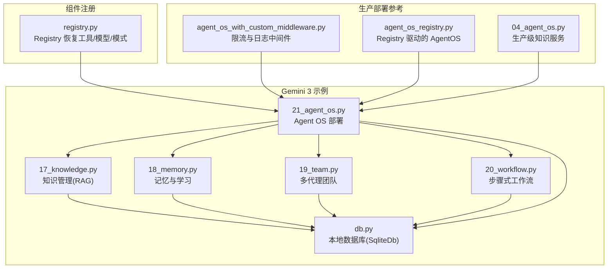
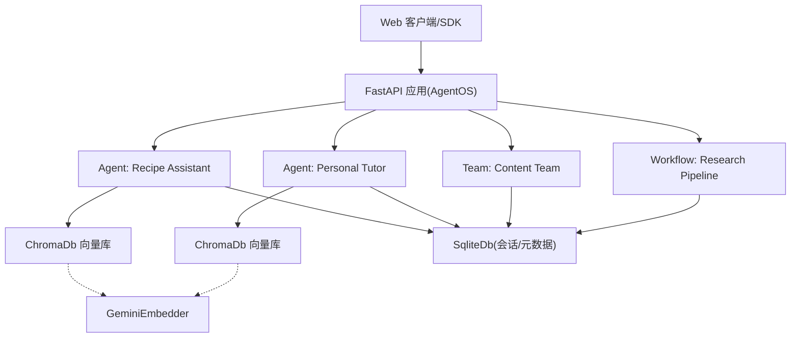
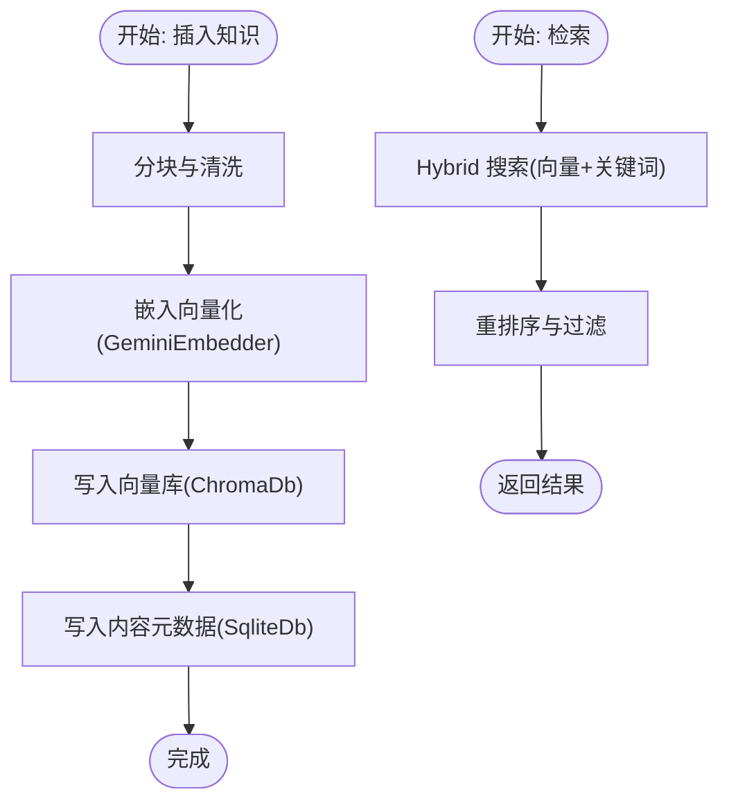
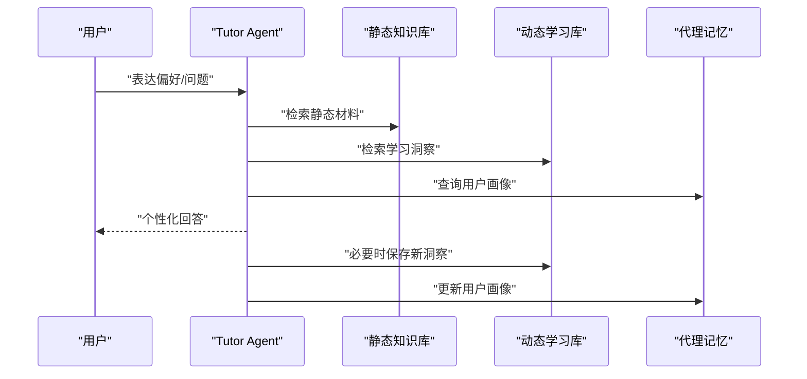
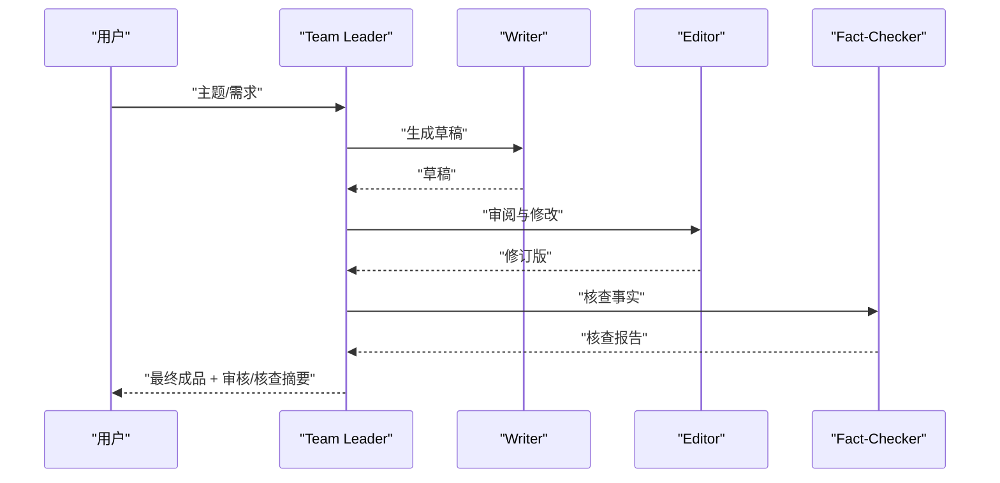
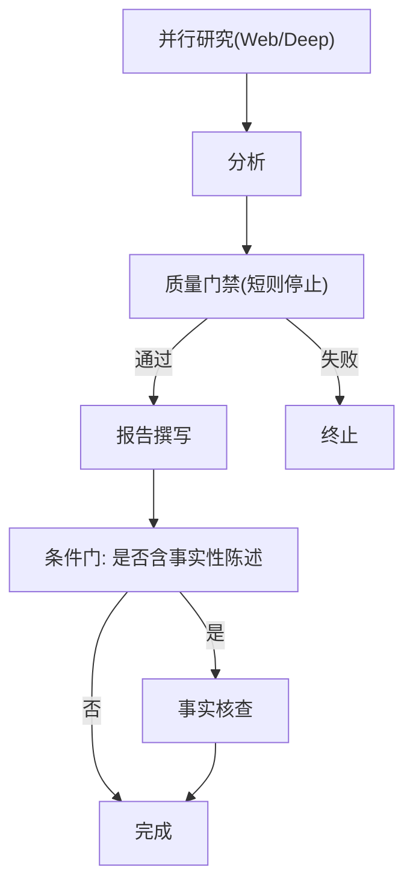
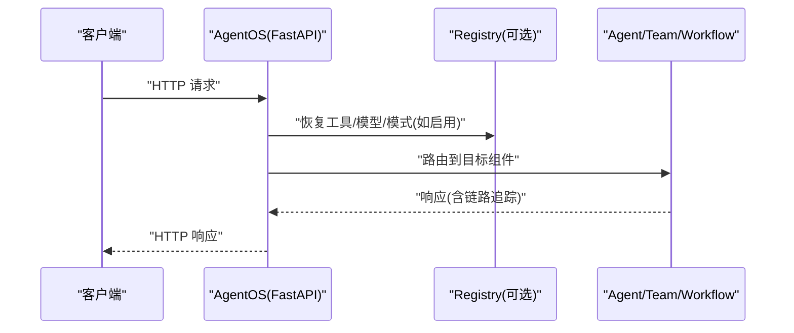
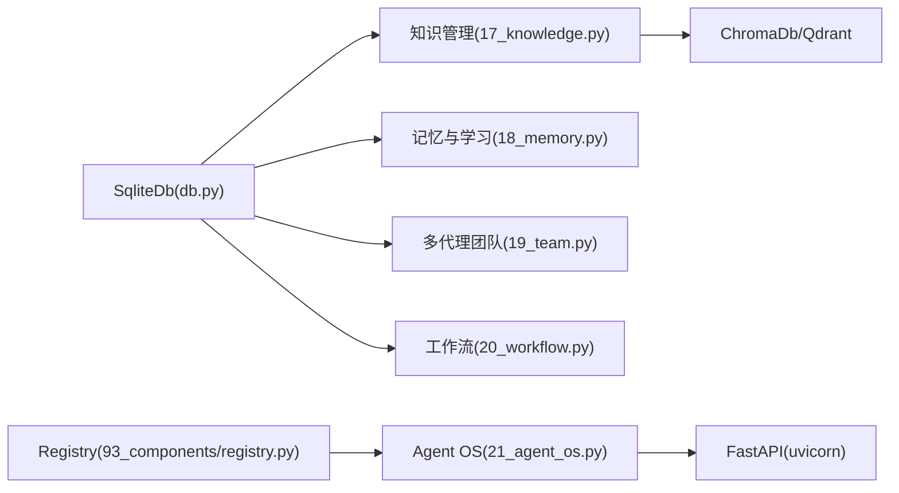

# 生产环境集成

<cite>
**本文引用的文件**
- [17_knowledge.py](file://cookbook/gemini_3/17_knowledge.py)
- [18_memory.py](file://cookbook/gemini_3/18_memory.py)
- [19_team.py](file://cookbook/gemini_3/19_team.py)
- [20_workflow.py](file://cookbook/gemini_3/20_workflow.py)
- [21_agent_os.py](file://cookbook/gemini_3/21_agent_os.py)
- [db.py](file://cookbook/gemini_3/db.py)
- [registry.py](file://cookbook/93_components/registry.py)
- [agent_os_with_custom_middleware.py](file://cookbook/05_agent_os/middleware/agent_os_with_custom_middleware.py)
- [agent_os_registry.py](file://cookbook/93_components/agent_os_registry.py)
- [04_agent_os.py](file://cookbook/07_knowledge/03_production/04_agent_os.py)
</cite>

## 目录
1. [简介](#简介)
2. [项目结构](#项目结构)
3. [核心组件](#核心组件)
4. [架构总览](#架构总览)
5. [详细组件分析](#详细组件分析)
6. [依赖分析](#依赖分析)
7. [性能考虑](#性能考虑)
8. [故障排除指南](#故障排除指南)
9. [结论](#结论)
10. [附录](#附录)

## 简介
本章节面向生产级智能代理系统的集成落地，基于仓库中的示例脚本，系统性地串联知识管理（RAG）、记忆与学习、多代理团队、步骤式工作流以及 Agent OS 部署等模块，形成可复用的工程化方案。重点覆盖以下方面：
- 数据库与存储：SqliteDb 作为会话与内容元数据存储，ChromaDb 作为本地向量数据库，支持混合检索与持久化。
- 组件注册与恢复：通过 Registry 在数据库持久化后恢复工具、模型与模式定义。
- 状态管理与会话：在 Agent/Team/Workflow 中使用统一的数据库进行状态持久化与跨步骤共享。
- 监控与可观测性：链路追踪与请求日志、限流中间件等。
- 部署与运维：AgentOS 将多类组件打包为 Web 服务，支持热重载与扩展。

## 项目结构
本集成以 cookbook/gemini_3 为核心，围绕知识、记忆、团队、工作流与 OS 部署五大主题展开，并通过 db.py 提供统一的本地数据库实例，registry.py 展示非可序列化组件的注册与恢复模式。

图示来源
- [17_knowledge.py:1-169](file://cookbook/gemini_3/17_knowledge.py#L1-L169)
- [18_memory.py:1-170](file://cookbook/gemini_3/18_memory.py#L1-L170)
- [19_team.py:1-184](file://cookbook/gemini_3/19_team.py#L1-L184)
- [20_workflow.py:1-237](file://cookbook/gemini_3/20_workflow.py#L1-L237)
- [21_agent_os.py:1-71](file://cookbook/gemini_3/21_agent_os.py#L1-L71)
- [db.py:1-9](file://cookbook/gemini_3/db.py#L1-L9)
- [registry.py:1-70](file://cookbook/93_components/registry.py#L1-L70)
- [agent_os_with_custom_middleware.py:1-192](file://cookbook/05_agent_os/middleware/agent_os_with_custom_middleware.py#L1-L192)
- [agent_os_registry.py:1-64](file://cookbook/93_components/agent_os_registry.py#L1-L64)
- [04_agent_os.py:1-100](file://cookbook/07_knowledge/03_production/04_agent_os.py#L1-L100)

章节来源
- [17_knowledge.py:1-169](file://cookbook/gemini_3/17_knowledge.py#L1-L169)
- [18_memory.py:1-170](file://cookbook/gemini_3/18_memory.py#L1-L170)
- [19_team.py:1-184](file://cookbook/gemini_3/19_team.py#L1-L184)
- [20_workflow.py:1-237](file://cookbook/gemini_3/20_workflow.py#L1-L237)
- [21_agent_os.py:1-71](file://cookbook/gemini_3/21_agent_os.py#L1-L71)
- [db.py:1-9](file://cookbook/gemini_3/db.py#L1-L9)
- [registry.py:1-70](file://cookbook/93_components/registry.py#L1-L70)
- [agent_os_with_custom_middleware.py:1-192](file://cookbook/05_agent_os/middleware/agent_os_with_custom_middleware.py#L1-L192)
- [agent_os_registry.py:1-64](file://cookbook/93_components/agent_os_registry.py#L1-L64)
- [04_agent_os.py:1-100](file://cookbook/07_knowledge/03_production/04_agent_os.py#L1-L100)

## 核心组件
- 知识管理（17_knowledge.py）
  - 使用 ChromaDb 作为向量数据库，GeminiEmbedder 进行嵌入，Hybrid 搜索提升召回质量。
  - 结合 SqliteDb 存储对话历史与内容元数据，实现“静态知识库 + 会话存储”的本地 RAG。
  - 支持从文本、URL、本地文件等多种来源加载知识。
- 记忆与学习（18_memory.py）
  - 双知识库：静态教学材料 + 动态学习洞察，二者共同参与检索。
  - LearningMachine 采用 AGENTIC 模式，由代理自主决定保存哪些洞察，适合生产场景。
  - 启用代理记忆（enable_agentic_memory），按用户画像构建长期记忆。
- 多代理团队（19_team.py）
  - Writer/Editor/Fact-Checker 三角色分工明确，团队领导使用更强模型进行委派决策。
  - show_members_responses 输出成员反馈，便于审计与改进。
- 步骤式工作流（20_workflow.py）
  - 基于 Step/Parallel/Condition 的可预测多步骤流水线，支持并行研究、质量门禁、条件事实核查。
  - session_state 跨步骤持久化，StepInput/StepOutput 传递上下文。
- Agent OS 部署（21_agent_os.py）
  - 将多个 Agent、Team、Workflow 打包为 FastAPI 应用，支持链路追踪与热重载。
  - 通过 importlib 动态导入命名以数字开头的模块，避免 Python 导入限制。
- 数据库配置（db.py）
  - 统一的 SqliteDb 实例，用于所有组件的状态与会话持久化。
- 组件注册（registry.py）
  - Registry 保存工具、模型、数据库与模式定义，用于从数据库恢复不可直接序列化的对象。

章节来源
- [17_knowledge.py:32-81](file://cookbook/gemini_3/17_knowledge.py#L32-L81)
- [18_memory.py:35-106](file://cookbook/gemini_3/18_memory.py#L35-L106)
- [19_team.py:45-148](file://cookbook/gemini_3/19_team.py#L45-L148)
- [20_workflow.py:37-183](file://cookbook/gemini_3/20_workflow.py#L37-L183)
- [21_agent_os.py:37-66](file://cookbook/gemini_3/21_agent_os.py#L37-L66)
- [db.py:8](file://cookbook/gemini_3/db.py#L8)
- [registry.py:46-53](file://cookbook/93_components/registry.py#L46-L53)

## 架构总览
下图展示生产级智能代理系统的端到端架构：前端通过 AgentOS Web 界面或 API 调用，后端由 Agent/Team/Workflow 组成的处理层，配合知识库与记忆系统，最终落库到 SqliteDb 与 ChromaDb。

图示来源
- [21_agent_os.py:49-66](file://cookbook/gemini_3/21_agent_os.py#L49-L66)
- [17_knowledge.py:32-44](file://cookbook/gemini_3/17_knowledge.py#L32-L44)
- [18_memory.py:35-59](file://cookbook/gemini_3/18_memory.py#L35-L59)
- [db.py:8](file://cookbook/gemini_3/db.py#L8)

## 详细组件分析

### 知识管理（RAG）组件分析
- 数据结构与复杂度
  - ChromaDb 的向量索引支持 O(log N) 检索近似最近邻，Hybrid 搜索结合关键词匹配，提升召回与精排效果。
  - 文档插入与检索流程：插入时分块 + 嵌入 + 写入向量库；检索时先向量相似度，再结合关键词过滤。
- 关键点
  - 混合检索策略与嵌入器选择直接影响检索质量与延迟。
  - contents_db 与 vector_db 解耦，便于独立扩展与迁移。
- 性能与可靠性
  - 建议对大文档分块策略与嵌入批次大小进行调优；定期维护向量库索引。
  - 对外暴露的知识管理接口应具备限流与缓存策略。

图示来源
- [17_knowledge.py:32-44](file://cookbook/gemini_3/17_knowledge.py#L32-L44)
- [17_knowledge.py:89-117](file://cookbook/gemini_3/17_knowledge.py#L89-L117)

章节来源
- [17_knowledge.py:32-81](file://cookbook/gemini_3/17_knowledge.py#L32-L81)
- [17_knowledge.py:89-169](file://cookbook/gemini_3/17_knowledge.py#L89-L169)

### 记忆与学习组件分析
- 数据结构与复杂度
  - 静态知识库与动态学习库并行检索，合并排序后返回，时间复杂度受检索规模影响。
  - 用户画像（代理记忆）通过会话模式识别与聚合，随时间增长而更精准。
- 关键点
  - AGENTIC 学习模式仅保存高质量洞察，降低噪声与成本。
  - 两套知识库协同，既保证权威性，又允许代理“自我进化”。
- 性能与可靠性
  - 学习内容的去重与归档策略需谨慎设计，避免无限增长。
  - 推荐对学习库进行周期性清理与摘要归档。

图示来源
- [18_memory.py:84-106](file://cookbook/gemini_3/18_memory.py#L84-L106)
- [18_memory.py:129-145](file://cookbook/gemini_3/18_memory.py#L129-L145)

章节来源
- [18_memory.py:35-106](file://cookbook/gemini_3/18_memory.py#L35-L106)
- [18_memory.py:111-170](file://cookbook/gemini_3/18_memory.py#L111-L170)

### 多代理团队组件分析
- 协调机制
  - 团队领导使用更强模型进行任务委派与合成，成员职责清晰：Writer 草稿、Editor 质量把关、Fact-Checker 核查事实。
  - show_members_responses 输出成员反馈，便于审计与可视化。
- 流程与输出
  - 明确的步骤顺序与输出格式规范，确保最终产物一致性。

图示来源
- [19_team.py:121-148](file://cookbook/gemini_3/19_team.py#L121-L148)
- [19_team.py:153-157](file://cookbook/gemini_3/19_team.py#L153-L157)

章节来源
- [19_team.py:28-148](file://cookbook/gemini_3/19_team.py#L28-L148)
- [19_team.py:153-184](file://cookbook/gemini_3/19_team.py#L153-L184)

### 步骤式工作流组件分析
- 流水线设计
  - 并行研究（Web/深度）→ 分析 → 质量门禁 → 报告撰写 → 条件事实核查。
  - 自定义执行器（quality_gate、needs_fact_check）实现业务规则与早停逻辑。
- 状态与上下文
  - session_state 跨步骤持久化；StepInput 提供原始输入与历史输出访问。
- 可靠性
  - 条件分支与早停减少无效计算，提高吞吐与稳定性。

图示来源
- [20_workflow.py:158-183](file://cookbook/gemini_3/20_workflow.py#L158-L183)
- [20_workflow.py:125-153](file://cookbook/gemini_3/20_workflow.py#L125-L153)

章节来源
- [20_workflow.py:37-183](file://cookbook/gemini_3/20_workflow.py#L37-L183)
- [20_workflow.py:188-237](file://cookbook/gemini_3/20_workflow.py#L188-L237)

### Agent OS 部署组件分析
- 组件注册与导入
  - 使用 importlib 动态导入以数字开头的模块名，避免 Python 导入限制。
  - AgentOS 将 Agent、Team、Workflow 注册为可调用资源，开启链路追踪。
- 中间件与可观测性
  - 可插拔中间件：限流（按 IP 时间窗口）与请求/响应日志，便于生产监控。
- 生产参考
  - 独立的知识服务示例展示了多知识实例共享向量库与内容库的隔离策略。

图示来源
- [21_agent_os.py:33-66](file://cookbook/gemini_3/21_agent_os.py#L33-L66)
- [agent_os_with_custom_middleware.py:28-72](file://cookbook/05_agent_os/middleware/agent_os_with_custom_middleware.py#L28-L72)
- [agent_os_registry.py:30-55](file://cookbook/93_components/agent_os_registry.py#L30-L55)
- [04_agent_os.py:48-91](file://cookbook/07_knowledge/03_production/04_agent_os.py#L48-L91)

章节来源
- [21_agent_os.py:37-71](file://cookbook/gemini_3/21_agent_os.py#L37-L71)
- [agent_os_with_custom_middleware.py:123-192](file://cookbook/05_agent_os/middleware/agent_os_with_custom_middleware.py#L123-L192)
- [agent_os_registry.py:44-64](file://cookbook/93_components/agent_os_registry.py#L44-L64)
- [04_agent_os.py:88-100](file://cookbook/07_knowledge/03_production/04_agent_os.py#L88-L100)

## 依赖分析
- 组件耦合
  - 所有组件均依赖统一的 SqliteDb 实例（db.py），确保状态与会话的一致性。
  - 知识管理组件依赖 ChromaDb 与嵌入器，学习组件依赖双知识库与 LearningMachine。
  - Agent OS 依赖 Registry（可选）与组件集合，提供统一入口。
- 外部依赖
  - 向量数据库：ChromaDb（本地）；Qdrant（生产参考示例）。
  - 模型：Google Gemini（示例中使用），可替换为其他模型。
  - Web 框架：FastAPI，服务器：uvicorn。

图示来源
- [db.py:8](file://cookbook/gemini_3/db.py#L8)
- [17_knowledge.py:26](file://cookbook/gemini_3/17_knowledge.py#L26)
- [18_memory.py:26](file://cookbook/gemini_3/18_memory.py#L26)
- [21_agent_os.py:26](file://cookbook/gemini_3/21_agent_os.py#L26)
- [registry.py:46](file://cookbook/93_components/registry.py#L46)
- [04_agent_os.py:36](file://cookbook/07_knowledge/03_production/04_agent_os.py#L36)

章节来源
- [db.py:1-9](file://cookbook/gemini_3/db.py#L1-L9)
- [registry.py:46-53](file://cookbook/93_components/registry.py#L46-L53)
- [04_agent_os.py:34-43](file://cookbook/07_knowledge/03_production/04_agent_os.py#L34-L43)

## 性能考虑
- 向量检索优化
  - 合理设置分块大小与重叠率，平衡召回与速度。
  - 使用 Hybrid 搜索时，调整关键词权重与向量相似度阈值。
- 学习与记忆
  - AGENTIC 模式仅保存高价值洞察，建议引入评分与阈值策略。
  - 定期归档与清理学习库，避免无限增长。
- 工作流与团队
  - 并行研究与条件门禁减少无效计算；早停逻辑避免长尾延迟。
  - 成员工具调用（如网络搜索）应设置超时与重试。
- 数据库与存储
  - SqliteDb 适合小到中型负载；生产建议使用 Postgres 或分布式 KV。
  - ChromaDb/Chroma 适合本地开发与小规模部署；大规模建议云原生向量服务。
- 中间件与可观测性
  - 限流与日志中间件在高并发下需评估 CPU 与 I/O 开销。
  - 链路追踪与指标埋点应覆盖关键路径，避免过度采样。

## 故障排除指南
- 知识库无法检索
  - 检查嵌入器是否正确初始化，向量库路径是否存在且可写。
  - 确认 Hybrid 搜索参数与过滤条件合理。
- 学习未生效
  - 确认 LearningMachine 模式为 AGENTIC，且代理具备保存权限。
  - 检查学习库是否被正确检索与合并排序。
- 团队协作异常
  - 校验团队领导模型与成员角色描述是否清晰。
  - 检查 show_members_responses 是否开启，以便定位成员输出。
- 工作流卡顿或早停
  - 检查质量门禁与条件函数逻辑，确保输入类型与长度阈值合理。
  - 查看 session_state 是否正确持久化与读取。
- Agent OS 启动失败
  - 确认模块名以数字开头时使用 importlib 动态导入。
  - 检查环境变量（如 GOOGLE_API_KEY）与端口占用。
- 中间件问题
  - 限流阈值过低导致 429，适当上调或按 IP 白名单放行。
  - 日志中间件开启过大可能影响性能，建议仅在调试阶段启用。

章节来源
- [17_knowledge.py:32-44](file://cookbook/gemini_3/17_knowledge.py#L32-L44)
- [18_memory.py:92-100](file://cookbook/gemini_3/18_memory.py#L92-L100)
- [19_team.py:121-148](file://cookbook/gemini_3/19_team.py#L121-L148)
- [20_workflow.py:125-153](file://cookbook/gemini_3/20_workflow.py#L125-L153)
- [21_agent_os.py:33-66](file://cookbook/gemini_3/21_agent_os.py#L33-L66)
- [agent_os_with_custom_middleware.py:28-72](file://cookbook/05_agent_os/middleware/agent_os_with_custom_middleware.py#L28-L72)

## 结论
通过将知识管理、记忆与学习、多代理团队、步骤式工作流与 Agent OS 部署有机整合，可以构建一个可扩展、可观测、可维护的生产级智能代理系统。关键在于：
- 统一的数据库与注册机制保障组件可恢复与可演进；
- 混合检索与 AGENTIC 学习提升效果与效率；
- 明确的团队与工作流边界，辅以中间件与链路追踪实现稳定运行；
- 以模块化方式逐步接入真实业务场景，持续优化性能与可靠性。

## 附录
- 部署清单
  - 准备环境变量（如 GOOGLE_API_KEY）与端口（默认 7777）。
  - 启动 AgentOS：python cookbook/gemini_3/21_agent_os.py。
  - 在浏览器访问 UI 并添加本地端点 http://localhost:7777。
- 最佳实践
  - 以 Registry 管理不可序列化组件，确保从数据库恢复时的一致性。
  - 对高并发场景增加限流与降级策略，结合链路追踪定位瓶颈。
  - 定期备份 SqliteDb 与 ChromaDb，制定灾难恢复预案。