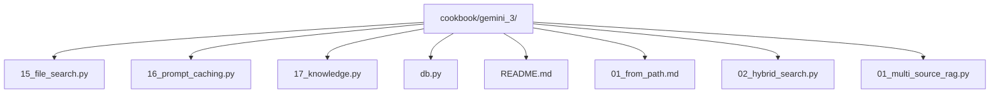
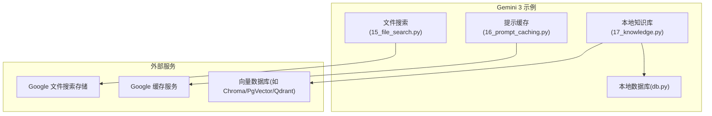
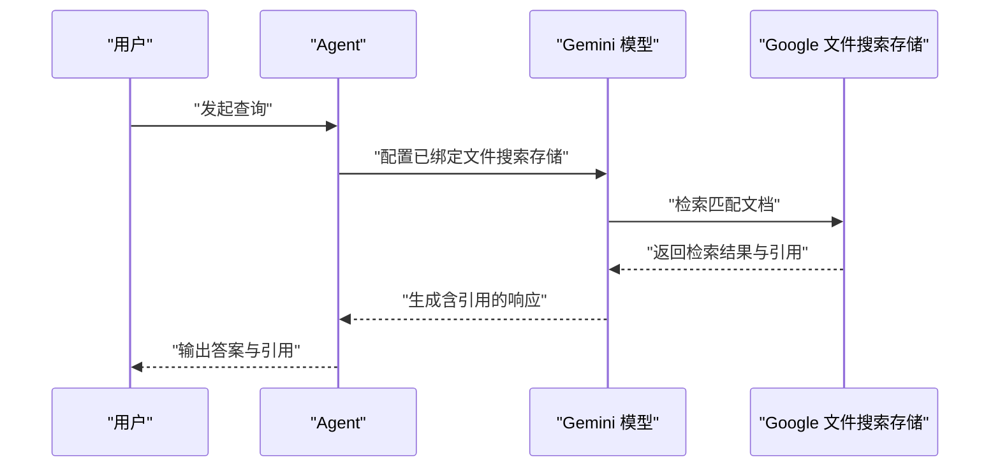
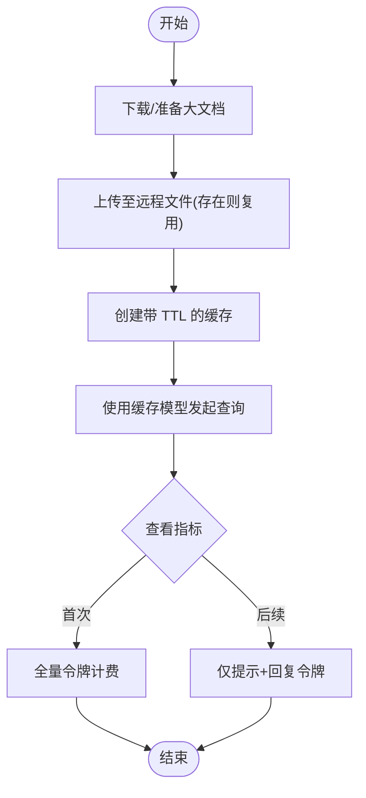
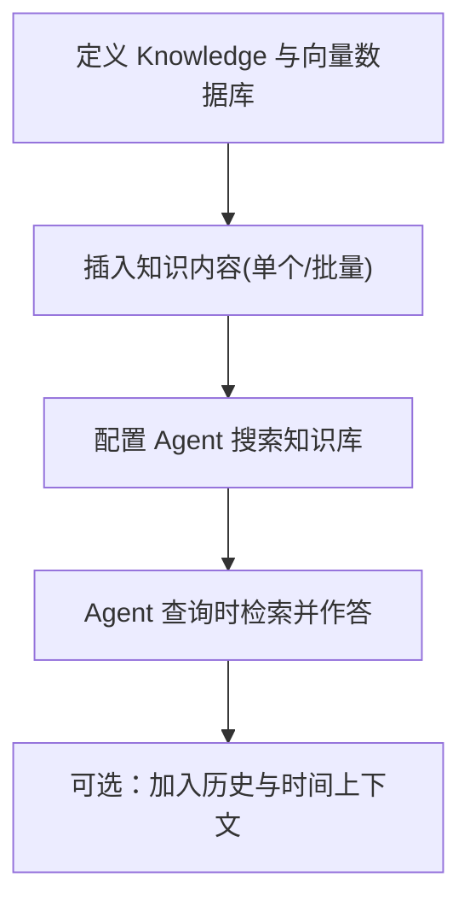
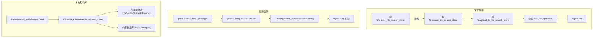

# 高级功能

<cite>
**本文引用的文件**
- [15_file_search.py](file://cookbook/gemini_3/15_file_search.py)
- [16_prompt_caching.py](file://cookbook/gemini_3/16_prompt_caching.py)
- [README.md](file://cookbook/gemini_3/README.md)
- [17_knowledge.py](file://cookbook/gemini_3/17_knowledge.py)
- [db.py](file://cookbook/gemini_3/db.py)
- [01_from_path.md](file://cookbook/07_knowledge/01_quickstart/01_from_path.md)
- [02_hybrid_search.py](file://cookbook/07_knowledge/02_building_blocks/02_hybrid_search.py)
- [01_multi_source_rag.py](file://cookbook/07_knowledge/03_production/01_multi_source_rag.py)
</cite>

## 目录
1. [简介](#简介)
2. [项目结构](#项目结构)
3. [核心组件](#核心组件)
4. [架构总览](#架构总览)
5. [详细组件分析](#详细组件分析)
6. [依赖分析](#依赖分析)
7. [性能考量](#性能考量)
8. [故障排除指南](#故障排除指南)
9. [结论](#结论)
10. [附录](#附录)

## 简介
本章节聚焦于 Gemini 3 的两项高级能力：服务器端 RAG（文件搜索）与提示缓存。前者通过“托管式文件搜索”实现可控的知识库与可验证的引用；后者通过服务端缓存大文档，显著降低重复查询的输入令牌成本，提升响应效率与性价比。本文将从技术原理、实现细节、配置方法、使用场景、性能对比、最佳实践与故障排除等方面进行系统阐述，并给出面向生产的落地建议。

## 项目结构
Gemini 3 示例代码位于 cookbook/gemini_3 目录中，高级功能示例分别为：
- 服务器端 RAG：15_file_search.py
- 提示缓存：16_prompt_caching.py
- 本地知识库（对比参考）：17_knowledge.py
- 数据库初始化：db.py
- 相关知识库文档与示例：01_from_path.md、02_hybrid_search.py、01_multi_source_rag.py

图表来源
- [README.md:59-66](file://cookbook/gemini_3/README.md#L59-L66)
- [15_file_search.py:1-124](file://cookbook/gemini_3/15_file_search.py#L1-L124)
- [16_prompt_caching.py:1-127](file://cookbook/gemini_3/16_prompt_caching.py#L1-L127)
- [17_knowledge.py:1-169](file://cookbook/gemini_3/17_knowledge.py#L1-L169)
- [db.py:1-9](file://cookbook/gemini_3/db.py#L1-L9)
- [01_from_path.md:1-191](file://cookbook/07_knowledge/01_quickstart/01_from_path.md#L1-L191)
- [02_hybrid_search.py:1-76](file://cookbook/07_knowledge/02_building_blocks/02_hybrid_search.py#L1-L76)
- [01_multi_source_rag.py:1-86](file://cookbook/07_knowledge/03_production/01_multi_source_rag.py#L1-L86)

章节来源
- [README.md:59-66](file://cookbook/gemini_3/README.md#L59-L66)

## 核心组件
- 服务器端 RAG（文件搜索）
  - 关键点：在 Google 托管的文件搜索存储中上传文档，自动分块与索引；通过模型配置启用文件搜索；生成响应时附带可验证的引用信息。
  - 典型流程：创建存储 → 上传文档 → 等待处理完成 → 配置模型使用该存储 → 发起查询 → 展示引用。
- 提示缓存
  - 关键点：通过服务端缓存大文档，后续查询仅支付提示与回复的令牌成本，大幅节省输入令牌开销；支持 TTL 控制缓存有效期。
  - 典型流程：下载/准备大文档 → 上传至远程文件 → 创建带 TTL 的缓存 → 使用缓存的模型实例发起多次查询 → 观察指标中的令牌节省效果。

章节来源
- [15_file_search.py:1-124](file://cookbook/gemini_3/15_file_search.py#L1-L124)
- [16_prompt_caching.py:1-127](file://cookbook/gemini_3/16_prompt_caching.py#L1-L127)

## 架构总览
下图展示了两种高级功能在 Gemini 3 示例中的位置与交互关系，以及与本地知识库的对比：

图表来源
- [15_file_search.py:60-86](file://cookbook/gemini_3/15_file_search.py#L60-L86)
- [16_prompt_caching.py:67-89](file://cookbook/gemini_3/16_prompt_caching.py#L67-L89)
- [17_knowledge.py:32-44](file://cookbook/gemini_3/17_knowledge.py#L32-L44)
- [db.py](file://cookbook/gemini_3/db.py#L8)

## 详细组件分析

### 服务器端 RAG（文件搜索）
- 技术原理
  - 使用模型提供的“文件搜索存储”能力，在 Google 托管的存储中上传文档，系统自动进行分块与索引；随后将该存储与模型绑定，使模型在回答时能检索并引用来源。
  - 响应中包含引用信息，便于用户核验来源，提升可信度与合规性。
- 实现要点
  - 创建文件搜索存储并命名；
  - 上传文档并等待处理完成；
  - 将存储名称赋给模型的文件搜索存储列表；
  - 发起查询并解析引用元数据。
- 配置与运行
  - 示例脚本演示了从创建存储、上传文档、等待处理、配置模型到查询与清理的完整流程。
- 对比参考（本地知识库）
  - 本地知识库使用向量数据库（如 Chroma/PgVector/Qdrant）与嵌入模型，支持混合检索策略与更灵活的控制；适合生产环境与大规模数据集。

图表来源
- [15_file_search.py:60-98](file://cookbook/gemini_3/15_file_search.py#L60-L98)

章节来源
- [15_file_search.py:1-124](file://cookbook/gemini_3/15_file_search.py#L1-L124)
- [17_knowledge.py:1-169](file://cookbook/gemini_3/17_knowledge.py#L1-L169)

### 提示缓存
- 技术原理
  - 通过创建带 TTL 的服务端缓存，将大型文档一次性加载到缓存中；后续查询仅需发送提示与接收回复，避免重复传输文档内容，从而节省输入令牌成本。
  - 支持不同 TTL 设置：开发测试（短 TTL）、交互会话（中 TTL）、批处理任务（长 TTL）。
- 实现要点
  - 下载或准备大文档；
  - 上传至远程文件（存在即复用）；
  - 创建缓存并指定系统指令与 TTL；
  - 使用带有缓存标识的模型实例进行多次查询；
  - 通过响应指标观察令牌节省情况。
- 性能对比（示例估算）
  - 一次查询：文档令牌 + 提示令牌 + 回复令牌
  - 后续查询：提示令牌 + 回复令牌
  - 以约 10 万令牌的大文档为例，查询 10 次时，未缓存约为 100 万输入令牌，缓存后约为 10 万输入令牌（文档）+ 10 次提示令牌，节省显著。

图表来源
- [16_prompt_caching.py:35-103](file://cookbook/gemini_3/16_prompt_caching.py#L35-L103)

章节来源
- [16_prompt_caching.py:1-127](file://cookbook/gemini_3/16_prompt_caching.py#L1-L127)

### 本地知识库（对比参考）
- 技术原理
  - 使用本地向量数据库与嵌入模型构建知识库，支持多种检索类型（向量、关键词、混合）；结合内容数据库持久化元数据；Agent 可自动检索知识库后再作答。
- 实现要点
  - 定义 Knowledge 实例，选择向量数据库与嵌入器；
  - 将知识内容插入知识库（支持多来源批量插入）；
  - 配置 Agent 开启搜索知识库功能；
  - 可选：启用历史上下文与时间信息增强。
- 与文件搜索对比
  - 本地知识库更适合生产环境、大规模数据与定制化检索逻辑；文件搜索适合快速原型与小规模托管方案。

图表来源
- [17_knowledge.py:32-81](file://cookbook/gemini_3/17_knowledge.py#L32-L81)
- [01_from_path.md:61-84](file://cookbook/07_knowledge/01_quickstart/01_from_path.md#L61-L84)
- [02_hybrid_search.py:31-39](file://cookbook/07_knowledge/02_building_blocks/02_hybrid_search.py#L31-L39)
- [01_multi_source_rag.py:50-71](file://cookbook/07_knowledge/03_production/01_multi_source_rag.py#L50-L71)

章节来源
- [17_knowledge.py:1-169](file://cookbook/gemini_3/17_knowledge.py#L1-L169)
- [db.py:1-9](file://cookbook/gemini_3/db.py#L1-L9)
- [01_from_path.md:1-191](file://cookbook/07_knowledge/01_quickstart/01_from_path.md#L1-L191)
- [02_hybrid_search.py:1-76](file://cookbook/07_knowledge/02_building_blocks/02_hybrid_search.py#L1-L76)
- [01_multi_source_rag.py:1-86](file://cookbook/07_knowledge/03_production/01_multi_source_rag.py#L1-L86)

## 依赖分析
- 文件搜索依赖
  - 模型对象提供创建文件搜索存储、上传文档、等待操作完成、删除存储等接口；Agent 用于发起查询并解析引用。
- 提示缓存依赖
  - genai 客户端用于创建缓存与远程文件管理；Gemini 模型通过 cached_content 参数绑定缓存；Agent 用于多次查询并观察指标。
- 本地知识库依赖
  - Knowledge 类负责内容插入与检索；向量数据库（Chroma/PgVector/Qdrant）负责向量化与相似度检索；内容数据库（Sqlite/Postgres）持久化元数据；Agent 通过 search_knowledge 控制是否自动检索。

图表来源
- [15_file_search.py:60-98](file://cookbook/gemini_3/15_file_search.py#L60-L98)
- [16_prompt_caching.py:67-103](file://cookbook/gemini_3/16_prompt_caching.py#L67-L103)
- [17_knowledge.py:32-81](file://cookbook/gemini_3/17_knowledge.py#L32-L81)
- [db.py](file://cookbook/gemini_3/db.py#L8)

章节来源
- [15_file_search.py:1-124](file://cookbook/gemini_3/15_file_search.py#L1-L124)
- [16_prompt_caching.py:1-127](file://cookbook/gemini_3/16_prompt_caching.py#L1-L127)
- [17_knowledge.py:1-169](file://cookbook/gemini_3/17_knowledge.py#L1-L169)
- [db.py:1-9](file://cookbook/gemini_3/db.py#L1-L9)

## 性能考量
- 服务器端 RAG（文件搜索）
  - 优点：托管处理、自动分块与索引、内置引用；适合小规模与快速原型。
  - 注意：大规模文档集与复杂检索策略建议使用本地知识库。
- 提示缓存
  - 优点：显著节省重复查询的输入令牌成本；适合长文档与高频问答场景。
  - 注意：缓存大小与 TTL 需按场景权衡；切换模型需重新创建缓存。
- 本地知识库
  - 优点：完全可控、可扩展、支持混合检索与多来源；适合生产与大规模部署。
  - 注意：需要维护向量数据库与嵌入模型，具备一定的运维成本。

章节来源
- [15_file_search.py:103-123](file://cookbook/gemini_3/15_file_search.py#L103-L123)
- [16_prompt_caching.py:108-126](file://cookbook/gemini_3/16_prompt_caching.py#L108-L126)
- [17_knowledge.py:155-168](file://cookbook/gemini_3/17_knowledge.py#L155-L168)

## 故障排除指南
- 环境变量与认证
  - 确保已设置正确的 API 密钥；若出现认证错误，请检查密钥配置。
- 模型 ID 不正确
  - 请确认使用的模型 ID 拼写正确；示例中使用了预览版模型 ID。
- 速率限制
  - 若遇到速率限制，请稍候重试或更换模型 ID。
- 依赖缺失
  - 如出现模块导入错误，请安装示例所需的依赖。
- 文件搜索与缓存
  - 确认上传与缓存创建成功后再进行查询；检查等待操作完成的步骤是否执行完毕。
- 本地知识库
  - 确认向量数据库与内容数据库可用；批量插入时注意去重与元数据一致性。

章节来源
- [README.md:121-129](file://cookbook/gemini_3/README.md#L121-L129)

## 结论
- 服务器端 RAG（文件搜索）适合快速原型与小规模托管方案，具备托管处理与内置引用的优势。
- 提示缓存适合长文档与高频问答场景，能显著节省输入令牌成本。
- 本地知识库适合生产环境与大规模部署，具备完全可控与可扩展的优势。
- 在生产环境中，建议根据数据规模、检索需求与合规要求选择合适的方案，并结合缓存与检索策略优化性能与成本。

## 附录
- 快速运行命令（示例）
  - 运行文件搜索示例：python cookbook/gemini_3/15_file_search.py
  - 运行提示缓存示例：python cookbook/gemini_3/16_prompt_caching.py
  - 运行本地知识库示例：python cookbook/gemini_3/17_knowledge.py
- 相关知识库文档与示例
  - 本地路径加载与 Agentic RAG：01_from_path.md
  - 检索类型（向量/关键词/混合）：02_hybrid_search.py
  - 多来源 RAG（批量插入）：01_multi_source_rag.py

章节来源
- [README.md:76-109](file://cookbook/gemini_3/README.md#L76-L109)
- [01_from_path.md:1-191](file://cookbook/07_knowledge/01_quickstart/01_from_path.md#L1-L191)
- [02_hybrid_search.py:1-76](file://cookbook/07_knowledge/02_building_blocks/02_hybrid_search.py#L1-L76)
- [01_multi_source_rag.py:1-86](file://cookbook/07_knowledge/03_production/01_multi_source_rag.py#L1-L86)