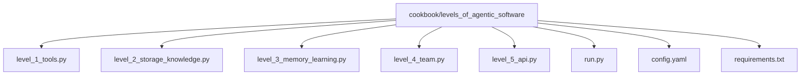
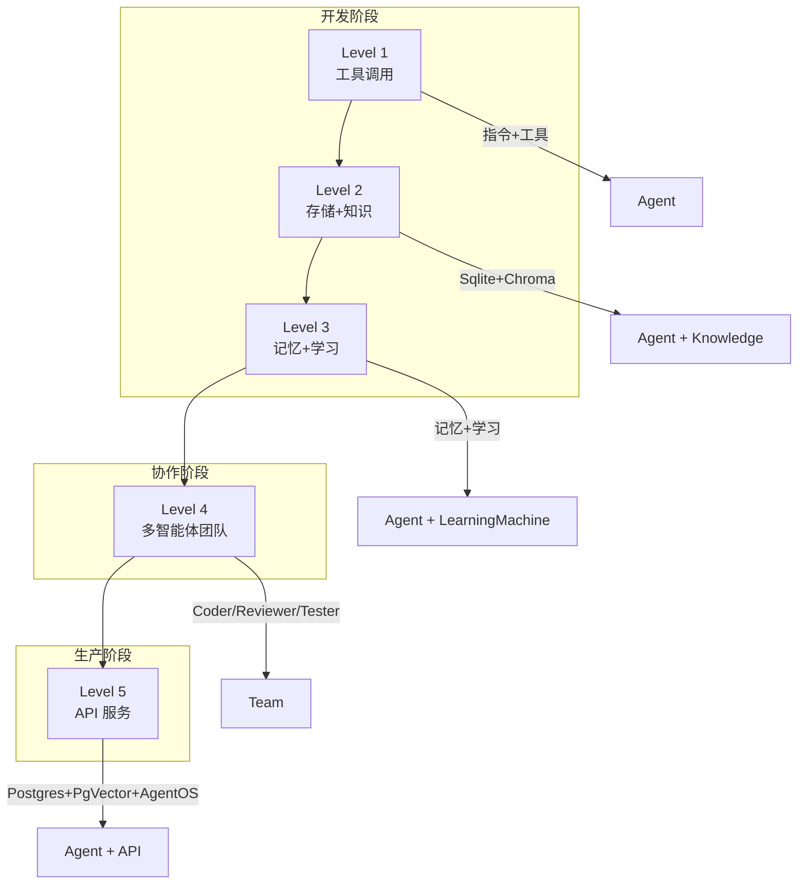
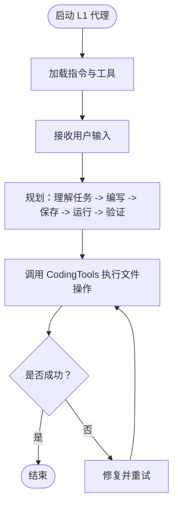
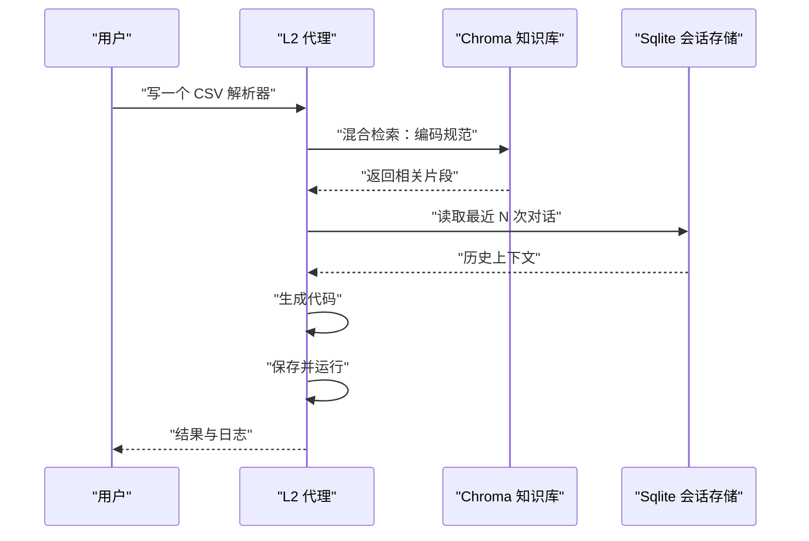
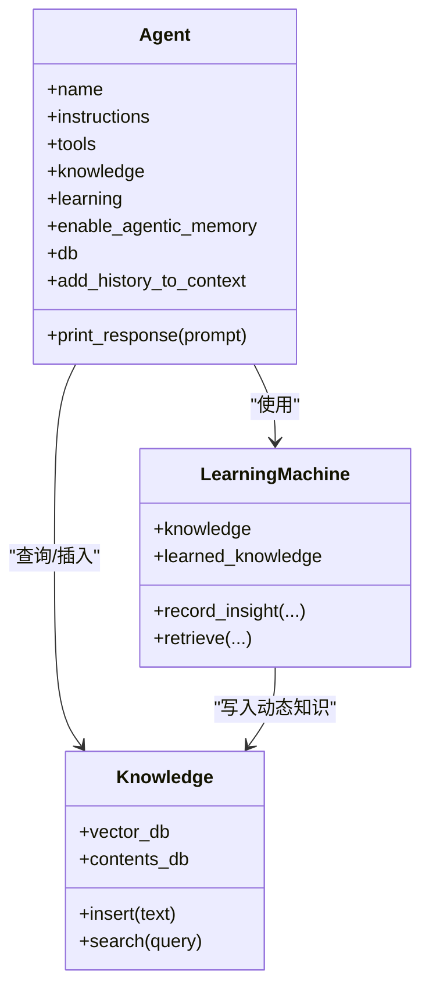
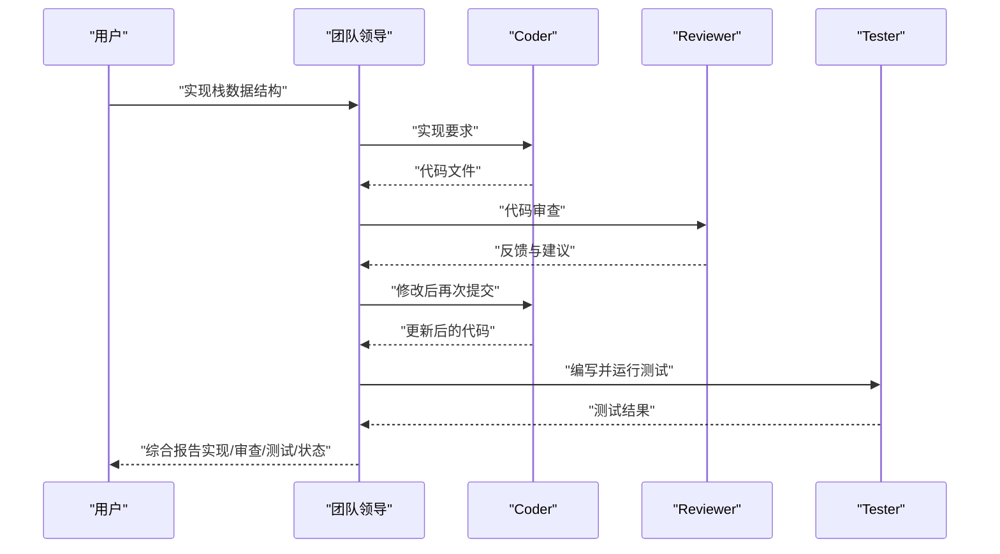
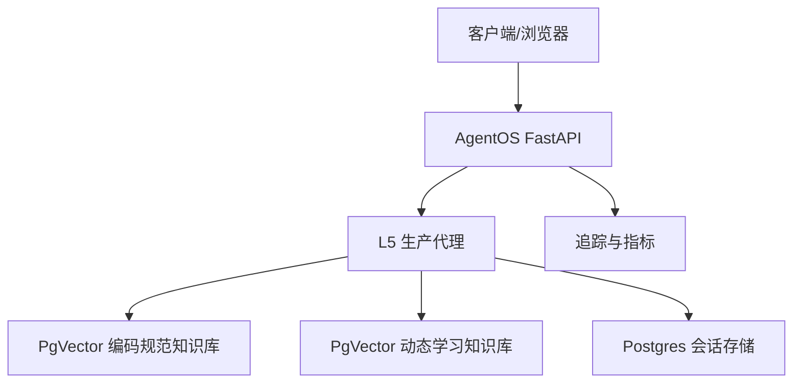
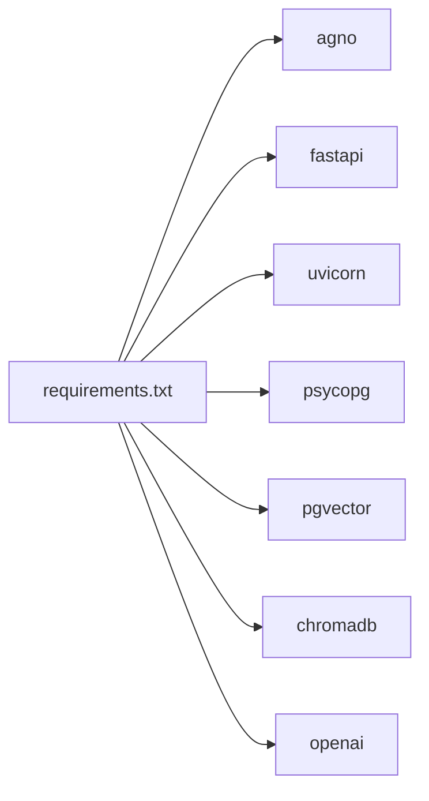

# 软件层级

<cite>
**本文引用的文件**
- [README.md](file://cookbook/levels_of_agentic_software/README.md)
- [config.yaml](file://cookbook/levels_of_agentic_software/config.yaml)
- [run.py](file://cookbook/levels_of_agentic_software/run.py)
- [level_1_tools.py](file://cookbook/levels_of_agentic_software/level_1_tools.py)
- [level_2_storage_knowledge.py](file://cookbook/levels_of_agentic_software/level_2_storage_knowledge.py)
- [level_3_memory_learning.py](file://cookbook/levels_of_agentic_software/level_3_memory_learning.py)
- [level_4_team.py](file://cookbook/levels_of_agentic_software/level_4_team.py)
- [level_5_api.py](file://cookbook/levels_of_agentic_software/level_5_api.py)
- [requirements.txt](file://cookbook/levels_of_agentic_software/requirements.txt)
</cite>

## 目录
1. [引言](#引言)
2. [项目结构](#项目结构)
3. [核心组件](#核心组件)
4. [架构总览](#架构总览)
5. [详细组件分析](#详细组件分析)
6. [依赖分析](#依赖分析)
7. [性能考虑](#性能考虑)
8. [故障排查指南](#故障排查指南)
9. [结论](#结论)
10. [附录](#附录)

## 引言
本项目通过“软件层级”示例系统性展示了从简单工具调用到复杂 API 服务的五层架构演进路径。每一层在前一层基础上增量添加能力：第一层为无状态工具调用；第二层引入持久化存储与知识库；第三层加入记忆与学习；第四层构建多智能体团队；第五层则提供生产级数据库、向量检索与 API 服务。该示例强调“先做简单，再按需扩展”的设计哲学，帮助开发者理解 agentic 软件的发展路径与性能权衡。

## 项目结构
- 核心目录：cookbook/levels_of_agentic_software
- 关键文件：
  - level_1_tools.py：第一层示例（工具 + 指令）
  - level_2_storage_knowledge.py：第二层示例（存储 + 知识）
  - level_3_memory_learning.py：第三层示例（记忆 + 学习）
  - level_4_team.py：第四层示例（多智能体团队）
  - level_5_api.py：第五层示例（生产 API）
  - run.py：Agent OS 启动器，统一注册并运行所有层级
  - config.yaml：各层级预设提示词集合
  - requirements.txt：依赖清单

图表来源
- [run.py:1-69](file://cookbook/levels_of_agentic_software/run.py#L1-L69)
- [level_1_tools.py:1-77](file://cookbook/levels_of_agentic_software/level_1_tools.py#L1-L77)
- [level_2_storage_knowledge.py:1-147](file://cookbook/levels_of_agentic_software/level_2_storage_knowledge.py#L1-L147)
- [level_3_memory_learning.py:1-168](file://cookbook/levels_of_agentic_software/level_3_memory_learning.py#L1-L168)
- [level_4_team.py:1-185](file://cookbook/levels_of_agentic_software/level_4_team.py#L1-L185)
- [level_5_api.py:1-144](file://cookbook/levels_of_agentic_software/level_5_api.py#L1-L144)
- [config.yaml:1-32](file://cookbook/levels_of_agentic_software/config.yaml#L1-L32)
- [requirements.txt:1-351](file://cookbook/levels_of_agentic_software/requirements.txt#L1-L351)

章节来源
- [README.md:1-122](file://cookbook/levels_of_agentic_software/README.md#L1-L122)
- [run.py:1-69](file://cookbook/levels_of_agentic_software/run.py#L1-L69)

## 核心组件
- 第一层（工具调用）：以指令与工具为核心，无状态执行，适合自包含任务。
- 第二层（存储与知识）：引入 Sqlite 会话存储与 Chroma 向量知识库，支持混合检索与历史上下文。
- 第三层（记忆与学习）：增加 LearningMachine、AGENTIC 动态知识与用户偏好记忆，持续改进。
- 第四层（团队协作）：多智能体团队（Coder/Reviewer/Tester），由团队领导协调流程。
- 第五层（API 服务）：生产级 Postgres + PgVector，AgentOS 提供 Web UI、追踪与会话管理。

章节来源
- [level_1_tools.py:1-77](file://cookbook/levels_of_agentic_software/level_1_tools.py#L1-L77)
- [level_2_storage_knowledge.py:1-147](file://cookbook/levels_of_agentic_software/level_2_storage_knowledge.py#L1-L147)
- [level_3_memory_learning.py:1-168](file://cookbook/levels_of_agentic_software/level_3_memory_learning.py#L1-L168)
- [level_4_team.py:1-185](file://cookbook/levels_of_agentic_software/level_4_team.py#L1-L185)
- [level_5_api.py:1-144](file://cookbook/levels_of_agentic_software/level_5_api.py#L1-L144)

## 架构总览
下图展示了五层架构的演进关系与关键依赖：从单一 Agent 到多 Agent 团队，再到生产级 API 服务；从本地嵌入式数据库到云原生向量数据库与分布式追踪。

图表来源
- [level_1_tools.py:58-65](file://cookbook/levels_of_agentic_software/level_1_tools.py#L58-L65)
- [level_2_storage_knowledge.py:81-93](file://cookbook/levels_of_agentic_software/level_2_storage_knowledge.py#L81-L93)
- [level_3_memory_learning.py:102-124](file://cookbook/levels_of_agentic_software/level_3_memory_learning.py#L102-L124)
- [level_4_team.py:145-172](file://cookbook/levels_of_agentic_software/level_4_team.py#L145-L172)
- [level_5_api.py:109-131](file://cookbook/levels_of_agentic_software/level_5_api.py#L109-L131)

## 详细组件分析

### 第一层：工具调用（Level 1）
- 设计理念：最小可用代理，仅通过明确指令与工具完成任务，无状态、易部署。
- 关键特性：
  - 明确工作流与规则
  - 使用 CodingTools 进行文件读写与运行
  - 支持流式输出与时间戳上下文
- 典型使用场景：单次任务、无需记忆或知识库的脚本编写与验证。
- 升级建议：当需要跨会话记忆或领域知识时，进入第二层。

图表来源
- [level_1_tools.py:36-53](file://cookbook/levels_of_agentic_software/level_1_tools.py#L36-L53)
- [level_1_tools.py:58-65](file://cookbook/levels_of_agentic_software/level_1_tools.py#L58-L65)

章节来源
- [level_1_tools.py:1-77](file://cookbook/levels_of_agentic_software/level_1_tools.py#L1-L77)

### 第二层：存储与知识（Level 2）
- 设计理念：在 L1 基础上引入持久化与可检索的知识库，支持会话历史与领域知识。
- 关键特性：
  - SqliteDb：跨会话存储聊天历史
  - ChromaDb：混合检索（向量+关键词）的编码规范知识库
  - 搜索知识与历史上下文注入
- 典型使用场景：需要遵循项目约定、复用历史经验的任务。
- 升级建议：当需要个性化偏好与动态学习时，进入第三层。

图表来源
- [level_2_storage_knowledge.py:43-53](file://cookbook/levels_of_agentic_software/level_2_storage_knowledge.py#L43-L53)
- [level_2_storage_knowledge.py:81-93](file://cookbook/levels_of_agentic_software/level_2_storage_knowledge.py#L81-L93)

章节来源
- [level_2_storage_knowledge.py:1-147](file://cookbook/levels_of_agentic_software/level_2_storage_knowledge.py#L1-L147)

### 第三层：记忆与学习（Level 3）
- 设计理念：代理具备“学习”能力，能记录用户偏好与通用模式，随交互不断优化。
- 关键特性：
  - LearningMachine：捕捉洞察与偏好
  - LearnedKnowledge（AGENTIC 模式）：由代理决定保存与检索
  - Agentic memory：构建用户画像
  - ReasoningTools：结构化推理工具
- 典型使用场景：需要个性化风格与持续改进的编码任务。
- 升级建议：当任务需要多人协作与流程编排时，进入第四层。

图表来源
- [level_3_memory_learning.py:102-124](file://cookbook/levels_of_agentic_software/level_3_memory_learning.py#L102-L124)
- [level_3_memory_learning.py:112-117](file://cookbook/levels_of_agentic_software/level_3_memory_learning.py#L112-L117)
- [level_3_memory_learning.py:65-74](file://cookbook/levels_of_agentic_software/level_3_memory_learning.py#L65-L74)

章节来源
- [level_3_memory_learning.py:1-168](file://cookbook/levels_of_agentic_software/level_3_memory_learning.py#L1-L168)

### 第四层：团队协作（Level 4）
- 设计理念：将职责拆分给多个专门智能体，由团队领导统一协调，提升质量与覆盖率。
- 关键特性：
  - Coder：实现代码
  - Reviewer：审查质量与规范
  - Tester：编写并运行测试
  - Team：合成最终报告
- 典型使用场景：需要高质量交付与全面测试的工程任务。
- 升级建议：当需要对外提供服务与可观测性时，进入第五层。

图表来源
- [level_4_team.py:149-167](file://cookbook/levels_of_agentic_software/level_4_team.py#L149-L167)
- [level_4_team.py:49-70](file://cookbook/levels_of_agentic_software/level_4_team.py#L49-L70)
- [level_4_team.py:75-113](file://cookbook/levels_of_agentic_software/level_4_team.py#L75-L113)
- [level_4_team.py:118-140](file://cookbook/levels_of_agentic_software/level_4_team.py#L118-L140)

章节来源
- [level_4_team.py:1-185](file://cookbook/levels_of_agentic_software/level_4_team.py#L1-L185)

### 第五层：API 服务（Level 5）
- 设计理念：生产级基础设施，提供可扩展、可观测、可治理的 API 服务。
- 关键特性：
  - PostgresDb：高可用会话存储
  - PgVector：生产级向量检索
  - AgentOS：FastAPI 服务器 + Web UI + 追踪
- 典型使用场景：多用户并发、需要审计与监控的生产环境。
- 升级建议：在 L5 基础上可进一步扩展为多租户、权限控制与弹性扩缩容。

图表来源
- [level_5_api.py:58-81](file://cookbook/levels_of_agentic_software/level_5_api.py#L58-L81)
- [level_5_api.py:109-131](file://cookbook/levels_of_agentic_software/level_5_api.py#L109-L131)
- [run.py:55-61](file://cookbook/levels_of_agentic_software/run.py#L55-L61)

章节来源
- [level_5_api.py:1-144](file://cookbook/levels_of_agentic_software/level_5_api.py#L1-L144)
- [run.py:1-69](file://cookbook/levels_of_agentic_software/run.py#L1-L69)

## 依赖分析
- 统一依赖来源：requirements.txt
- 核心依赖类别：
  - 框架与服务：FastAPI、uvicorn、psycopg、pgvector
  - 向量与嵌入：chromadb、pgvector、openai embeddings
  - 工具与模型：openai、agno（核心库）
- 依赖关系可视化（节选）：

图表来源
- [requirements.txt:1-351](file://cookbook/levels_of_agentic_software/requirements.txt#L1-L351)

章节来源
- [requirements.txt:1-351](file://cookbook/levels_of_agentic_software/requirements.txt#L1-L351)

## 性能考虑
- 数据库选择：
  - 开发阶段：Chroma（嵌入式）与 Sqlite（轻量）
  - 生产阶段：Postgres + PgVector（高并发、可扩展）
- 检索策略：
  - 混合检索（向量+关键词）在准确性与性能间取得平衡
- 并发与会话：
  - L5 使用 Postgres 保证多用户一致性与事务隔离
- 可观测性：
  - AgentOS 提供追踪与指标，便于定位瓶颈与回归

## 故障排查指南
- 环境变量与密钥
  - 设置 OPENAI_API_KEY 等必要环境变量
- 数据库准备
  - L5 需先启动 PostgreSQL + PgVector（端口 5532）
- 运行方式
  - 单独运行某一层：python level_X_*.py
  - 通过 Agent OS 统一运行：python run.py，访问 https://os.agno.com
- 常见问题
  - Postgres 连接失败：检查连接串与容器状态
  - Chroma/向量库初始化失败：确认嵌入模型可用与网络连通
  - 权限不足：确保工作目录与数据库用户权限正确

章节来源
- [README.md:35-81](file://cookbook/levels_of_agentic_software/README.md#L35-L81)
- [run.py:30-34](file://cookbook/levels_of_agentic_software/run.py#L30-L34)

## 结论
五层架构清晰地展示了 agentic 软件从“简单工具调用”到“生产 API 服务”的演进路径。每层都围绕真实需求逐步增强能力：从无状态到有记忆、从单智能体到多智能体团队、从开发环境到生产基础设施。开发者应遵循“先做简单、再按需扩展”的原则，在合适层级投入相应资源，以获得最佳的成本与收益比。

## 附录
- 快速开始
  - 安装依赖：参考 requirements.txt
  - 设置 API 密钥：OPENAI_API_KEY
  - 运行任一层：python level_X_*.py 或通过 Agent OS
- 使用场景对照
  - Level 1：自包含任务、无需记忆
  - Level 2：需要领域知识与历史上下文
  - Level 3：个性化偏好与持续改进
  - Level 4：需要多方协作与全面测试
  - Level 5：多用户并发、可观测的生产服务

章节来源
- [README.md:111-122](file://cookbook/levels_of_agentic_software/README.md#L111-L122)
- [config.yaml:1-32](file://cookbook/levels_of_agentic_software/config.yaml#L1-L32)