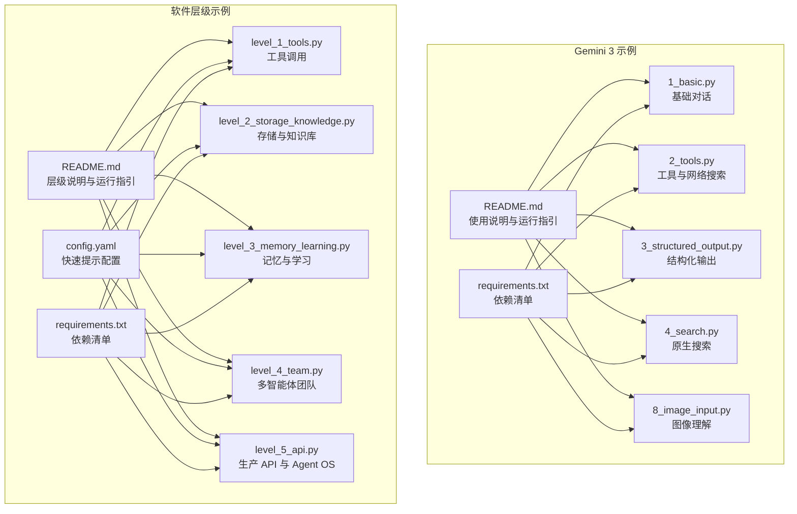
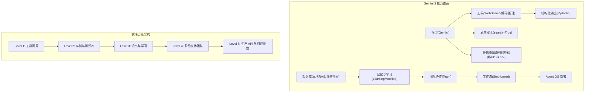
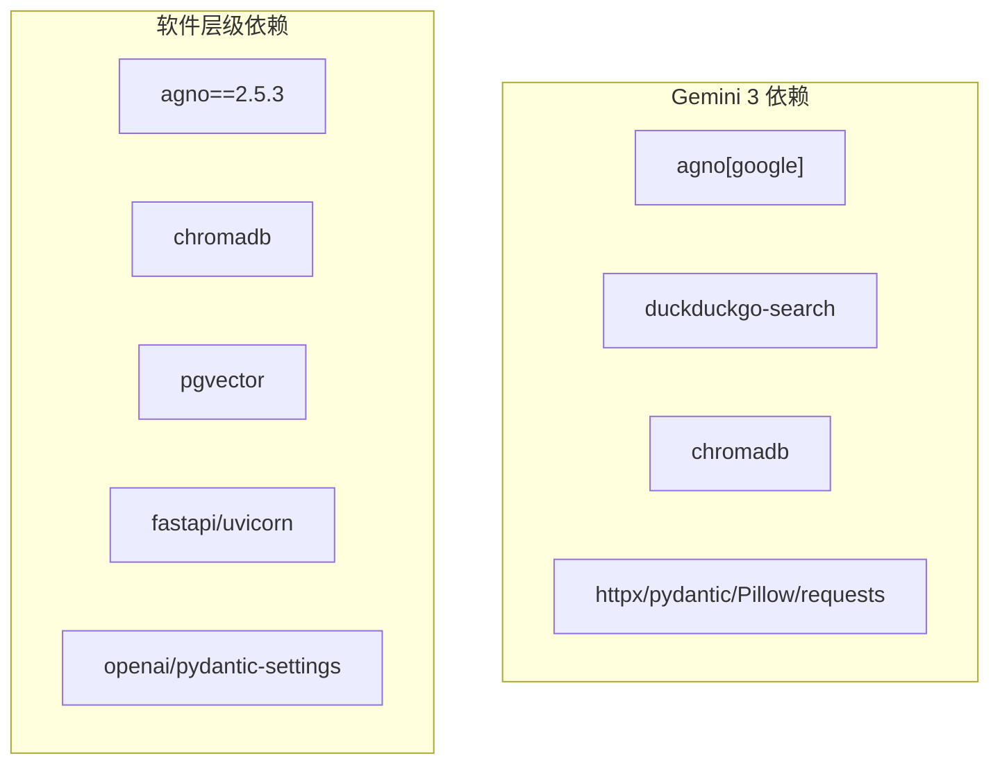

# 高级示例

<cite>
**本文引用的文件**
- [README.md](file://cookbook/gemini_3/README.md)
- [requirements.txt](file://cookbook/gemini_3/requirements.txt)
- [1_basic.py](file://cookbook/gemini_3/1_basic.py)
- [2_tools.py](file://cookbook/gemini_3/2_tools.py)
- [3_structured_output.py](file://cookbook/gemini_3/3_structured_output.py)
- [4_search.py](file://cookbook/gemini_3/4_search.py)
- [8_image_input.py](file://cookbook/gemini_3/8_image_input.py)
- [README.md](file://cookbook/levels_of_agentic_software/README.md)
- [requirements.txt](file://cookbook/levels_of_agentic_software/requirements.txt)
- [config.yaml](file://cookbook/levels_of_agentic_software/config.yaml)
- [level_1_tools.py](file://cookbook/levels_of_agentic_software/level_1_tools.py)
- [level_2_storage_knowledge.py](file://cookbook/levels_of_agentic_software/level_2_storage_knowledge.py)
- [level_3_memory_learning.py](file://cookbook/levels_of_agentic_software/level_3_memory_learning.py)
- [level_4_team.py](file://cookbook/levels_of_agentic_software/level_4_team.py)
- [level_5_api.py](file://cookbook/levels_of_agentic_software/level_5_api.py)
</cite>

## 目录
1. [简介](#简介)
2. [项目结构](#项目结构)
3. [核心组件](#核心组件)
4. [架构总览](#架构总览)
5. [详细组件分析](#详细组件分析)
6. [依赖关系分析](#依赖关系分析)
7. [性能考量](#性能考量)
8. [故障排查指南](#故障排查指南)
9. [结论](#结论)
10. [附录](#附录)

## 简介
本章节面向希望构建复杂智能体系统的开发者，系统性介绍两类高级示例：Gemini 3 集成示例与“软件层级”进阶示例。前者以 Google Gemini 3 为主线，逐步演示从基础对话到多模态理解、原生搜索、结构化输出、团队协作与工作流编排；后者以“五级架构”为线索，从无状态工具调用起步，逐步引入存储与知识库、记忆与学习、多智能体团队、再到生产级 API 与可观测性，帮助读者建立对复杂 agentic 场景的系统性认知。

## 项目结构
本仓库中与高级示例直接相关的核心路径如下：
- cookbook/gemini_3：以 Gemini 3 为核心，按步骤拆分的示例集合，覆盖基础对话、工具、结构化输出、原生搜索、多模态输入、检索增强、记忆学习、团队协作、工作流与 Agent OS 部署。
- cookbook/levels_of_agentic_software：以“五级架构”为线索，从 Level 1 到 Level 5 逐步演进，展示 agentic 软件在不同阶段的架构设计、数据与知识基础设施、团队协作与生产部署。

图表来源
- [README.md:1-135](file://cookbook/gemini_3/README.md#L1-L135)
- [requirements.txt:1-8](file://cookbook/gemini_3/requirements.txt#L1-L8)
- [README.md:1-122](file://cookbook/levels_of_agentic_software/README.md#L1-L122)
- [config.yaml:1-32](file://cookbook/levels_of_agentic_software/config.yaml#L1-L32)
- [requirements.txt:1-351](file://cookbook/levels_of_agentic_software/requirements.txt#L1-L351)

章节来源
- [README.md:1-135](file://cookbook/gemini_3/README.md#L1-L135)
- [README.md:1-122](file://cookbook/levels_of_agentic_software/README.md#L1-L122)

## 核心组件
- 智能体（Agent）：Agno 的核心抽象，封装模型、指令、工具、知识库、存储、记忆等能力，并提供同步/异步、流式/非流式的多种执行模式。
- 模型适配器：以 Gemini 为例，通过模型适配器注入推理能力，支持原生搜索、多模态输入、结构化输出等特性。
- 工具集（Toolkit）：内置工具如网络搜索、编码工具、推理工具等，也可自定义工具。
- 知识库（Knowledge）：结合向量数据库（Chroma、PgVector）与内容数据库（Sqlite、Postgres），实现静态知识与动态学习的混合检索。
- 记忆与学习（LearningMachine）：记录交互经验，形成可复用的“学习”知识，支持 AGENTIC 模式下的自主决策与偏好建模。
- 团队（Team）：由多个角色明确的智能体组成，通过团队领导进行任务分解与结果合成。
- 工作流（Workflow）：以步骤化的方式编排复杂流程，支持条件分支、并行执行与循环控制。
- Agent OS：提供 Web UI、会话管理、追踪与部署能力，便于在浏览器中交互与调试。

章节来源
- [1_basic.py:1-84](file://cookbook/gemini_3/1_basic.py#L1-L84)
- [2_tools.py:1-92](file://cookbook/gemini_3/2_tools.py#L1-L92)
- [3_structured_output.py:1-94](file://cookbook/gemini_3/3_structured_output.py#L1-L94)
- [4_search.py:1-84](file://cookbook/gemini_3/4_search.py#L1-L84)
- [8_image_input.py:1-92](file://cookbook/gemini_3/8_image_input.py#L1-L92)
- [level_1_tools.py:1-77](file://cookbook/levels_of_agentic_software/level_1_tools.py#L1-L77)
- [level_2_storage_knowledge.py:1-147](file://cookbook/levels_of_agentic_software/level_2_storage_knowledge.py#L1-L147)
- [level_3_memory_learning.py:1-168](file://cookbook/levels_of_agentic_software/level_3_memory_learning.py#L1-L168)
- [level_4_team.py:1-185](file://cookbook/levels_of_agentic_software/level_4_team.py#L1-L185)
- [level_5_api.py:1-144](file://cookbook/levels_of_agentic_software/level_5_api.py#L1-L144)

## 架构总览
下图展示了 Gemini 3 示例与软件层级示例在不同阶段的能力叠加与组合方式。左侧为 Gemini 3 的能力谱系，右侧为软件层级的架构演进路径，二者均以智能体为中心，围绕“模型—工具—知识—记忆—团队—工作流—部署”的维度逐步扩展。

图表来源
- [README.md:28-75](file://cookbook/gemini_3/README.md#L28-L75)
- [README.md:1-122](file://cookbook/levels_of_agentic_software/README.md#L1-L122)

## 详细组件分析

### Gemini 3 示例：集成、多模态与性能优化
本节聚焦于 Gemini 3 的端到端集成路径，涵盖基础对话、工具调用、结构化输出、原生搜索、多模态输入、检索增强、记忆学习、团队协作与工作流编排，并给出性能优化建议。

- 基础对话与执行模式
  - 支持同步、异步、流式与非流式四种执行模式，适合开发调试与生产部署的不同场景。
  - 参考路径：[1_basic.py:1-84](file://cookbook/gemini_3/1_basic.py#L1-L84)

- 工具与网络搜索
  - 通过 WebSearchTools 实现无需 API 密钥的网络搜索；可与系统指令结合，形成清晰的工作流与规则。
  - 参考路径：[2_tools.py:1-92](file://cookbook/gemini_3/2_tools.py#L1-L92)

- 结构化输出
  - 使用 Pydantic 定义输出模式，确保返回字段的类型安全与一致性，便于后续 UI 渲染、数据库入库与比较分析。
  - 参考路径：[3_structured_output.py:1-94](file://cookbook/gemini_3/3_structured_output.py#L1-L94)

- 原生搜索
  - 在模型层启用 search=True，实现无缝的实时信息检索；与工具式搜索相比更易用但可控性略低。
  - 参考路径：[4_search.py:1-84](file://cookbook/gemini_3/4_search.py#L1-L84)

- 多模态输入
  - 支持图像、音频、视频、PDF、CSV 等多模态输入；可结合搜索获取上下文，或与结构化输出配合抽取关键信息。
  - 参考路径：[8_image_input.py:1-92](file://cookbook/gemini_3/8_image_input.py#L1-L92)

- 性能优化策略
  - 选择合适的模型 ID 与参数（如 search=True）以平衡速度与准确性。
  - 对大文档采用“提示缓存”（Prompt Caching）减少重复计算成本。
  - 合理使用结构化输出与工具调用，避免不必要的往返与解析开销。
  - 在多模态场景中，优先使用本地文件或已缓存资源，减少网络传输延迟。
  - 参考路径：[README.md:121-129](file://cookbook/gemini_3/README.md#L121-L129)

章节来源
- [1_basic.py:1-84](file://cookbook/gemini_3/1_basic.py#L1-L84)
- [2_tools.py:1-92](file://cookbook/gemini_3/2_tools.py#L1-L92)
- [3_structured_output.py:1-94](file://cookbook/gemini_3/3_structured_output.py#L1-L94)
- [4_search.py:1-84](file://cookbook/gemini_3/4_search.py#L1-L84)
- [8_image_input.py:1-92](file://cookbook/gemini_3/8_image_input.py#L1-L92)
- [README.md:121-129](file://cookbook/gemini_3/README.md#L121-L129)

### 软件层级：概念、实现与性能对比
本节系统讲解“五级架构”，从 Level 1 的无状态工具调用到 Level 5 的生产 API 与可观测性，展示架构如何随复杂度增长而演进，并给出各层级的适用场景与性能特征。

- Level 1：工具调用
  - 仅模型与工具，无记忆、无持久化，适合一次性任务。
  - 参考路径：[level_1_tools.py:1-77](file://cookbook/levels_of_agentic_software/level_1_tools.py#L1-L77)

- Level 2：存储与知识库
  - 引入 SqliteDb 与 ChromaDb，实现会话历史与领域知识的混合检索。
  - 参考路径：[level_2_storage_knowledge.py:1-147](file://cookbook/levels_of_agentic_software/level_2_storage_knowledge.py#L1-L147)

- Level 3：记忆与学习
  - 加入 LearningMachine 与 AGENTIC 学习模式，使智能体具备偏好建模与经验沉淀能力。
  - 参考路径：[level_3_memory_learning.py:1-168](file://cookbook/levels_of_agentic_software/level_3_memory_learning.py#L1-L168)

- Level 4：多智能体团队
  - 将职责拆分给 Coder、Reviewer、Tester，由团队领导协调与汇总，适合需要多方视角的任务。
  - 参考路径：[level_4_team.py:1-185](file://cookbook/levels_of_agentic_software/level_4_team.py#L1-L185)

- Level 5：生产 API 与可观测性
  - 升级至 Postgres + PgVector，引入 Agent OS 提供 Web UI、追踪与会话管理，适合多用户、高并发的生产环境。
  - 参考路径：[level_5_api.py:1-144](file://cookbook/levels_of_agentic_software/level_5_api.py#L1-L144)

- 性能对比与选型建议
  - Level 1 最快、最简单，适合单次任务与原型验证。
  - Level 2 平衡了上下文与知识，适合需要遵循规范与参考历史的场景。
  - Level 3 在迭代中提升质量与效率，适合长期维护与改进的项目。
  - Level 4 在人机协同与质量把关上优势明显，适合需要评审与测试的流程。
  - Level 5 具备生产级稳定性与可观测性，适合多用户、高负载与合规要求高的系统。
  - 参考路径：[README.md:111-122](file://cookbook/levels_of_agentic_software/README.md#L111-L122)

章节来源
- [level_1_tools.py:1-77](file://cookbook/levels_of_agentic_software/level_1_tools.py#L1-L77)
- [level_2_storage_knowledge.py:1-147](file://cookbook/levels_of_agentic_software/level_2_storage_knowledge.py#L1-L147)
- [level_3_memory_learning.py:1-168](file://cookbook/levels_of_agentic_software/level_3_memory_learning.py#L1-L168)
- [level_4_team.py:1-185](file://cookbook/levels_of_agentic_software/level_4_team.py#L1-L185)
- [level_5_api.py:1-144](file://cookbook/levels_of_agentic_software/level_5_api.py#L1-L144)
- [README.md:111-122](file://cookbook/levels_of_agentic_software/README.md#L111-L122)

### 设计理念与架构原理
- 分层渐进：从无状态工具调用开始，逐步引入存储、知识、记忆、团队与工作流，避免过早复杂化。
- 能力组合：模型、工具、知识、记忆、团队与工作流相互解耦，可在不同层级自由组合。
- 可观测性：通过 Agent OS 提供的 Web UI、追踪与会话管理，便于调试与运维。
- 性能优先：在多模态、检索与团队协作等高开销场景中，采用缓存、结构化输出与异步执行等策略降低延迟与提升吞吐。

章节来源
- [README.md:1-135](file://cookbook/gemini_3/README.md#L1-L135)
- [README.md:1-122](file://cookbook/levels_of_agentic_software/README.md#L1-L122)

### 高级用例实现
- 多代理协作
  - 通过 Team 组织 Coder、Reviewer、Tester，明确分工与反馈闭环，适合需要质量把关与测试覆盖的场景。
  - 参考路径：[level_4_team.py:1-185](file://cookbook/levels_of_agentic_software/level_4_team.py#L1-L185)

- 复杂工作流编排
  - 使用步骤化工作流实现条件分支、并行执行与循环控制，适合需要确定性与可预测性的流程。
  - 参考路径：[README.md:66-75](file://cookbook/gemini_3/README.md#L66-L75)

- 高级知识管理
  - 静态知识库（Chroma/PgVector）与动态学习（LearningMachine）双轨并行，既保证规范遵循，又支持持续改进。
  - 参考路径：[level_3_memory_learning.py:1-168](file://cookbook/levels_of_agentic_software/level_3_memory_learning.py#L1-L168)
  - 参考路径：[level_5_api.py:1-144](file://cookbook/levels_of_agentic_software/level_5_api.py#L1-L144)

章节来源
- [level_4_team.py:1-185](file://cookbook/levels_of_agentic_software/level_4_team.py#L1-L185)
- [README.md:66-75](file://cookbook/gemini_3/README.md#L66-L75)
- [level_3_memory_learning.py:1-168](file://cookbook/levels_of_agentic_software/level_3_memory_learning.py#L1-L168)
- [level_5_api.py:1-144](file://cookbook/levels_of_agentic_software/level_5_api.py#L1-L144)

### 使用指南与最佳实践
- Gemini 3 快速上手
  - 安装依赖、设置 API Key、逐级运行示例，先从基础对话与工具开始，再逐步引入结构化输出、原生搜索与多模态。
  - 参考路径：[README.md:76-109](file://cookbook/gemini_3/README.md#L76-L109)
  - 参考路径：[requirements.txt:1-8](file://cookbook/gemini_3/requirements.txt#L1-L8)

- 软件层级实践
  - 从 Level 1 开始，根据问题复杂度逐步升级；在需要多用户与高并发时再迁移到 Level 5。
  - 参考路径：[README.md:41-91](file://cookbook/levels_of_agentic_software/README.md#L41-L91)
  - 参考路径：[config.yaml:1-32](file://cookbook/levels_of_agentic_software/config.yaml#L1-L32)

- 最佳实践
  - 明确每一步新增的能力边界，避免一次性堆叠过多复杂度。
  - 在工具与模型之间做权衡：工具可控性强，模型原生能力更易用。
  - 使用结构化输出统一数据形态，简化下游处理。
  - 在团队协作中明确角色与输出格式，减少沟通成本。
  - 在生产环境引入可观测性与缓存策略，保障性能与稳定性。
  - 参考路径：[README.md:121-129](file://cookbook/gemini_3/README.md#L121-L129)
  - 参考路径：[README.md:111-122](file://cookbook/levels_of_agentic_software/README.md#L111-L122)

章节来源
- [README.md:76-109](file://cookbook/gemini_3/README.md#L76-L109)
- [requirements.txt:1-8](file://cookbook/gemini_3/requirements.txt#L1-L8)
- [README.md:41-91](file://cookbook/levels_of_agentic_software/README.md#L41-L91)
- [config.yaml:1-32](file://cookbook/levels_of_agentic_software/config.yaml#L1-L32)
- [README.md:121-129](file://cookbook/gemini_3/README.md#L121-L129)
- [README.md:111-122](file://cookbook/levels_of_agentic_software/README.md#L111-L122)

## 依赖关系分析
- Gemini 3 示例依赖 agno 的 Google 模型适配器与内置工具，以及第三方库如 DuckDuckGo 搜索、Chroma、Pillow、Requests 等。
- 软件层级示例依赖 agno 的多数据库适配器（Sqlite、Postgres）、向量数据库（Chroma、PgVector）、FastAPI、Uvicorn 等，用于生产级部署与可观测性。

图表来源
- [requirements.txt:1-8](file://cookbook/gemini_3/requirements.txt#L1-L8)
- [requirements.txt:1-351](file://cookbook/levels_of_agentic_software/requirements.txt#L1-L351)

章节来源
- [requirements.txt:1-8](file://cookbook/gemini_3/requirements.txt#L1-L8)
- [requirements.txt:1-351](file://cookbook/levels_of_agentic_software/requirements.txt#L1-L351)

## 性能考量
- 执行模式选择
  - 开发与调试：同步阻塞模式，便于快速验证。
  - 生产部署：异步非阻塞模式，提高并发与响应性。
  - 参考路径：[1_basic.py:60-83](file://cookbook/gemini_3/1_basic.py#L60-L83)

- 模型与参数
  - 根据任务选择合适模型 ID 与参数（如 search=True），在速度与准确性间取得平衡。
  - 参考路径：[README.md:121-129](file://cookbook/gemini_3/README.md#L121-L129)

- 缓存与预处理
  - 对大文档启用提示缓存，减少重复 token 消耗。
  - 多模态输入前进行本地缓存与压缩，降低网络与解析成本。
  - 参考路径：[README.md:121-129](file://cookbook/gemini_3/README.md#L121-L129)

- 数据库与检索
  - 在知识库层面采用混合检索与向量化索引，减少全表扫描。
  - 生产环境使用 PgVector 与 Postgres，提升并发与稳定性。
  - 参考路径：[level_5_api.py:58-81](file://cookbook/levels_of_agentic_software/level_5_api.py#L58-L81)

- 团队协作与工作流
  - 明确角色与输出格式，减少来回沟通与重算。
  - 使用步骤化工作流替代不确定性较高的团队编排，提高可预测性。
  - 参考路径：[level_4_team.py:145-172](file://cookbook/levels_of_agentic_software/level_4_team.py#L145-L172)
  - 参考路径：[README.md:66-75](file://cookbook/gemini_3/README.md#L66-L75)

## 故障排查指南
- 环境与依赖
  - 确认已安装示例所需的依赖包，并在虚拟环境中运行。
  - 参考路径：[requirements.txt:1-8](file://cookbook/gemini_3/requirements.txt#L1-L8)
  - 参考路径：[requirements.txt:1-351](file://cookbook/levels_of_agentic_software/requirements.txt#L1-L351)

- API Key 与模型
  - 设置正确的 API Key；若出现速率限制或模型不存在，请检查模型 ID 与配额。
  - 参考路径：[README.md:121-129](file://cookbook/gemini_3/README.md#L121-L129)

- 运行与调试
  - 使用 Agent OS 提供的 Web UI 与追踪功能，定位问题与优化性能。
  - 参考路径：[README.md:111-119](file://cookbook/gemini_3/README.md#L111-L119)
  - 参考路径：[README.md:69-81](file://cookbook/levels_of_agentic_software/README.md#L69-L81)

章节来源
- [requirements.txt:1-8](file://cookbook/gemini_3/requirements.txt#L1-L8)
- [requirements.txt:1-351](file://cookbook/levels_of_agentic_software/requirements.txt#L1-L351)
- [README.md:121-129](file://cookbook/gemini_3/README.md#L121-L129)
- [README.md:111-119](file://cookbook/gemini_3/README.md#L111-L119)
- [README.md:69-81](file://cookbook/levels_of_agentic_software/README.md#L69-L81)

## 结论
通过 Gemini 3 与软件层级两大主线，开发者可以系统地掌握从基础对话到多模态理解、从单智能体到多智能体团队、从开发环境到生产部署的完整路径。建议以“最小可用”为起点，按需渐进扩展能力，并在生产环境中引入可观测性与缓存策略，以获得稳定且高性能的 agentic 软件体验。

## 附录
- 快速提示配置（软件层级）
  - 不同层级的快速提示示例，便于在 Agent OS 中快速试用。
  - 参考路径：[config.yaml:1-32](file://cookbook/levels_of_agentic_software/config.yaml#L1-L32)

- 运行示例
  - Gemini 3：按步骤运行每个示例文件，观察能力叠加效果。
  - 软件层级：从 Level 1 到 Level 5 逐步运行，对比架构差异与性能表现。
  - 参考路径：[README.md:76-109](file://cookbook/gemini_3/README.md#L76-L109)
  - 参考路径：[README.md:47-67](file://cookbook/levels_of_agentic_software/README.md#L47-L67)

章节来源
- [config.yaml:1-32](file://cookbook/levels_of_agentic_software/config.yaml#L1-L32)
- [README.md:76-109](file://cookbook/gemini_3/README.md#L76-L109)
- [README.md:47-67](file://cookbook/levels_of_agentic_software/README.md#L47-L67)