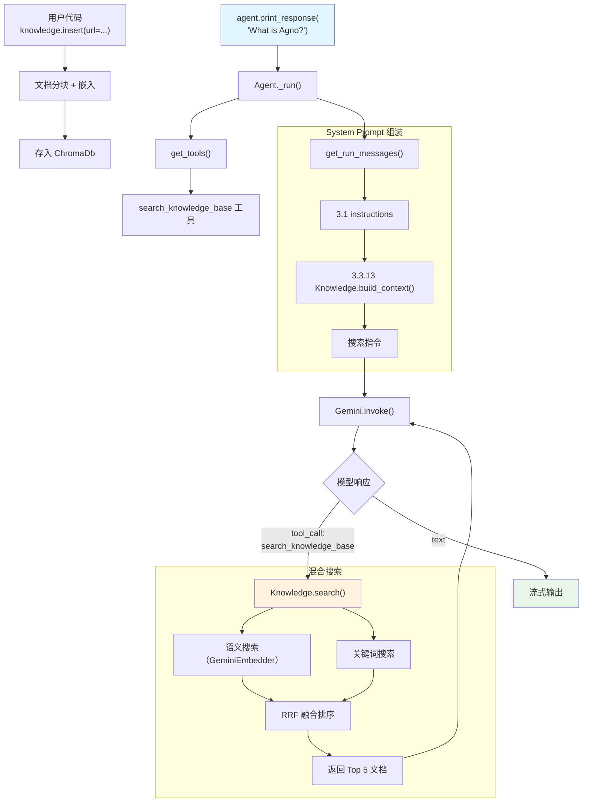

# agent_search_over_knowledge.py — 实现原理分析

> 源文件：`cookbook/00_quickstart/agent_search_over_knowledge.py`

## 概述

本示例展示 Agno 的 **Agentic RAG（代理式检索增强生成）** 机制：Agent 通过 `knowledge` + `search_knowledge=True` 获得 `search_knowledge_base` 工具，模型在需要时主动搜索向量知识库（ChromaDb + 混合搜索），实现基于文档的智能问答。

**核心配置一览：**

| 配置项 | 值 | 说明 |
|--------|------|------|
| `name` | `"Agent with Knowledge"` | Agent 名称 |
| `model` | `Gemini(id="gemini-3-flash-preview")` | Google Gemini API |
| `instructions` | 搜索优先的问答工作流 | 指导先搜索再回答 |
| `knowledge` | `Knowledge(vector_db=ChromaDb(...))` | 向量知识库 |
| `search_knowledge` | `True`（默认） | 启用 Agentic RAG 搜索工具 |
| `db` | `SqliteDb(db_file="tmp/agents.db")` | SQLite 持久化 |
| `add_datetime_to_context` | `True` | 注入当前时间 |
| `add_history_to_context` | `True` | 加载历史消息 |
| `num_history_runs` | `5` | 最近 5 次运行历史 |
| `markdown` | `True` | Markdown 格式化 |

## 架构分层

```
用户代码层                           agno.agent 层
┌─────────────────────────────┐    ┌──────────────────────────────────────┐
│ agent_search_over_          │    │ Agent._run()                         │
│   knowledge.py              │    │  ├ _tools.py                         │
│                             │    │  │  get_tools() L176-186             │
│ knowledge=Knowledge(        │    │  │    → search_knowledge_base 工具   │
│   vector_db=ChromaDb(       │───>│  │                                    │
│     search_type=hybrid,     │    │  ├ _messages.py                       │
│     embedder=GeminiEmbedder │    │  │  get_system_message()              │
│   ),                        │    │  │    → 3.3.13 Knowledge.build_context│
│   max_results=5,            │    │  │                                    │
│   contents_db=agent_db      │    │  └ search_knowledge_base 工具调用     │
│ )                           │    │    → _messages.get_relevant_docs()    │
│ search_knowledge=True       │    │    → Knowledge.search()               │
└─────────────────────────────┘    └──────────────────────────────────────┘
        │                                  │
        │                          ┌───────┴──────────┐
        │                          │                  │
        ▼                          ▼                  ▼
                           ┌──────────────┐   ┌──────────────────┐
                           │ Gemini       │   │ ChromaDb         │
                           │ gemini-3-    │   │ (hybrid search)  │
                           │ flash        │   │ + GeminiEmbedder │
                           └──────────────┘   └──────────────────┘
```

## 核心组件解析

### Knowledge

`Knowledge`（`knowledge/knowledge.py:41`）封装向量数据库操作：

```python
knowledge = Knowledge(
    name="Agno Documentation",
    vector_db=ChromaDb(
        name="agno_docs",
        collection="agno_docs",
        path="tmp/chromadb",
        persistent_client=True,
        search_type=SearchType.hybrid,  # 混合搜索
        hybrid_rrf_k=60,               # RRF 融合常数
        embedder=GeminiEmbedder(id="gemini-embedding-001"),
    ),
    max_results=5,          # 每次搜索返回 5 条
    contents_db=agent_db,   # 内容元数据存储
)
```

**混合搜索**（`SearchType.hybrid`）结合：
- **语义搜索**：通过 `GeminiEmbedder` 计算查询和文档的向量相似度
- **关键词搜索**：精确匹配关键术语
- **RRF 融合**：`hybrid_rrf_k=60` 控制融合权重（越大，低排名结果权重越高）

### search_knowledge_base 工具注册

在 `get_tools()`（`_tools.py:176-186`）中：

```python
# _tools.py L176-186
if (resolved_knowledge is not None or agent.knowledge_retriever is not None) and agent.search_knowledge:
    agent_tools.append(
        _default_tools.create_knowledge_search_tool(
            agent, run_response=run_response, run_context=run_context,
            knowledge_filters=run_context.knowledge_filters,
            enable_agentic_filters=agent.enable_agentic_knowledge_filters,
        )
    )
```

`create_knowledge_search_tool()`（`_default_tools.py:103`）创建 `search_knowledge_base` 函数，本例中 `enable_agentic_filters=False`，因此工具签名只有 `query` 参数：

```python
# _default_tools.py L224-250
def search_knowledge_base(query: str) -> str:
    """Use this function to search the knowledge base for information about a query."""
    docs = _messages.get_relevant_docs_from_knowledge(agent, query=query, ...)
    return _format_results(docs)  # JSON 格式
```

### Knowledge.build_context()

在步骤 3.3.13（`_messages.py:404-413`）中，搜索指令被注入到 system prompt：

```python
# knowledge.py L2908-2933
def build_context(self, enable_agentic_filters=False):
    context_parts = [self._SEARCH_KNOWLEDGE_INSTRUCTIONS]
    # _SEARCH_KNOWLEDGE_INSTRUCTIONS:
    # "You have a knowledge base you can search using the search_knowledge_base tool.
    #  Search before answering questions—don't assume you know the answer."
    return "<knowledge_base>\n" + "\n".join(context_parts) + "\n</knowledge_base>"
```

### 文档插入

```python
knowledge.insert(name="Agno Introduction", url="https://docs.agno.com/introduction.md")
```

`insert()` 从 URL 下载文档，分块后通过 `GeminiEmbedder` 生成嵌入向量，存入 `ChromaDb`。

## System Prompt 组装

| 序号 | 组成部分 | 本文件中的值/来源 | 是否生效 |
|------|---------|-----------------|---------|
| 1 | `system_message`（自定义） | `None` | 否 |
| 3.1 | `instructions` | 搜索优先的问答工作流 | 是 |
| 3.2.1 | `markdown` | `True` | 是 |
| 3.2.2 | `add_datetime_to_context` | `True` | 是 |
| 3.3.3 | instructions 拼接 | 写入 system message | 是 |
| 3.3.4 | additional_information | markdown + datetime | 是 |
| 3.3.13 | `search_knowledge` instructions | `Knowledge.build_context()` | 是 |

### 最终 System Prompt

```text
You are an expert on the Agno framework and building AI agents.

## Workflow
1. Search ...
2. Synthesize ...
3. Present ...

## Rules
...

<additional_information>
- Use markdown to format your answers.
- The current time is 2026-03-01 14:30:00.
</additional_information>

<knowledge_base>
You have a knowledge base you can search using the search_knowledge_base tool. Search before answering questions—don't assume you know the answer. For ambiguous questions, search first rather than asking for clarification.
</knowledge_base>
```

## 完整 API 请求

```python
# 第 1 轮：模型调用搜索工具
client.models.generate_content(
    model="gemini-3-flash-preview",
    contents=[
        # 1. System Message
        {"role": "user", "parts": [{"text": "<system prompt with <knowledge_base>>"}]},
        {"role": "model", "parts": [{"text": "ok"}]},
        # 2. 用户输入
        {"role": "user", "parts": [{"text": "What is Agno?"}]}
    ],
    tools=[{"function_declarations": [
        # search_knowledge_base 工具
        {"name": "search_knowledge_base",
         "description": "Use this function to search the knowledge base for information about a query.",
         "parameters": {"type": "object", "properties": {"query": {"type": "string"}}, "required": ["query"]}},
    ]}]
)

# 模型返回 tool_call: search_knowledge_base(query="What is Agno")
# → Knowledge.search() → ChromaDb 混合搜索 → 返回 5 条文档

# 第 2 轮：搜索结果返回后生成最终回答
client.models.generate_content(
    model="gemini-3-flash-preview",
    contents=[
        # ... 前轮消息 ...
        # tool_call 消息
        {"role": "model", "parts": [{"function_call": {"name": "search_knowledge_base", "args": {"query": "What is Agno"}}}]},
        # tool_result 消息（JSON 格式的搜索结果）
        {"role": "user", "parts": [{"function_response": {"name": "search_knowledge_base", "response": "[{\"content\": \"Agno is...\", ...}]"}}]},
    ],
    tools=[...]
)
```

## Mermaid 流程图



## 关键源码文件索引

| 文件 | 关键函数/类 | 作用 |
|------|------------|------|
| `agno/knowledge/knowledge.py` | `Knowledge` L41 | 知识库核心类 |
| `agno/knowledge/knowledge.py` | `search()` L507 | 向量搜索入口 |
| `agno/knowledge/knowledge.py` | `build_context()` L2908 | 构建搜索指令 |
| `agno/agent/_tools.py` | L176-186 | 注册 search_knowledge_base 工具 |
| `agno/agent/_default_tools.py` | `create_knowledge_search_tool()` L103 | 创建搜索工具 |
| `agno/agent/_messages.py` | L404-413 | 步骤 3.3.13 知识库指令注入 |
| `agno/vectordb/chroma/` | `ChromaDb` | ChromaDb 向量数据库 |
| `agno/knowledge/embedder/google.py` | `GeminiEmbedder` | Gemini 嵌入模型 |
