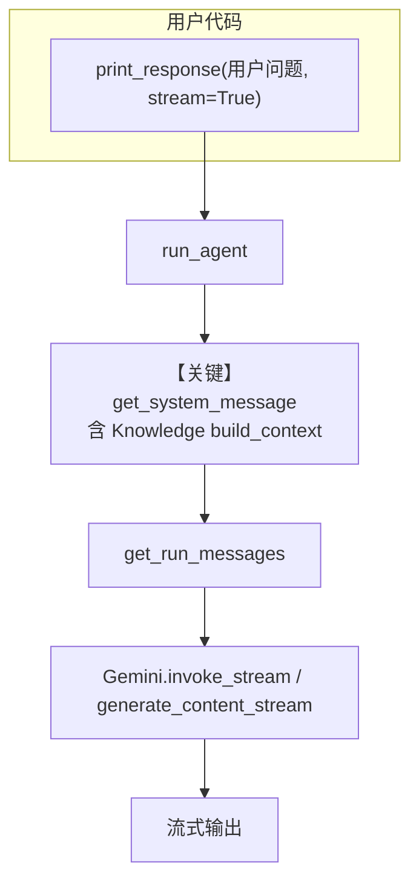

# agent_search_over_knowledge.py — 实现原理分析

> 源文件：`cookbook/00_quickstart/agent_search_over_knowledge.py`

## 概述

本示例展示 Agno 的 **Knowledge（向量知识库）+ agentic RAG（search_knowledge）** 机制：将文档入库到 Chroma，通过混合检索供模型在对话中按需检索；**`search_knowledge=True`** 会在 system 中注入知识库使用说明，并由模型决定何时调用检索。

**核心配置一览：**

| 配置项 | 值 | 说明 |
|--------|------|------|
| `name` | `"Agent with Knowledge"` | Agent 名称 |
| `model` | `Gemini(id="gemini-3-flash-preview")` | Google GenAI `generate_content` / 流式 |
| `instructions` | 多行字符串（Agno 工作流与规则） | 要求先检索再回答 |
| `knowledge` | `Knowledge(...)` + ChromaDb 混合检索 | 向量库 + `contents_db` |
| `search_knowledge` | `True` | 启用 agentic 检索与 system 中的知识说明 |
| `db` | `SqliteDb(db_file="tmp/agents.db")` | 会话与知识元数据 |
| `add_datetime_to_context` | `True` | system 附加当前时间 |
| `add_history_to_context` | `True` | 附带历史 run |
| `num_history_runs` | `5` | 历史条数 |
| `markdown` | `True` | 默认 system 中增加 markdown 提示（无 output_schema 时） |
| `description` | 未设置 | None |
| `role` | 未设置 | None |
| `system_message` | 未设置 | 走默认拼装 |
| `build_context` | 未设置（默认 True） | 未显式传入 |

## 架构分层

```
用户代码层                agno.agent 层
┌──────────────────┐    ┌──────────────────────────────────┐
│ agent_search_    │    │ print_response → run → run_agent│
│ over_knowledge.py│    │  ├ execute_pre_hooks（本例无）   │
│                  │    │  ├ get_tools()                   │
│ Knowledge +      │───>│  ├ get_system_message()         │
│ search_knowledge │    │  │   #3.1 instructions          │
│                  │    │  │   #3.3.13 Knowledge.build_ctx│
│ knowledge.insert │    │  ├ get_run_messages()           │
└──────────────────┘    └──────────────────────────────────┘
                                │
                                ▼
                        ┌──────────────┐
                        │ Gemini       │
                        │ generate_*   │
                        └──────────────┘
```

## 核心组件解析

### Knowledge + ChromaDb（混合检索）

`Knowledge` 绑定 `ChromaDb`，`search_type=SearchType.hybrid` 启用语义+关键词融合（RRF）。`contents_db=agent_db` 把内容元数据写入与 Agent 相同的 SQLite。

### search_knowledge 与 system 注入

`_get_resolved_knowledge` 解析当前 Agent 上的 `knowledge`；当 `search_knowledge` 与 `add_search_knowledge_instructions`（默认 True）同时满足时，`get_system_message()` 在 **# 3.3.13** 段调用 `build_context()`，把知识库使用说明拼进 system（`agno/agent/_messages.py` 约 L409-L418）。

### 数据加载

`main` 中 `knowledge.insert(url=...)` 将文档拉取并写入向量库，属于**示例初始化**，与单次 `run` 的 LLM 调用分离。

### 运行机制与因果链

1. **数据路径**：用户字符串 → `print_response` → `run_agent` → `get_run_messages` 组装 user + 历史；`get_system_message` 组装 system（含知识库说明）；`Gemini.invoke_stream` 将消息交给 Google API；若模型发起工具/检索循环，由框架与知识库 API 继续交互。
2. **状态与副作用**：`SqliteDb` 持久化会话；`knowledge.insert` 写入向量库与元数据；重复运行会累积/更新数据（视 insert 行为而定）。
3. **关键分支**：`search_knowledge=False` 时不注入 #3.3.13 知识说明；`agent.system_message is not None` 时早退默认拼装（见 `_messages.py` L129-L152）。
4. **与相邻示例差异**：相对 `agent_with_tools`，本示例核心是多 **Knowledge** 与 **search_knowledge**，演示 RAG 而非仅 Yahoo 工具。

## System Prompt 组装

| 序号 | 组成部分 | 本文件中的值/来源 | 是否生效 |
|------|---------|-----------------|---------|
| 1 | `description` | 未设置 | 否 |
| 2 | `role` | 未设置 | 否 |
| 3 | `instructions` | 模块顶部 `instructions` 三引号字符串 | 是 |
| 4.1 | `markdown` | `True`，且无 `output_schema` | 是（追加「Use markdown…」） |
| 4.2 | `add_datetime_to_context` | `True` | 是 |
| 4.3 | `add_location_to_context` | 未设置 | 否 |
| 4.4 | `add_name_to_context` | 未设置 | 否 |
| 5 | Knowledge `#3.3.13` | `build_context()` 动态生成 | 是（正文随版本/配置变化） |

### 拼装顺序与源码锚点

1. **# 3.1** 合并 `instructions` 与 `model.get_instructions_for_model(tools)`（`gemini.py` 可能追加模型侧说明）。
2. **# 3.2.1** `markdown`：追加 “Use markdown to format your answers.”（`_messages.py` L184-L185）。
3. **# 3.2.2** 当前时间（`_messages.py` L187-L207）。
4. **# 3.3.3** 将 instructions 写入 `system_message_content`（标签视 `use_instruction_tags` 而定，默认无标签时为纯文本拼接）。
5. **# 3.3.4** `<additional_information>` 包裹附加段。
6. **# 3.3.13** 知识库说明 + `build_context` 片段（`_messages.py` L409-L418 附近）。

### 还原后的完整 System 文本

下列为可从本文件**静态还原**的固定部分；**Knowledge `build_context` 输出的长文案**依赖运行时，请本地对 `get_system_message` 返回的 `Message.content` 打断点或打印以查看完整内容。

```text
You are an expert on the Agno framework and building AI agents.

## Workflow

1. Search
   - For questions about Agno, always search your knowledge base first
   - Extract key concepts from the query to search effectively

2. Synthesize
   - Combine information from multiple search results
   - Prioritize official documentation over general knowledge

3. Present
   - Lead with a direct answer
   - Include code examples when helpful
   - Keep it practical and actionable

## Rules

- Always search knowledge before answering Agno questions
- If the answer isn't in the knowledge base, say so
- Include code snippets for implementation questions
- Be concise — developers want answers, not essays

Use markdown to format your answers.

<additional_information>
- The current time is <运行时格式化时间>.
</additional_information>

<此处省略：Knowledge.build_context(...) 返回的知识库使用说明与策略正文>
```

本示例一次典型用户输入为：`"What is Agno?"`（见 `print_response`）。

### 段落释义（模型视角）

- **instructions**：强制「先检索、再综合、再呈现」，保证 Agno 相关问题走知识库。
- **markdown 提示**：输出使用 Markdown，便于文档与代码块。
- **时间**：回答时效性问题时可参考。
- **知识库段（动态）**：约束如何检索、引用检索结果；具体措辞以 `build_context` 为准。

### 与 User / Developer 消息的边界

用户消息仅为问题字符串；Gemini 适配器将 system 单独抽出并传入 `generate_content` 的配置（见 `Gemini._format_messages` / `get_request_params`），用户轮转为模型 `user` 角色内容。

## 完整 API 请求

本示例使用 **`Gemini`**：`invoke_stream` 内部调用 `get_client().models.generate_content_stream`（`libs/agno/agno/models/google/gemini.py` L585-L588）。

```python
# 等价结构（流式一次 run；具体参数由 get_request_params 合并）
client.models.generate_content_stream(
    model="gemini-3-flash-preview",
    contents=[...],  # 用户/助手历史等，由 _format_messages 从 Message 列表转换
    # system_instruction 或 config 中带 system，来自 get_system_message 与 Gemini 格式化逻辑
)
```

> System 文本与上节「还原」一致；`contents` 含当前用户问题及可选历史。本示例 `stream=True`。

## Mermaid 流程图


```mermaid
flowchart TD
    subgraph UserCode["用户代码"]
        A["print_response(用户问题, stream=True)"]
    end
    A --> B["run_agent"]
    B --> C["【关键】get_system_message<br/>含 Knowledge build_context"]
    C --> D["get_run_messages"]
    D --> E["Gemini.invoke_stream / generate_content_stream"]
    E --> F["流式输出"]
```

- **【关键】get_system_message**：本示例演示的 **agentic RAG** 依赖此处注入的知识库使用说明与检索约束（#3.3.13）。

## 关键源码文件索引

| 文件 | 关键函数/类 | 作用 |
|------|------------|------|
| `agno/agent/_messages.py` | `get_system_message()` L106+ | 默认 system 拼装，含 #3.3.13 知识 |
| `agno/agent/_messages.py` | `get_run_messages()` L1156+ | 组装完整消息列表 |
| `agno/agent/_run.py` | `run_agent` 内工具/pre_hook 等 L415+ | 执行管线 |
| `agno/models/google/gemini.py` | `invoke` / `invoke_stream` L507+ / L564+ | 调用 Google GenAI |
| `agno/knowledge/knowledge.py` | `Knowledge` / `build_context` | 知识库上下文生成 |
