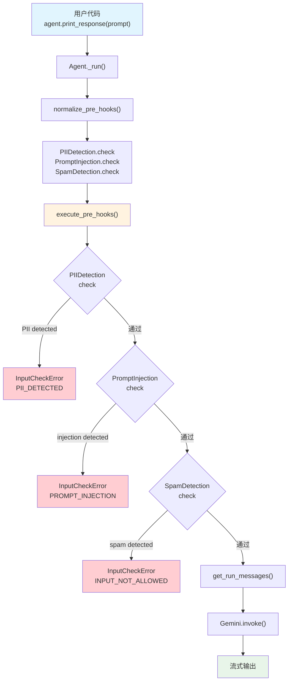

# agent_with_guardrails.py — 实现原理分析

> 源文件：`cookbook/00_quickstart/agent_with_guardrails.py`

## 概述

本示例展示 Agno 的 **`pre_hooks` 护栏（Guardrails）** 机制：通过 `pre_hooks` 注册多个护栏实例，在模型调用前检查输入安全性。内置 `PIIDetectionGuardrail`、`PromptInjectionGuardrail` 和自定义 `SpamDetectionGuardrail` 组合使用，检查失败抛出 `InputCheckError` 阻止请求。

**核心配置一览：**

| 配置项 | 值 | 说明 |
|--------|------|------|
| `name` | `"Agent with Guardrails"` | Agent 名称 |
| `model` | `Gemini(id="gemini-3-flash-preview")` | Google Gemini API |
| `instructions` | 简洁的金融分析师指令 | 无敏感信息分享 |
| `tools` | `[YFinanceTools(all=True)]` | Yahoo Finance 工具集 |
| `pre_hooks` | `[PIIDetectionGuardrail(), PromptInjectionGuardrail(), SpamDetectionGuardrail()]` | 3 个护栏 |
| `add_datetime_to_context` | `True` | 注入当前时间 |
| `markdown` | `True` | Markdown 格式化 |
| `db` | `None` | 未设置 |

## 架构分层

```
用户代码层                           agno.agent 层
┌─────────────────────────────┐    ┌──────────────────────────────────────┐
│ agent_with_guardrails.py    │    │ Agent._run()                         │
│                             │    │  ├ normalize_pre_hooks()             │
│ pre_hooks=[                 │    │  │  PIIDetection.check               │
│   PIIDetectionGuardrail(),  │    │  │  PromptInjection.check            │
│   PromptInjectionGuardrail()│───>│  │  SpamDetection.check              │
│   SpamDetectionGuardrail(), │    │  │                                    │
│ ]                           │    │  ├ execute_pre_hooks()               │
│                             │    │  │  → 按顺序执行每个 hook            │
│                             │    │  │  → InputCheckError? 中断运行      │
│                             │    │  │                                    │
│                             │    │  ├ 检查通过 → Gemini.invoke()        │
│                             │    │  └ 检查失败 → 异常传播               │
└─────────────────────────────┘    └──────────────────────────────────────┘
                                           │
                                           ▼
                                   ┌──────────────────┐
                                   │ Gemini           │
                                   │ gemini-3-flash   │
                                   │ （仅在通过后调用）│
                                   └──────────────────┘
```

## 核心组件解析

### BaseGuardrail

所有护栏继承自 `BaseGuardrail`（`guardrails/base.py:8`），必须实现 `check()` 和 `async_check()` 方法：

```python
class BaseGuardrail(ABC):
    @abstractmethod
    def check(self, run_input: Union[RunInput, TeamRunInput]) -> None:
        pass
    @abstractmethod
    async def async_check(self, run_input: Union[RunInput, TeamRunInput]) -> None:
        pass
```

### normalize_pre_hooks

在 `_run.py:1250-1256` 的首次运行时，`normalize_pre_hooks()`（`utils/hooks.py:70`）将 `BaseGuardrail` 实例转换为绑定方法：

```python
# utils/hooks.py L83-88
if isinstance(hook, BaseGuardrail):
    if async_mode:
        result_hooks.append(hook.async_check)  # 绑定方法
    else:
        result_hooks.append(hook.check)         # 绑定方法
```

### execute_pre_hooks

在 `_hooks.py:43` 中按顺序执行每个 hook：

```python
# _hooks.py L62-70（参数准备）
all_args = {
    "run_input": run_input,      # RunInput 实例
    "run_context": run_context,
    "agent": agent,
    "session": session,
    "user_id": user_id,
    ...
}
```

通过 `filter_hook_args()`（`utils/hooks.py:156`）根据函数签名过滤参数——`BaseGuardrail.check()` 只接受 `run_input`，因此只传递 `run_input`。

### PIIDetectionGuardrail

检测 SSN、信用卡、邮箱、电话等 PII（`guardrails/pii.py:10`）：

```python
# guardrails/pii.py L48-70
def check(self, run_input):
    content = run_input.input_content_string()
    detected_pii = []
    for pii_type, pattern in self.pii_patterns.items():
        if pattern.search(content):
            detected_pii.append(pii_type)
    if detected_pii:
        raise InputCheckError(
            "Potential PII detected in input",
            check_trigger=CheckTrigger.PII_DETECTED,
        )
```

### PromptInjectionGuardrail

检测 17 个预定义注入关键词（`guardrails/prompt_injection.py:9`）：

```python
# guardrails/prompt_injection.py L38-44
def check(self, run_input):
    if any(keyword in run_input.input_content_string().lower()
           for keyword in self.injection_patterns):
        raise InputCheckError(
            "Potential jailbreaking or prompt injection detected.",
            check_trigger=CheckTrigger.PROMPT_INJECTION,
        )
```

### 自定义 SpamDetectionGuardrail

本例自定义的护栏，检测过多大写字母和感叹号：

```python
class SpamDetectionGuardrail(BaseGuardrail):
    def __init__(self, max_caps_ratio=0.7, max_exclamations=3):
        self.max_caps_ratio = max_caps_ratio
        self.max_exclamations = max_exclamations

    def check(self, run_input):
        content = run_input.input_content_string()
        # 大写比例超过 70%
        if len(content) > 10:
            caps_ratio = sum(1 for c in content if c.isupper()) / len(content)
            if caps_ratio > self.max_caps_ratio:
                raise InputCheckError("Input appears to be spam (excessive capitals)")
        # 感叹号超过 3 个
        if content.count("!") > self.max_exclamations:
            raise InputCheckError("Input appears to be spam (excessive exclamation marks)")
```

### InputCheckError 异常

```python
# exceptions.py L134-152
class InputCheckError(Exception):
    def __init__(self, message, check_trigger=CheckTrigger.INPUT_NOT_ALLOWED, additional_data=None):
        self.message = message
        self.check_trigger = check_trigger      # 枚举类型
        self.additional_data = additional_data  # 附加数据
```

| CheckTrigger | 说明 |
|-------------|------|
| `PII_DETECTED` | PII 检测触发 |
| `PROMPT_INJECTION` | 注入检测触发 |
| `INPUT_NOT_ALLOWED` | 默认（自定义护栏使用） |

## System Prompt 组装

| 序号 | 组成部分 | 本文件中的值/来源 | 是否生效 |
|------|---------|-----------------|---------|
| 1 | `system_message`（自定义） | `None` | 否 |
| 3.1 | `instructions` | 简洁的金融分析师指令 | 是 |
| 3.2.1 | `markdown` | `True` | 是 |
| 3.2.2 | `add_datetime_to_context` | `True` | 是 |
| 3.3.3 | instructions 拼接 | 写入 system message | 是 |
| 3.3.4 | additional_information | markdown + datetime | 是 |

### 最终 System Prompt

```text
You are a Finance Agent — a data-driven analyst who retrieves market data
and produces concise, decision-ready insights.

Always be helpful and provide accurate financial information.
Never share sensitive personal information in responses.

<additional_information>
- Use markdown to format your answers.
- The current time is 2026-03-01 14:30:00.
</additional_information>
```

> 注意：护栏不影响 system prompt 内容。它们在 system prompt 组装之前执行，阻止不合规输入进入模型。

## 完整 API 请求

**检查通过时（正常请求）：**

```python
# 输入："What's a good P/E ratio for tech stocks?"
# → PIIDetectionGuardrail.check() ✓
# → PromptInjectionGuardrail.check() ✓
# → SpamDetectionGuardrail.check() ✓
# → 全部通过，发出 API 请求

client.models.generate_content(
    model="gemini-3-flash-preview",
    contents=[
        {"role": "user", "parts": [{"text": "<system prompt>"}]},
        {"role": "model", "parts": [{"text": "ok"}]},
        {"role": "user", "parts": [{"text": "What's a good P/E ratio for tech stocks?"}]}
    ],
    tools=[{"function_declarations": [...]}]
)
```

**检查失败时（不发出 API 请求）：**

```python
# 输入："My SSN is 123-45-6789"
# → PIIDetectionGuardrail.check() ✗
# → 抛出 InputCheckError(
#       message="Potential PII detected in input",
#       check_trigger=CheckTrigger.PII_DETECTED,
#       additional_data={"detected_pii": ["SSN"]}
#   )
# → 不会调用 Gemini API
```

## Mermaid 流程图



## 关键源码文件索引

| 文件 | 关键函数/类 | 作用 |
|------|------------|------|
| `agno/agent/agent.py` | `pre_hooks` L176 | 前置 hook 列表 |
| `agno/agent/_hooks.py` | `execute_pre_hooks()` L43 | 执行 pre_hooks |
| `agno/utils/hooks.py` | `normalize_pre_hooks()` L70 | 规范化 BaseGuardrail → .check |
| `agno/utils/hooks.py` | `filter_hook_args()` L156 | 按签名过滤参数 |
| `agno/guardrails/base.py` | `BaseGuardrail` L8 | 护栏抽象基类 |
| `agno/guardrails/pii.py` | `PIIDetectionGuardrail` L10 | PII 检测 |
| `agno/guardrails/prompt_injection.py` | `PromptInjectionGuardrail` L9 | 注入检测 |
| `agno/exceptions.py` | `InputCheckError` L134 | 输入检查异常 |
| `agno/exceptions.py` | `CheckTrigger` L122 | 检查触发枚举 |
| `agno/run/agent.py` | `RunInput` L29 | 输入容器 |
