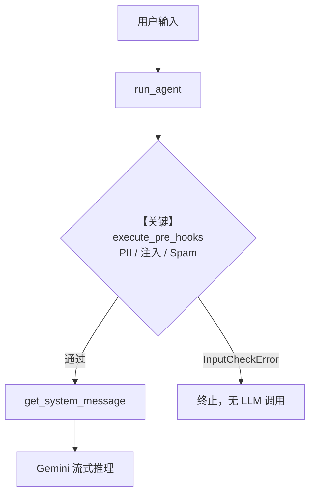

# agent_with_guardrails.py — 实现原理分析

> 源文件：`cookbook/00_quickstart/agent_with_guardrails.py`

## 概述

本示例展示 Agno 的 **`pre_hooks` 护栏（Guardrails）** 机制：在模型与工具执行前拦截/检查输入；内置 **PII**、**提示注入** 检测与自定义 **`BaseGuardrail`**，失败时抛出 **`InputCheckError`**，主循环不会进入正常推理。

**核心配置一览：**

| 配置项 | 值 | 说明 |
|--------|------|------|
| `name` | `"Agent with Guardrails"` | Agent 名称 |
| `model` | `Gemini(id="gemini-3-flash-preview")` | Google GenAI |
| `instructions` | Finance Agent 说明 | 业务指令 |
| `tools` | `[YFinanceTools(all=True)]` | 雅虎财经工具 |
| `pre_hooks` | `PIIDetectionGuardrail`, `PromptInjectionGuardrail`, `SpamDetectionGuardrail` | 输入前检查链 |
| `add_datetime_to_context` | `True` | system 附加时间 |
| `markdown` | `True` | 附加 markdown 提示 |
| `db` | 未设置 | None |
| `knowledge` | 未设置 | None |
| `search_knowledge` | 未设置 | None |
| `build_context` | 未设置 | 默认 True |

## 架构分层

```
用户代码层                agno.agent 层
┌──────────────────┐    ┌──────────────────────────────────┐
│ agent_with_      │    │ print_response → run_agent       │
│ guardrails.py    │    │  【4. execute pre-hooks】       │
│                  │───>│   execute_pre_hooks(L418+)       │
│ pre_hooks 列表   │    │   → Guardrail.check / async_check│
│                  │    │  若通过 → get_system_message     │
│                  │    │         → get_tools → Gemini    │
└──────────────────┘    └──────────────────────────────────┘
```

## 核心组件解析

### pre_hooks 执行时机

在 `agno/agent/_run.py` 同步路径中，**步骤 4** 在解析依赖之后、**确定工具之前**调用 `execute_pre_hooks`（约 L415-L433）。护栏可读取 `RunInput`，抛出 `InputCheckError` 则本轮终止。

### 内置护栏

- `PIIDetectionGuardrail`：检测 SSN 等敏感信息。
- `PromptInjectionGuardrail`：匹配越狱类输入。

### 自定义 SpamDetectionGuardrail

继承 `BaseGuardrail`，实现 `check` 与 `async_check`（异步路径需两者一致），通过 `run_input.input_content_string()` 取文本。

### 运行机制与因果链

1. **路径**：用户字符串 → `execute_pre_hooks` →（通过）`get_system_message` → `get_run_messages` → `Gemini`；失败则异常直达 `print_response` 调用方。
2. **副作用**：护栏默认不写库；本示例无 `db`。
3. **分支**：`pre_hooks is None` 时跳过检查；某条护栏 raise 则后续步骤不执行。
4. **定位**：在「带工具的财经 Agent」上叠加**输入安全**，与 `agent_with_tools` 相比多 **pre_hooks**。

## System Prompt 组装

| 序号 | 组成部分 | 本文件中的值/来源 | 是否生效 |
|------|---------|-----------------|---------|
| 1 | `instructions` | 模块内 `instructions` 字符串 | 是 |
| 2 | `markdown` | `True` | 是（#3.2.1） |
| 3 | `add_datetime_to_context` | `True` | 是 |
| 4 | `description` / `role` | 未设置 | 否 |

### 拼装顺序与源码锚点

同默认路径：`#3.1` instructions → `#3.2.1` markdown → `#3.2.2` 时间 → `#3.3.3` 写入主内容 → `#3.3.4` additional_information（`_messages.py` L106 起）。

### 还原后的完整 System 文本

```text
You are a Finance Agent — a data-driven analyst who retrieves market data
and produces concise, decision-ready insights.

Always be helpful and provide accurate financial information.
Never share sensitive personal information in responses.

Use markdown to format your answers.

<additional_information>
- The current time is <运行时时间>.
</additional_information>
```

### 段落释义（模型视角）

- 业务角色与合规：强调财经数据与勿泄露敏感信息。
- Markdown 与时间：格式与时效参考。

### 与 User 消息边界

护栏只看**输入内容**，不改变 system；用户消息在通过护栏后原样进入后续消息列表。

## 完整 API 请求

通过护栏后，`Gemini.invoke_stream` 使用 `generate_content_stream`（`gemini.py` L585-L588）。若护栏拦截，**不会**发起本次模型调用。

```python
# 仅当 pre_hooks 全部通过时才会执行：
client.models.generate_content_stream(
    model="gemini-3-flash-preview",
    contents=[...],
    # tools 含 YFinance 的 function 声明
)
```

## Mermaid 流程图


```mermaid
flowchart TD
    A["用户输入"] --> B["run_agent"]
    B --> C{"【关键】execute_pre_hooks<br/>PII / 注入 / Spam"}
    C -->|通过| D["get_system_message"]
    C -->|InputCheckError| X["终止，无 LLM 调用"]
    D --> E["Gemini 流式推理"]
```

- **【关键】execute_pre_hooks**：本示例演示的**输入护栏**在此消费；失败则短路。

## 关键源码文件索引

| 文件 | 关键函数/类 | 作用 |
|------|------------|------|
| `agno/agent/_run.py` | `execute_pre_hooks` 调用处 L418+ | 护栏入口 |
| `agno/agent/_hooks.py` | `execute_pre_hooks()` L43+ | 遍历并执行护栏 |
| `agno/agent/_messages.py` | `get_system_message()` L106+ | system 拼装 |
| `agno/models/google/gemini.py` | `invoke_stream` L564+ | 下游 API |
