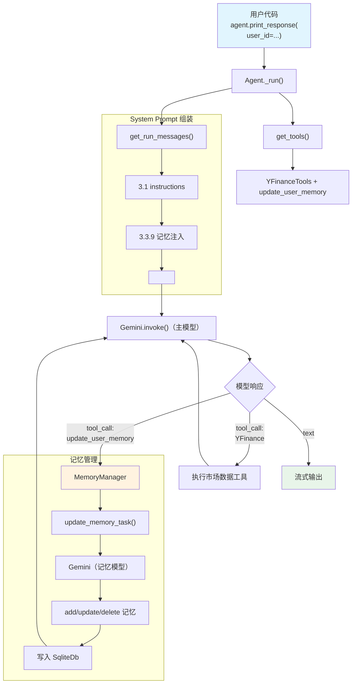

# agent_with_memory.py — 实现原理分析

> 源文件：`cookbook/00_quickstart/agent_with_memory.py`

## 概述

本示例展示 Agno 的 **代理式记忆（Agentic Memory）** 机制：通过 `MemoryManager` + `enable_agentic_memory=True`，模型获得 `update_user_memory` 工具，可主动决定何时存储/更新用户偏好信息，实现跨会话的个性化记忆。

**核心配置一览：**

| 配置项 | 值 | 说明 |
|--------|------|------|
| `name` | `"Agent with Memory"` | Agent 名称 |
| `model` | `Gemini(id="gemini-3-flash-preview")` | 主模型 |
| `instructions` | 含记忆使用指南的金融分析师 | 指导利用记忆个性化 |
| `tools` | `[YFinanceTools(all=True)]` | Yahoo Finance 工具集 |
| `db` | `SqliteDb(db_file="tmp/agents.db")` | SQLite 持久化 |
| `memory_manager` | `MemoryManager(model=Gemini, db=agent_db)` | 记忆管理器（独立模型） |
| `enable_agentic_memory` | `True` | 启用代理式记忆（工具模式） |
| `add_datetime_to_context` | `True` | 注入当前时间 |
| `add_history_to_context` | `True` | 加载历史消息 |
| `num_history_runs` | `5` | 最近 5 次运行历史 |
| `markdown` | `True` | Markdown 格式化 |
| `add_memories_to_context` | `None`（默认） | 未显式设置 |

## 架构分层

```
用户代码层                        agno.agent 层
┌──────────────────────────┐    ┌──────────────────────────────────────┐
│ agent_with_memory.py     │    │ Agent._run()                         │
│                          │    │  ├ _tools.py                         │
│ memory_manager=          │    │  │  get_tools()                      │
│   MemoryManager(         │───>│  │    → YFinance + update_user_memory│
│     model=Gemini,        │    │  │                                    │
│     db=agent_db          │    │  ├ _messages.py                       │
│   )                      │    │  │  get_system_message()              │
│ enable_agentic_memory=   │    │  │    → 3.3.9 记忆注入               │
│   True                   │    │  │    → <updating_user_memories>     │
│ user_id="investor@..."   │    │  │                                    │
│                          │    │  └ update_user_memory 工具调用时      │
│                          │    │    → MemoryManager.update_memory_task│
└──────────────────────────┘    └──────────────────────────────────────┘
        │                               │
        │                       ┌───────┴──────────┐
        │                       │                  │
        ▼                       ▼                  ▼
                        ┌──────────────┐   ┌──────────────┐
                        │ Gemini       │   │ Gemini       │
                        │ (主模型)     │   │ (记忆模型)   │
                        │ gemini-3-    │   │ gemini-3-    │
                        │ flash        │   │ flash        │
                        └──────────────┘   └──────────────┘
```

## 核心组件解析

### MemoryManager

`MemoryManager`（`memory/manager.py:44`）是一个独立的记忆管理器，拥有自己的模型和数据库：

```python
memory_manager = MemoryManager(
    model=Gemini(id="gemini-3-flash-preview"),  # 独立模型
    db=agent_db,                                 # 与 Agent 共用 db
    additional_instructions="""
    Capture the user's favorite stocks, their risk tolerance, and their investment goals.
    """,
)
```

### enable_agentic_memory 工具注册

在 `get_tools()`（`_tools.py:150`）中，`enable_agentic_memory=True` 会注册 `update_user_memory` 工具：

```python
# _tools.py L150-151
if agent.enable_agentic_memory:
    agent_tools.append(_default_tools.get_update_user_memory_function(agent, user_id=user_id))
```

`get_update_user_memory_function()`（`_default_tools.py:38`）创建一个闭包：

```python
# _default_tools.py L38-53
def get_update_user_memory_function(agent, user_id=None):
    def update_user_memory(task: str) -> str:
        """Use this function to submit a task to modify the Agent's memory."""
        response = agent.memory_manager.update_memory_task(task=task, user_id=user_id)
        return response
    return Function.from_callable(update_user_memory, name="update_user_memory")
```

### update_memory_task 执行流程

当模型调用 `update_user_memory` 工具时，`MemoryManager.update_memory_task()`（`memory/manager.py:481`）执行：

1. 从 SQLite 读取已有记忆
2. 构建记忆管理的 system prompt（含 CRUD 工具说明）
3. 用 MemoryManager 的**独立模型**调用 `run_memory_task()`
4. 内部模型通过工具调用执行 add/update/delete 操作
5. 将变更写入数据库

### 记忆注入到 System Prompt

在 `get_system_message()` 步骤 3.3.9（`_messages.py:282-320`）中：

```python
# _messages.py L282-320
if agent.add_memories_to_context:
    user_memories = agent.memory_manager.get_user_memories(user_id=user_id)
    if user_memories:
        system_message_content += "You have access to user info and preferences...\n"
        system_message_content += "<memories_from_previous_interactions>"
        for _memory in user_memories:
            system_message_content += f"\n- {_memory.memory}"
        system_message_content += "\n</memories_from_previous_interactions>\n"

    if agent.enable_agentic_memory:
        system_message_content += "<updating_user_memories>\n"
        system_message_content += "- You have access to the `update_user_memory` tool...\n"
        system_message_content += "</updating_user_memories>\n"
```

> 注意：本例未显式设置 `add_memories_to_context`（默认为 `None`），但 `enable_agentic_memory=True` 会在步骤 3.3.9 中自动添加 `<updating_user_memories>` 说明。首次运行时因无历史记忆，会显示"尚未与用户交互"的提示。

## System Prompt 组装

| 序号 | 组成部分 | 本文件中的值/来源 | 是否生效 |
|------|---------|-----------------|---------|
| 1 | `system_message`（自定义） | `None` | 否 |
| 3.1 | `instructions` | 含记忆使用指南 | 是 |
| 3.2.1 | `markdown` | `True` | 是 |
| 3.2.2 | `add_datetime_to_context` | `True` | 是 |
| 3.3.3 | instructions 拼接 | 写入 system message | 是 |
| 3.3.4 | additional_information | markdown + datetime | 是 |
| 3.3.9 | `add_memories_to_context` | `None`，但 agentic_memory 注入工具说明 | 部分 |

### 最终 System Prompt

```text
You are a Finance Agent — a data-driven analyst ...

## Memory
You have memory of user preferences ...

## Workflow ...
## Rules ...

<additional_information>
- Use markdown to format your answers.
- The current time is 2026-03-01 14:30:00.
</additional_information>

<updating_user_memories>
- You have access to the `update_user_memory` tool ...
- If the user's message includes information that should be captured as a memory, use the tool ...
</updating_user_memories>
```

## 完整 API 请求

```python
# 主模型请求
client.models.generate_content(
    model="gemini-3-flash-preview",
    contents=[
        # 1. System Message
        {"role": "user", "parts": [{"text": "<system prompt with memory instructions>"}]},
        {"role": "model", "parts": [{"text": "ok"}]},
        # 2. 历史消息（最近 5 次）
        # 3. 用户输入
        {"role": "user", "parts": [{"text": "I'm interested in AI and semiconductor stocks. My risk tolerance is moderate."}]}
    ],
    tools=[
        {"function_declarations": [
            # update_user_memory 工具
            {"name": "update_user_memory",
             "description": "Use this function to submit a task to modify the Agent's memory.",
             "parameters": {"type": "object", "properties": {"task": {"type": "string"}}, "required": ["task"]}},
            # YFinanceTools 函数
        ]}
    ]
)

# 当模型调用 update_user_memory(task="Add memory: user interested in AI stocks")
# MemoryManager 内部调用（独立模型请求）：
# → MemoryManager.update_memory_task()
# → run_memory_task() 用记忆模型执行 CRUD
# → 结果写入 SqliteDb
```

## Mermaid 流程图



## 关键源码文件索引

| 文件 | 关键函数/类 | 作用 |
|------|------------|------|
| `agno/agent/agent.py` | `memory_manager` L111 | MemoryManager 属性 |
| `agno/agent/agent.py` | `enable_agentic_memory` L113 | 代理式记忆开关 |
| `agno/agent/_tools.py` | L150-151 | 注册 update_user_memory 工具 |
| `agno/agent/_default_tools.py` | `get_update_user_memory_function()` L38 | 工具工厂 |
| `agno/agent/_messages.py` | L282-320 | 步骤 3.3.9 记忆注入 |
| `agno/memory/manager.py` | `MemoryManager` L44 | 记忆管理器 |
| `agno/memory/manager.py` | `update_memory_task()` L481 | 工具调用入口 |
| `agno/memory/manager.py` | `get_system_message()` L958 | 记忆模型的 system prompt |
