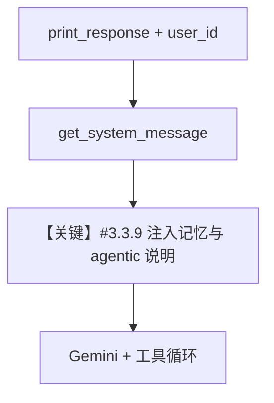

# agent_with_memory.py — 实现原理分析

> 源文件：`cookbook/00_quickstart/agent_with_memory.py`

## 概述

本示例展示 Agno 的 **MemoryManager + enable_agentic_memory** 机制：跨会话保留用户偏好；**`add_memories_to_context`**（默认行为与 memory 配置联动）在 `get_system_message` 中注入历史记忆与 **update_user_memory** 工具说明，使模型可显式更新记忆。

**核心配置一览：**

| 配置项 | 值 | 说明 |
|--------|------|------|
| `name` | `"Agent with Memory"` | Agent 名称 |
| `model` | `Gemini(id="gemini-3-flash-preview")` | Google GenAI |
| `instructions` | 含 Memory 段落的财经指令 | 业务 + 记忆使用说明 |
| `tools` | `[YFinanceTools(all=True)]` | 雅虎财经 |
| `db` | `SqliteDb(db_file="tmp/agents.db")` | 会话与记忆存储 |
| `memory_manager` | `MemoryManager(model=..., db=..., additional_instructions=...)` | 记忆提取/存储 |
| `enable_agentic_memory` | `True` | system 注入 `<updating_user_memories>` 与工具说明 |
| `add_datetime_to_context` | `True` | 是 |
| `add_history_to_context` | `True` | 是 |
| `num_history_runs` | `5` | 是 |
| `markdown` | `True` | 是 |
| `add_memories_to_context` | 未显式设置 | 默认 True（与记忆联用） |
| `user_id` | 在 `print_response` 传入 `"investor@example.com"` | 关联记忆主体 |

## 架构分层

```
用户代码层                agno.agent 层
┌──────────────────┐    ┌──────────────────────────────────┐
│ agent_with_      │    │ run(user_id=...)                 │
│ memory.py        │───>│ get_system_message               │
│ MemoryManager    │    │  #3.3.9 add_memories_to_context  │
│ user_id          │    │  → memory_manager.get_user_memories
└──────────────────┘    │  → <updating_user_memories>      │
                        └──────────────────────────────────┘
```

## 核心组件解析

### MemoryManager

独立 `MemoryManager` 使用同一 `SqliteDb`；`additional_instructions` 影响记忆提取策略（具体见 memory 子系统实现）。

### get_system_message 中的记忆段

当 `add_memories_to_context` 为真且配置了 `memory_manager` 时，**# 3.3.9** 段（`_messages.py` L287-L325 附近）注入：

- 过往记忆列表（若有）；
- 或「尚无交互」提示；
- `enable_agentic_memory=True` 时再追加 `update_user_memory` 工具说明。

### 运行机制与因果链

1. **路径**：`user_id` 贯穿 run → `get_system_message` 用其拉取记忆 → 用户消息进入对话 → 模型可调用记忆工具或仅依赖上下文。
2. **副作用**：记忆写入 `db`；多次 `print_response` 同一 `user_id` 会持续更新记忆库。
3. **分支**：无 `user_id` 时记忆可能回落到 `"default"`（见 `_messages.py` L289-L291）；`enable_agentic_memory=False` 时不追加 `<updating_user_memories>` 块。
4. **与 storage 差异**：storage 管会话消息历史；memory 管**用户级**长期事实。

## System Prompt 组装

| 序号 | 组成部分 | 本文件 | 是否生效 |
|------|---------|--------|---------|
| `instructions` | 长字符串（含 ## Memory） | 是 |
| `markdown` | True | 是 |
| `add_datetime_to_context` | True | 是 |
| `#3.3.9` 记忆 | 动态记忆列表 + agentic 说明 | 是 |

### 拼装顺序与源码锚点

在默认 `#3.3.3` 之后，于 **#3.3.9** 插入记忆相关段落（`_messages.py` L287+）；顺序在 cultural knowledge 等之前或之后以源码为准（当前版本在 L287 段）。

### 还原后的完整 System 文本

**instructions** 可原样列出如下；**记忆正文**随数据库变化，无法静态固定。

```text
You are a Finance Agent — a data-driven analyst who retrieves market data,
computes key ratios, and produces concise, decision-ready insights.

## Memory

You have memory of user preferences (automatically provided in context). Use this to:
- Tailor recommendations to their interests
- Consider their risk tolerance
- Reference their investment goals

## Workflow

1. Retrieve
   - Fetch: price, change %, market cap, P/E, EPS, 52-week range
   - For comparisons, pull the same fields for each ticker

2. Analyze
   - Compute ratios (P/E, P/S, margins) when not already provided
   - Key drivers and risks — 2-3 bullets max
   - Facts only, no speculation

3. Present
   - Lead with a one-line summary
   - Use tables for multi-stock comparisons
   - Keep it tight

## Rules

- Source: Yahoo Finance. Always note the timestamp.
- Missing data? Say "N/A" and move on.
- No personalized advice — add disclaimer when relevant.
- No emojis.

Use markdown to format your answers.

<additional_information>
- The current time is <运行时时间>.
</additional_information>

<此处为 #3.3.9 动态段：memories 列表或空状态提示 + 可选 updating_user_memories 块>
```

### 段落释义（模型视角）

- **Memory**：要求利用上下文中的用户偏好。
- **动态记忆块**：提供可个性化的事实；agentic 段约束何时调用 `update_user_memory`。

## 完整 API 请求

与标准 `Gemini` 调用一致；记忆不改变 HTTP 形状，仅 system 更长并可能多轮工具调用。

```python
client.models.generate_content_stream(
    model="gemini-3-flash-preview",
    contents=[...],
    tools=[...],  # 含 YFinance；可能含 update_user_memory
)
```

## Mermaid 流程图


```mermaid
flowchart TD
    A["print_response + user_id"] --> B["get_system_message"]
    B --> C["【关键】#3.3.9 注入记忆与 agentic 说明"]
    C --> D["Gemini + 工具循环"]
```

- **【关键】#3.3.9**：本示例的**长期记忆**机制锚点在 system 拼装此段。

## 关键源码文件索引

| 文件 | 关键函数/类 | 作用 |
|------|------------|------|
| `agno/agent/_messages.py` | `get_system_message()` L287+（记忆） | 注入记忆与工具说明 |
| `agno/memory/` | `MemoryManager` | 记忆 CRUD |
| `agno/models/google/gemini.py` | `invoke` / `invoke_stream` L507+ | 模型调用 |
