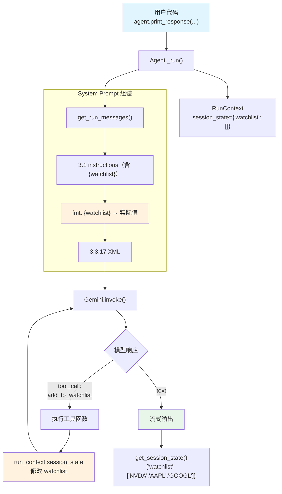

# agent_with_state_management.py — 实现原理分析

> 源文件：`cookbook/00_quickstart/agent_with_state_management.py`

## 概述

本示例展示 Agno 的 **`session_state` 状态管理** 机制：Agent 通过 `session_state` 维护结构化数据（如股票 watchlist），工具函数通过 `RunContext` 读写状态，`{variable}` 模板变量将状态注入到 instructions 中。

**核心配置一览：**

| 配置项 | 值 | 说明 |
|--------|------|------|
| `name` | `"Agent with State Management"` | Agent 名称 |
| `model` | `Gemini(id="gemini-3-flash-preview")` | Google Gemini API |
| `instructions` | 含 `{watchlist}` 模板变量 | 动态注入当前 watchlist |
| `tools` | `[add_to_watchlist, remove_from_watchlist, YFinanceTools(all=True)]` | 自定义状态工具 + 市场数据 |
| `session_state` | `{"watchlist": []}` | 初始状态：空 watchlist |
| `add_session_state_to_context` | `True` | 将 session_state 注入 system prompt |
| `db` | `SqliteDb(db_file="tmp/agents.db")` | SQLite 持久化 |
| `add_datetime_to_context` | `True` | 注入当前时间 |
| `add_history_to_context` | `True` | 加载历史消息 |
| `num_history_runs` | `5` | 最近 5 次运行历史 |
| `markdown` | `True` | Markdown 格式化 |

## 架构分层

```
用户代码层                           agno.agent 层
┌─────────────────────────────┐    ┌──────────────────────────────────────────┐
│ agent_with_state_           │    │ Agent._run()                             │
│   management.py             │    │  ├ _messages.py                           │
│                             │    │  │  get_system_message()                  │
│ session_state=              │    │  │    → {watchlist} 模板替换              │
│   {"watchlist": []}         │───>│  │    → <session_state> XML 注入          │
│ add_session_state_to_       │    │  │                                        │
│   context=True              │    │  ├ RunContext.session_state               │
│                             │    │  │  → 引用传递给工具函数                   │
│ tools=[                     │    │  │                                        │
│   add_to_watchlist,         │    │  ├ _tools.py                              │
│   remove_from_watchlist,    │    │  │  get_tools()                           │
│   YFinanceTools             │    │  │    → 自定义工具 + YFinance             │
│ ]                           │    │  │                                        │
└─────────────────────────────┘    └──────────────────────────────────────────┘
                                           │
                                           ▼
                                   ┌──────────────────┐
                                   │ Gemini           │
                                   │ gemini-3-flash   │
                                   └──────────────────┘
```

## 核心组件解析

### session_state 与 RunContext

`session_state={"watchlist": []}` 定义初始状态。在 `Agent._run()` 中，状态被注入到 `RunContext`：

```python
# RunContext（run/base.py L16-33）
@dataclass
class RunContext:
    session_state: Optional[Dict[str, Any]] = None  # 引用传递！
    ...
```

工具函数通过 `run_context: RunContext` 参数访问和修改状态：

```python
def add_to_watchlist(run_context: RunContext, ticker: str) -> str:
    watchlist = run_context.session_state.get("watchlist", [])
    watchlist.append(ticker)
    run_context.session_state["watchlist"] = watchlist  # 直接修改
    return f"Added {ticker} to watchlist"
```

因为 `session_state` 是引用传递，工具函数的修改立即反映在 Agent 的状态中。

### {watchlist} 模板变量替换

instructions 中的 `{watchlist}` 在 `get_system_message()` 步骤 fmt（`_messages.py:262`）中被替换：

```python
# _messages.py L56-98 format_message_with_state_variables()
def format_message_with_state_variables(agent, message, run_context=None):
    session_state = run_context.session_state if run_context else None
    # 构建变量映射
    format_variables = ChainMap(
        session_state if session_state is not None else {},  # {"watchlist": ["NVDA", "AAPL"]}
        dependencies or {},
        metadata or {},
    )
    # 将 {var} 转为 ${var} 后用 Template.safe_substitute() 替换
    template = string.Template(converted_msg)
    result = template.safe_substitute(format_variables)
```

替换后，`{watchlist}` 变为 `['NVDA', 'AAPL', 'GOOGL']`。

### add_session_state_to_context

在 `get_system_message()` 步骤 3.3.17（`_messages.py:437`）中：

```python
# _messages.py L437-438
if add_session_state_to_context and session_state is not None:
    system_message_content += f"\n<session_state>\n{session_state}\n</session_state>\n\n"
```

完整的 `session_state` 字典以 XML 标签包裹注入到 system prompt 末尾，让模型了解当前状态全貌。

### 状态对比：模板替换 vs XML 注入

| 机制 | 来源 | 位置 | 格式 | 用途 |
|------|------|------|------|------|
| `{watchlist}` 模板替换 | `resolve_in_context=True`（默认） | instructions 中 | 原始值 | 在指令中引用特定字段 |
| `<session_state>` XML | `add_session_state_to_context=True` | system prompt 末尾 | 完整字典 | 让模型了解全部状态 |

两者可以同时使用，本例正是如此。

## System Prompt 组装

| 序号 | 组成部分 | 本文件中的值/来源 | 是否生效 |
|------|---------|-----------------|---------|
| 1 | `system_message`（自定义） | `None` | 否 |
| 3.1 | `instructions` | 含 `{watchlist}` 的工作流指令 | 是 |
| 3.2.1 | `markdown` | `True` | 是 |
| 3.2.2 | `add_datetime_to_context` | `True` | 是 |
| 3.3.3 | instructions 拼接 | 写入（含 `{watchlist}` 模板） | 是 |
| 3.3.4 | additional_information | markdown + datetime | 是 |
| 3.3.5 | `_tool_instructions` | 无 | 否 |
| fmt | `resolve_in_context` 变量替换 | `{watchlist}` → `['NVDA', 'AAPL']` | 是 |
| 3.3.17 | `add_session_state_to_context` | `True` → `<session_state>` 注入 | 是 |

### 最终 System Prompt

```text
You are a Finance Agent that manages a stock watchlist.

## Current Watchlist
['NVDA', 'AAPL', 'GOOGL']

## Capabilities
1. Manage watchlist ...
2. Get stock data ...

## Rules
...

<additional_information>
- Use markdown to format your answers.
- The current time is 2026-03-01 14:30:00.
</additional_information>

<session_state>
{'watchlist': ['NVDA', 'AAPL', 'GOOGL']}
</session_state>
```

## 完整 API 请求

```python
client.models.generate_content(
    model="gemini-3-flash-preview",
    contents=[
        # 1. System Message（含 {watchlist} 已替换 + <session_state>）
        {"role": "user", "parts": [{"text": "<system prompt with watchlist>"}]},
        {"role": "model", "parts": [{"text": "ok"}]},
        # 2. 历史消息（最近 5 次）
        # ...
        # 3. 用户输入
        {"role": "user", "parts": [{"text": "Add NVDA, AAPL, and GOOGL to my watchlist"}]}
    ],
    tools=[
        {"function_declarations": [
            # add_to_watchlist（run_context 参数被隐藏，不暴露给模型）
            {"name": "add_to_watchlist", "description": "Add a stock ticker to the watchlist.",
             "parameters": {"type": "object", "properties": {"ticker": {"type": "string"}}, "required": ["ticker"]}},
            # remove_from_watchlist
            {"name": "remove_from_watchlist", "description": "Remove a stock ticker from the watchlist.",
             "parameters": {"type": "object", "properties": {"ticker": {"type": "string"}}, "required": ["ticker"]}},
            # YFinanceTools 函数
        ]}
    ]
)
```

> `run_context` 参数不会出现在工具的 JSON Schema 中——agno 在注册工具时自动过滤掉 `RunContext` 类型的参数，运行时自动注入。

## Mermaid 流程图



## 关键源码文件索引

| 文件 | 关键函数/类 | 作用 |
|------|------------|------|
| `agno/agent/agent.py` | `session_state` L84 | 默认状态字典 |
| `agno/agent/agent.py` | `add_session_state_to_context` L86 | 状态注入开关 |
| `agno/agent/agent.py` | `resolve_in_context` L249 | 模板变量替换开关（默认 True） |
| `agno/agent/agent.py` | `get_session_state()` L939 | 获取当前状态 |
| `agno/agent/_messages.py` | `format_message_with_state_variables()` L56 | 模板变量替换实现 |
| `agno/agent/_messages.py` | L437-438 | `<session_state>` XML 注入 |
| `agno/run/base.py` | `RunContext` L16 | 运行上下文（含 session_state） |
