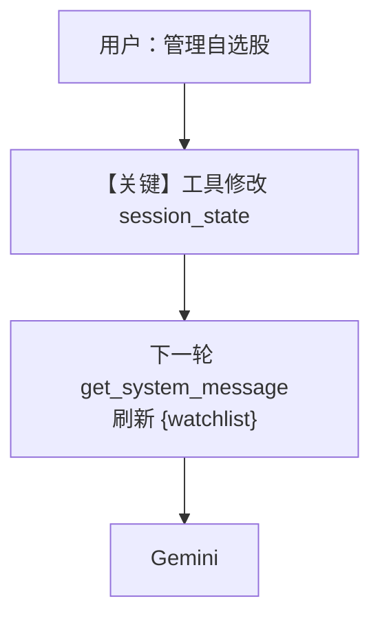

# agent_with_state_management.py — 实现原理分析

<!-- cookbook-py-source:start -->
## 完整源码

```python
"""
Agent with State Management - Finance Agent with Watchlist
===========================================================
This example shows how to give your agent persistent state that it can
read and modify. The agent maintains a stock watchlist across conversations.

Different from storage (conversation history) and memory (user preferences),
state is structured data the agent actively manages: counters, lists, flags.

Key concepts:
- session_state: A dict that persists across runs
- Tools can read/write state via run_context.session_state
- State variables can be injected into instructions with {variable_name}

Example prompts to try:
- "Add NVDA and AMD to my watchlist"
- "What's on my watchlist?"
- "Remove AMD from the list"
- "How are my watched stocks doing today?"
"""

from agno.agent import Agent
from agno.db.sqlite import SqliteDb
from agno.models.google import Gemini
from agno.run import RunContext
from agno.tools.yfinance import YFinanceTools

# ---------------------------------------------------------------------------
# Storage Configuration
# ---------------------------------------------------------------------------
agent_db = SqliteDb(db_file="tmp/agents.db")


# ---------------------------------------------------------------------------
# Custom Tools that Modify State
# ---------------------------------------------------------------------------
def add_to_watchlist(run_context: RunContext, ticker: str) -> str:
    """
    Add a stock ticker to the watchlist.

    Args:
        ticker: Stock ticker symbol (e.g., NVDA, AAPL)

    Returns:
        Confirmation message
    """
    ticker = ticker.upper().strip()
    watchlist = run_context.session_state.get("watchlist", [])

    if ticker in watchlist:
        return f"{ticker} is already on your watchlist"

    watchlist.append(ticker)
    run_context.session_state["watchlist"] = watchlist

    return f"Added {ticker} to watchlist. Current watchlist: {', '.join(watchlist)}"


def remove_from_watchlist(run_context: RunContext, ticker: str) -> str:
    """
    Remove a stock ticker from the watchlist.

    Args:
        ticker: Stock ticker symbol to remove

    Returns:
        Confirmation message
    """
    ticker = ticker.upper().strip()
    watchlist = run_context.session_state.get("watchlist", [])

    if ticker not in watchlist:
        return f"{ticker} is not on your watchlist"

    watchlist.remove(ticker)
    run_context.session_state["watchlist"] = watchlist

    if watchlist:
        return f"Removed {ticker}. Remaining watchlist: {', '.join(watchlist)}"
    return f"Removed {ticker}. Watchlist is now empty."


# ---------------------------------------------------------------------------
# Agent Instructions
# ---------------------------------------------------------------------------
instructions = """\
You are a Finance Agent that manages a stock watchlist.

## Current Watchlist
{watchlist}

## Capabilities

1. Manage watchlist
   - Add stocks: use add_to_watchlist tool
   - Remove stocks: use remove_from_watchlist tool

2. Get stock data
   - Use YFinance tools to fetch prices and metrics for watched stocks
   - Compare stocks on the watchlist

## Rules

- Always confirm watchlist changes
- When asked about "my stocks" or "watchlist", refer to the current state
- Fetch fresh data when reporting on watchlist performance\
"""

# ---------------------------------------------------------------------------
# Create the Agent
# ---------------------------------------------------------------------------
agent_with_state_management = Agent(
    name="Agent with State Management",
    model=Gemini(id="gemini-3-flash-preview"),
    instructions=instructions,
    tools=[
        add_to_watchlist,
        remove_from_watchlist,
        YFinanceTools(all=True),
    ],
    session_state={"watchlist": []},
    add_session_state_to_context=True,
    db=agent_db,
    add_datetime_to_context=True,
    add_history_to_context=True,
    num_history_runs=5,
    markdown=True,
)

# ---------------------------------------------------------------------------
# Run the Agent
# ---------------------------------------------------------------------------
if __name__ == "__main__":
    # Add some stocks
    agent_with_state_management.print_response(
        "Add NVDA, AAPL, and GOOGL to my watchlist",
        stream=True,
    )

    # Check the watchlist
    agent_with_state_management.print_response(
        "How are my watched stocks doing today?",
        stream=True,
    )

    # View the state directly
    print("\n" + "=" * 60)
    print("Session State:")
    print(
        f"  Watchlist: {agent_with_state_management.get_session_state().get('watchlist', [])}"
    )
    print("=" * 60)

# ---------------------------------------------------------------------------
# More Examples
# ---------------------------------------------------------------------------
"""
State vs Storage vs Memory:

- State: Structured data the agent manages (watchlist, counters, flags)
- Storage: Conversation history ("what did we discuss?")
- Memory: User preferences ("what do I like?")

State is perfect for:
- Tracking items (watchlists, todos, carts)
- Counters and progress
- Multi-step workflows
- Any structured data that changes during conversation

Accessing state:

1. In tools: run_context.session_state["key"]
2. In instructions: {key} (with add_session_state_to_context=True)
3. After run: agent.get_session_state() or response.session_state
"""
```

<!-- cookbook-py-source:end -->

> 源文件：`cookbook/00_quickstart/agent_with_state_management.py`

## 概述

本示例展示 Agno 的 **`session_state` + `add_session_state_to_context`** 机制：在指令中用 `{watchlist}` 占位，由框架在 `get_system_message` 中通过 `format_message_with_state_variables` 替换；工具通过 **`RunContext.session_state`** 读写同一字典，实现跨轮结构化状态（自选股列表）。

**核心配置一览：**

| 配置项 | 值 | 说明 |
|--------|------|------|
| `name` | `"Agent with State Management"` | Agent 名称 |
| `model` | `Gemini(id="gemini-3-flash-preview")` | Google GenAI |
| `instructions` | 含 `{watchlist}` 占位 | 与 session_state 联动 |
| `tools` | `add_to_watchlist`, `remove_from_watchlist`, `YFinanceTools(all=True)` | 自定义 + 第三方 |
| `session_state` | `{"watchlist": []}` | 初始状态 |
| `add_session_state_to_context` | `True` | 解析指令中的占位符 |
| `db` | `SqliteDb(...)` | 会话持久化 |
| `add_datetime_to_context` | `True` | 是 |
| `add_history_to_context` | `True` | 是 |
| `num_history_runs` | `5` | 是 |
| `markdown` | `True` | 是 |
| `resolve_in_context` | 未设置 | 默认 True，启用占位符解析 |

## 架构分层

```
用户代码层                agno.agent 层
┌──────────────────┐    ┌──────────────────────────────────┐
│ 自定义工具写      │    │ get_system_message               │
│ session_state    │───>│ format_message_with_state_variables
│ instructions     │    │ {watchlist} → 当前列表字符串      │
│ {watchlist}      │    │ get_tools → 注册可调用工具        │
└──────────────────┘    └──────────────────────────────────┘
```

## 核心组件解析

### session_state 与指令占位

`instructions` 中 `## Current Watchlist` + `{watchlist}` 在 `resolve_in_context` 为真时由 `format_message_with_state_variables` 替换（参见 `get_system_message` 末尾 L268-L273、以及 callable `instructions` 分支）。

### RunContext 工具

`add_to_watchlist` / `remove_from_watchlist` 直接修改 `run_context.session_state["watchlist"]`，与 Agent 持有的状态同步（由框架注入 `RunContext`）。

### 运行机制与因果链

1. **路径**：状态只存在于 session/run 上下文 + 持久化 session 记录（若 `db` 写会话状态）；工具返回字符串供模型继续推理。
2. **副作用**：`SqliteDb` 存会话；`session_state` 随会话保存策略持久（见 Session 实现）。
3. **分支**：`add_session_state_to_context=False` 时 `{watchlist}` 不会替换为当前值（仍为字面占位或原样）。
4. **与 memory 差异**：state 是**会话内结构化列表**；memory 是**用户级长期事实**。

## System Prompt 组装

| 组成部分 | 说明 |
|---------|------|
| `instructions` | 替换后的全文含当前 watchlist 快照 |
| `markdown` / 时间 | 同其他示例 |

### 还原后的完整 System 文本（占位已解析）

运行时 `watchlist` 初值为 `[]`，故首次 run 前可近似为：

```text
You are a Finance Agent that manages a stock watchlist.

## Current Watchlist
[]

## Capabilities

1. Manage watchlist
   - Add stocks: use add_to_watchlist tool
   - Remove stocks: use remove_from_watchlist tool

2. Get stock data
   - Use YFinance tools to fetch prices and metrics for watched stocks
   - Compare stocks on the watchlist

## Rules

- Always confirm watchlist changes
- When asked about "my stocks" or "watchlist", refer to the current state
- Fetch fresh data when reporting on watchlist performance

Use markdown to format your answers.

<additional_information>
- The current time is <运行时时间>.
</additional_information>
```

列表内容在工具调用后会变化，以实际 `session_state` 为准。

### 段落释义（模型视角）

- **Current Watchlist**：每轮可见快照，驱动「自选股」相关回答。
- **Capabilities/Rules**：约束工具使用与数据新鲜度。

## 完整 API 请求

`Gemini` `generate_content_stream`，工具列表包含自定义函数与 YFinance。

## Mermaid 流程图


```mermaid
flowchart TD
    A["用户：管理自选股"] --> B["【关键】工具修改 session_state"]
    B --> C["下一轮 get_system_message<br/>刷新 {watchlist}"]
    C --> D["Gemini"]
```

- **【关键】工具修改 session_state**：本示例的**可变状态**由工具写入，再反馈到 system。

## 关键源码文件索引

| 文件 | 关键函数/类 | 作用 |
|------|------------|------|
| `agno/agent/_messages.py` | `format_message_with_state_variables` / `get_system_message` L268+ | 占位符解析 |
| `agno/run/context.py` | `RunContext` | 工具访问 session_state |
| `agno/models/google/gemini.py` | `invoke_stream` L564+ | 模型调用 |
