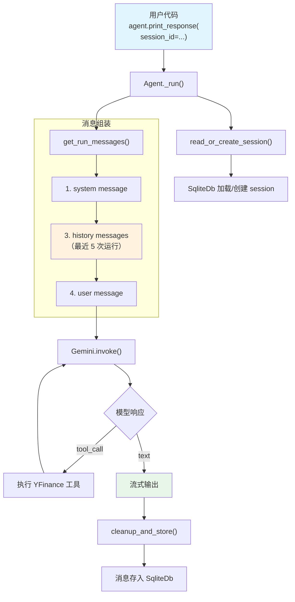

# agent_with_storage.py — 实现原理分析

> 源文件：`cookbook/00_quickstart/agent_with_storage.py`

## 概述

本示例展示 Agno 的 **会话持久化（Storage）** 机制：通过 `db` 和 `add_history_to_context` 参数，Agent 可以跨运行保存对话历史，同一 `session_id` 下的多次调用形成连续对话。

**核心配置一览：**

| 配置项 | 值 | 说明 |
|--------|------|------|
| `name` | `"Agent with Storage"` | Agent 名称 |
| `model` | `Gemini(id="gemini-3-flash-preview")` | Google Gemini API |
| `instructions` | 金融分析师工作流（含"参考历史分析"） | 指导引用历史 |
| `tools` | `[YFinanceTools(all=True)]` | Yahoo Finance 工具集 |
| `db` | `SqliteDb(db_file="tmp/agents.db")` | SQLite 持久化 |
| `add_datetime_to_context` | `True` | 注入当前时间 |
| `add_history_to_context` | `True` | 加载历史消息到上下文 |
| `num_history_runs` | `5` | 最近 5 次运行历史 |
| `markdown` | `True` | Markdown 格式化输出 |

## 架构分层

```
用户代码层                      agno.agent 层
┌────────────────────────┐    ┌──────────────────────────────────────┐
│ agent_with_storage.py  │    │ Agent._run()                         │
│                        │    │  ├ read_or_create_session()           │
│ db=SqliteDb            │    │  │  → 从 SQLite 恢复/创建 session    │
│ session_id=            │───>│  │                                    │
│   "finance-agent-      │    │  ├ _messages.py                       │
│    session"            │    │  │  get_run_messages()                │
│ add_history=True       │    │  │    → system + history + user       │
│ num_history_runs=5     │    │  │                                    │
│                        │    │  └ cleanup_and_store()                │
│                        │    │     → 存储本次运行消息到 SQLite       │
└────────────────────────┘    └──────────────────────────────────────┘
                                      │
                              ┌───────┴───────┐
                              │               │
                              ▼               ▼
                      ┌──────────────┐ ┌─────────────┐
                      │ Gemini       │ │ SqliteDb     │
                      │ gemini-3-    │ │ agents.db    │
                      │ flash        │ └─────────────┘
                      └──────────────┘
```

## 核心组件解析

### session_id

`session_id` 标识一个对话线程。同一 `session_id` 下的所有 `print_response()` 调用共享对话历史：

```python
# 用户代码中
session_id = "finance-agent-session"
agent.print_response("Analyze NVDA", session_id=session_id, stream=True)
agent.print_response("Compare that to Tesla", session_id=session_id, stream=True)
```

在 `Agent._run()` 的步骤 1（`_run.py:316`）中，`read_or_create_session()` 根据 `session_id` 从 SQLite 恢复已有会话，或创建新会话。

### add_history_to_context

在 `get_run_messages()` 步骤 3（`_messages.py:1231`）中，历史消息被加载到上下文：

```python
# _messages.py L1231-1262
if add_history_to_context:
    history: List[Message] = session.get_messages(
        last_n_runs=agent.num_history_runs,  # 最近 5 次
        limit=agent.num_history_messages,
        skip_roles=[skip_role] if skip_role else None,
    )
    if len(history) > 0:
        history_copy = [deepcopy(msg) for msg in history]
        for _msg in history_copy:
            _msg.from_history = True  # 标记为历史消息
        run_messages.messages += history_copy
```

消息顺序为：`system → history → user`，模型能看到之前的对话从而理解"那个"指代什么。

### SqliteDb

`SqliteDb(db_file="tmp/agents.db")` 使用 SQLite 数据库存储会话数据。每次运行结束后，`cleanup_and_store()`（`_run.py:4348`）将本次运行的消息序列化后存入数据库。

## System Prompt 组装

| 序号 | 组成部分 | 本文件中的值/来源 | 是否生效 |
|------|---------|-----------------|---------|
| 1 | `system_message`（自定义） | `None` | 否 |
| 3.1 | `instructions` | 金融分析师工作流 | 是 |
| 3.2.1 | `markdown` | `True` | 是 |
| 3.2.2 | `add_datetime_to_context` | `True` | 是 |
| 3.3.3 | instructions 拼接 | 写入 system message | 是 |
| 3.3.4 | additional_information | markdown + datetime | 是 |

### 最终 System Prompt

```text
You are a Finance Agent — a data-driven analyst who retrieves market data,
computes key ratios, and produces concise, decision-ready insights.

## Workflow
1. Clarify ...
2. Retrieve ...
3. Analyze ...
4. Present ...

## Rules
...
- Reference previous analyses when relevant.

<additional_information>
- Use markdown to format your answers.
- The current time is 2026-03-01 14:30:00.
</additional_information>
```

## 完整 API 请求

```python
# 第 2 轮对话（"Compare that to Tesla"），包含历史
client.models.generate_content(
    model="gemini-3-flash-preview",
    contents=[
        # 1. System Message
        {"role": "user", "parts": [{"text": "<system prompt>"}]},
        {"role": "model", "parts": [{"text": "ok"}]},

        # 2. 历史消息（第 1 轮的 user + assistant + tool_calls）
        {"role": "user", "parts": [{"text": "Give me a quick investment brief on NVIDIA"}]},
        {"role": "model", "parts": [{"function_call": {"name": "get_stock_price", "args": {"symbol": "NVDA"}}}]},
        {"role": "user", "parts": [{"function_response": {"name": "get_stock_price", "response": {"price": 850.0}}}]},
        {"role": "model", "parts": [{"text": "NVIDIA 投资简报..."}]},

        # 3. 当前用户输入
        {"role": "user", "parts": [{"text": "Compare that to Tesla"}]}
    ],
    tools=[{"function_declarations": [...]}]
)
```

> 历史消息来自 SQLite，在 `get_run_messages()` 步骤 3 中被深拷贝后插入。模型能看到之前分析了 NVDA，因此理解"that"指代 NVDA。

## Mermaid 流程图



## 关键源码文件索引

| 文件 | 关键函数/类 | 作用 |
|------|------------|------|
| `agno/agent/agent.py` | `db` L123 | 数据库配置 |
| `agno/agent/agent.py` | `add_history_to_context` L127 | 历史消息开关 |
| `agno/agent/agent.py` | `num_history_runs` L129 | 限制历史运行次数 |
| `agno/agent/_messages.py` | `get_run_messages()` L1231-1262 | 加载历史消息 |
| `agno/agent/_run.py` | `cleanup_and_store()` L4348 | 运行后存储 |
| `agno/db/sqlite/` | `SqliteDb` | SQLite 持久化后端 |
