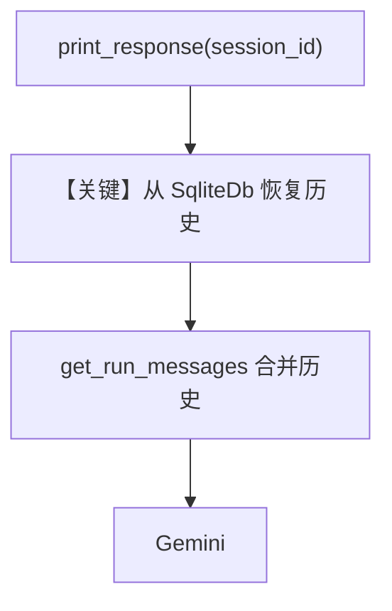

# agent_with_storage.py — 实现原理分析

> 源文件：`cookbook/00_quickstart/agent_with_storage.py`

## 概述

本示例展示 Agno 的 **`db`（SqliteDb）+ `add_history_to_context` + `session_id`** 机制：会话历史持久化到 SQLite，**同一 `session_id`** 跨多次 `print_response` 甚至进程重启仍可恢复上下文，使多轮对话具备「记得之前说过什么」的能力。

**核心配置一览：**

| 配置项 | 值 | 说明 |
|--------|------|------|
| `name` | `"Agent with Storage"` | Agent 名称 |
| `model` | `Gemini(id="gemini-3-flash-preview")` | Google GenAI |
| `instructions` | 财经工作流指令 | 业务 |
| `tools` | `[YFinanceTools(all=True)]` | 雅虎财经 |
| `db` | `SqliteDb(db_file="tmp/agents.db")` | 会话存储 |
| `add_datetime_to_context` | `True` | 是 |
| `add_history_to_context` | `True` | 是 |
| `num_history_runs` | `5` | 最近若干轮注入上下文 |
| `markdown` | `True` | 是 |
| `session_id` | `main` 中 `"finance-agent-session"` | 显式会话键 |

## 架构分层

```
用户代码层                agno.agent 层
┌──────────────────┐    ┌──────────────────────────────────┐
│ print_response   │    │ run_agent 加载/保存 Session       │
│ session_id 固定   │───>│ get_run_messages 附带历史消息      │
└──────────────────┘    │ SqliteDb 读写                      │
                        └──────────────────────────────────┘
```

## 核心组件解析

### SqliteDb

提供 Agent 会话与消息记录的持久化适配器（具体表结构见 `agno/db/sqlite`）。

### 历史注入

`add_history_to_context=True` 时，`get_run_messages` 从 `db` 读取最近 `num_history_runs` 轮相关消息拼入模型输入。

### 运行机制与因果链

1. **路径**：用户消息 → 加载 session → 附加历史 user/assistant → 当前用户输入 → Gemini。
2. **副作用**：每轮 run 写入 `tmp/agents.db`；重复运行同一 `session_id` 追加历史。
3. **分支**：不传 `session_id` 时由框架生成新会话；`add_history_to_context=False` 则仅当前轮。
4. **与 memory 差异**：storage 是**对话日志**；memory 是**用户画像**。

## System Prompt 组装

与「仅工具财经 Agent」相同：`instructions` + markdown + 时间（无 output_schema 时）。无 Knowledge、无记忆段。

### 还原后的完整 System 文本

```text
You are a Finance Agent — a data-driven analyst who retrieves market data,
computes key ratios, and produces concise, decision-ready insights.

## Workflow

1. Clarify
   - Identify tickers from company names (e.g., Apple → AAPL)
   - If ambiguous, ask

2. Retrieve
   - Fetch: price, change %, market cap, P/E, EPS, 52-week range
   - For comparisons, pull the same fields for each ticker

3. Analyze
   - Compute ratios (P/E, P/S, margins) when not already provided
   - Key drivers and risks — 2-3 bullets max
   - Facts only, no speculation

4. Present
   - Lead with a one-line summary
   - Use tables for multi-stock comparisons
   - Keep it tight

## Rules

- Source: Yahoo Finance. Always note the timestamp.
- Missing data? Say "N/A" and move on.
- No personalized advice — add disclaimer when relevant.
- No emojis.
- Reference previous analyses when relevant.

Use markdown to format your answers.

<additional_information>
- The current time is <运行时时间>.
</additional_information>
```

**多轮语境**主要来自 **message 历史**，而非 system 中的额外「摘要」段落（除非业务指令要求引用）。

### 段落释义（模型视角）

- **Reference previous analyses**：与历史消息配合，强调利用前文。

## 完整 API 请求

```python
# 每次 run：contents 含 system + 若干历史 user/assistant + 当前 user
client.models.generate_content_stream(
    model="gemini-3-flash-preview",
    contents=[...],
    tools=[...],
)
```

## Mermaid 流程图


```mermaid
flowchart TD
    A["print_response(session_id)"] --> B["【关键】从 SqliteDb 恢复历史"]
    B --> C["get_run_messages 合并历史"]
    C --> D["Gemini"]
```

- **【关键】从 SqliteDb 恢复历史**：本示例的**持久化多轮对话**依赖存储层 + `session_id`。

## 关键源码文件索引

| 文件 | 关键函数/类 | 作用 |
|------|------------|------|
| `agno/agent/_messages.py` | `get_run_messages()` L1156+ | 历史与当前消息合并 |
| `agno/db/sqlite.py` | `SqliteDb` | 持久化 |
| `agno/models/google/gemini.py` | `invoke_stream` L564+ | 模型调用 |
