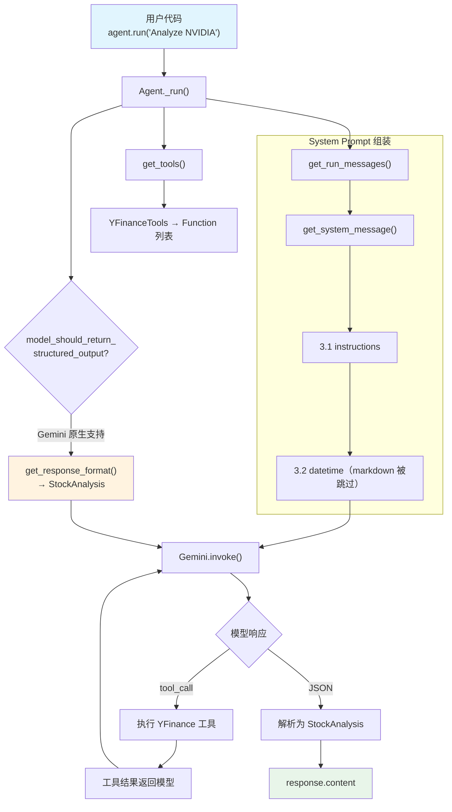

# agent_with_structured_output.py — 实现原理分析

> 源文件：`cookbook/00_quickstart/agent_with_structured_output.py`

## 概述

本示例展示 Agno 的 **`output_schema` 结构化输出** 机制：通过 Pydantic 模型定义响应格式，Agent 保证返回类型安全的结构化数据，而非自由文本。

**核心配置一览：**

| 配置项 | 值 | 说明 |
|--------|------|------|
| `name` | `"Agent with Structured Output"` | Agent 名称 |
| `model` | `Gemini(id="gemini-3-flash-preview")` | Google Gemini API |
| `instructions` | 金融分析工作流 | 指导分析和推荐 |
| `tools` | `[YFinanceTools(all=True)]` | Yahoo Finance 工具集 |
| `output_schema` | `StockAnalysis`（Pydantic 模型） | 结构化输出 schema |
| `db` | `SqliteDb(db_file="tmp/agents.db")` | SQLite 持久化 |
| `add_datetime_to_context` | `True` | 注入当前时间 |
| `add_history_to_context` | `True` | 加载历史消息 |
| `num_history_runs` | `5` | 最近 5 次运行历史 |
| `markdown` | `True` | 有 output_schema 时不生效 |

## 架构分层

```
用户代码层                         agno.agent 层
┌───────────────────────────┐    ┌──────────────────────────────────────┐
│ agent_with_structured_    │    │ Agent._run()                         │
│   output.py               │    │  ├ _tools.py                         │
│                           │    │  │  get_tools()                      │
│ output_schema=            │    │  │    → YFinanceTools 解析            │
│   StockAnalysis           │───>│  ├ _response.py                      │
│ db=SqliteDb               │    │  │  model_should_return_structured_  │
│ add_history=True          │    │  │    output() → True (Gemini 原生)  │
│ num_history_runs=5        │    │  │  get_response_format()             │
│                           │    │  │    → StockAnalysis class           │
│                           │    │  ├ _messages.py                       │
│                           │    │  │  get_system_message()              │
│                           │    │  │  get_run_messages()                │
│                           │    │  │    → system + history + user       │
└───────────────────────────┘    └──────────────────────────────────────┘
                                         │
                                         ▼
                                 ┌──────────────────┐
                                 │ Gemini           │
                                 │ gemini-3-flash   │
                                 │ (structured out) │
                                 └──────────────────┘
```

## 核心组件解析

### output_schema

`output_schema=StockAnalysis` 定义了 Agent 的结构化输出格式。Gemini 模型支持原生结构化输出（`supports_native_structured_outputs=True`，`gemini.py:80`），因此走原生路径。

在 `_response.py:860` 的 `model_should_return_structured_output()` 中：

```python
# _response.py L860-869
def model_should_return_structured_output(agent, run_context=None):
    output_schema = run_context.output_schema if run_context else None
    return bool(
        agent.model.supports_native_structured_outputs  # Gemini = True
        and output_schema is not None                    # StockAnalysis
        and (not agent.use_json_mode or agent.structured_outputs)
    )
```

因为 Gemini 原生支持，`get_response_format()`（`_response.py:872`）直接返回 `StockAnalysis` 类，模型被要求按此 schema 返回 JSON。

### markdown 与 output_schema 的交互

当 `output_schema` 存在时，`markdown` 指令不会被添加到 system prompt：

```python
# _messages.py L184-185
if agent.markdown and output_schema is None:  # output_schema 不为 None，跳过
    additional_information.append("Use markdown to format your answers.")
```

### StockAnalysis Pydantic 模型

```python
class StockAnalysis(BaseModel):
    ticker: str           # 股票代码
    company_name: str     # 公司名称
    current_price: float  # 当前价格
    market_cap: str       # 市值
    pe_ratio: Optional[float]  # 市盈率（可选）
    week_52_high: float   # 52 周最高
    week_52_low: float    # 52 周最低
    summary: str          # 一句话总结
    key_drivers: List[str]    # 增长驱动因素
    key_risks: List[str]      # 风险因素
    recommendation: str       # 推荐（Strong Buy/Buy/Hold/Sell/Strong Sell）
```

### agent.run() vs agent.print_response()

本例使用 `agent.run()` 而非 `print_response()`，因为需要程序化访问结构化数据：

```python
response = agent_with_structured_output.run("Analyze NVIDIA")
analysis: StockAnalysis = response.content  # 类型安全的 Pydantic 对象
print(f"Price: ${analysis.current_price:.2f}")
```

## System Prompt 组装

| 序号 | 组成部分 | 本文件中的值/来源 | 是否生效 |
|------|---------|-----------------|---------|
| 1 | `system_message`（自定义） | `None` | 否 |
| 3.1 | `instructions` | 金融分析工作流 | 是 |
| 3.2.1 | `markdown` | `True` 但 output_schema 存在，跳过 | 否 |
| 3.2.2 | `add_datetime_to_context` | `True` | 是 |
| 3.2.3 | `add_location_to_context` | `False` | 否 |
| 3.2.4 | `add_name_to_context` | `False` | 否 |
| 3.3.3 | instructions 拼接 | 写入 system message | 是 |
| 3.3.4 | additional_information | datetime | 是 |
| 3.3.5 | `_tool_instructions` | 无 | 否 |
| 3.3.15 | JSON output prompt | Gemini 原生支持，跳过 | 否 |

### 最终 System Prompt

```text
You are a Finance Agent — a data-driven analyst who retrieves market data,
computes key ratios, and produces concise, decision-ready insights.

## Workflow
1. Retrieve ...
2. Analyze ...
3. Recommend ...

## Rules
...

<additional_information>
- The current time is 2026-03-01 14:30:00.
</additional_information>
```

> 注意：因为 Gemini 原生支持 structured outputs，不需要在 system prompt 中添加 JSON 格式说明。模型通过 `response_format` 参数强制输出 `StockAnalysis` schema。

## 完整 API 请求

```python
# Gemini 原生结构化输出
client.models.generate_content(
    model="gemini-3-flash-preview",
    contents=[
        # 1. System Message
        {"role": "user", "parts": [{"text": "<system prompt>"}]},
        {"role": "model", "parts": [{"text": "ok"}]},
        # 2. 历史消息（如有，最近 5 次运行）
        # ...
        # 3. 用户输入
        {"role": "user", "parts": [{"text": "Analyze NVIDIA"}]}
    ],
    tools=[
        {"function_declarations": [
            # YFinanceTools 的函数定义
        ]}
    ],
    config={
        "response_mime_type": "application/json",
        "response_schema": StockAnalysis,  # Pydantic → JSON Schema
    }
)
```

> Gemini 通过 `response_schema` 参数原生支持结构化输出，模型保证返回符合 schema 的 JSON。`response.content` 被自动解析为 `StockAnalysis` 实例。

## Mermaid 流程图



## 关键源码文件索引

| 文件 | 关键函数/类 | 作用 |
|------|------------|------|
| `agno/agent/agent.py` | `output_schema` L281 | 结构化输出 schema |
| `agno/agent/_response.py` | `model_should_return_structured_output()` L860 | 判断是否使用原生结构化输出 |
| `agno/agent/_response.py` | `get_response_format()` L872 | 获取 response_format |
| `agno/agent/_messages.py` | `get_system_message()` L106 | 构建 system prompt |
| `agno/agent/_messages.py` | `get_run_messages()` L1146 | 组装消息列表（含历史） |
| `agno/models/google/gemini.py` | `supports_native_structured_outputs` L80 | Gemini 原生支持标记 |
| `agno/tools/yfinance.py` | `YFinanceTools` | Yahoo Finance 工具集 |
| `agno/db/sqlite/` | `SqliteDb` | SQLite 持久化存储 |
