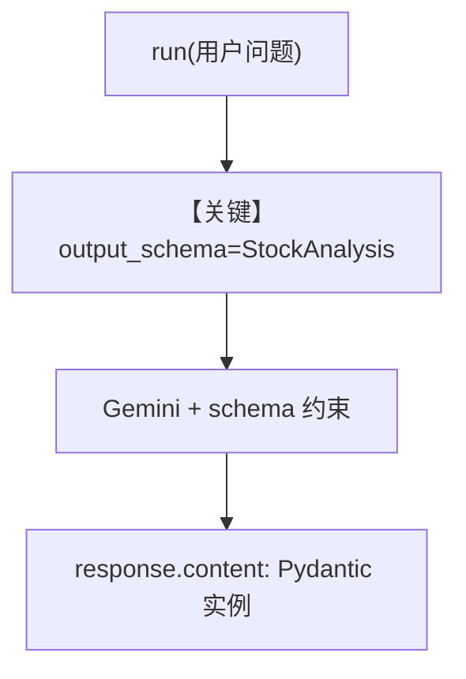

# agent_with_structured_output.py — 实现原理分析

> 源文件：`cookbook/00_quickstart/agent_with_structured_output.py`

## 概述

本示例展示 Agno 的 **`output_schema`（Pydantic）** 机制：强制模型输出解析为 **`StockAnalysis`** 类型，供下游直接使用；当设置 `output_schema` 时，默认 system 中 **不** 追加「Use markdown…」行（`markdown and output_schema is None` 条件，见 `_messages.py` L184）。

**核心配置一览：**

| 配置项 | 值 | 说明 |
|--------|------|------|
| `name` | `"Agent with Structured Output"` | Agent 名称 |
| `model` | `Gemini(id="gemini-3-flash-preview")` | Google GenAI |
| `instructions` | 财经分析工作流 | 业务 |
| `tools` | `[YFinanceTools(all=True)]` | 雅虎财经 |
| `output_schema` | `StockAnalysis` | Pydantic 模型 |
| `db` | `SqliteDb(...)` | 会话 |
| `add_datetime_to_context` | `True` | 是 |
| `add_history_to_context` | `True` | 是 |
| `num_history_runs` | `5` | 是 |
| `markdown` | `True` | 不追加 markdown 提示行（因 output_schema） |

## 架构分层

```
用户代码层                agno.agent 层
┌──────────────────┐    ┌──────────────────────────────────┐
│ run("Analyze NVDA")│   │ run_context.output_schema = StockAnalysis
│ response.content   │───>│ 模型响应 → 解析为 Pydantic         │
└──────────────────┘    └──────────────────────────────────┘
```

## 核心组件解析

### output_schema 对 system 的影响

- **#3.2.1**：`markdown` 为 True 但 `run_context.output_schema` 非空时，跳过「Use markdown…」附加段。
- 模型侧可能通过 `response_format` / schema 约束走 Gemini 的结构化输出路径（见 `Gemini.get_request_params` / `prepare_response_schema`）。

### StockAnalysis

字段覆盖价格、市值、驱动因素、评级等，`run` 返回的 `response.content` 为 **`StockAnalysis` 实例**。

### 运行机制与因果链

1. **路径**：用户字符串 → 工具调用拉数据 → 模型生成符合 schema 的内容 → 框架解析为 Pydantic。
2. **副作用**：`db` 记会话；结构化结果可 `model_dump()` 落库。
3. **分支**：无 schema 时走纯文本；有 schema 时解析失败可能触发重试（依模型适配器实现）。
4. **定位**：在「带工具财经 Agent」上强调**类型化输出契约**。

## System Prompt 组装

| 组成部分 | 是否生效 |
|---------|---------|
| `instructions` | 是 |
| markdown 附加行 | **否**（output_schema 存在） |
| `add_datetime_to_context` | 是 |

### 还原后的完整 System 文本

```text
You are a Finance Agent — a data-driven analyst who retrieves market data,
computes key ratios, and produces concise, decision-ready insights.

## Workflow

1. Retrieve
   - Fetch: price, change %, market cap, P/E, EPS, 52-week range
   - Get all required fields for the analysis

2. Analyze
   - Identify 2-3 key drivers (what's working)
   - Identify 2-3 key risks (what could go wrong)
   - Facts only, no speculation

3. Recommend
   - Based on the data, provide a clear recommendation
   - Be decisive but note this is not personalized advice

## Rules

- Source: Yahoo Finance
- Missing data? Use null for optional fields, estimate for required
- Recommendation must be one of: Strong Buy, Buy, Hold, Sell, Strong Sell

<additional_information>
- The current time is <运行时时间>.
</additional_information>
```

另：**expected_output / JSON schema 约束**可能由模型适配器以 API 参数附加，不一定全部以明文出现在 `message.content` 中；若需确认，请在 `Gemini.get_request_params` 附近打断点。

### 段落释义（模型视角）

- 指令要求按工作流填满 `StockAnalysis` 各字段；评级枚举固定。

## 完整 API 请求

`Gemini.invoke`（非流式示例使用 `run` 默认 `stream=False`）会传入 `response_format` 指向 schema（`gemini.py` L507+）。

```python
client.models.generate_content(
    model="gemini-3-flash-preview",
    contents=[...],
    # config 中含 response_schema / 结构化输出相关字段
)
```

## Mermaid 流程图


```mermaid
flowchart TD
    A["run(用户问题)"] --> B["【关键】output_schema=StockAnalysis"]
    B --> C["Gemini + schema 约束"]
    C --> D["response.content: Pydantic 实例"]
```

- **【关键】output_schema**：本示例演示的**结构化输出**由 schema 驱动解析与类型保证。

## 关键源码文件索引

| 文件 | 关键函数/类 | 作用 |
|------|------------|------|
| `agno/agent/_messages.py` | `get_system_message()` L184-185 | markdown 与 schema 互斥附加 |
| `agno/models/google/gemini.py` | `invoke` L507+、`get_request_params` | schema 传参 |
| `agno/utils/gemini.py` | `prepare_response_schema` 等 | Schema 格式化 |
