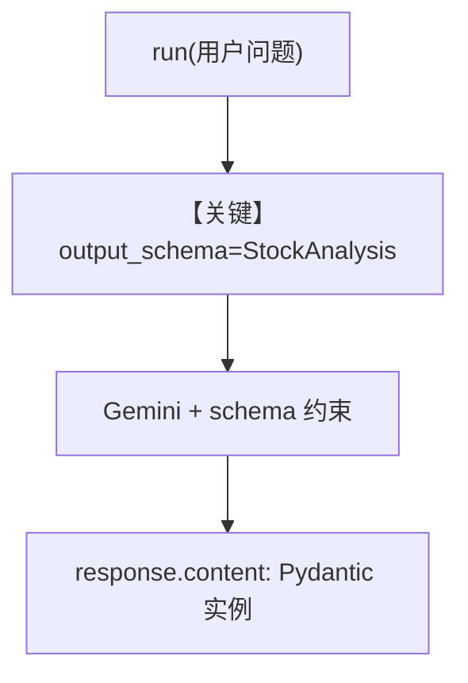

# agent_with_structured_output.py — 实现原理分析

<!-- cookbook-py-source:start -->
## 完整源码

```python
"""
Agent with Structured Output - Finance Agent with Typed Responses
==================================================================
This example shows how to get structured, typed responses from your agent.
Instead of free-form text, you get a Pydantic model you can trust.

Perfect for building pipelines, UIs, or integrations where you need
predictable data shapes. Parse it, store it, display it — no regex required.

Key concepts:
- output_schema: A Pydantic model defining the response structure
- The agent's response will always match this schema
- Access structured data via response.content

Example prompts to try:
- "Analyze NVDA"
- "Give me a report on Tesla"
- "What's the investment case for Apple?"
"""

from typing import List, Optional

from agno.agent import Agent
from agno.db.sqlite import SqliteDb
from agno.models.google import Gemini
from agno.tools.yfinance import YFinanceTools
from pydantic import BaseModel, Field

# ---------------------------------------------------------------------------
# Storage Configuration
# ---------------------------------------------------------------------------
agent_db = SqliteDb(db_file="tmp/agents.db")


# ---------------------------------------------------------------------------
# Structured Output Schema
# ---------------------------------------------------------------------------
class StockAnalysis(BaseModel):
    """Structured output for stock analysis."""

    ticker: str = Field(..., description="Stock ticker symbol (e.g., NVDA)")
    company_name: str = Field(..., description="Full company name")
    current_price: float = Field(..., description="Current stock price in USD")
    market_cap: str = Field(..., description="Market cap (e.g., '3.2T' or '150B')")
    pe_ratio: Optional[float] = Field(None, description="P/E ratio, if available")
    week_52_high: float = Field(..., description="52-week high price")
    week_52_low: float = Field(..., description="52-week low price")
    summary: str = Field(..., description="One-line summary of the stock")
    key_drivers: List[str] = Field(..., description="2-3 key growth drivers")
    key_risks: List[str] = Field(..., description="2-3 key risks")
    recommendation: str = Field(
        ..., description="One of: Strong Buy, Buy, Hold, Sell, Strong Sell"
    )


# ---------------------------------------------------------------------------
# Agent Instructions
# ---------------------------------------------------------------------------
instructions = """\
You are a Finance Agent — a data-driven analyst who retrieves market data,
computes key ratios, and produces concise, decision-ready insights.

## Workflow

1. Retrieve
   - Fetch: price, change %, market cap, P/E, EPS, 52-week range
   - Get all required fields for the analysis

2. Analyze
   - Identify 2-3 key drivers (what's working)
   - Identify 2-3 key risks (what could go wrong)
   - Facts only, no speculation

3. Recommend
   - Based on the data, provide a clear recommendation
   - Be decisive but note this is not personalized advice

## Rules

- Source: Yahoo Finance
- Missing data? Use null for optional fields, estimate for required
- Recommendation must be one of: Strong Buy, Buy, Hold, Sell, Strong Sell\
"""

# ---------------------------------------------------------------------------
# Create the Agent
# ---------------------------------------------------------------------------
agent_with_structured_output = Agent(
    name="Agent with Structured Output",
    model=Gemini(id="gemini-3-flash-preview"),
    instructions=instructions,
    tools=[YFinanceTools(all=True)],
    output_schema=StockAnalysis,
    db=agent_db,
    add_datetime_to_context=True,
    add_history_to_context=True,
    num_history_runs=5,
    markdown=True,
)

# ---------------------------------------------------------------------------
# Run the Agent
# ---------------------------------------------------------------------------
if __name__ == "__main__":
    # Get structured output
    response = agent_with_structured_output.run("Analyze NVIDIA")

    # Access the typed data
    analysis: StockAnalysis = response.content

    # Use it programmatically
    print(f"\n{'=' * 60}")
    print(f"Stock Analysis: {analysis.company_name} ({analysis.ticker})")
    print(f"{'=' * 60}")
    print(f"Price: ${analysis.current_price:.2f}")
    print(f"Market Cap: {analysis.market_cap}")
    print(f"P/E Ratio: {analysis.pe_ratio or 'N/A'}")
    print(f"52-Week Range: ${analysis.week_52_low:.2f} - ${analysis.week_52_high:.2f}")
    print(f"\nSummary: {analysis.summary}")
    print("\nKey Drivers:")
    for driver in analysis.key_drivers:
        print(f"  • {driver}")
    print("\nKey Risks:")
    for risk in analysis.key_risks:
        print(f"  • {risk}")
    print(f"\nRecommendation: {analysis.recommendation}")
    print(f"{'=' * 60}\n")

# ---------------------------------------------------------------------------
# More Examples
# ---------------------------------------------------------------------------
"""
Structured output is perfect for:

1. Building UIs
   analysis = agent.run("Analyze TSLA").content
   render_stock_card(analysis)

2. Storing in databases
   db.insert("analyses", analysis.model_dump())

3. Comparing stocks
   nvda = agent.run("Analyze NVDA").content
   amd = agent.run("Analyze AMD").content
   if nvda.pe_ratio < amd.pe_ratio:
       print(f"{nvda.ticker} is cheaper by P/E")

4. Building pipelines
   tickers = ["AAPL", "GOOGL", "MSFT"]
   analyses = [agent.run(f"Analyze {t}").content for t in tickers]

The schema guarantees you always get the fields you expect.
No parsing, no surprises.
"""
```

<!-- cookbook-py-source:end -->

> 源文件：`cookbook/00_quickstart/agent_with_structured_output.py`

## 概述

本示例展示 Agno 的 **`output_schema`（Pydantic）** 机制：强制模型输出解析为 **`StockAnalysis`** 类型，供下游直接使用；当设置 `output_schema` 时，默认 system 中 **不** 追加「Use markdown…」行（`markdown and output_schema is None` 条件，见 `_messages.py` L184）。

**核心配置一览：**

| 配置项 | 值 | 说明 |
|--------|------|------|
| `name` | `"Agent with Structured Output"` | Agent 名称 |
| `model` | `Gemini(id="gemini-3-flash-preview")` | Google GenAI |
| `instructions` | 财经分析工作流 | 业务 |
| `tools` | `[YFinanceTools(all=True)]` | 雅虎财经 |
| `output_schema` | `StockAnalysis` | Pydantic 模型 |
| `db` | `SqliteDb(...)` | 会话 |
| `add_datetime_to_context` | `True` | 是 |
| `add_history_to_context` | `True` | 是 |
| `num_history_runs` | `5` | 是 |
| `markdown` | `True` | 不追加 markdown 提示行（因 output_schema） |

## 架构分层

```
用户代码层                agno.agent 层
┌──────────────────┐    ┌──────────────────────────────────┐
│ run("Analyze NVDA")│   │ run_context.output_schema = StockAnalysis
│ response.content   │───>│ 模型响应 → 解析为 Pydantic         │
└──────────────────┘    └──────────────────────────────────┘
```

## 核心组件解析

### output_schema 对 system 的影响

- **#3.2.1**：`markdown` 为 True 但 `run_context.output_schema` 非空时，跳过「Use markdown…」附加段。
- 模型侧可能通过 `response_format` / schema 约束走 Gemini 的结构化输出路径（见 `Gemini.get_request_params` / `prepare_response_schema`）。

### StockAnalysis

字段覆盖价格、市值、驱动因素、评级等，`run` 返回的 `response.content` 为 **`StockAnalysis` 实例**。

### 运行机制与因果链

1. **路径**：用户字符串 → 工具调用拉数据 → 模型生成符合 schema 的内容 → 框架解析为 Pydantic。
2. **副作用**：`db` 记会话；结构化结果可 `model_dump()` 落库。
3. **分支**：无 schema 时走纯文本；有 schema 时解析失败可能触发重试（依模型适配器实现）。
4. **定位**：在「带工具财经 Agent」上强调**类型化输出契约**。

## System Prompt 组装

| 组成部分 | 是否生效 |
|---------|---------|
| `instructions` | 是 |
| markdown 附加行 | **否**（output_schema 存在） |
| `add_datetime_to_context` | 是 |

### 还原后的完整 System 文本

```text
You are a Finance Agent — a data-driven analyst who retrieves market data,
computes key ratios, and produces concise, decision-ready insights.

## Workflow

1. Retrieve
   - Fetch: price, change %, market cap, P/E, EPS, 52-week range
   - Get all required fields for the analysis

2. Analyze
   - Identify 2-3 key drivers (what's working)
   - Identify 2-3 key risks (what could go wrong)
   - Facts only, no speculation

3. Recommend
   - Based on the data, provide a clear recommendation
   - Be decisive but note this is not personalized advice

## Rules

- Source: Yahoo Finance
- Missing data? Use null for optional fields, estimate for required
- Recommendation must be one of: Strong Buy, Buy, Hold, Sell, Strong Sell

<additional_information>
- The current time is <运行时时间>.
</additional_information>
```

另：**expected_output / JSON schema 约束**可能由模型适配器以 API 参数附加，不一定全部以明文出现在 `message.content` 中；若需确认，请在 `Gemini.get_request_params` 附近打断点。

### 段落释义（模型视角）

- 指令要求按工作流填满 `StockAnalysis` 各字段；评级枚举固定。

## 完整 API 请求

`Gemini.invoke`（非流式示例使用 `run` 默认 `stream=False`）会传入 `response_format` 指向 schema（`gemini.py` L507+）。

```python
client.models.generate_content(
    model="gemini-3-flash-preview",
    contents=[...],
    # config 中含 response_schema / 结构化输出相关字段
)
```

## Mermaid 流程图


```mermaid
flowchart TD
    A["run(用户问题)"] --> B["【关键】output_schema=StockAnalysis"]
    B --> C["Gemini + schema 约束"]
    C --> D["response.content: Pydantic 实例"]
```

- **【关键】output_schema**：本示例演示的**结构化输出**由 schema 驱动解析与类型保证。

## 关键源码文件索引

| 文件 | 关键函数/类 | 作用 |
|------|------------|------|
| `agno/agent/_messages.py` | `get_system_message()` L184-185 | markdown 与 schema 互斥附加 |
| `agno/models/google/gemini.py` | `invoke` L507+、`get_request_params` | schema 传参 |
| `agno/utils/gemini.py` | `prepare_response_schema` 等 | Schema 格式化 |
