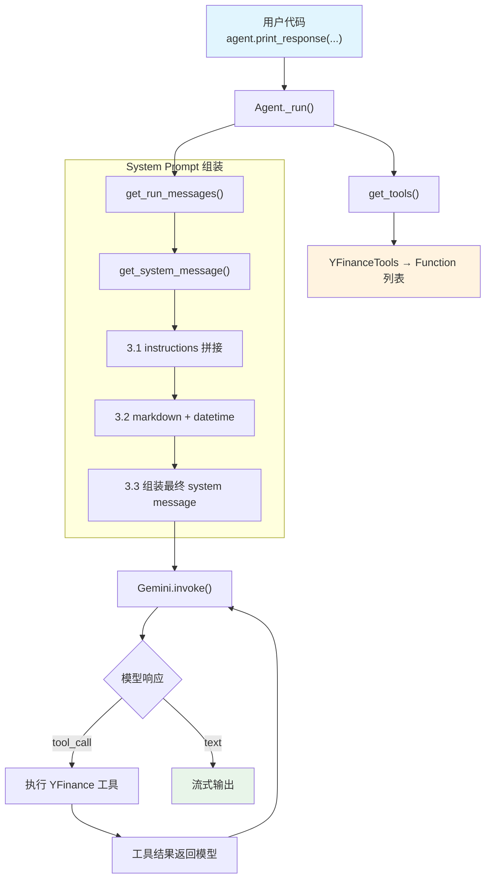

# agent_with_tools.py — 实现原理分析

> 源文件：`cookbook/00_quickstart/agent_with_tools.py`

## 概述

本示例展示 Agno 的 **工具调用（Tool Use）** 机制：Agent 通过 `tools` 参数注册 `YFinanceTools`，模型在需要市场数据时自动调用工具函数，实现数据驱动的金融分析。

**核心配置一览：**

| 配置项 | 值 | 说明 |
|--------|------|------|
| `name` | `"Agent with Tools"` | Agent 名称 |
| `model` | `Gemini(id="gemini-3-flash-preview")` | Google Gemini API |
| `instructions` | 金融分析师工作流指令 | 多段 Markdown 格式 |
| `tools` | `[YFinanceTools(all=True)]` | Yahoo Finance 全功能工具集 |
| `add_datetime_to_context` | `True` | 注入当前时间到 system prompt |
| `markdown` | `True` | 格式化输出为 Markdown |
| `db` | `None` | 未设置，不持久化 |
| `add_history_to_context` | `False`（默认） | 不加载历史消息 |

## 架构分层

```
用户代码层                    agno.agent 层
┌──────────────────────┐    ┌──────────────────────────────────────┐
│ agent_with_tools.py  │    │ Agent._run()                         │
│                      │    │  ├ _tools.py                         │
│ model=Gemini         │    │  │  get_tools()                      │
│ instructions=...     │───>│  │    → YFinanceTools 解析为 Function │
│ tools=[YFinance]     │    │  │                                    │
│ add_datetime=True    │    │  ├ _messages.py                       │
│ markdown=True        │    │  │  get_system_message()              │
│                      │    │  │    → instructions + datetime       │
│                      │    │  │  get_run_messages()                │
│                      │    │  │    → system + user messages        │
└──────────────────────┘    └──────────────────────────────────────┘
                                    │
                                    ▼
                            ┌──────────────────┐
                            │ Gemini           │
                            │ gemini-3-flash   │
                            └──────────────────┘
```

## 核心组件解析

### YFinanceTools

`YFinanceTools(all=True)` 是一个 `Toolkit` 子类（`tools/yfinance.py`），`all=True` 启用所有可用工具函数。在 `get_tools()`（`agent/_tools.py:105`）中：

```python
# _tools.py L133-136
if resolved_tools is not None:
    _raise_if_async_tools_in_list(resolved_tools)
    agent_tools.extend(resolved_tools)
```

`Toolkit` 的 `__init__()`（`tools/toolkit.py:15`）会将标记为工具的方法注册为 `Function` 对象，每个 `Function` 包含函数名、描述、参数 JSON Schema。

### Instructions 处理

`instructions` 是一个多行字符串，在 `get_system_message()`（`_messages.py:106`）的步骤 3.1 中处理：

```python
# _messages.py L163-174
if agent.instructions is not None:
    _instructions = agent.instructions
    if callable(agent.instructions):
        _instructions = execute_instructions(...)
    if isinstance(_instructions, str):
        instructions.append(_instructions)  # 本例走此分支
```

### add_datetime_to_context

在 `get_system_message()` 步骤 3.2.2（`_messages.py:187`）中：

```python
# _messages.py L187-202
if agent.add_datetime_to_context:
    time = datetime.now(tz) if tz else datetime.now()
    additional_information.append(f"The current time is {time}.")
```

时间信息被包裹在 `<additional_information>` 标签中追加到 system prompt。

## System Prompt 组装

| 序号 | 组成部分 | 本文件中的值/来源 | 是否生效 |
|------|---------|-----------------|---------|
| 1 | `system_message`（自定义） | `None` | 否 |
| 3.1 | `instructions` | 金融分析师工作流指令 | 是 |
| 3.1.1 | 模型指令 | Gemini 无额外指令 | 否 |
| 3.2.1 | `markdown` | `True` → "Use markdown to format your answers." | 是 |
| 3.2.2 | `add_datetime_to_context` | `True` → "The current time is ..." | 是 |
| 3.2.3 | `add_location_to_context` | `False` | 否 |
| 3.2.4 | `add_name_to_context` | `False` | 否 |
| 3.3.1 | `description` | `None` | 否 |
| 3.3.2 | `role` | `None` | 否 |
| 3.3.3 | instructions 拼接 | 金融分析师指令写入 system message | 是 |
| 3.3.4 | additional_information | datetime + markdown | 是 |
| 3.3.5 | `_tool_instructions` | YFinanceTools 无额外指令 | 否 |
| fmt | `resolve_in_context` 变量替换 | 无模板变量 | 否 |
| 3.3.7 | `expected_output` | `None` | 否 |
| 3.3.8 | `additional_context` | `None` | 否 |
| 3.3.9 | `add_memories_to_context` | `None` | 否 |
| 3.3.10 | `add_culture_to_context` | `None` | 否 |
| 3.3.11 | `add_session_summary_to_context` | `None` | 否 |
| 3.3.12 | `add_learnings_to_context` | 无 LearningMachine | 否 |
| 3.3.13 | `search_knowledge` instructions | 无 knowledge | 否 |
| 3.3.14 | 模型 system message | Gemini 无 | 否 |
| 3.3.15 | JSON output prompt | 无 output_schema | 否 |
| 3.3.16 | parser_model format prompt | 无 parser_model | 否 |
| 3.3.17 | `add_session_state_to_context` | `False` | 否 |

### 最终 System Prompt

```text
You are a Finance Agent — a data-driven analyst who retrieves market data,
computes key ratios, and produces concise, decision-ready insights.

## Workflow
1. Clarify ...
2. Retrieve ...
3. Analyze ...
4. Present ...

## Rules
- Source: Yahoo Finance. Always note the timestamp.
...

<additional_information>
- Use markdown to format your answers.
- The current time is 2026-03-01 14:30:00.
</additional_information>
```

## 完整 API 请求

Gemini 使用 Google GenAI SDK，内部转换为 Gemini API 格式：

```python
# 第一轮：模型决定调用工具
client.models.generate_content(
    model="gemini-3-flash-preview",
    contents=[
        # 1. System Message
        {"role": "user", "parts": [{"text": "<system prompt>"}]},
        {"role": "model", "parts": [{"text": "ok"}]},
        # 2. 用户输入
        {"role": "user", "parts": [{"text": "Give me a quick investment brief on NVIDIA"}]}
    ],
    tools=[
        # YFinanceTools 的所有函数定义
        {"function_declarations": [
            {"name": "get_stock_price", "description": "...", "parameters": {...}},
            {"name": "get_company_info", "description": "...", "parameters": {...}},
            # ... 更多 YFinance 工具函数
        ]}
    ],
    config={"generation_config": {...}}
)

# 第二轮：工具调用结果返回后，模型生成最终响应
# ... contents 追加 tool_call + tool_result 消息
```

> Gemini API 的 system message 通过 `system_instruction` 参数传递，或通过 user/model 对话模拟。工具函数由 `YFinanceTools(all=True)` 解析生成。

## Mermaid 流程图



## 关键源码文件索引

| 文件 | 关键函数/类 | 作用 |
|------|------------|------|
| `agno/agent/agent.py` | `tools` L159 | 工具列表属性 |
| `agno/agent/agent.py` | `print_response()` L1053 | 用户调用入口 |
| `agno/agent/_tools.py` | `get_tools()` L105 | 解析工具为 Function |
| `agno/agent/_messages.py` | `get_system_message()` L106 | 构建 system prompt |
| `agno/agent/_messages.py` | `get_run_messages()` L1146 | 组装完整消息列表 |
| `agno/tools/yfinance.py` | `YFinanceTools` | Yahoo Finance 工具集 |
| `agno/tools/toolkit.py` | `Toolkit.__init__()` L15 | 工具注册机制 |
| `agno/models/google/gemini.py` | `Gemini` L62 | Google Gemini 模型 |
