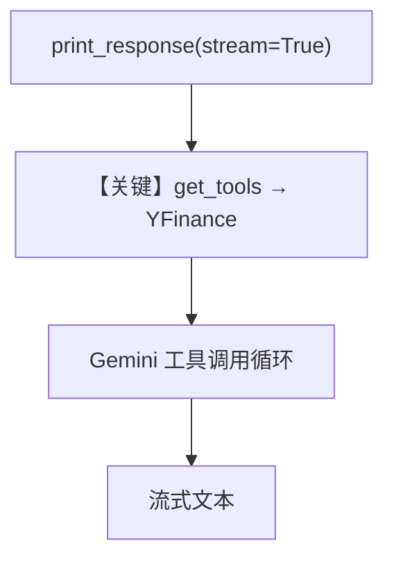

# agent_with_tools.py — 实现原理分析

<!-- cookbook-py-source:start -->
## 完整源码

```python
"""
Agent with Tools - Finance Agent
=================================
Your first Agno agent: a data-driven financial analyst that retrieves
market data, computes key metrics, and delivers concise insights.

This example shows how to give an agent tools to interact with external
data sources. The agent uses YFinanceTools to fetch real-time market data.

Example prompts to try:
- "What's the current price of AAPL?"
- "Compare NVDA and AMD — which looks stronger?"
- "Give me a quick investment brief on Microsoft"
- "What's Tesla's P/E ratio and how does it compare to the industry?"
- "Show me the key metrics for the FAANG stocks"
"""

from agno.agent import Agent
from agno.models.google import Gemini
from agno.tools.yfinance import YFinanceTools

# ---------------------------------------------------------------------------
# Agent Instructions
# ---------------------------------------------------------------------------
instructions = """\
You are a Finance Agent — a data-driven analyst who retrieves market data,
computes key ratios, and produces concise, decision-ready insights.

## Workflow

1. Clarify
   - Identify tickers from company names (e.g., Apple → AAPL)
   - If ambiguous, ask

2. Retrieve
   - Fetch: price, change %, market cap, P/E, EPS, 52-week range
   - For comparisons, pull the same fields for each ticker

3. Analyze
   - Compute ratios (P/E, P/S, margins) when not already provided
   - Key drivers and risks — 2-3 bullets max
   - Facts only, no speculation

4. Present
   - Lead with a one-line summary
   - Use tables for multi-stock comparisons
   - Keep it tight

## Rules

- Source: Yahoo Finance. Always note the timestamp.
- Missing data? Say "N/A" and move on.
- No personalized advice — add disclaimer when relevant.
- No emojis.\
"""

# ---------------------------------------------------------------------------
# Create the Agent
# ---------------------------------------------------------------------------
agent_with_tools = Agent(
    name="Agent with Tools",
    model=Gemini(id="gemini-3-flash-preview"),
    instructions=instructions,
    tools=[YFinanceTools(all=True)],
    add_datetime_to_context=True,
    markdown=True,
)

# ---------------------------------------------------------------------------
# Run the Agent
# ---------------------------------------------------------------------------
if __name__ == "__main__":
    agent_with_tools.print_response(
        "Give me a quick investment brief on NVIDIA", stream=True
    )

# ---------------------------------------------------------------------------
# More Examples
# ---------------------------------------------------------------------------
"""
Try these prompts:

1. Single Stock Analysis
   "What's Apple's current valuation? Is it expensive?"

2. Comparison
   "Compare Google and Microsoft as investments"

3. Sector Overview
   "Show me key metrics for the top AI stocks: NVDA, AMD, GOOGL, MSFT"

4. Quick Check
   "What's Tesla trading at today?"

5. Deep Dive
   "Break down Amazon's financials — revenue, margins, and growth"
"""
```

<!-- cookbook-py-source:end -->

> 源文件：`cookbook/00_quickstart/agent_with_tools.py`

## 概述

本示例展示 Agno 的 **Tools（YFinanceTools）** 最小闭环：**无 `db`**、无记忆、无知识库；Agent 仅通过 **`instructions`** 约束行为，通过 **`get_tools`** 向模型暴露 Yahoo Finance 工具，由模型在对话中按需调用。

**核心配置一览：**

| 配置项 | 值 | 说明 |
|--------|------|------|
| `name` | `"Agent with Tools"` | Agent 名称 |
| `model` | `Gemini(id="gemini-3-flash-preview")` | Google GenAI |
| `instructions` | 财经工作流 | 业务 |
| `tools` | `[YFinanceTools(all=True)]` | 全量 Yahoo 工具 |
| `add_datetime_to_context` | `True` | 是 |
| `markdown` | `True` | 附加 markdown 提示 |
| `db` | 未设置 | None |
| `add_history_to_context` | 未设置 | 默认行为 |

## 架构分层

```
用户代码层                agno.agent 层
┌──────────────────┐    ┌──────────────────────────────────┐
│ agent_with_tools │    │ get_tools() → YFinance 函数定义     │
│ print_response   │───>│ get_system_message + get_run_messages
└──────────────────┘    └──────────────────────────────────┘
                                │
                                ▼
                        Gemini + tools 循环
```

## 核心组件解析

### YFinanceTools

`all=True` 注册多枚工具；模型在 `generate_content` 的 function calling 模式下选用。

### 默认 system

无 `description`/`role`；含 instructions、markdown 行、时间。

### 运行机制与因果链

1. **路径**：用户问题 → system + user → 可能多轮 tool 调用 → 最终自然语言（流式）。
2. **副作用**：无持久化（无 db）。
3. **分支**：无工具时模型纯文本回答；有工具时进入 agentic 循环。
4. **定位**：quickstart **基线**，后续示例均在其上叠加 storage/memory/knowledge 等。

## System Prompt 组装

### 还原后的完整 System 文本

```text
You are a Finance Agent — a data-driven analyst who retrieves market data,
computes key ratios, and produces concise, decision-ready insights.

## Workflow

1. Clarify
   - Identify tickers from company names (e.g., Apple → AAPL)
   - If ambiguous, ask

2. Retrieve
   - Fetch: price, change %, market cap, P/E, EPS, 52-week range
   - For comparisons, pull the same fields for each ticker

3. Analyze
   - Compute ratios (P/E, P/S, margins) when not already provided
   - Key drivers and risks — 2-3 bullets max
   - Facts only, no speculation

4. Present
   - Lead with a one-line summary
   - Use tables for multi-stock comparisons
   - Keep it tight

## Rules

- Source: Yahoo Finance. Always note the timestamp.
- Missing data? Say "N/A" and move on.
- No personalized advice — add disclaimer when relevant.
- No emojis.

Use markdown to format your answers.

<additional_information>
- The current time is <运行时时间>.
</additional_information>
```

另：**#3.3.5 工具说明** 若 `_tool_instructions` 非空会追加（本示例依赖模型与 YFinance 内置描述，可能另有工具段）。

### 段落释义（模型视角）

- 明确四步工作流与数据来源；要求表格与简洁输出。

## 完整 API 请求

流式：`generate_content_stream` + `tools` 参数（`gemini.py` L585+）。

## Mermaid 流程图


```mermaid
flowchart TD
    A["print_response(stream=True)"] --> B["【关键】get_tools → YFinance"]
    B --> C["Gemini 工具调用循环"]
    C --> D["流式文本"]
```

- **【关键】get_tools**：本示例唯一「外部能力」来源。

## 关键源码文件索引

| 文件 | 关键函数/类 | 作用 |
|------|------------|------|
| `agno/agent/agent.py` | `get_tools` | 工具解析 |
| `agno/agent/_messages.py` | `get_system_message()` L106+ | system |
| `agno/tools/yfinance.py` | `YFinanceTools` | 工具定义 |
| `agno/models/google/gemini.py` | `invoke_stream` L564+ | API |
