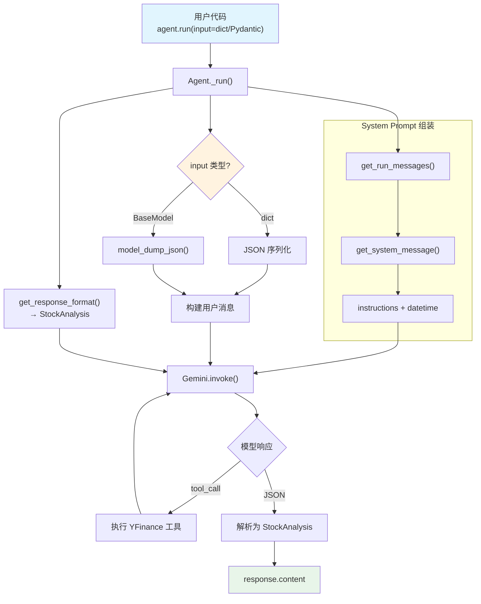

# agent_with_typed_input_output.py — 实现原理分析

> 源文件：`cookbook/00_quickstart/agent_with_typed_input_output.py`

## 概述

本示例展示 Agno 的 **`input_schema` + `output_schema` 端到端类型安全** 机制：通过同时定义输入和输出的 Pydantic 模型，实现从输入验证到输出保证的完整类型契约。

**核心配置一览：**

| 配置项 | 值 | 说明 |
|--------|------|------|
| `name` | `"Agent with Typed Input Output"` | Agent 名称 |
| `model` | `Gemini(id="gemini-3-flash-preview")` | Google Gemini API |
| `instructions` | 含输入参数说明的工作流 | 指导按输入参数调整分析 |
| `tools` | `[YFinanceTools(all=True)]` | Yahoo Finance 工具集 |
| `input_schema` | `AnalysisRequest`（Pydantic 模型） | 输入验证 schema |
| `output_schema` | `StockAnalysis`（Pydantic 模型） | 结构化输出 schema |
| `db` | `SqliteDb(db_file="tmp/agents.db")` | SQLite 持久化 |
| `add_datetime_to_context` | `True` | 注入当前时间 |
| `add_history_to_context` | `True` | 加载历史消息 |
| `num_history_runs` | `5` | 最近 5 次运行历史 |
| `markdown` | `True` | 有 output_schema 时不生效 |

## 架构分层

```
用户代码层                           agno.agent 层
┌─────────────────────────────┐    ┌──────────────────────────────────────┐
│ agent_with_typed_input_     │    │ Agent._run()                         │
│   output.py                 │    │  ├ input_schema 验证                  │
│                             │    │  │  AnalysisRequest.model_validate()  │
│ input_schema=               │    │  │                                    │
│   AnalysisRequest           │───>│  ├ _messages.py                       │
│ output_schema=              │    │  │  get_run_messages()                │
│   StockAnalysis             ���    │  │    → dict/Pydantic → JSON 用户消息 │
│                             │    │  │                                    │
│ input={                     │    │  ├ _response.py                       │
│   "ticker": "NVDA",        │    │  │  get_response_format()             │
│   "analysis_type": "deep", │    │  │    → StockAnalysis（原生）          │
│   "include_risks": True    │    │  │                                    │
│ }                           │    │  └ 模型响应 → StockAnalysis 解析      │
└─────────────────────────────┘    └──────────────────────────────────────┘
                                           │
                                           ▼
                                   ┌──────────────────┐
                                   │ Gemini           │
                                   │ gemini-3-flash   │
                                   │ (structured out) │
                                   └──────────────────┘
```

## 核心组件解析

### input_schema

`input_schema=AnalysisRequest` 定义输入契约：

```python
class AnalysisRequest(BaseModel):
    ticker: str                                    # 股票代码
    analysis_type: Literal["quick", "deep"]        # 分析深度
    include_risks: bool = True                     # 是否包含风险分析
```

用户可通过 `dict` 或 `Pydantic` 实例传入。在 `get_run_messages()`（`_messages.py:1310`）中，`BaseModel` 输入被序列化为 JSON 字符串作为用户消息：

```python
# _messages.py L1310-1316
elif isinstance(input, BaseModel):
    content = input.model_dump_json(indent=2, exclude_none=True)
    user_message = Message(role=agent.user_message_role, content=content)
```

对于 `dict` 输入，走 `_messages.py:1297` 分支，同样转为 JSON。

### 两种传入方式

```python
# 方式 1：dict
response_1 = agent.run(input={"ticker": "NVDA", "analysis_type": "deep", "include_risks": True})

# 方式 2：Pydantic 模型
request = AnalysisRequest(ticker="AAPL", analysis_type="quick", include_risks=False)
response_2 = agent.run(input=request)
```

两种方式最终都被序列化为 JSON 字符串发送给模型。

### Literal 类型

`analysis_type: Literal["quick", "deep"]` 在工具参数解析中（`utils/json_schema.py:127-143`）被转换为：

```json
{"type": "string", "enum": ["quick", "deep"]}
```

但在 `input_schema` 场景下，它主要用于 Pydantic 的客户端验证，不直接影响模型的 JSON Schema。

## System Prompt 组装

| 序号 | 组成部分 | 本文件中的值/来源 | 是否生效 |
|------|---------|-----------------|---------|
| 1 | `system_message`（自定义） | `None` | 否 |
| 3.1 | `instructions` | 含输入参数说明的工作流 | 是 |
| 3.2.1 | `markdown` | `True` 但 output_schema 存在，跳过 | 否 |
| 3.2.2 | `add_datetime_to_context` | `True` | 是 |
| 3.3.3 | instructions 拼接 | 写入 system message | 是 |
| 3.3.4 | additional_information | datetime | 是 |
| 3.3.15 | JSON output prompt | Gemini 原生支持，跳过 | 否 |

### 最终 System Prompt

```text
You are a Finance Agent that produces structured stock analyses.

## Input Parameters
You receive structured requests with:
- ticker: The stock to analyze
- analysis_type: "quick" (summary only) or "deep" (full analysis)
- include_risks: Whether to include risk analysis

## Workflow
1. Fetch data for the requested ticker
2. If analysis_type is "deep", identify key drivers
3. If include_risks is True, identify key risks
4. Provide a clear recommendation

## Rules
...

<additional_information>
- The current time is 2026-03-01 14:30:00.
</additional_information>
```

## 完整 API 请求

```python
client.models.generate_content(
    model="gemini-3-flash-preview",
    contents=[
        # 1. System Message
        {"role": "user", "parts": [{"text": "<system prompt>"}]},
        {"role": "model", "parts": [{"text": "ok"}]},
        # 2. 历史消息（最近 5 次，如有）
        # ...
        # 3. 用户输入（input_schema 被序列化为 JSON）
        {"role": "user", "parts": [{"text": "{\n  \"ticker\": \"NVDA\",\n  \"analysis_type\": \"deep\",\n  \"include_risks\": true\n}"}]}
    ],
    tools=[{"function_declarations": [...]}],
    config={
        "response_mime_type": "application/json",
        "response_schema": StockAnalysis,  # 原生结构化输出
    }
)
```

> 输入的 `AnalysisRequest` 被 `model_dump_json()` 序列化为 JSON 字符串，作为用户消息发送。模型根据 instructions 中的参数说明理解输入含义。

## Mermaid 流程图



## 关键源码文件索引

| 文件 | 关键函数/类 | 作用 |
|------|------------|------|
| `agno/agent/agent.py` | `input_schema` L278 | 输入验证 schema |
| `agno/agent/agent.py` | `output_schema` L281 | 结构化输出 schema |
| `agno/agent/_messages.py` | `get_run_messages()` L1146 | 处理 dict/BaseModel 输入 |
| `agno/agent/_messages.py` | L1297-1316 | dict → Message / BaseModel → JSON Message |
| `agno/agent/_response.py` | `get_response_format()` L872 | 获取结构化输出格式 |
| `agno/models/google/gemini.py` | `supports_native_structured_outputs` L80 | Gemini 原生支持 |
| `agno/utils/json_schema.py` | `get_json_schema_for_arg()` L124 | Literal 类型转换 |
