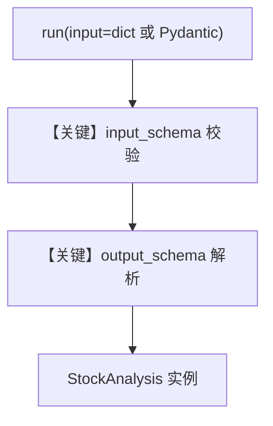

# agent_with_typed_input_output.py — 实现原理分析

> 源文件：`cookbook/00_quickstart/agent_with_typed_input_output.py`

## 概述

本示例展示 Agno 的 **`input_schema` + `output_schema`** 组合：**`AnalysisRequest`** 校验入参，**`StockAnalysis`** 约束出参；`run` 可接受 `dict` 或 Pydantic 实例。System 拼装受 **`output_schema`** 影响：与 `agent_with_structured_output` 相同，**不**追加 markdown 提示行（`_messages.py` L184-185）。

**核心配置一览：**

| 配置项 | 值 | 说明 |
|--------|------|------|
| `name` | `"Agent with Typed Input Output"` | Agent 名称 |
| `model` | `Gemini(id="gemini-3-flash-preview")` | Google GenAI |
| `instructions` | 说明 quick/deep 与参数 | 业务 |
| `tools` | `[YFinanceTools(all=True)]` | 雅虎财经 |
| `input_schema` | `AnalysisRequest` | 入参模型 |
| `output_schema` | `StockAnalysis` | 出参模型 |
| `db` | `SqliteDb(...)` | 会话 |
| `add_datetime_to_context` | `True` | 是 |
| `add_history_to_context` | `True` | 是 |
| `num_history_runs` | `5` | 是 |
| `markdown` | `True` | 不附加 markdown 行（output_schema） |

## 架构分层

```
用户 dict / Pydantic  →  RunInput 校验  →  用户消息语义化
                              ↓
                    Gemini + tools  →  StockAnalysis
```

## 核心组件解析

### input_schema

框架将结构化输入转为对话中的用户侧约束（具体序列化见 `run`/`RunInput`）；失败时在进入模型前校验报错。

### output_schema

同结构化输出示例，`response.content` 为 **`StockAnalysis`**。

### 运行机制与因果链

1. **数据路径**：结构化输入 → 校验 → 与 instructions 对齐的推理 → 结构化输出。
2. **副作用**：会话写入 `db`。
3. **分支**：`analysis_type=quick` 时不应填充 deep 专属字段（指令层约束）。
4. **定位**：相对仅 `output_schema`，本示例强调**入站+出站**双重契约。

## System Prompt 组装

### 还原后的完整 System 文本

```text
You are a Finance Agent that produces structured stock analyses.

## Input Parameters

You receive structured requests with:
- ticker: The stock to analyze
- analysis_type: "quick" (summary only) or "deep" (full analysis)
- include_risks: Whether to include risk analysis

## Workflow

1. Fetch data for the requested ticker
2. If analysis_type is "deep", identify key drivers
3. If include_risks is True, identify key risks
4. Provide a clear recommendation

## Rules

- Source: Yahoo Finance
- Match output to input parameters — don't include drivers for "quick" analysis
- Recommendation must be one of: Strong Buy, Buy, Hold, Sell, Strong Sell

<additional_information>
- The current time is <运行时时间>.
</additional_information>
```

（无「Use markdown…」行，因 `output_schema` 存在。）

## 完整 API 请求

与 `Gemini.generate_content` + schema 约束一致；用户侧内容来自结构化输入的文本化表示。

## Mermaid 流程图


```mermaid
flowchart TD
    A["run(input=dict 或 Pydantic)"] --> B["【关键】input_schema 校验"]
    B --> C["【关键】output_schema 解析"]
    C --> D["StockAnalysis 实例"]
```

- **【关键】input_schema**：入站类型安全。
- **【关键】output_schema**：出站类型安全。

## 关键源码文件索引

| 文件 | 关键函数/类 | 作用 |
|------|------------|------|
| `agno/run/agent.py` | `RunInput` | 输入封装与校验 |
| `agno/agent/_messages.py` | `get_system_message()` | system，含 markdown 条件 |
| `agno/models/google/gemini.py` | `invoke` | 结构化输出 |
