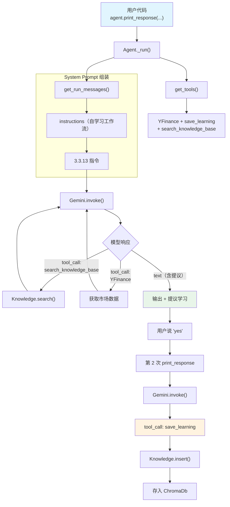

# custom_tool_for_self_learning.py — 实现原理分析

> 源文件：`cookbook/00_quickstart/custom_tool_for_self_learning.py`

## 概述

本示例展示 Agno 的 **自定义工具** + **Agentic RAG** 组合机制：Agent 使用自定义 Python 函数 `save_learning` 作为工具将洞察保存到向量知识库，同时通过 `search_knowledge=True` 自动搜索已有知识，实现自学习循环。

**核心配置一览：**

| 配置项 | 值 | 说明 |
|--------|------|------|
| `name` | `"Self-Learning Agent"` | Agent 名称 |
| `model` | `Gemini(id="gemini-3-flash-preview")` | Google Gemini API |
| `instructions` | 自学习工作流（先搜后答后存） | 提出学习 → 用户确认 → 保存 |
| `tools` | `[YFinanceTools(all=True), save_learning]` | 市场数据 + 自定义保存工具 |
| `knowledge` | `Knowledge(vector_db=ChromaDb(...))` | 学习知识库 |
| `search_knowledge` | `True`（默认） | 启用 Agentic RAG |
| `db` | `SqliteDb(db_file="tmp/agents.db")` | SQLite 持久化 |
| `add_datetime_to_context` | `True` | 注入当前时间 |
| `add_history_to_context` | `True` | 加载历史消息 |
| `num_history_runs` | `5` | 最近 5 次运行历史 |
| `markdown` | `True` | Markdown 格式化 |

## 架构分层

```
用户代码层                           agno.agent 层
┌─────────────────────────────┐    ┌──────────────────────────────────────┐
│ custom_tool_for_self_       │    │ Agent._run()                         │
│   learning.py               │    │  ├ _tools.py                         │
│                             │    │  │  get_tools()                      │
│ tools=[                     │    │  │    → YFinance + save_learning     │
│   YFinanceTools(all=True),  │    │  │    → search_knowledge_base        │
│   save_learning             │───>│  │                                    │
│ ]                           │    │  ├ _messages.py                       │
│ knowledge=learnings_kb      │    │  │  get_system_message()              │
│ search_knowledge=True       │    │  │    → instructions + knowledge 指令│
│                             │    │  │                                    │
│                             │    │  └ 工具调用                           │
│                             │    │    → search_knowledge_base / YFinance│
│                             │    │    → save_learning                    │
└─────────────────────────────┘    └──────────────────────────────────────┘
                                           │
                                   ┌───────┴──────────┐
                                   │                  │
                                   ▼                  ▼
                           ┌──────────────┐   ┌──────────────────┐
                           │ Gemini       │   │ ChromaDb         │
                           │ gemini-3-    │   │ (learnings)      │
                           │ flash        │   │ + GeminiEmbedder │
                           └──────────────┘   └──────────────────┘
```

## 核心组件解析

### 自定义工具 save_learning

一个普通 Python 函数，通过 `tools=[..., save_learning]` 注册：

```python
def save_learning(title: str, learning: str) -> str:
    """
    Save a reusable insight to the knowledge base for future reference.

    Args:
        title: Short descriptive title
        learning: The insight to save
    """
    payload = {
        "title": title.strip(),
        "learning": learning.strip(),
        "saved_at": datetime.now(timezone.utc).isoformat(),
    }
    learnings_kb.insert(
        name=payload["title"],
        text_content=json.dumps(payload, ensure_ascii=False),
        reader=TextReader(),
        skip_if_exists=True,
    )
    return f"Saved: '{title}'"
```

**关键要素：**
- **docstring**：告诉模型工具的用途和参数含义
- **类型注解**：`title: str, learning: str` → 生成 JSON Schema
- **返回字符串**：工具结果以文本形式返回给模型
- **直接操作 Knowledge**：通过闭包访问 `learnings_kb`

### 自定义工具 vs Toolkit 工具

| 特性 | 自定义函数工具 | Toolkit 工具 |
|------|-------------|------------|
| 定义方式 | 普通 Python 函数 | Toolkit 子类的方法 |
| 注册方式 | `tools=[save_learning]` | `tools=[YFinanceTools(all=True)]` |
| 参数来源 | 函数签名 + docstring | 方法签名 + docstring |
| 适用场景 | 简单自定义逻辑 | 一组相关工具 |

### 自学习工作流

instructions 定义了三步工作流：
1. **先搜索**：`search_knowledge_base` → 查找已有学习
2. **回答并提议**：基于数据回答 + 提出可保存的洞察
3. **用户确认后保存**：用户说"yes"后调用 `save_learning`

## System Prompt 组装

| 序号 | 组成部分 | 本文件中的值/来源 | 是否生效 |
|------|---------|-----------------|---------|
| 1 | `system_message`（自定义） | `None` | 否 |
| 3.1 | `instructions` | 自学习工作流 | 是 |
| 3.2.1 | `markdown` | `True` | 是 |
| 3.2.2 | `add_datetime_to_context` | `True` | 是 |
| 3.3.3 | instructions 拼接 | 写入 system message | 是 |
| 3.3.4 | additional_information | markdown + datetime | 是 |
| 3.3.13 | `search_knowledge` instructions | `Knowledge.build_context()` | 是 |

### 最终 System Prompt

```text
You are a Finance Agent that learns and improves over time.

You have two special abilities:
1. Search your knowledge base for previously saved learnings
2. Save new insights using the save_learning tool

## Workflow
1. Check Knowledge First ...
2. Gather Information ...
3. Propose Learnings ...

## What Makes a Good Learning ...

<additional_information>
- Use markdown to format your answers.
- The current time is 2026-03-01 14:30:00.
</additional_information>

<knowledge_base>
You have a knowledge base you can search using the search_knowledge_base tool. Search before answering questions—don't assume you know the answer.
</knowledge_base>
```

## 完整 API 请求

```python
# 第 1 轮：模型搜索知识库 + 调用 YFinance
client.models.generate_content(
    model="gemini-3-flash-preview",
    contents=[
        {"role": "user", "parts": [{"text": "<system prompt>"}]},
        {"role": "model", "parts": [{"text": "ok"}]},
        {"role": "user", "parts": [{"text": "What's a healthy P/E ratio for tech stocks?"}]}
    ],
    tools=[{"function_declarations": [
        {"name": "search_knowledge_base", "description": "...", "parameters": {...}},
        {"name": "save_learning", "description": "Save a reusable insight to the knowledge base.",
         "parameters": {"type": "object", "properties": {
             "title": {"type": "string", "description": "Short descriptive title"},
             "learning": {"type": "string", "description": "The insight to save"}
         }, "required": ["title", "learning"]}},
        # YFinanceTools 函数
    ]}]
)

# 后续轮次：用户说"yes"后，模型调用 save_learning
# → save_learning(title="Tech P/E benchmarks", learning="...")
# → Knowledge.insert() → ChromaDb 存储
```

## Mermaid 流程图



## 关键源码文件索引

| 文件 | 关键函数/类 | 作用 |
|------|------------|------|
| `agno/agent/agent.py` | `tools` L159 | 工具列表（含自定义函数） |
| `agno/agent/_tools.py` | `get_tools()` L105 | 解析所有工具 |
| `agno/agent/_tools.py` | L176-186 | 注册 search_knowledge_base |
| `agno/tools/function.py` | `Function.from_callable()` | 将函数转为 Function |
| `agno/knowledge/knowledge.py` | `Knowledge.insert()` L90 | 插入内容到知识库 |
| `agno/knowledge/knowledge.py` | `Knowledge.search()` L507 | 搜索知识库 |
| `agno/knowledge/reader/text_reader.py` | `TextReader` | 文本内容读取器 |
