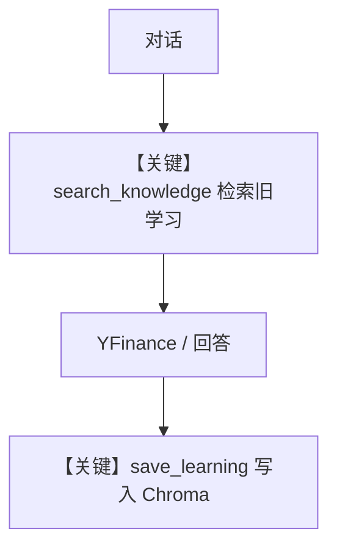

# custom_tool_for_self_learning.py — 实现原理分析

<!-- cookbook-py-source:start -->
## 完整源码

```python
"""
Custom Tool for Self-Learning - Write Your Own Tools
=====================================================
This example shows how to write custom tools for your agent.
A tool is just a Python function — the agent calls it when needed.

We'll build a self-learning agent that can save insights to a knowledge base.
The key concept: any function can become a tool.

Key concepts:
- Tools are Python functions with docstrings (the docstring tells the agent what the tool does)
- The agent decides when to call your tool based on the conversation
- Return a string to communicate results back to the agent

Example prompts to try:
- "What's a good P/E ratio for tech stocks? Save that insight."
- "Remember that NVDA's data center revenue is the key growth driver"
- "What learnings do we have saved?"
"""

import json
from datetime import datetime, timezone

from agno.agent import Agent
from agno.db.sqlite import SqliteDb
from agno.knowledge import Knowledge
from agno.knowledge.embedder.google import GeminiEmbedder
from agno.knowledge.reader.text_reader import TextReader
from agno.models.google import Gemini
from agno.tools.yfinance import YFinanceTools
from agno.vectordb.chroma import ChromaDb
from agno.vectordb.search import SearchType

# ---------------------------------------------------------------------------
# Storage Configuration
# ---------------------------------------------------------------------------
agent_db = SqliteDb(db_file="tmp/agents.db")

# ---------------------------------------------------------------------------
# Knowledge Base for Learnings
# ---------------------------------------------------------------------------
learnings_kb = Knowledge(
    name="Agent Learnings",
    vector_db=ChromaDb(
        name="learnings",
        collection="learnings",
        path="tmp/chromadb",
        persistent_client=True,
        search_type=SearchType.hybrid,
        hybrid_rrf_k=60,
        embedder=GeminiEmbedder(id="gemini-embedding-001"),
    ),
    max_results=5,
    contents_db=agent_db,
)


# ---------------------------------------------------------------------------
# Custom Tool: Save Learning
# ---------------------------------------------------------------------------
def save_learning(title: str, learning: str) -> str:
    """
    Save a reusable insight to the knowledge base for future reference.

    Args:
        title: Short descriptive title (e.g., "Tech stock P/E benchmarks")
        learning: The insight to save — be specific and actionable

    Returns:
        Confirmation message
    """
    # Validate inputs
    if not title or not title.strip():
        return "Cannot save: title is required"
    if not learning or not learning.strip():
        return "Cannot save: learning content is required"

    # Build the payload
    payload = {
        "title": title.strip(),
        "learning": learning.strip(),
        "saved_at": datetime.now(timezone.utc).isoformat(),
    }

    # Save to knowledge base
    learnings_kb.insert(
        name=payload["title"],
        text_content=json.dumps(payload, ensure_ascii=False),
        reader=TextReader(),
        skip_if_exists=True,
    )

    return f"Saved: '{title}'"


# ---------------------------------------------------------------------------
# Agent Instructions
# ---------------------------------------------------------------------------
instructions = """\
You are a Finance Agent that learns and improves over time.

You have two special abilities:
1. Search your knowledge base for previously saved learnings
2. Save new insights using the save_learning tool

## Workflow

1. Check Knowledge First
   - Before answering, search for relevant prior learnings
   - Apply any relevant insights to your response

2. Gather Information
   - Use YFinance tools for market data
   - Combine with your knowledge base insights

3. Propose Learnings
   - After answering, consider: is there a reusable insight here?
   - If yes, propose it in this format:

---
**Proposed Learning**

Title: [concise title]
Learning: [the insight — specific and actionable]

Save this? (yes/no)
---

- Only call save_learning AFTER the user says "yes"
- If user says "no", acknowledge and move on

## What Makes a Good Learning

- Specific: "Tech P/E ratios typically range 20-35x" not "P/E varies"
- Actionable: Can be applied to future questions
- Reusable: Useful beyond this one conversation

Don't save: Raw data, one-off facts, or obvious information.\
"""

# ---------------------------------------------------------------------------
# Create the Agent
# ---------------------------------------------------------------------------
self_learning_agent = Agent(
    name="Self-Learning Agent",
    model=Gemini(id="gemini-3-flash-preview"),
    instructions=instructions,
    tools=[
        YFinanceTools(all=True),
        save_learning,  # Our custom tool — just a Python function!
    ],
    knowledge=learnings_kb,
    search_knowledge=True,
    db=agent_db,
    add_datetime_to_context=True,
    add_history_to_context=True,
    num_history_runs=5,
    markdown=True,
)

# ---------------------------------------------------------------------------
# Run the Agent
# ---------------------------------------------------------------------------
if __name__ == "__main__":
    # Ask a question that might produce a learning
    self_learning_agent.print_response(
        "What's a healthy P/E ratio for tech stocks?",
        stream=True,
    )

    # If the agent proposed a learning, approve it
    self_learning_agent.print_response(
        "yes",
        stream=True,
    )

    # Later, the agent can recall the learning
    self_learning_agent.print_response(
        "What learnings do we have saved?",
        stream=True,
    )

# ---------------------------------------------------------------------------
# More Examples
# ---------------------------------------------------------------------------
"""
Writing custom tools:

1. Define a function with type hints and a docstring
   def my_tool(param: str) -> str:
       '''Description of what this tool does.

       Args:
           param: What this parameter is for

       Returns:
           What the tool returns
       '''
       # Your logic here
       return "Result"

2. Add it to the agent's tools list
   agent = Agent(
       tools=[my_tool],
       ...
   )

The docstring is critical — it tells the agent:
- What the tool does
- What parameters it needs
- What it returns

The agent uses this to decide when and how to call your tool.
"""
```

<!-- cookbook-py-source:end -->

> 源文件：`cookbook/00_quickstart/custom_tool_for_self_learning.py`

## 概述

本示例展示 **自定义可调用工具 + Knowledge**：`save_learning` 将 JSON 文本写入 **`learnings_kb`**（Chroma + `TextReader`），与 **`search_knowledge=True`** 结合，使代理能检索过往「学习」并在用户确认后入库；**YFinance** 仍用于行情数据。

**核心配置一览：**

| 配置项 | 值 | 说明 |
|--------|------|------|
| `name` | `"Self-Learning Agent"` | Agent 名称 |
| `model` | `Gemini(id="gemini-3-flash-preview")` | Google GenAI |
| `instructions` | 检索、保存、征求 yes/no 流程 | 业务 |
| `tools` | `YFinanceTools(all=True)`, `save_learning` | 内置 + 自定义 |
| `knowledge` | `learnings_kb`（Chroma hybrid） | 学习库 |
| `search_knowledge` | `True` | agentic 检索 + system 知识段 |
| `db` | `SqliteDb(...)` | 元数据 |
| `add_datetime_to_context` | `True` | 是 |
| `add_history_to_context` | `True` | 是 |
| `num_history_runs` | `5` | 是 |
| `markdown` | `True` | 是 |

## 架构分层

```
save_learning()  →  knowledge.insert  →  向量库持久化
        ↑
用户确认 "yes"  →  模型再次调用 save_learning（由对话驱动）
search_knowledge →  get_system_message #3.3.13
```

## 核心组件解析

### save_learning

普通 Python 函数，由框架注册为 tool；内部 `learnings_kb.insert(..., reader=TextReader(), skip_if_exists=True)`。

### Knowledge 双用途

同一 `Knowledge` 既被 **检索**（search_knowledge）又被 **写入**（工具内 insert）。

### 运行机制与因果链

1. **路径**：问答 → 可能检索旧学习 → YFinance → 模型提议保存 → 用户 `yes` → `save_learning` 执行 insert。
2. **副作用**：Chroma/SQLite 增长；重复 title 可能 skip。
3. **分支**：用户未说 yes 则不应保存（指令约束）；无知识命中时仍可依工具写入新内容。
4. **定位**：演示 **自定义工具写知识库**，区别于仅 `knowledge.insert` 预灌文档的示例。

## System Prompt 组装

固定 **instructions** 可原样还原；**#3.3.13** `build_context` 动态。

### 还原后的完整 System 文本（固定部分）

```text
You are a Finance Agent that learns and improves over time.

You have two special abilities:
1. Search your knowledge base for previously saved learnings
2. Save new insights using the save_learning tool

## Workflow

1. Check Knowledge First
   - Before answering, search for relevant prior learnings
   - Apply any relevant insights to your response

2. Gather Information
   - Use YFinance tools for market data
   - Combine with your knowledge base insights

3. Propose Learnings
   - After answering, consider: is there a reusable insight here?
   - If yes, propose it in this format:

---
**Proposed Learning**

Title: [concise title]
Learning: [the insight — specific and actionable]

Save this? (yes/no)
---

- Only call save_learning AFTER the user says "yes"
- If user says "no", acknowledge and move on

## What Makes a Good Learning

- Specific: "Tech P/E ratios typically range 20-35x" not "P/E varies"
- Actionable: Can be applied to future questions
- Reusable: Useful beyond this one conversation

Don't save: Raw data, one-off facts, or obvious information.

Use markdown to format your answers.

<additional_information>
- The current time is <运行时时间>.
</additional_information>

<Knowledge.build_context 动态段>
```

## 完整 API 请求

`generate_content_stream` + 工具含 `save_learning` 与 YFinance；知识检索可能以工具或嵌入 system 说明形式出现（依版本）。

## Mermaid 流程图


```mermaid
flowchart TD
    A["对话"] --> B["【关键】search_knowledge 检索旧学习"]
    B --> C["YFinance / 回答"]
    C --> D["【关键】save_learning 写入 Chroma"]
```

- **【关键】search_knowledge**：复用已有学习。
- **【关键】save_learning**：持久化新学习。

## 关键源码文件索引

| 文件 | 关键函数/类 | 作用 |
|------|------------|------|
| `agno/agent/_messages.py` | `#3.3.13` L409+ | 知识 system 段 |
| `agno/knowledge/knowledge.py` | `insert` / `build_context` | 写入与上下文 |
| `agno/utils/callables.py` | 可调用转 Tool | 自定义函数封装 |
