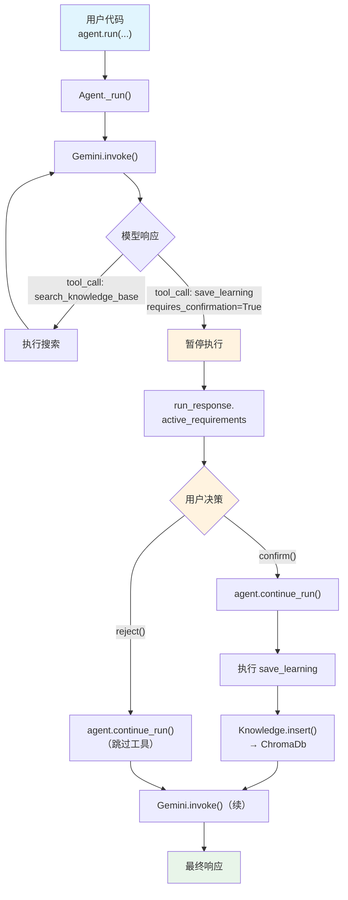

# human_in_the_loop.py — 实现原理分析

> 源文件：`cookbook/00_quickstart/human_in_the_loop.py`

## 概述

本示例展示 Agno 的 **人在环中（Human-in-the-Loop / HITL）** 机制：通过 `@tool(requires_confirmation=True)` 装饰器标记需要用户确认的工具，Agent 在调用该工具前暂停，等待用户通过 `requirement.confirm()` 或 `requirement.reject()` 决策后，再通过 `agent.continue_run()` 恢复执行。

**核心配置一览：**

| 配置项 | 值 | 说明 |
|--------|------|------|
| `name` | `"Agent with Human in the Loop"` | Agent 名称 |
| `model` | `Gemini(id="gemini-3-flash-preview")` | Google Gemini API |
| `instructions` | 自学习工作流（含确认说明） | 保存需确认 |
| `tools` | `[YFinanceTools(all=True), save_learning]` | 市场数据 + 确认保存工具 |
| `knowledge` | `Knowledge(vector_db=ChromaDb(...))` | 学习知识库 |
| `search_knowledge` | `True`（默认） | Agentic RAG |
| `db` | `SqliteDb(db_file="tmp/agents.db")` | SQLite 持久化 |
| `add_datetime_to_context` | `True` | 注入当前时间 |
| `add_history_to_context` | `True` | 加载历史消息 |
| `num_history_runs` | `5` | 最近 5 次运行历史 |
| `markdown` | `True` | Markdown 格式化 |

## 架构分层

```
用户代码层                           agno.agent 层
┌─────────────────────────────┐    ┌──────────────────────────────────────┐
│ human_in_the_loop.py        │    │ Agent._run()                         │
│                             │    │  ├ 模型返回 tool_call                │
│ @tool(requires_confirmation │    │  │  → save_learning 需要确认         │
│   =True)                    │    │  │  → 暂停，填充 active_requirements │
│ def save_learning(...)      │───>│  │                                    │
│                             │    │  ├ run_response.active_requirements  │
│ # 用户决策循环              │    │  │  → requirement.confirm()           │
│ for req in requirements:    │    │  │  → requirement.reject()            │
│   req.confirm() / reject()  │    │  │                                    │
│                             │    │  └ agent.continue_run()              │
│ agent.continue_run(         │    │     → 恢复执行 / 跳过               │
│   run_id=...,               │    │                                      │
│   requirements=...          │    │                                      │
│ )                           │    │                                      │
└─────────────────────────────┘    └──────────────────────────────────────┘
                                           │
                                   ┌───────┴──────────┐
                                   │                  │
                                   ▼                  ▼
                           ┌──────────────┐   ┌──────────────────┐
                           │ Gemini       │   │ ChromaDb         │
                           │ gemini-3-    │   │ (learnings)      │
                           │ flash        │   └──────────────────┘
                           └──────────────┘
```

## 核心组件解析

### @tool(requires_confirmation=True)

`@tool` 装饰器（`tools/decorator.py:87`）将函数转为 `Function` 对象并设置 `requires_confirmation=True`：

```python
@tool(requires_confirmation=True)
def save_learning(title: str, learning: str) -> str:
    """Save a reusable insight to the knowledge base."""
    ...
```

当模型调用此工具时，agno 不会立即执行函数，而是将调用信息存储在 `run_response.active_requirements` 中等待用户决策。

### HITL 执行流程

```python
# 1. 运行 Agent（使用 agent.run() 而非 print_response）
run_response = agent.run("What's a healthy P/E ratio? Save that insight.")

# 2. 检查是否有待确认的工具调用
if run_response.active_requirements:
    for requirement in run_response.active_requirements:
        if requirement.needs_confirmation:
            # 展示工具调用详情
            print(f"Tool: {requirement.tool_execution.tool_name}")
            print(f"Args: {requirement.tool_execution.tool_args}")

            # 用户决策
            choice = Prompt.ask("Do you want to continue?", choices=["y", "n"])
            if choice == "n":
                requirement.reject()   # 拒绝执行
            else:
                requirement.confirm()  # 确认执行

    # 3. 恢复运行
    run_response = agent.continue_run(
        run_id=run_response.run_id,
        requirements=run_response.requirements,
    )
```

### Function.requires_confirmation

在 `tools/function.py:171`：

```python
class Function:
    requires_confirmation: Optional[bool] = None  # L171
```

当 `requires_confirmation=True` 时，Agent 的 agentic loop 在执行该工具前暂停，构建 `StepRequirement` 对象返回给调用者。

### agent.run() vs agent.print_response()

本例使用 `agent.run()` 而非 `print_response()`，因为 HITL 需要程序化访问 `run_response.active_requirements`。`print_response()` 是 `run()` 的便捷包装，不适合 HITL 场景。

## System Prompt 组装

| 序号 | 组成部分 | 本文件中的值/来源 | 是否生效 |
|------|---------|-----------------|---------|
| 1 | `system_message`（自定义） | `None` | 否 |
| 3.1 | `instructions` | 自学习工作流 | 是 |
| 3.2.1 | `markdown` | `True` | 是 |
| 3.2.2 | `add_datetime_to_context` | `True` | 是 |
| 3.3.3 | instructions 拼接 | 写入 system message | 是 |
| 3.3.4 | additional_information | markdown + datetime | 是 |
| 3.3.13 | `search_knowledge` instructions | `Knowledge.build_context()` | 是 |

### 最终 System Prompt

```text
You are a Finance Agent that learns and improves over time.

You have two special abilities:
1. Search your knowledge base for previously saved learnings
2. Save new insights using the save_learning tool

## Workflow
1. Check Knowledge First ...
2. Gather Information ...
3. Save Valuable Insights
   - If you discover something reusable, save it with save_learning
   - The user will be asked to confirm before it's saved
...

<additional_information>
- Use markdown to format your answers.
- The current time is 2026-03-01 14:30:00.
</additional_information>

<knowledge_base>
You have a knowledge base you can search using the search_knowledge_base tool. ...
</knowledge_base>
```

## 完整 API 请求

```python
# 第 1 轮：模型决定调用 save_learning
client.models.generate_content(
    model="gemini-3-flash-preview",
    contents=[
        {"role": "user", "parts": [{"text": "<system prompt>"}]},
        {"role": "model", "parts": [{"text": "ok"}]},
        {"role": "user", "parts": [{"text": "What's a healthy P/E ratio for tech stocks? Save that insight."}]}
    ],
    tools=[{"function_declarations": [
        {"name": "search_knowledge_base", ...},
        {"name": "save_learning",
         "description": "Save a reusable insight to the knowledge base. This action requires user confirmation.",
         "parameters": {"type": "object", "properties": {
             "title": {"type": "string"},
             "learning": {"type": "string"}
         }, "required": ["title", "learning"]}},
        # YFinanceTools
    ]}]
)

# 模型返回 tool_call: save_learning(title="...", learning="...")
# → requires_confirmation=True → 暂停，不执行
# → run_response.active_requirements 填充待确认项

# 用户确认后 → agent.continue_run()
# → 执行 save_learning → Knowledge.insert()
# → 第 2 轮：将工具结果返回模型生成最终响应
```

## Mermaid 流程图



## 关键源码文件索引

| 文件 | 关键函数/类 | 作用 |
|------|------------|------|
| `agno/tools/decorator.py` | `@tool()` L87 | 工具装饰器 |
| `agno/tools/decorator.py` | `requires_confirmation` L69 | 确认标记参数 |
| `agno/tools/function.py` | `requires_confirmation` L171 | Function 属性 |
| `agno/agent/agent.py` | `continue_run()` | 恢复暂停的运行 |
| `agno/knowledge/knowledge.py` | `Knowledge.insert()` L90 | 插入知识 |
| `agno/knowledge/knowledge.py` | `Knowledge.search()` L507 | 搜索知识 |
