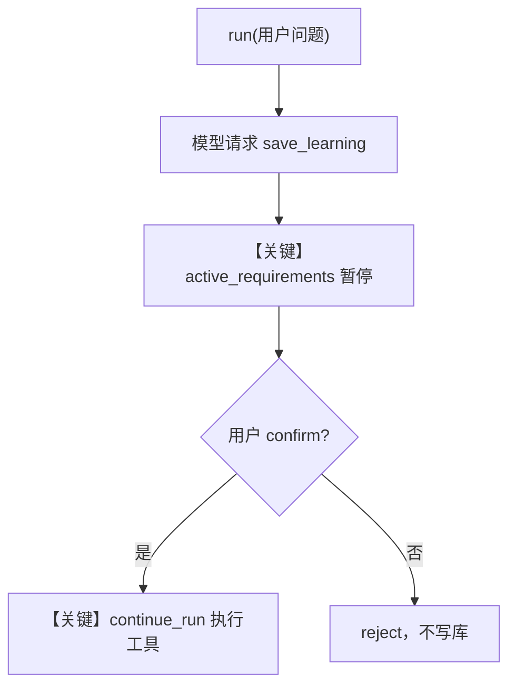

# human_in_the_loop.py — 实现原理分析

<!-- cookbook-py-source:start -->
## 完整源码

```python
"""
Human in the Loop - Confirm Before Taking Action
================================================
This example shows how to require user confirmation before executing
certain tools. Critical for actions that are irreversible or sensitive.

We'll build on our self-learning agent, and ask for user confirmation before saving a learning.

Key concepts:
- @tool(requires_confirmation=True): Mark tools that need approval
- run_response.active_requirements: Check for pending confirmations
- requirement.confirm() / requirement.reject(): Approve or deny
- agent.continue_run(): Resume execution after decision

Some practical applications:
- Confirming sensitive operations before execution
- Reviewing API calls before they're made
- Validating data transformations
- Approving automated actions in critical systems

Example prompts to try:
- "What's a good P/E ratio for tech stocks? Save that insight."
- "Analyze NVDA and save any insights"
- "What learnings do we have saved?"
"""

import json
from datetime import datetime, timezone

from agno.agent import Agent
from agno.db.sqlite import SqliteDb
from agno.knowledge.embedder.google import GeminiEmbedder
from agno.knowledge.knowledge import Knowledge
from agno.knowledge.reader.text_reader import TextReader
from agno.models.google import Gemini
from agno.tools import tool
from agno.tools.yfinance import YFinanceTools
from agno.utils import pprint
from agno.vectordb.chroma import ChromaDb
from agno.vectordb.search import SearchType
from rich.console import Console
from rich.prompt import Prompt

# ---------------------------------------------------------------------------
# Storage Configuration
# ---------------------------------------------------------------------------
agent_db = SqliteDb(db_file="tmp/agents.db")

# ---------------------------------------------------------------------------
# Knowledge Base for Learnings
# ---------------------------------------------------------------------------
learnings_kb = Knowledge(
    name="Agent Learnings HITL",
    vector_db=ChromaDb(
        name="learnings",
        collection="learnings",
        path="tmp/chromadb",
        persistent_client=True,
        search_type=SearchType.hybrid,
        embedder=GeminiEmbedder(id="gemini-embedding-001"),
    ),
    max_results=5,
    contents_db=agent_db,
)


# ---------------------------------------------------------------------------
# Custom Tool: Save Learning (requires confirmation)
# ---------------------------------------------------------------------------
@tool(requires_confirmation=True)
def save_learning(title: str, learning: str) -> str:
    """
    Save a reusable insight to the knowledge base for future reference.
    This action requires user confirmation before executing.

    Args:
        title: Short descriptive title (e.g., "Tech stock P/E benchmarks")
        learning: The insight to save — be specific and actionable

    Returns:
        Confirmation message
    """
    if not title or not title.strip():
        return "Cannot save: title is required"
    if not learning or not learning.strip():
        return "Cannot save: learning content is required"

    payload = {
        "title": title.strip(),
        "learning": learning.strip(),
        "saved_at": datetime.now(timezone.utc).isoformat(),
    }

    learnings_kb.insert(
        name=payload["title"],
        text_content=json.dumps(payload, ensure_ascii=False),
        reader=TextReader(),
        skip_if_exists=True,
    )

    return f"Saved: '{title}'"


# ---------------------------------------------------------------------------
# Agent Instructions
# ---------------------------------------------------------------------------
instructions = """\
You are a Finance Agent that learns and improves over time.

You have two special abilities:
1. Search your knowledge base for previously saved learnings
2. Save new insights using the save_learning tool

## Workflow

1. Check Knowledge First
   - Before answering, search for relevant prior learnings
   - Apply any relevant insights to your response

2. Gather Information
   - Use YFinance tools for market data
   - Combine with your knowledge base insights

3. Save Valuable Insights
   - If you discover something reusable, save it with save_learning
   - The user will be asked to confirm before it's saved
   - Good learnings are specific, actionable, and generalizable

## What Makes a Good Learning

- Specific: "Tech P/E ratios typically range 20-35x" not "P/E varies"
- Actionable: Can be applied to future questions
- Reusable: Useful beyond this one conversation

Don't save: Raw data, one-off facts, or obvious information.\
"""

# ---------------------------------------------------------------------------
# Create the Agent
# ---------------------------------------------------------------------------
human_in_the_loop_agent = Agent(
    name="Agent with Human in the Loop",
    model=Gemini(id="gemini-3-flash-preview"),
    instructions=instructions,
    tools=[
        YFinanceTools(all=True),
        save_learning,
    ],
    knowledge=learnings_kb,
    search_knowledge=True,
    db=agent_db,
    add_datetime_to_context=True,
    add_history_to_context=True,
    num_history_runs=5,
    markdown=True,
)

# ---------------------------------------------------------------------------
# Run the Agent
# ---------------------------------------------------------------------------
if __name__ == "__main__":
    console = Console()

    # Ask a question that might trigger a save
    run_response = human_in_the_loop_agent.run(
        "What's a healthy P/E ratio for tech stocks? Save that insight."
    )

    # Print the initial response content (the actual answer)
    if run_response.content:
        pprint.pprint_run_response(run_response)

    # Handle any confirmation requirements
    if run_response.active_requirements:
        for requirement in run_response.active_requirements:
            if requirement.needs_confirmation:
                console.print(
                    f"\n[bold yellow]Confirmation Required[/bold yellow]\n"
                    f"Tool: [bold blue]{requirement.tool_execution.tool_name}[/bold blue]\n"
                    f"Args: {requirement.tool_execution.tool_args}"
                )

                choice = (
                    Prompt.ask(
                        "Do you want to continue?",
                        choices=["y", "n"],
                        default="y",
                    )
                    .strip()
                    .lower()
                )

                if choice == "n":
                    requirement.reject()
                    console.print("[red]Rejected[/red]")
                else:
                    requirement.confirm()
                    console.print("[green]Approved[/green]")

        # Continue the run with the user's decisions
        run_response = human_in_the_loop_agent.continue_run(
            run_id=run_response.run_id,
            requirements=run_response.requirements,
        )

        # Print the final response after tool execution
        pprint.pprint_run_response(run_response)

# ---------------------------------------------------------------------------
# More Examples
# ---------------------------------------------------------------------------
"""
Human-in-the-loop patterns:

1. Confirmation for sensitive actions
   @tool(requires_confirmation=True)
   def delete_file(path: str) -> str:
       ...

2. Confirmation for external calls
   @tool(requires_confirmation=True)
   def send_email(to: str, subject: str, body: str) -> str:
       ...

3. Confirmation for financial transactions
   @tool(requires_confirmation=True)
   def place_order(ticker: str, quantity: int, side: str) -> str:
       ...

The pattern:
1. Mark tool with @tool(requires_confirmation=True)
2. Run agent with agent.run()
3. Loop through run_response.active_requirements
4. Check requirement.needs_confirmation
5. Call requirement.confirm() or requirement.reject()
6. Call agent.continue_run() with requirements

This gives you full control over which actions execute.
"""
```

<!-- cookbook-py-source:end -->

> 源文件：`cookbook/00_quickstart/human_in_the_loop.py`

## 概述

本示例展示 Agno 的 **`@tool(requires_confirmation=True)` + `continue_run`** 机制：工具在真正执行前产生**待确认需求**（`active_requirements`）；用户 `confirm()` / `reject()` 后，通过 **`Agent.continue_run`** 恢复执行，适用于不可逆或敏感操作。

**核心配置一览：**

| 配置项 | 值 | 说明 |
|--------|------|------|
| `name` | `"Agent with Human in the Loop"` | Agent 名称 |
| `model` | `Gemini(id="gemini-3-flash-preview")` | Google GenAI |
| `instructions` | 学习 + 保存流程 | 业务 |
| `tools` | `YFinanceTools(all=True)`, `save_learning`（装饰器注册） | 保存需确认 |
| `knowledge` | `learnings_kb` | Chroma 混合检索 |
| `search_knowledge` | `True` | 是 |
| `db` | `SqliteDb(...)` | 是 |
| `add_datetime_to_context` | `True` | 是 |
| `add_history_to_context` | `True` | 是 |
| `num_history_runs` | `5` | 是 |
| `markdown` | `True` | 是 |

## 架构分层

```
run() → 模型提议调用 save_learning
     → 框架暂停，active_requirements 非空
用户 confirm/reject
continue_run(run_id, requirements) → 真正执行工具或跳过
```

## 核心组件解析

### @tool(requires_confirmation=True)

见 `agno/tools/decorator.py`（约 L69+），为函数元数据设置 `requires_confirmation`；`Function` 定义见 `agno/tools/function.py` L171 等。

### active_requirements 与 continue_run

首轮 `run` 返回 `RunOutput` 含 `active_requirements`；用户决策后调用 `continue_run`（`agno/agent/agent.py` 约 L1479+）携带同一 `run_id` 与 `requirements` 恢复。

### 运行机制与因果链

1. **路径**：用户提问 → 模型生成 tool call → 若需确认则**不直接写库** → 用户 y/n → `continue_run` 完成或取消执行。
2. **副作用**：仅在 confirm 且工具体执行后 `knowledge.insert`；reject 则无写入。
3. **分支**：无待确认需求时 `continue_run` 不必调用。
4. **与 custom_tool 差异**：同 save 逻辑，但**强制人工确认**。

## System Prompt 组装

与普通 Knowledge Agent 相同：`instructions` + markdown + 时间 + **#3.3.13** 知识段（动态）。无单独「HITL」system 段，行为由 **工具元数据** 驱动。

### 还原后的完整 System 文本（固定 instructions）

```text
You are a Finance Agent that learns and improves over time.

You have two special abilities:
1. Search your knowledge base for previously saved learnings
2. Save new insights using the save_learning tool

## Workflow

1. Check Knowledge First
   - Before answering, search for relevant prior learnings
   - Apply any relevant insights to your response

2. Gather Information
   - Use YFinance tools for market data
   - Combine with your knowledge base insights

3. Save Valuable Insights
   - If you discover something reusable, save it with save_learning
   - The user will be asked to confirm before it's saved
   - Good learnings are specific, actionable, and generalizable

## What Makes a Good Learning

- Specific: "Tech P/E ratios typically range 20-35x" not "P/E varies"
- Actionable: Can be applied to future questions
- Reusable: Useful beyond this one conversation

Don't save: Raw data, one-off facts, or obvious information.

Use markdown to format your answers.

<additional_information>
- The current time is <运行时时间>.
</additional_information>

<Knowledge.build_context 动态段>
```

## 完整 API 请求

与 `Gemini` 一致；**确认前后**可能对应多次 `generate_content` 调用（首轮停在 tool confirmation，续跑再执行）。

## Mermaid 流程图


```mermaid
flowchart TD
    A["run(用户问题)"] --> B["模型请求 save_learning"]
    B --> C["【关键】active_requirements 暂停"]
    C --> D{"用户 confirm?"}
    D -->|是| E["【关键】continue_run 执行工具"]
    D -->|否| F["reject，不写库"]
```

- **【关键】active_requirements**：人机协作的暂停点。
- **【关键】continue_run**：恢复执行链。

## 关键源码文件索引

| 文件 | 关键函数/类 | 作用 |
|------|------------|------|
| `agno/tools/decorator.py` | `@tool` | `requires_confirmation` 元数据 |
| `agno/agent/agent.py` | `continue_run()` L1479+ | 续跑 |
| `agno/tools/function.py` | `Function` | 工具定义字段 |
