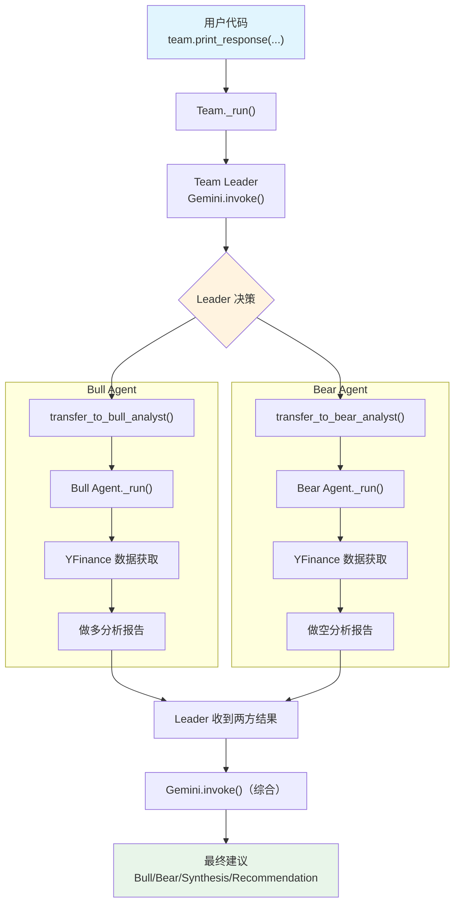

# multi_agent_team.py — 实现原理分析

> 源文件：`cookbook/00_quickstart/multi_agent_team.py`

## 概述

本示例展示 Agno 的 **Team 多 Agent 协作** 机制：通过 `Team` 将多个专业化 Agent（Bull Analyst、Bear Analyst）组合为投资研究团队，Team Leader 协调分析、综合多角度观点后输出最终建议。

**核心配置一览：**

**Team 配置：**

| 配置项 | 值 | 说明 |
|--------|------|------|
| `name` | `"Multi-Agent Team"` | 团队名称 |
| `model` | `Gemini(id="gemini-3-flash-preview")` | Team Leader 模型 |
| `members` | `[bull_agent, bear_agent]` | 成员列表 |
| `instructions` | 协调分析流程 + 输出格式 | Leader 工作指令 |
| `db` | `SqliteDb(db_file="tmp/agents.db")` | SQLite 持久化 |
| `show_members_responses` | `True` | 展示成员响应 |
| `add_datetime_to_context` | `True` | 注入当前时间 |
| `add_history_to_context` | `True` | 加载历史消息 |
| `num_history_runs` | `5` | 最近 5 次运行历史 |
| `markdown` | `True` | Markdown 格式化 |

**Bull Agent 配置：**

| 配置项 | 值 | 说明 |
|--------|------|------|
| `name` | `"Bull Analyst"` | 做多分析师 |
| `role` | `"Make the investment case FOR a stock"` | 团队角色 |
| `model` | `Gemini(id="gemini-3-flash-preview")` | 成员模型 |
| `tools` | `[YFinanceTools(all=True)]` | 市场数据工具 |

**Bear Agent 配置：**

| 配置项 | 值 | 说明 |
|--------|------|------|
| `name` | `"Bear Analyst"` | 做空分析师 |
| `role` | `"Make the investment case AGAINST a stock"` | 团队角色 |
| `model` | `Gemini(id="gemini-3-flash-preview")` | 成员模型 |
| `tools` | `[YFinanceTools(all=True)]` | 市场数据工具 |

## 架构分层

```
用户代码层                    agno.team 层                    agno.agent 层
┌──────────────────┐    ┌──────────────────────┐    ┌──────────────────────┐
│ multi_agent_     │    │ Team._run()          │    │ Bull Agent._run()    │
│   team.py        │    │  ├ Team Leader 模型  │    │  ├ instructions      │
│                  │    │  │  决定委派目标      │    │  ├ tools=[YFinance]  │
│ Team(            │    │  │                    │    │  └ Gemini.invoke()   │
│   members=[      │───>│  ├ transfer_to_      │───>│                      │
│     bull_agent,  │    │  │   bull_analyst()   │    ├──────────────────────┤
│     bear_agent   │    │  ├ transfer_to_      │    │ Bear Agent._run()    │
│   ]              │    │  │   bear_analyst()   │───>│  ├ instructions      │
│ )                │    │  │                    │    │  ├ tools=[YFinance]  │
│                  │    │  └ 综合两方观点       │    │  └ Gemini.invoke()   │
│                  │    │    → 最终建议         │    │                      │
└──────────────────┘    └──────────────────────┘    └──────────────────────┘
                                │                           │
                        ┌───────┴────┐              ┌───────┴────┐
                        ▼            ▼              ▼            ▼
                ┌──────────┐ ┌──────────┐   ┌──────────┐ ┌──────────┐
                │ Gemini   │ │ SqliteDb │   │ Gemini   │ │ Gemini   │
                │ (Leader) │ │          │   │ (Bull)   │ │ (Bear)   │
                └──────────┘ └──────────┘   └──────────┘ └──────────┘
```

## 核心组件解析

### Team

`Team`（`team/team.py:70`）是多 Agent 协作的核心类：

```python
multi_agent_team = Team(
    name="Multi-Agent Team",
    model=Gemini(id="gemini-3-flash-preview"),  # Leader 模型
    members=[bull_agent, bear_agent],            # 成员列表
    instructions="""...""",                       # Leader 指令
    show_members_responses=True,                  # 展示成员响应
)
```

Team 内部为每个成员生成 `transfer_to_<agent_name>` 工具，Leader 通过调用这些工具将任务委派给成员。

### 成员 Agent 的 role

每个成员的 `role` 属性在其 system prompt 的步骤 3.3.2 中以 XML 格式注入：

```python
# _messages.py L233-234
if agent.role is not None:
    system_message_content += f"\n<your_role>\n{agent.role}\n</your_role>\n\n"
```

### Team 执行流程

1. **Team Leader 接收用户消息**
2. **Leader 决定委派**：通过 `transfer_to_bull_analyst()` 和 `transfer_to_bear_analyst()` 工具分别委派任务
3. **成员独立执行**：Bull 和 Bear Agent 各自运行 `_run()`，使用 YFinance 获取数据
4. **Leader 综合**：收到两方分析后，综合输出最终建议

### show_members_responses

`show_members_responses=True` 使成员的响应也被展示给用户，便于看到多角度分析过程。

## System Prompt 组装

**Team Leader 的 System Prompt：**

| 序号 | 组成部分 | 值 | 是否生效 |
|------|---------|-----|---------|
| 3.1 | `instructions` | 协调流程 + 输出格式 | 是 |
| 3.2.1 | `markdown` | `True` | 是 |
| 3.2.2 | `add_datetime_to_context` | `True` | 是 |
| 3.3.3 | instructions 拼接 | 写入 system message | 是 |

**Bull Agent 的 System Prompt：**

| 序号 | 组成部分 | 值 | 是否生效 |
|------|---------|-----|---------|
| 3.1 | `instructions` | 做多分析指令 | 是 |
| 3.2.2 | `add_datetime_to_context` | `True` | 是 |
| 3.3.2 | `role` | "Make the investment case FOR a stock" | 是 |

**Bear Agent 的 System Prompt 同理，role 为 AGAINST。**

### Team Leader 最终 System Prompt

```text
You lead an investment research team with a Bull Analyst and Bear Analyst.

## Process
1. Send the stock to BOTH analysts
2. Let each make their case independently
3. Synthesize their arguments into a balanced recommendation

## Output Format
After hearing from both analysts, provide:
- **Bull Case Summary**: ...
- **Bear Case Summary**: ...
- **Synthesis**: ...
- **Recommendation**: ...
- **Key Metrics**: ...

<additional_information>
- Use markdown to format your answers.
- The current time is 2026-03-01 14:30:00.
</additional_information>
```

## 完整 API 请求

```python
# 1. Team Leader 请求（含 transfer 工具）
client.models.generate_content(
    model="gemini-3-flash-preview",
    contents=[
        {"role": "user", "parts": [{"text": "<Team Leader system prompt>"}]},
        {"role": "model", "parts": [{"text": "ok"}]},
        {"role": "user", "parts": [{"text": "Should I invest in NVIDIA (NVDA)?"}]}
    ],
    tools=[{"function_declarations": [
        {"name": "transfer_to_bull_analyst",
         "description": "Transfer task to Bull Analyst to make the investment case FOR a stock",
         "parameters": {"type": "object", "properties": {"task": {"type": "string"}}}},
        {"name": "transfer_to_bear_analyst",
         "description": "Transfer task to Bear Analyst to make the investment case AGAINST a stock",
         "parameters": {"type": "object", "properties": {"task": {"type": "string"}}}},
    ]}]
)

# 2. Bull Agent 请求（独立运行）
client.models.generate_content(
    model="gemini-3-flash-preview",
    contents=[
        {"role": "user", "parts": [{"text": "<Bull Agent system prompt with role>"}]},
        {"role": "model", "parts": [{"text": "ok"}]},
        {"role": "user", "parts": [{"text": "Analyze NVDA from a bullish perspective"}]}
    ],
    tools=[{"function_declarations": [
        # YFinanceTools 函数
    ]}]
)

# 3. Bear Agent 请求（独立运行，同结构）

# 4. Team Leader 最终综合请求
# → 收到两方分析结果后，生成最终建议
```

## Mermaid 流程图



## 关键源码文件索引

| 文件 | 关键函数/类 | 作用 |
|------|------------|------|
| `agno/team/team.py` | `Team` L70 | 团队核心类 |
| `agno/team/team.py` | `members` L75 | 成员列表 |
| `agno/agent/agent.py` | `role` L312 | 成员在团队中的角色 |
| `agno/agent/_messages.py` | L233-234 | role → `<your_role>` 注入 |
| `agno/tools/yfinance.py` | `YFinanceTools` | Yahoo Finance 工具集 |
