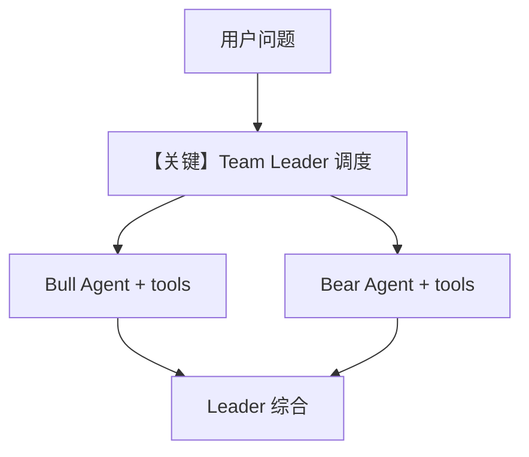

# multi_agent_team.py — 实现原理分析

<!-- cookbook-py-source:start -->
## 完整源码

```python
"""
Multi-Agent Team - Investment Research Team
============================================
This example shows how to create a team of agents that work together.
Each agent has a specialized role, and the team leader coordinates.

We'll build an investment research team with opposing perspectives:
- Bull Agent: Makes the case FOR investing
- Bear Agent: Makes the case AGAINST investing
- Lead Analyst: Synthesizes into a balanced recommendation

This adversarial approach produces better analysis than a single agent.

Key concepts:
- Team: A group of agents coordinated by a leader
- Members: Specialized agents with distinct roles
- The leader delegates, synthesizes, and produces final output

Example prompts to try:
- "Should I invest in NVIDIA?"
- "Analyze Tesla as a long-term investment"
- "Is Apple overvalued right now?"
"""

from agno.agent import Agent
from agno.db.sqlite import SqliteDb
from agno.models.google import Gemini
from agno.team.team import Team
from agno.tools.yfinance import YFinanceTools

# ---------------------------------------------------------------------------
# Storage Configuration
# ---------------------------------------------------------------------------
team_db = SqliteDb(db_file="tmp/agents.db")

# ---------------------------------------------------------------------------
# Bull Agent — Makes the Case FOR
# ---------------------------------------------------------------------------
bull_agent = Agent(
    name="Bull Analyst",
    role="Make the investment case FOR a stock",
    model=Gemini(id="gemini-3-flash-preview"),
    tools=[YFinanceTools(all=True)],
    db=team_db,
    instructions="""\
You are a bull analyst. Your job is to make the strongest possible case
FOR investing in a stock. Find the positives:
- Growth drivers and catalysts
- Competitive advantages
- Strong financials and metrics
- Market opportunities

Be persuasive but grounded in data. Use the tools to get real numbers.\
""",
    add_datetime_to_context=True,
    add_history_to_context=True,
    num_history_runs=5,
)

# ---------------------------------------------------------------------------
# Bear Agent — Makes the Case AGAINST
# ---------------------------------------------------------------------------
bear_agent = Agent(
    name="Bear Analyst",
    role="Make the investment case AGAINST a stock",
    model=Gemini(id="gemini-3-flash-preview"),
    tools=[YFinanceTools(all=True)],
    db=team_db,
    instructions="""\
You are a bear analyst. Your job is to make the strongest possible case
AGAINST investing in a stock. Find the risks:
- Valuation concerns
- Competitive threats
- Weak spots in financials
- Market or macro risks

Be critical but fair. Use the tools to get real numbers to support your concerns.\
""",
    add_datetime_to_context=True,
    add_history_to_context=True,
    num_history_runs=5,
)

# ---------------------------------------------------------------------------
# Create Team
# ---------------------------------------------------------------------------
multi_agent_team = Team(
    name="Multi-Agent Team",
    model=Gemini(id="gemini-3-flash-preview"),
    members=[bull_agent, bear_agent],
    instructions="""\
You lead an investment research team with a Bull Analyst and Bear Analyst.

## Process

1. Send the stock to BOTH analysts
2. Let each make their case independently
3. Synthesize their arguments into a balanced recommendation

## Output Format

After hearing from both analysts, provide:
- **Bull Case Summary**: Key points from the bull analyst
- **Bear Case Summary**: Key points from the bear analyst
- **Synthesis**: Where do they agree? Where do they disagree?
- **Recommendation**: Your balanced view (Buy/Hold/Sell) with confidence level
- **Key Metrics**: A table of the important numbers

Be decisive but acknowledge uncertainty.\
""",
    db=team_db,
    show_members_responses=True,
    add_datetime_to_context=True,
    add_history_to_context=True,
    num_history_runs=5,
    markdown=True,
)

# ---------------------------------------------------------------------------
# Run Team
# ---------------------------------------------------------------------------
if __name__ == "__main__":
    # First analysis
    multi_agent_team.print_response(
        "Should I invest in NVIDIA (NVDA)?",
        stream=True,
    )

    # Follow-up question — team remembers the previous analysis
    multi_agent_team.print_response(
        "How does AMD compare to that?",
        stream=True,
    )

# ---------------------------------------------------------------------------
# More Examples
# ---------------------------------------------------------------------------
"""
When to use Teams vs single Agent:

Single Agent:
- One coherent task
- No need for opposing views
- Simpler is better

Team:
- Multiple perspectives needed
- Specialized expertise
- Complex tasks that benefit from division of labor
- Adversarial reasoning (like this example)

Other team patterns:

1. Research → Analysis → Writing pipeline
   researcher = Agent(role="Gather information")
   analyst = Agent(role="Analyze data")
   writer = Agent(role="Write report")

2. Checker pattern
   worker = Agent(role="Do the task")
   checker = Agent(role="Verify the work")

3. Specialist routing
   classifier = Agent(role="Route to specialist")
   specialists = [finance_agent, legal_agent, tech_agent]
"""
```

<!-- cookbook-py-source:end -->

> 源文件：`cookbook/00_quickstart/multi_agent_team.py`

## 概述

本示例展示 Agno 的 **`Team`**：由 **Leader 模型**协调多名 **`Agent` 成员**（Bull / Bear）；与单 Agent 不同，**团队级 `instructions`** 描述流程与输出格式，**成员级**各有 `instructions`/`role`/`tools`。不存在单一 `Agent` 的默认 system 路径覆盖全队——**每次成员被调用时**仍各自走 `get_system_message`（成员 Agent）。

**核心配置一览（Team）：**

| 配置项 | 值 | 说明 |
|--------|------|------|
| `name` | `"Multi-Agent Team"` | 团队名 |
| `model` | `Gemini(id="gemini-3-flash-preview")` | Leader 模型 |
| `members` | `bull_agent`, `bear_agent` | 子 Agent |
| `instructions` | 领导流程与输出格式 | Leader 层指令 |
| `db` | `SqliteDb(...)` | 共享存储 |
| `show_members_responses` | `True` | 展示成员输出 |
| `add_datetime_to_context` | `True` | Team 层 |
| `add_history_to_context` | `True` | Team 层 |
| `num_history_runs` | `5` | Team 层 |

**成员 Agent（示例）：** 各含 `name`, `role`, `model`, `tools`, `instructions`, `db`, 历史相关参数。

## 架构分层

```
用户 → Team.run / print_response (team.py L733+ / L1126+)
     → Leader 调度成员
     → 成员 Agent：各自 get_system_message + Gemini
     → Leader 综合
```

## 核心组件解析

### Team 类

定义见 `agno/team/team.py` L71+；协调逻辑在 `run` 内（多轮 LLM 与成员调用，细节见源码）。

### 成员隔离

`bull_agent` 与 `bear_agent` **复用** `team_db`，但 **system 内容不同**（instructions 对立）。

### 运行机制与因果链

1. **路径**：用户问题 → Leader 决策 → 调用成员 → 成员各自推理（含 YFinance）→ Leader 合成。
2. **副作用**：会话与追踪写入 `team_db`。
3. **分支**：`show_members_responses` 影响对外可见的中间结果。
4. **与 Workflow 差异**：Team 为**动态协作**；Workflow 为**固定步骤**（见 `sequential_workflow.py`）。

## System Prompt 组装

**本节不适用单一 Agent 的全局 system。** 说明如下：

| 层级 | System 来源 |
|------|------------|
| Leader | Team 的 `instructions` + Team 层 `get_system_message` 等价路径（由 Team 实现封装） |
| Bull / Bear | 各自 `instructions` + `role` + `add_datetime_to_context` 等 |

具体 Leader 消息是否以 `system` 或合并为 `developer` 取决于 `Team` 使用的模型适配器与消息转换；请以 `agno/team/` 内实现为准并在运行时打印验证。

### 还原后的成员 System 文本（Bull，节选）

```text
Make the investment case FOR a stock
（以及 instructions 全文，见源码 bull_agent instructions 块）
```

Bear 同理为「AGAINST」。

Leader 全文见 `multi_agent_team` 中 `Team(instructions=...)`。

## 完整 API 请求

多次 `Gemini.generate_content` / stream：Leader 与成员各自调用；非单次 `messages` 能概括全队。

```python
# 示意：多轮调用，每次 model 为 gemini-3-flash-preview
# leader.invoke(...) → member_bull.invoke(...) → member_bear.invoke(...) → leader.invoke(...)
```

## Mermaid 流程图


```mermaid
flowchart TD
    A["用户问题"] --> B["【关键】Team Leader 调度"]
    B --> C["Bull Agent + tools"]
    B --> D["Bear Agent + tools"]
    C --> E["Leader 综合"]
    D --> E
```

- **【关键】Team Leader 调度**：本示例的**多视角对抗**依赖 Leader 编排成员。

## 关键源码文件索引

| 文件 | 关键函数/类 | 作用 |
|------|------------|------|
| `agno/team/team.py` | `Team` L71+，`run` L733+，`print_response` L1126+ | 团队协调 |
| `agno/agent/_messages.py` | `get_system_message()` | 成员子 Agent 的 system |
