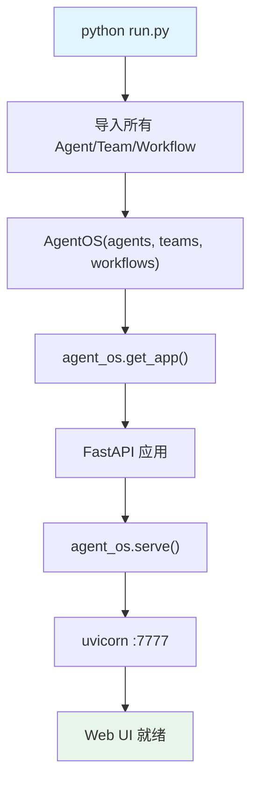

# run.py — 实现原理分析

> 源文件：`cookbook/00_quickstart/run.py`

## 概述

本文件是 Quick Start 的 **AgentOS 服务器入口**，它将本目录下所有 Agent、Team、Workflow 注册到 AgentOS 运行时，提供 Web UI 供用户交互、调试和管理。

**核心配置一览：**

| 配置项 | 值 | 说明 |
|--------|------|------|
| `id` | `"Quick Start AgentOS"` | AgentOS 实例名称 |
| `agents` | 10 个 Agent 实例 | 注册的所有 Agent |
| `teams` | `[multi_agent_team]` | 注册的 Team |
| `workflows` | `[sequential_workflow]` | 注册的 Workflow |
| `config` | `config.yaml` | 配置文件路径 |
| `tracing` | `True` | 启用追踪 |

## 架构分层

```
用户代码层                   agno.os 层
┌──────────────────┐       ┌─────────────────────────────┐
│ run.py           │       │ AgentOS                     │
│                  │       │  ├ agents: [10 个 Agent]     │
│ 导入所有 Agent   │──────>│  ├ teams: [Team]            │
│ 导入 Team        │       │  ├ workflows: [Workflow]    │
│ 导入 Workflow    │       │  └ get_app() → FastAPI App  │
│                  │       └─────────────────────────────┘
└──────────────────┘                │
                                   ▼
                           ┌──────────────┐
                           │ uvicorn      │
                           │ :7777        │
                           └──────────────┘
```

## 核心组件解析

### AgentOS

`AgentOS` 是 Agno 的运行时容器，负责：

1. **注册实体**：接收 `agents`、`teams`、`workflows` 列表
2. **启动 Web 服务**：`get_app()` 返回 FastAPI 应用
3. **提供 Web UI**：用户访问 `https://os.agno.com` 并连接本地端点 `http://localhost:7777`
4. **追踪与调试**：`tracing=True` 启用运行追踪

### 实体注册

```python
agent_os = AgentOS(
    agents=[
        agent_with_tools,          # 基础工具 Agent
        agent_with_storage,        # 带存储的 Agent
        agent_with_knowledge,      # 带知识库的 Agent
        self_learning_agent,       # 自学习 Agent
        agent_with_structured_output,  # 结构化输出 Agent
        agent_with_typed_input_output, # 类型化输入输出 Agent
        agent_with_memory,         # 带记忆的 Agent
        agent_with_state_management,   # 状态管理 Agent
        human_in_the_loop_agent,   # 人在环中 Agent
        agent_with_guardrails,     # 带护栏的 Agent
    ],
    teams=[multi_agent_team],      # 投资研究团队
    workflows=[sequential_workflow], # 顺序工作流
)
```

每个实体从各自的模块导入，确保代码解耦。

### 启动方式

```python
agent_os.serve(app="run:app", reload=True)
```

使用 uvicorn 启动，`reload=True` 支持热重载开发。

## Mermaid 流程图



## 关键源码文件索引

| 文件 | 关键函数/类 | 作用 |
|------|------------|------|
| `agno/os/__init__.py` | `AgentOS` | 运行时容器 |
| `cookbook/00_quickstart/*.py` | 各 Agent/Team/Workflow 定义 | 被 run.py 导入注册 |
