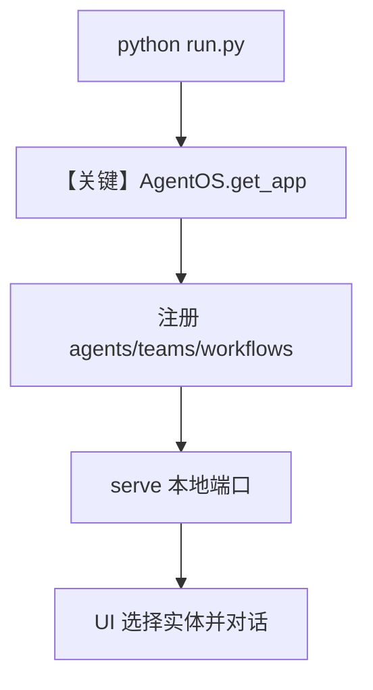

# run.py — 实现原理分析

> 源文件：`cookbook/00_quickstart/run.py`

## 概述

本文件**不定义新 Agent 逻辑**，而是 **`AgentOS` 启动器**：从同目录 quickstart 模块**导入**已构造好的 Agent/Team/Workflow，注册到 **`AgentOS`**，暴露 ASGI `app` 并 `serve` Web UI（配置 `config.yaml`）。原理重点是 **运行时注册与 HTTP 服务**，而非单一 `get_system_message`。

**核心配置一览：**

| 配置项 | 值 | 说明 |
|--------|------|------|
| `AgentOS` | `id="Quick Start AgentOS"` | OS 实例标识 |
| `agents` | 列表：tools/storage/knowledge/.../guardrails 等 | 已存在实例 |
| `teams` | `[multi_agent_team]` | 团队 |
| `workflows` | `[sequential_workflow]` | 工作流 |
| `config` | `config.yaml` 路径 | UI/OS 配置 |
| `tracing` | `True` | 追踪 |

## 架构分层

```
run.py
  → import 各 cookbook 模块中的全局 agent 实例
  → AgentOS(agents=..., teams=..., workflows=...)
  → get_app() → uvicorn serve
  → 浏览器连接本地端口 / os.agno.com 远程 UI
```

## 核心组件解析

### AgentOS

类定义见 `agno/os/app.py` 约 **L190**（`class AgentOS`）；`get_app()` 构建 FastAPI/Starlette 应用；`serve` 启动服务。

### 导入副作用

各 `from xxx import agent_*` 在 import 时即执行模块级 Agent 构造（**不**在 `run.py` 内 new Agent）。

### 运行机制与因果链

1. **路径**：用户通过 Web UI 选实体 → OS 路由到对应 Agent/Team/Workflow 的 run → 与各示例独立运行时相同的内部管线。
2. **副作用**：监听端口、写日志/trace；数据库路径与各模块定义一致（多指向 `tmp/agents.db`）。
3. **分支**：取决于 UI 选的实体与请求参数。
4. **定位**：**聚合入口**，便于演示 AgentOS，而非新 AI 模式。

## System Prompt 组装

**不存在本文件专属的 system。** 提示词由各已导入的 Agent/Team/Workflow 定义；参见对应 `agent_with_*.py`、`multi_agent_team.py`、`sequential_workflow.py` 文档。

## 完整 API 请求

对外为 **HTTP**（REST/WebSocket，以 `AgentOS` 实现为准），内部再转为各 `Gemini` 等模型调用；非直接 `generate_content` 从本脚本发起。

## Mermaid 流程图


```mermaid
flowchart TD
    A["python run.py"] --> B["【关键】AgentOS.get_app"]
    B --> C["注册 agents/teams/workflows"]
    C --> D["serve 本地端口"]
    D --> E["UI 选择实体并对话"]
```

- **【关键】AgentOS.get_app**：本文件唯一核心——**统一注册与暴露服务**。

## 关键源码文件索引

| 文件 | 关键函数/类 | 作用 |
|------|------------|------|
| `agno/os/app.py` | `AgentOS` L190+ | OS 应用工厂 |
| `cookbook/00_quickstart/config.yaml` | （若存在） | UI 配置 |
