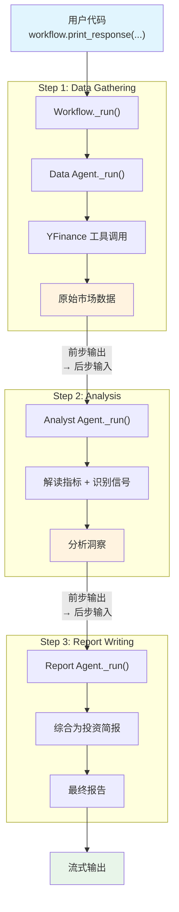

# sequential_workflow.py — 实现原理分析

> 源文件：`cookbook/00_quickstart/sequential_workflow.py`

## 概述

本示例展示 Agno 的 **Workflow 顺序执行管道** 机制：通过 `Workflow` + `Step` 构建三步研究管道（数据收集 → 分析 → 报告撰写），每个步骤由专业化 Agent 负责，输出自动流转到下一步骤，确保可预测、可重复的执行顺序。

**核心配置一览：**

**Workflow 配置：**

| 配置项 | 值 | 说明 |
|--------|------|------|
| `name` | `"Sequential Workflow"` | 工作流名称 |
| `description` | `"Three-step research pipeline"` | 描述 |
| `steps` | `[data_step, analysis_step, report_step]` | 3 个顺序步骤 |

**Step 1: Data Gathering**

| 配置项 | 值 | 说明 |
|--------|------|------|
| `name` | `"Data Gathering"` | 步骤名称 |
| `agent` | `data_agent`（含 YFinanceTools） | 数据收集 Agent |
| `description` | `"Fetch comprehensive market data"` | 步骤描述 |

**Step 2: Analysis**

| 配置项 | 值 | 说明 |
|--------|------|------|
| `name` | `"Analysis"` | 步骤名称 |
| `agent` | `analyst_agent`（无工具） | 分析 Agent |
| `description` | `"Analyze the market data"` | 步骤描述 |

**Step 3: Report Writing**

| 配置项 | 值 | 说明 |
|--------|------|------|
| `name` | `"Report Writing"` | 步骤名称 |
| `agent` | `report_agent`（markdown=True） | 报告撰写 Agent |
| `description` | `"Produce a concise investment brief"` | 步骤描述 |

**各 Agent 共有配置：**

| 配置项 | 值 | 说明 |
|--------|------|------|
| `model` | `Gemini(id="gemini-3-flash-preview")` | Google Gemini API |
| `db` | `SqliteDb(db_file="tmp/agents.db")` | SQLite 持久化 |
| `add_datetime_to_context` | `True` | 注入当前时间 |
| `add_history_to_context` | `True` | 加载历史消息 |
| `num_history_runs` | `5` | 最近 5 次运行历史 |

## 架构分层

```
用户代码层                  agno.workflow 层                 agno.agent 层
┌────────────────┐    ┌──────────────────────┐    ┌──────────────────────┐
│ sequential_    │    │ Workflow._run()      │    │ Step 1: Data Agent   │
│   workflow.py  │    │                      │    │  ├ tools=[YFinance]  │
│                │    │  steps=[             │    │  └ 收集原始数据       │
│ Workflow(      │    │    data_step,        │───>├──────────────────────┤
│   steps=[      │───>│    analysis_step,    │    │ Step 2: Analyst      │
│     step1,     │    │    report_step       │    │  ├ 无工具             │
│     step2,     │    │  ]                   │───>│  └ 解读关键指标       │
│     step3      │    │                      │    ├──────────────────────┤
│   ]            │    │  按顺序执行每个 step │    │ Step 3: Report Writer│
│ )              │    │  前步输出 → 后步输入 │───>│  ├ markdown=True     │
│                │    │                      │    │  └ 生成投资简报       │
└────────────────┘    └──────────────────────┘    └──────────────────────┘
                              │
                      ┌───────┴───────┐
                      ▼       ▼       ▼
              ┌──────────┐┌──────────┐┌──────────┐
              │ Gemini   ││ Gemini   ││ Gemini   │
              │ (Data)   ││ (Analyst)││ (Report) │
              └──────────┘└──────────┘└──────────┘
```

## 核心组件解析

### Workflow

`Workflow`（`workflow/workflow.py:208`）是管道编排器：

```python
class Workflow:
    name: Optional[str] = None
    description: Optional[str] = None
    steps: Optional[WorkflowSteps] = None  # 步骤列表
```

它按顺序执行每个 `Step`，将前一步骤的输出传递为后一步骤的输入。

### Step

`Step`（`workflow/step.py:59`）封装单个执行单元：

```python
class Step:
    name: Optional[str] = None
    agent: Optional[Agent] = None       # 执行 Agent
    team: Optional[Team] = None         # 或执行 Team
    executor: Optional[StepExecutor] = None  # 或自定义执行器
    description: Optional[str] = None
    max_retries: int = 3                # 失败重试次数
    skip_on_failure: bool = False       # 失败后跳过
    add_workflow_history: Optional[bool] = None  # 是否加载工作流历史
```

### 数据流

每个步骤的 Agent 有各自的 instructions：

| Agent | 职责 | 工具 | 输出 |
|-------|------|------|------|
| Data Gatherer | 收集原始市场数据 | YFinanceTools | 价格、指标、趋势 |
| Analyst | 解读数据、识别信号 | 无 | 分析洞察 |
| Report Writer | 综合为投资简报 | 无 | 最终报告 |

### Workflow vs Team 对比

| 特性 | Workflow | Team |
|------|---------|------|
| 执行顺序 | 显式定义，可预测 | Leader 动态决定 |
| 数据流 | 前步输出 → 后步输入 | 通过 transfer 工具传递 |
| 适用场景 | 固定流程（管道） | 动态协作 |
| 灵活性 | 低（但可预测） | 高（但不确定） |

## System Prompt 组装

**每个 Agent 的 System Prompt 独立构建：**

**Data Agent：**
```text
You are a data gathering agent. Your job is to fetch comprehensive market data.

For the requested stock, gather:
- Current price and daily change
- Market cap and volume
- P/E ratio, EPS, and other key ratios
...

Present the raw data clearly. Don't analyze — just gather and organize.

<additional_information>
- The current time is 2026-03-01 14:30:00.
</additional_information>
```

**Analyst Agent：**
```text
You are a financial analyst. You receive raw market data from the data team.

Your job is to:
- Interpret the key metrics ...
- Identify strengths and weaknesses ...

Provide analysis, not recommendations. Be objective and data-driven.

<additional_information>
- The current time is 2026-03-01 14:30:00.
</additional_information>
```

**Report Writer Agent：**
```text
You are a report writer. You receive analysis from the research team.

Your job is to:
- Synthesize the analysis into a clear investment brief
- Lead with a one-line summary
- Include a recommendation ...
- Keep it concise — max 200 words

<additional_information>
- Use markdown to format your answers.
- The current time is 2026-03-01 14:30:00.
</additional_information>
```

## 完整 API 请求

```python
# Step 1: Data Gathering
client.models.generate_content(
    model="gemini-3-flash-preview",
    contents=[
        {"role": "user", "parts": [{"text": "<Data Agent system prompt>"}]},
        {"role": "model", "parts": [{"text": "ok"}]},
        {"role": "user", "parts": [{"text": "Analyze NVIDIA (NVDA) for investment"}]}
    ],
    tools=[{"function_declarations": [
        # YFinanceTools
    ]}]
)
# → 输出：NVDA 原始数据（价格、PE、市值等）

# Step 2: Analysis（前步输出作为输入）
client.models.generate_content(
    model="gemini-3-flash-preview",
    contents=[
        {"role": "user", "parts": [{"text": "<Analyst system prompt>"}]},
        {"role": "model", "parts": [{"text": "ok"}]},
        # 前步输出作为上下文/输入
        {"role": "user", "parts": [{"text": "<Step 1 的输出：NVDA 原始数据>"}]}
    ]
    # 无工具
)
# → 输出：分析洞察（PE 偏高、增长驱动、风险等）

# Step 3: Report Writing（前步输出作为输入）
client.models.generate_content(
    model="gemini-3-flash-preview",
    contents=[
        {"role": "user", "parts": [{"text": "<Report Writer system prompt>"}]},
        {"role": "model", "parts": [{"text": "ok"}]},
        {"role": "user", "parts": [{"text": "<Step 2 的输出：分析洞察>"}]}
    ]
    # 无工具
)
# → 输出：投资简报（一句话总结 + 推荐 + 关键指标表）
```

## Mermaid 流程图



## 关键源码文件索引

| 文件 | 关键函数/类 | 作用 |
|------|------------|------|
| `agno/workflow/workflow.py` | `Workflow` L208 | 工作流编排器 |
| `agno/workflow/step.py` | `Step` L59 | 单步骤封装 |
| `agno/agent/agent.py` | `Agent` L67 | 步骤内的执行 Agent |
| `agno/tools/yfinance.py` | `YFinanceTools` | Yahoo Finance 工具集（仅 Step 1） |
