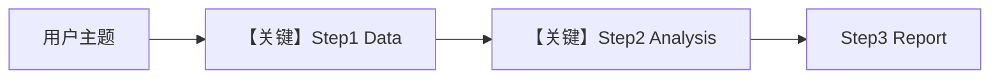

# sequential_workflow.py — 实现原理分析

<!-- cookbook-py-source:start -->
## 完整源码

```python
"""
Sequential Workflow - Stock Research Pipeline
==============================================
This example shows how to create a workflow with sequential steps.
Each step is handled by a specialized agent, and outputs flow to the next step.

Different from Teams (agents collaborate dynamically), Workflows give you
explicit control over execution order and data flow.

Key concepts:
- Workflow: Orchestrates a sequence of steps
- Step: Wraps an agent with a specific task
- Steps execute in order, each building on the previous

Example prompts to try:
- "Analyze NVDA"
- "Research Tesla for investment"
- "Give me a report on Apple"
"""

from agno.agent import Agent
from agno.db.sqlite import SqliteDb
from agno.models.google import Gemini
from agno.tools.yfinance import YFinanceTools
from agno.workflow import Step, Workflow

# ---------------------------------------------------------------------------
# Storage Configuration
# ---------------------------------------------------------------------------
workflow_db = SqliteDb(db_file="tmp/agents.db")

# ---------------------------------------------------------------------------
# Step 1: Data Gatherer — Fetches raw market data
# ---------------------------------------------------------------------------
data_agent = Agent(
    name="Data Gatherer",
    model=Gemini(id="gemini-3-flash-preview"),
    tools=[YFinanceTools(all=True)],
    instructions="""\
You are a data gathering agent. Your job is to fetch comprehensive market data.

For the requested stock, gather:
- Current price and daily change
- Market cap and volume
- P/E ratio, EPS, and other key ratios
- 52-week high and low
- Recent price trends

Present the raw data clearly. Don't analyze — just gather and organize.\
""",
    db=workflow_db,
    add_datetime_to_context=True,
    add_history_to_context=True,
    num_history_runs=5,
)

data_step = Step(
    name="Data Gathering",
    agent=data_agent,
    description="Fetch comprehensive market data for the stock",
)

# ---------------------------------------------------------------------------
# Step 2: Analyst — Interprets the data
# ---------------------------------------------------------------------------
analyst_agent = Agent(
    name="Analyst",
    model=Gemini(id="gemini-3-flash-preview"),
    instructions="""\
You are a financial analyst. You receive raw market data from the data team.

Your job is to:
- Interpret the key metrics (is the P/E high or low for this sector?)
- Identify strengths and weaknesses
- Note any red flags or positive signals
- Compare to typical industry benchmarks

Provide analysis, not recommendations. Be objective and data-driven.\
""",
    db=workflow_db,
    add_datetime_to_context=True,
    add_history_to_context=True,
    num_history_runs=5,
)

analysis_step = Step(
    name="Analysis",
    agent=analyst_agent,
    description="Analyze the market data and identify key insights",
)

# ---------------------------------------------------------------------------
# Step 3: Report Writer — Produces final output
# ---------------------------------------------------------------------------
report_agent = Agent(
    name="Report Writer",
    model=Gemini(id="gemini-3-flash-preview"),
    instructions="""\
You are a report writer. You receive analysis from the research team.

Your job is to:
- Synthesize the analysis into a clear investment brief
- Lead with a one-line summary
- Include a recommendation (Buy/Hold/Sell) with rationale
- Keep it concise — max 200 words
- End with key metrics in a small table

Write for a busy investor who wants the bottom line fast.\
""",
    db=workflow_db,
    add_datetime_to_context=True,
    add_history_to_context=True,
    num_history_runs=5,
    markdown=True,
)

report_step = Step(
    name="Report Writing",
    agent=report_agent,
    description="Produce a concise investment brief",
)

# ---------------------------------------------------------------------------
# Create the Workflow
# ---------------------------------------------------------------------------
sequential_workflow = Workflow(
    name="Sequential Workflow",
    description="Three-step research pipeline: Data → Analysis → Report",
    steps=[
        data_step,  # Step 1: Gather data
        analysis_step,  # Step 2: Analyze data
        report_step,  # Step 3: Write report
    ],
)

# ---------------------------------------------------------------------------
# Run the Workflow
# ---------------------------------------------------------------------------
if __name__ == "__main__":
    sequential_workflow.print_response(
        "Analyze NVIDIA (NVDA) for investment",
        stream=True,
    )

# ---------------------------------------------------------------------------
# More Examples
# ---------------------------------------------------------------------------
"""
Workflow vs Team:

- Workflow: Explicit step order, predictable execution, clear data flow
- Team: Dynamic collaboration, leader decides who does what

Use Workflow when:
- Steps must happen in a specific order
- Each step has a clear, specialized role
- You want predictable, repeatable execution
- Output from step N feeds into step N+1

Use Team when:
- Agents need to collaborate dynamically
- The leader should decide who to involve
- Tasks benefit from back-and-forth discussion

Advanced workflow features (not shown here):
- Parallel: Run steps concurrently
- Condition: Run steps only if criteria met
- Loop: Repeat steps until condition met
- Router: Dynamically select which step to run
"""
```

<!-- cookbook-py-source:end -->

> 源文件：`cookbook/00_quickstart/sequential_workflow.py`

## 概述

本示例展示 Agno 的 **`Workflow` + `Step`**：**顺序管道** Data → Analysis → Report；每步绑定一个 **`Agent`**，由工作流引擎按序执行，区别于 **`Team`** 的动态协作。提示词分布在**各 Step 的 Agent `instructions`**，无单一全局 Agent。

**核心配置一览：**

| 配置项 | 值 | 说明 |
|--------|------|------|
| `Workflow` | `name`, `description`, `steps=[data_step, analysis_step, report_step]` | 三步管道 |
| `Step` | `name`, `agent`, `description` | 每步包装一个 Agent |
| `data_agent` / `analyst_agent` / `report_agent` | 各 `Gemini` + `instructions` + `db` | 专用子代理 |
| `workflow_db` | `SqliteDb(...)` | 共享 |

## 架构分层

```
用户输入 → Workflow.print_response
        → Step1 data_agent.run
        → Step2 analyst_agent.run（输入依赖上步输出）
        → Step3 report_agent.run
        → 最终输出
```

## 核心组件解析

### Workflow 与 Step

`Workflow` 见 `agno/workflow/workflow.py` 约 **L208**；`Step` 将 Agent 与描述绑定，引擎负责顺序与数据传递（详见 workflow 模块内 `print_response`/`run` 实现）。

### 三角色分工

- **Data Gatherer**：只拉数不解读。
- **Analyst**：解读数据。
- **Report Writer**：写简短投资建议（`markdown=True`）。

### 运行机制与因果链

1. **路径**：单用户请求触发多步串联；每步一次（或多次）子 Agent run。
2. **副作用**：各 Agent 共享 `workflow_db` 会话策略。
3. **分支**：与 Team 不同，**不**由 Leader 动态选人，顺序固定。
4. **定位**：演示 **ETL 式**可控流水线。

## System Prompt 组装

**分属三个 Agent**，各自 `get_system_message`。示例 **Data Gatherer** 还原：

```text
You are a data gathering agent. Your job is to fetch comprehensive market data.

For the requested stock, gather:
- Current price and daily change
- Market cap and volume
- P/E ratio, EPS, and other key ratios
- 52-week high and low
- Recent price trends

Present the raw data clearly. Don't analyze — just gather and organize.

Use markdown to format your answers.  # 若该 Agent markdown 默认

<additional_information>
- The current time is <运行时时间>.
</additional_information>
```

（`data_agent` 未设 `markdown=True`，故可能无 #3.2.1 行——以 `_messages.py` 条件为准。）

Analyst、Report Writer 见源码各自 `instructions` 块。

## 完整 API 请求

三步各调用 `Gemini`；前一步输出作为后一步上下文的一部分（具体字段由 Workflow 实现组装）。

## Mermaid 流程图


```mermaid
flowchart LR
    A["用户主题"] --> B["【关键】Step1 Data"]
    B --> C["【关键】Step2 Analysis"]
    C --> D["Step3 Report"]
```

- **【关键】Step1/2**：顺序与职责划分是 Workflow 的核心。

## 关键源码文件索引

| 文件 | 关键函数/类 | 作用 |
|------|------------|------|
| `agno/workflow/workflow.py` | `Workflow` L208+ | 工作流执行 |
| `agno/agent/_messages.py` | `get_system_message()` | 每步 Agent 的 system |
