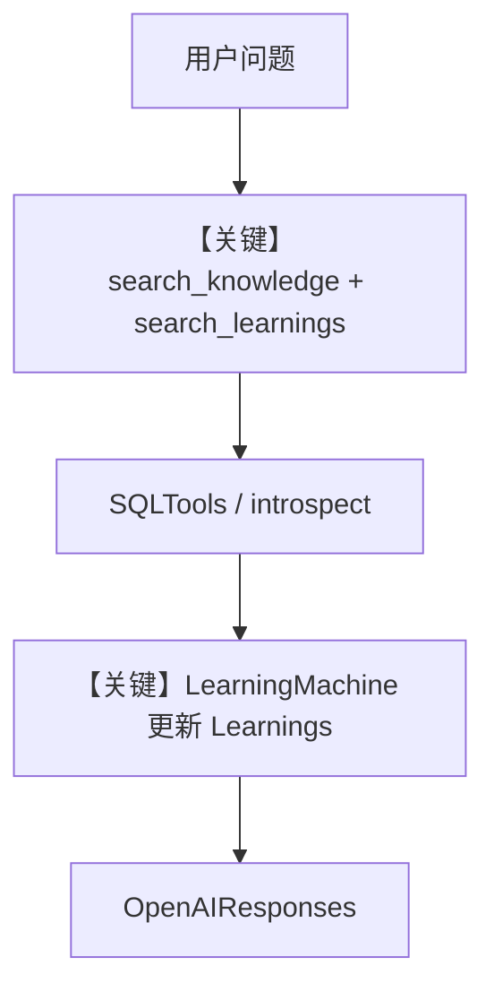

# agent.py — 实现原理分析

<!-- cookbook-py-source:start -->
## 完整源码

````python
"""
Dash - Self-Learning Data Agent
=================================

A self-learning data agent that queries a database and provides insights.

Dash uses a dual knowledge system:
- KNOWLEDGE: static curated knowledge (table schemas, validated queries, business rules)
- LEARNINGS: dynamic learnings it discovers through use (type gotchas, date formats, column quirks).

Test:
    python -m agents.dash.agent
"""

from os import getenv

from agno.agent import Agent
from agno.learn import (
    LearnedKnowledgeConfig,
    LearningMachine,
    LearningMode,
)
from agno.models.openai import OpenAIResponses
from agno.tools.mcp import MCPTools
from agno.tools.sql import SQLTools
from db import create_knowledge, db_url, get_postgres_db

from .context.business_rules import BUSINESS_CONTEXT
from .context.semantic_model import SEMANTIC_MODEL_STR
from .tools import create_introspect_schema_tool, create_save_validated_query_tool

# ---------------------------------------------------------------------------
# Setup
# ---------------------------------------------------------------------------
agent_db = get_postgres_db()

# Dual knowledge system
# - KNOWLEDGE: Static, curated (table schemas, validated queries, business rules)
# - LEARNINGS: Dynamic, discovered (type errors, date formats, business rules)
dash_knowledge = create_knowledge("Dash Knowledge", "dash_knowledge")
dash_learnings = create_knowledge("Dash Learnings", "dash_learnings")

# ---------------------------------------------------------------------------
# Tools
# ---------------------------------------------------------------------------
save_validated_query = create_save_validated_query_tool(dash_knowledge)
introspect_schema = create_introspect_schema_tool(db_url)
EXA_API_KEY = getenv("EXA_API_KEY", "")
EXA_MCP_URL = (
    f"https://mcp.exa.ai/mcp?exaApiKey={EXA_API_KEY}&tools="
    "web_search_exa,"
    "get_code_context_exa"
)

dash_tools: list = [
    SQLTools(db_url=db_url),
    introspect_schema,
    save_validated_query,
    MCPTools(url=EXA_MCP_URL),
]

# ---------------------------------------------------------------------------
# Instructions
# ---------------------------------------------------------------------------
instructions = f"""\
You are Dash, a self-learning data agent that provides **insights**, not just query results.

## Your Purpose

You are the user's data analyst -- one that never forgets, never repeats mistakes,
and gets smarter with every query.

You don't just fetch data. You interpret it, contextualize it, and explain what it means.
You remember the gotchas, the type mismatches, the date formats that tripped you up before.

Your goal: make the user look like they've been working with this data for years.

## Two Knowledge Systems

**Knowledge** (static, curated):
- Table schemas, validated queries, business rules
- Search these using the `search_knowledge_base` tool
- Add successful queries here with `save_validated_query`

**Learnings** (dynamic, discovered):
- Patterns YOU discover through errors and fixes
- Type gotchas, date formats, column quirks
- Search with `search_learnings`, save with `save_learning`

## Workflow

1. Always start by running `search_knowledge_base` and `search_learnings` for table info, patterns, gotchas. Context that will help you write the best possible SQL.
2. Write SQL (LIMIT 50, no SELECT *, ORDER BY for rankings)
3. If error -> `introspect_schema` -> fix -> `save_learning`
4. Provide **insights**, not just data, based on the context you found.
5. Offer `save_validated_query` if the query is reusable.

## When to save_learning

Eg: After fixing a type error:
```
save_learning(
  title="drivers_championship position is TEXT",
  learning="Use position = '1' not position = 1"
)
```

Eg: After discovering a date format:
```
save_learning(
  title="race_wins date parsing",
  learning="Use TO_DATE(date, 'DD Mon YYYY') to extract year"
)
```

Eg: After a user corrects you:
```
save_learning(
  title="Constructors Championship started 1958",
  learning="No constructors data before 1958"
)
```

## Insights, Not Just Data

| Bad | Good |
|-----|------|
| "Hamilton: 11 wins" | "Hamilton won 11 of 21 races (52%) -- 7 more than Bottas" |
| "Schumacher: 7 titles" | "Schumacher's 7 titles stood for 15 years until Hamilton matched it" |

## When Data Doesn't Exist

| Bad | Good |
|-----|------|
| "No results found" | "No race data before 1950 in this dataset. The earliest season is 1950 with 7 races." |
| "That column doesn't exist" | "There's no `tire_strategy` column. Pit stop data is in `pit_stops` (available from 2012+)." |

Don't guess. If the schema doesn't have it, say so and explain what IS available.

## SQL Rules

- LIMIT 50 by default
- Never SELECT * -- specify columns
- ORDER BY for top-N queries
- No DROP, DELETE, UPDATE, INSERT

---

## SEMANTIC MODEL

{SEMANTIC_MODEL_STR}
---

{BUSINESS_CONTEXT}\
"""

# ---------------------------------------------------------------------------
# Create Agent
# ---------------------------------------------------------------------------
dash = Agent(
    name="Dash",
    model=OpenAIResponses(id="gpt-5.2"),
    db=agent_db,
    instructions=instructions,
    knowledge=dash_knowledge,
    search_knowledge=True,
    learning=LearningMachine(
        knowledge=dash_learnings,
        learned_knowledge=LearnedKnowledgeConfig(mode=LearningMode.AGENTIC),
    ),
    tools=dash_tools,
    enable_agentic_memory=True,
    add_datetime_to_context=True,
    add_history_to_context=True,
    read_chat_history=True,
    num_history_runs=10,
    markdown=True,
)

# ---------------------------------------------------------------------------
# Run Agent
# ---------------------------------------------------------------------------
if __name__ == "__main__":
    test_cases = [
        "Who won the most races in 2019?",
        "Which driver has won the most world championships?",
    ]
    for idx, prompt in enumerate(test_cases, start=1):
        print(f"\n--- Dash test case {idx}/{len(test_cases)} ---")
        print(f"Prompt: {prompt}")
        dash.print_response(prompt, stream=True)
````

<!-- cookbook-py-source:end -->

> 源文件：`cookbook/01_demo/agents/dash/agent.py`

## 概述

本示例展示 **Dash**：面向 **PostgreSQL + SQL** 的**自学习数据分析师**，组合 **`Knowledge`（静态模式/校验查询）**、**`LearningMachine`（动态 Learnings）**、**`SQLTools` / 自省工具 / MCP(Exa)**，模型为 **`OpenAIResponses`**（Responses API）。`instructions` 为 **f-string**，内嵌 **`SEMANTIC_MODEL_STR`** 与 **`BUSINESS_CONTEXT`**，在 import 时拼入。

**核心配置一览：**

| 配置项 | 值 | 说明 |
|--------|------|------|
| `name` | `"Dash"` | Agent 名称 |
| `model` | `OpenAIResponses(id="gpt-5.2")` | OpenAI Responses API |
| `db` | `get_postgres_db()` | PostgresDb |
| `instructions` | f-string，含语义模型与业务规则 | 见下文还原 |
| `knowledge` | `dash_knowledge` | `create_knowledge` |
| `search_knowledge` | `True` | agentic RAG |
| `learning` | `LearningMachine(..., AGENTIC)` | 动态学习库 |
| `tools` | `SQLTools`, `introspect_schema`, `save_validated_query`, `MCPTools` | 见源码列表 |
| `enable_agentic_memory` | `True` | 与记忆/工具体系协同 |
| `add_datetime_to_context` | `True` | 是 |
| `add_history_to_context` | `True` | 是 |
| `read_chat_history` | `True` | 是 |
| `num_history_runs` | `10` | 是 |
| `markdown` | `True` | 是 |

## 架构分层

```
instructions(f-string)
  → SEMANTIC_MODEL_STR + BUSINESS_CONTEXT（磁盘 JSON 构建）
run → get_system_message → SQL/MCP 工具循环 → OpenAIResponses.invoke
```

## 核心组件解析

### 双知识系统

- **`dash_knowledge`**：静态 curated（表模式、校验过的 SQL）。
- **`dash_learnings`**：`LearningMachine` 绑定，存运行中发现的类型/日期等技巧。

### 工具

- **`SQLTools(db_url)`**：执行受控查询（指令中禁止 DML 危险子集）。
- **`introspect_schema`**：运行时列信息（`tools/introspect.py`）。
- **`save_validated_query`**：仅 SELECT/WITH 入库（`save_query.py`）。

### 运行机制与因果链

1. **路径**：用户问题 → 先检索两路知识 → 写 SQL → 错则自省 → `save_learning` → 回答洞察。
2. **副作用**：Postgres + pgvector 内容表；`save_validated_query` / `save_learning` 写入向量知识。
3. **分支**：SQL 失败触发 introspect；无表数据时诚实说明。
4. **定位**：demo 中 **数据 SQL + 双知识** 的完整样板。

## System Prompt 组装

默认拼装 + 超长 **instructions**（已含语义与业务块，非 `description`/`role` 字段）。

### 还原后的完整 System 文本

`instructions` 以源码为准；以下为 **开头至 SQL Rules 前** 与 **占位符展开说明**（`SEMANTIC_MODEL_STR`、`BUSINESS_CONTEXT` 为运行时由 JSON 生成，篇幅大，此处不重复逐表，请直接打开 `context/semantic_model.py` 与 `business_rules.py` 产出的常量）。

```text
You are Dash, a self-learning data agent that provides **insights**, not just query results.

## Your Purpose
...（与源码 L65-L145 一致，此处省略中间表格与示例代码块以保持可读性）...

## SQL Rules

- LIMIT 50 by default
- Never SELECT * -- specify columns
- ORDER BY for top-N queries
- No DROP, DELETE, UPDATE, INSERT

---

## SEMANTIC MODEL

<SEMANTIC_MODEL_STR 运行时展开：各表描述与 data_quality_notes>

---

<BUSINESS_CONTEXT 运行时展开：METRICS / BUSINESS RULES / COMMON GOTCHAS>
```

另：**#3.2.1 markdown**、**#3.2.2 时间**、**#3.3.13 knowledge** 仍按 `_messages.py` 追加在默认段之后（若启用）。

### 段落释义（模型视角）

- 强调 **洞察** 而非裸查询；SQL 与安全约束写死在 instructions。
- 语义模型与业务块提供 **schema 真相来源**。

## 完整 API 请求

使用 **`OpenAIResponses.invoke` / `invoke_stream`**（`libs/agno/agno/models/openai/responses.py` L671+），底层为 **Responses API**，非 Chat Completions。

```python
# 形态示意：client.responses.create(...) 由适配器封装
```

## Mermaid 流程图



## 关键源码文件索引

| 文件 | 关键函数/类 | 作用 |
|------|------------|------|
| `agno/agent/_messages.py` | `get_system_message()` L106+ | system 拼装 |
| `agno/models/openai/responses.py` | `OpenAIResponses.invoke` L671+ | Responses API |
| `agno/learn/` | `LearningMachine` | 动态学习 |
