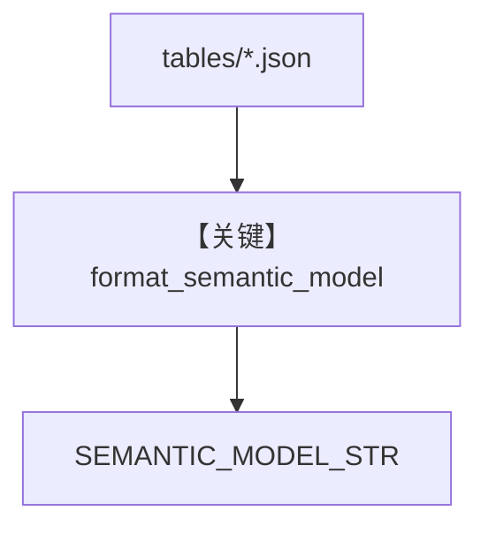

# semantic_model.py — 实现原理分析

> 源文件：`cookbook/01_demo/agents/dash/context/semantic_model.py`

## 概述

本文件从 `knowledge/tables/*.json` 加载**表级元数据**，**`format_semantic_model`** 转为可读 Markdown，**`SEMANTIC_MODEL_STR`** 供 **`dash/agent.py` instructions** 中 **`{SEMANTIC_MODEL_STR}`** 展开，使模型掌握表用途与数据质量提示。

**核心配置一览：** 无 Agent；导出 **`SEMANTIC_MODEL_STR`**。

## 架构分层

```
tables/*.json → load_table_metadata → format_semantic_model → SEMANTIC_MODEL_STR
```

## 核心组件解析

### load_table_metadata

读取每张表的 `table_name`、`table_description`、`use_cases`、`data_quality_notes`（截断至 `MAX_QUALITY_NOTES`）。

### 运行机制与因果链

1. **路径**：静态 JSON → import 时进入 Dash 的 instructions。
2. **副作用**：无。
3. **分支**：目录不存在则空列表（L20-L21）。

## System Prompt 组装

作为 **`instructions` 内嵌块**，见 `agent.py` 中 `## SEMANTIC MODEL` 段。

### 还原后的完整 System 文本

取决于 `knowledge/tables` 下 JSON；无文件时 `SEMANTIC_MODEL_STR` 近似空。

## 完整 API 请求

无。

## Mermaid 流程图



## 关键源码文件索引

| 文件 | 关键函数/类 | 作用 |
|------|------------|------|
| `semantic_model.py` | `format_semantic_model()` L48 | 表语义格式化 |
